# Authorization Guide

> **Source of truth:** `src/server/authz/`, `src/shared/constants/publicApiRoutes.ts`, `src/lib/api/requireManagementAuth.ts`, `src/shared/utils/apiAuth.ts`
> **Last updated:** 2026-06-28 — v3.8.40

OmniRoute has a route-aware authorization pipeline that gates every API request. Classification is **deterministic** and **fail-closed** — anything that cannot be classified ends up as `MANAGEMENT` and demands a session or management-grade token. This page explains the model for engineers maintaining routes or designing new endpoints.



> Source: [diagrams/authz-pipeline.mmd](../diagrams/authz-pipeline.mmd)

## Two Auth Modes

### 1. API Key (Bearer)

Used for the OpenAI/Anthropic/Gemini-compatible client APIs and a few management routes when the key has the `manage` scope.

```
Authorization: Bearer <api-key>
```

Validated by `isValidApiKey()` / `extractApiKey()` in `src/sse/services/auth.ts` and re-exported through `src/shared/utils/apiAuth.ts`. The validator also accepts the `OMNIROUTE_API_KEY` / `ROUTER_API_KEY` env vars as persistent passthrough keys (issue #1350).

### 2. Dashboard Session (auth_token cookie)

For dashboard pages and admin operations.

```
Cookie: auth_token=<JWT signed with JWT_SECRET>
```

Verified by `isDashboardSessionAuthenticated()` in `src/shared/utils/apiAuth.ts`. The pipeline auto-refreshes the JWT when it has fewer than 7 days left in its 30-day lifetime.

Some management routes accept **either** mode: cookie OR `Bearer <key>` when the API key has the `manage` (or `admin`) scope. This is what enables the "configurable via API calls" workflow added in v3.8.

## Route Classes

`src/server/authz/types.ts` defines three classes; any route that cannot be classified deterministically falls back to `MANAGEMENT`.

| Class        | Description                                                                                                                                          | Auth required                                                           |
| ------------ | ---------------------------------------------------------------------------------------------------------------------------------------------------- | ----------------------------------------------------------------------- |
| `PUBLIC`     | Explicitly safe routes — login, logout, status, init, health, onboarding bootstrap.                                                                  | None                                                                    |
| `CLIENT_API` | Model-serving endpoints — `/api/v1/*`, `/api/v1beta/*`, plus aliases `/v1/*`, `/v1beta/*`, `/chat/completions`, `/responses`, `/models`, `/codex/*`. | Bearer key when the effective `REQUIRE_API_KEY` feature flag is enabled |
| `MANAGEMENT` | Dashboard pages, settings, providers, keys, admin and diagnostics endpoints.                                                                         | Dashboard session OR Bearer with `manage` scope                         |

## Pipeline

```
Incoming request → src/proxy.ts
  → runAuthzPipeline() in src/server/authz/pipeline.ts
    1. Strip trusted internal headers (x-omniroute-auth-*, x-omniroute-route-class)
    2. Generate request id, classify route via classifyRoute()
    3. If pathname == "/" → redirect /dashboard
    4. If draining (graceful shutdown) and /api/* → 503
    5. If non-GET /api/* → checkBodySize() guard
    6. If OPTIONS → CORS preflight 204
    7. If options.enforce == false → pass-through with route-class headers
    8. Otherwise: POLICIES[routeClass].evaluate(ctx)
       - allow  → stamp x-omniroute-auth-{kind,id,label,scopes} → NextResponse.next()
       - reject → JSON error w/ correlation_id (dashboard pages → 302 /login)
```

Trusted internal headers (defined in `src/server/authz/headers.ts`) are **stripped from incoming requests** before classification — clients cannot pre-populate `x-omniroute-auth-*` to impersonate a subject.

### Policy contracts

Each route class has a policy in `src/server/authz/policies/`:

- **`publicPolicy`** (`policies/public.ts`) — always returns `allow({ kind: "anonymous", id: "anonymous" })`.
- **`clientApiPolicy`** (`policies/clientApi.ts`) — extracts Bearer, validates via `validateApiKey()`. Falls through to anonymous only when the effective `REQUIRE_API_KEY` feature flag is disabled. The effective flag is resolved through `isRequireApiKeyEnabled()` (`DB feature flag override > process.env.REQUIRE_API_KEY > default`) so Dashboard Feature Flags and environment variables govern `/api/v1/*`, `/api/v1beta/*`, and aliases consistently; resolver failures fail closed. Allows dashboard-session requests on client API routes (including `/api/v1/models`, used by the dashboard model catalog).
- **`managementPolicy`** (`policies/management.ts`) — accepts dashboard session, internal model-sync requests (matched against `/api/providers/[name]/(sync-models|models)`), or skips entirely if `isAuthRequired()` returns false. Returns 403 (`AUTH_001`) when a Bearer token is present but invalid, 401 otherwise. Also enforces the route-guard tiers (LOCAL_ONLY / ALWAYS_PROTECTED) before any auth branch — see [Route Guard Tiers](../security/ROUTE_GUARD_TIERS.md). LOCAL_ONLY paths in `LOCAL_ONLY_MANAGE_SCOPE_BYPASS_PREFIXES` (today: `/api/mcp/`) may be accessed from non-loopback when the Bearer key carries the `manage` scope; all other LOCAL_ONLY paths remain strict-loopback regardless of scope.

A successful policy returns `AuthSubject` with `kind ∈ { client_api_key, dashboard_session, management_key, anonymous }`. Downstream handlers can read it via `assertAuth(request, "CLIENT_API")` in `src/server/authz/assertAuth.ts` instead of re-running auth logic.

## Public Routes List

`src/shared/constants/publicApiRoutes.ts` is the explicit allowlist:

```ts
PUBLIC_API_ROUTE_PREFIXES = [
  "/api/auth/login",
  "/api/auth/logout",
  "/api/auth/status",
  "/api/init",
  "/api/v1/", // treated as CLIENT_API in classify, not as "no-auth public"
  "/api/cloud/",
  "/api/sync/bundle",
  "/api/oauth/",
];

PUBLIC_READONLY_API_ROUTE_PREFIXES = ["/api/monitoring/health", "/api/settings/require-login"];

PUBLIC_READONLY_METHODS = new Set(["GET", "HEAD", "OPTIONS"]);
```

Read-only prefixes are public **only** for safe methods. Note: `classifyRoute()` excludes `/api/v1/*` and `/api/v1beta/*` from the PUBLIC fall-through — those are always `CLIENT_API` so the Bearer-key policy still applies.

## Adding a New Route

### Pattern 1 — Public client API endpoint (Bearer-auth)

Routes under `/api/v1/` and `/api/v1beta/` are classified `CLIENT_API` automatically. The middleware enforces the Bearer check; route handlers don't need to redo it but can read the subject if useful.

```typescript
// src/app/api/v1/your-route/route.ts
import { NextRequest, NextResponse } from "next/server";
import { assertAuth } from "@/server/authz/assertAuth";

export async function POST(req: NextRequest) {
  const subject = assertAuth(req, "CLIENT_API");
  // subject.kind === "client_api_key" | "anonymous" | "dashboard_session"
  // ... handler logic
}
```

### Pattern 2 — Management endpoint (session or Bearer + manage)

Use `requireManagementAuth()` from `src/lib/api/requireManagementAuth.ts`:

```typescript
import { requireManagementAuth } from "@/lib/api/requireManagementAuth";

export async function POST(request: Request) {
  const rejection = await requireManagementAuth(request);
  if (rejection) return rejection;
  // ... handler logic
}
```

`requireManagementAuth()` returns `null` on success or a JSON error `Response`:

- 401 `AUTH_001` "Authentication required" — no credentials at all
- 403 — invalid Bearer **or** Bearer present but key lacks the `manage` / `admin` scope

`hasManageScope(scopes)` returns true for `"manage"` or `"admin"`.

### Pattern 3 — Adding to the public allowlist

Add the prefix to `PUBLIC_API_ROUTE_PREFIXES` (or `PUBLIC_READONLY_API_ROUTE_PREFIXES` for GET-only). Update unit tests at `tests/unit/public-api-routes.test.ts` and `tests/unit/authz/classify.test.ts`.

## Scopes

API keys carry a `scopes` array (stored as JSON in `api_keys.scopes`, see `src/lib/db/apiKeys.ts`).

### Management scope

- `manage` / `admin` — grants the key access to management API endpoints when sent as Bearer.

### MCP scopes (`src/shared/constants/mcpScopes.ts`)

Each MCP tool requires specific scopes via `MCP_TOOL_SCOPES`. Full list (`MCP_SCOPE_LIST`):

```
read:health, read:combos, write:combos, read:quota, read:usage,
read:models, execute:completions, execute:search, write:budget,
write:resilience, pricing:write, read:cache, write:cache,
read:compression, write:compression, read:proxies
```

Preset bundles (`MCP_SCOPE_PRESETS`): `readonly`, `full`, `monitor`, `agent`. Use `hasRequiredScopes(granted, toolName)` and `getMissingScopes()` for enforcement inside MCP handlers.

## Auth Required Toggle

`isAuthRequired()` in `src/shared/utils/apiAuth.ts` decides whether **any** auth is enforced for a request:

- `settings.requireLogin === false` → auth is globally disabled.
- No password configured **and** no `INITIAL_PASSWORD` env var → bootstrap mode allows the onboarding wizard and loopback requests, but exposed network requests still need credentials.
- Any DB error → fails closed (secure-by-default).

Client API key enforcement uses `isRequireApiKeyEnabled()` in `src/shared/utils/featureFlags.ts`, not a direct `process.env.REQUIRE_API_KEY` read. This matters for deployed instances: toggling `REQUIRE_API_KEY` in Dashboard → Feature Flags stores a DB override and immediately affects `/v1/*`, `/v1beta/*`, `/models`, `/responses`, `/chat/completions`, `/codex/*`, and other client-API auth checks that share this helper. If the feature flag store cannot be read, client API auth fails closed and requires a key.

## Breaking Change — v3.8.0

The `/api/v1/agents/tasks/*` and `/api/resilience/model-cooldowns` endpoints **now require management auth** (commit `588a0333`). Clients previously sending a normal API key without the `manage` scope receive `403`. Migration: either issue the key the `manage` scope in the API Keys dashboard, or use a logged-in dashboard session.

## Behaviour Change — v3.8.2

`/api/mcp/*` (the remote MCP server) is still LOCAL_ONLY by default but now accepts non-loopback requests when the `Authorization: Bearer <api-key>` header carries the `manage` scope. The carve-out is gated explicitly per-path via `LOCAL_ONLY_MANAGE_SCOPE_BYPASS_PREFIXES` in `src/server/authz/routeGuard.ts`; the sibling LOCAL_ONLY prefix `/api/cli-tools/runtime/*` is intentionally NOT bypassable because it can spawn arbitrary subprocesses. Anonymous requests to `/api/mcp/*` from non-loopback continue to return `403 LOCAL_ONLY` — the default for any new LOCAL_ONLY path remains strict-loopback. See [Route Guard Tiers](../security/ROUTE_GUARD_TIERS.md#manage-scope-carve-out).

## Testing

- Unit tests: `tests/unit/authz/` — `classify.test.ts`, `pipeline.test.ts`, `client-api-policy.test.ts`, `management-policy.test.ts`, `public-policy.test.ts`.
- Public allowlist: `tests/unit/public-api-routes.test.ts`.
- Run focused: `node --import tsx/esm --test tests/unit/authz/classify.test.ts`.

## Debugging

The pipeline always stamps responses with:

```
x-request-id:               <correlation id, echoed in error bodies>
x-omniroute-route-class:    PUBLIC | CLIENT_API | MANAGEMENT
```

For authenticated requests the upstream (handler-side) request headers also include:

```
x-omniroute-auth-kind:      client_api_key | dashboard_session | management_key | anonymous
x-omniroute-auth-id:        key_<last-4> | "dashboard" | "anonymous"
x-omniroute-auth-label:     (optional)
x-omniroute-auth-scopes:    comma-separated list
```

Use `assertAuth(req, expectedClass)` inside handlers — it throws `AuthzAssertionError` with code `AUTHZ_NOT_INITIALIZED` if the middleware was bypassed (helpful for catching configuration regressions in tests).

## See Also

- [API_REFERENCE.md](../reference/API_REFERENCE.md) — auth marker per endpoint
- [COMPLIANCE.md](../security/COMPLIANCE.md) — audit log for auth events
- [MCP-SERVER.md](../frameworks/MCP-SERVER.md) — MCP scope enforcement details
- Source: `src/server/authz/`, `src/lib/api/requireManagementAuth.ts`
