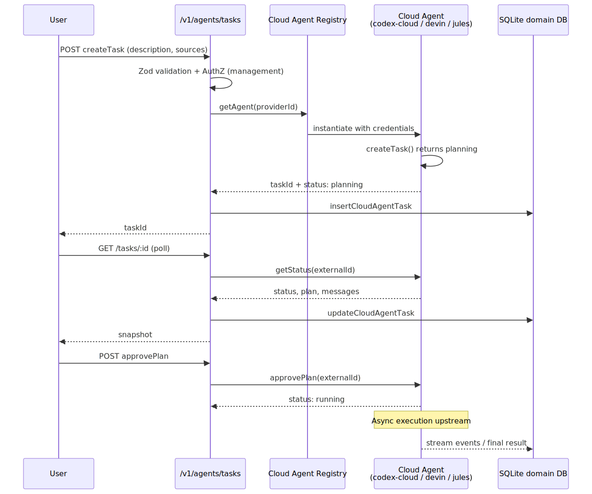

# Cloud Agents

> **Source of truth:** `src/lib/cloudAgent/` and `src/app/api/v1/agents/tasks/`
> **Last updated:** 2026-06-28 — v3.8.40 (frontmatter refresh; 4 agents incl. cursor-cloud)

OmniRoute orchestrates third-party cloud-hosted coding agents (Codex Cloud, Cursor,
Devin, Jules) as long-running tasks. Each agent is wrapped behind a uniform interface so
clients can submit a prompt + repo URL and receive results without dealing with
provider-specific APIs.

A Cloud Agent task is **not** a regular chat completion. It is a durable, multi-step
unit of work that may take minutes to hours, can produce a Pull Request as its
artifact, and supports follow-up messages and (in some providers) plan approval gates.



> Source: [diagrams/cloud-agent-flow.mmd](../diagrams/cloud-agent-flow.mmd)

## Supported Agents

| Provider ID    | Class              | Source                                | Upstream Base URL                       | Plan Approval |
| -------------- | ------------------ | ------------------------------------- | --------------------------------------- | ------------- |
| `jules`        | `JulesAgent`       | `src/lib/cloudAgent/agents/jules.ts`  | `https://jules.googleapis.com/v1alpha`  | Yes           |
| `devin`        | `DevinAgent`       | `src/lib/cloudAgent/agents/devin.ts`  | `https://api.devin.ai/v1`               | Yes           |
| `codex-cloud`  | `CodexCloudAgent`  | `src/lib/cloudAgent/agents/codex.ts`  | `https://api.openai.com/v1/codex/cloud` | No (auto)     |
| `cursor-cloud` | `CursorCloudAgent` | `src/lib/cloudAgent/agents/cursor.ts` | `https://api.cursor.com/v0`             | No (auto)     |

Registry: `src/lib/cloudAgent/registry.ts` — exports `getAgent(providerId)`,
`getAvailableAgents()`, and `isCloudAgentProvider(providerId)`. The registry is a
plain in-memory `Record<string, CloudAgentBase>` populated at module load.

## Architecture

```
Client (Dashboard / CLI / API)
  → POST /api/v1/agents/tasks (management auth required)
    → CreateCloudAgentTaskSchema validation (Zod)
    → registry.getAgent(providerId)
    → getCloudAgentCredentials(providerId)
      └─ pulls from getProviderConnections({ provider, isActive: true })
         (apiKey first, fallback to accessToken)
    → agent.createTask({ prompt, source, options }, credentials)
      └─ HTTP POST to upstream provider API
      └─ returns CloudAgentTask with internal id + externalId
    → insertCloudAgentTask(...) into cloud_agent_tasks (SQLite)

Polling (lazy sync on read):
  GET /api/v1/agents/tasks/[id]
    → getCloudAgentTaskById(id)
    → agent.getStatus(externalId, credentials)  // refreshes status + activities
    → updateCloudAgentTask(...) with new status, result, completed_at
    → return serialized task

Interactions:
  POST /api/v1/agents/tasks/[id]  body: { action: "approve" | "message" | "cancel" }
    → agent.approvePlan(externalId, credentials)        for "approve"
    → agent.sendMessage(externalId, message, credentials) for "message"
    → status flips to "cancelled"                       for "cancel" (local-only)
```

Sync is **lazy**: status is refreshed from the upstream on every `GET /tasks/[id]`.
There is no background poller. Dashboards that need fresh state should poll the GET
endpoint at a sensible interval.

## `CloudAgentBase` Interface

Source: `src/lib/cloudAgent/baseAgent.ts`

```typescript
export interface AgentCredentials {
  apiKey: string;
  baseUrl?: string;
}

export interface CreateTaskParams {
  prompt: string;
  source: CloudAgentSource;
  options: {
    autoCreatePr?: boolean;
    planApprovalRequired?: boolean;
    environment?: Record<string, string>;
  };
}

export interface GetStatusResult {
  status: CloudAgentStatus;
  externalId?: string;
  result?: CloudAgentResult;
  activities: CloudAgentActivity[];
  error?: string;
}

export abstract class CloudAgentBase {
  abstract readonly providerId: string;
  abstract readonly baseUrl: string;

  abstract createTask(p: CreateTaskParams, c: AgentCredentials): Promise<CloudAgentTask>;
  abstract getStatus(externalId: string, c: AgentCredentials): Promise<GetStatusResult>;
  abstract approvePlan(externalId: string, c: AgentCredentials): Promise<void>;
  abstract sendMessage(
    externalId: string,
    message: string,
    c: AgentCredentials
  ): Promise<CloudAgentActivity>;
  abstract listSources(
    c: AgentCredentials
  ): Promise<{ name: string; url: string; branch?: string }[]>;

  protected mapStatus(raw: string): CloudAgentStatus; // heuristic upstream-string → enum
  protected generateTaskId(): string; // `task_<ts>_<rand>`
  protected generateActivityId(): string; // `act_<ts>_<rand>`
}
```

`CodexCloudAgent.approvePlan` intentionally throws — Codex Cloud auto-plans and has
no approval gate. `CodexCloudAgent.listSources` returns `[]`.

`CursorCloudAgent` drives Cursor's Background / Cloud Agents through its official REST
API (`api.cursor.com/v0`) with a **user or service-account API key** — the safer,
first-party alternative to re-using the Cursor IDE's OAuth session (provider `cursor`,
which carries a ban-risk warning). It is a plain REST adapter (no `@cursor/sdk` native
dependency). `approvePlan` throws (Cursor agents run autonomously); `listSources` lists
the repositories reachable by the key. Cursor returns UPPERCASE status enums
(`CREATING`/`RUNNING`/`FINISHED`/`ERROR`), mapped explicitly to the shared
`CloudAgentStatus`. `baseUrl` is overridable per-credential so the API version/path can
be corrected without a code change.

## Domain Types

Source: `src/lib/cloudAgent/types.ts`

```typescript
export const CLOUD_AGENT_STATUS = {
  QUEUED: "queued",
  RUNNING: "running",
  AWAITING_APPROVAL: "awaiting_approval",
  COMPLETED: "completed",
  FAILED: "failed",
  CANCELLED: "cancelled",
} as const;

export interface CloudAgentSource {
  repoName: string;
  repoUrl: string; // must be a valid URL
  branch?: string;
}

export interface CloudAgentResult {
  prUrl?: string;
  prNumber?: number;
  commitMessage?: string;
  diffUrl?: string;
  summary?: string;
  duration?: number; // seconds, positive int
  cost?: number; // positive float
}

export interface CloudAgentActivity {
  id: string;
  type: "plan" | "command" | "code_change" | "message" | "error" | "completion";
  content: string;
  timestamp: string; // ISO 8601
  metadata?: Record<string, unknown>;
}

export interface CloudAgentTask {
  id: string; // internal `task_...` id
  providerId: "jules" | "devin" | "codex-cloud" | "cursor-cloud";
  externalId?: string; // upstream provider's id
  status: CloudAgentStatus;
  prompt: string; // 1..10000 chars
  source: CloudAgentSource;
  options: {
    autoCreatePr?: boolean;
    planApprovalRequired?: boolean;
    environment?: Record<string, string>;
  };
  result?: CloudAgentResult;
  activities: CloudAgentActivity[];
  error?: string;
  createdAt: string;
  updatedAt: string;
  completedAt?: string;
}
```

Validation schemas (`CreateCloudAgentTaskSchema`, `UpdateCloudAgentTaskSchema`) are
exported alongside the types and are used by the route handlers.

## Database

Source: `src/lib/cloudAgent/db.ts` — table is created lazily via
`createCloudAgentTaskTable()` (also called from `src/lib/cloudAgent/index.ts` at
module import).

```sql
CREATE TABLE IF NOT EXISTS cloud_agent_tasks (
  id           TEXT PRIMARY KEY,
  provider_id  TEXT NOT NULL,
  external_id  TEXT,
  status       TEXT NOT NULL DEFAULT 'queued',
  prompt       TEXT NOT NULL,
  source       TEXT NOT NULL,             -- JSON
  options      TEXT DEFAULT '{}',         -- JSON
  result       TEXT,                       -- JSON
  activities   TEXT DEFAULT '[]',          -- JSON
  error        TEXT,
  created_at   TEXT NOT NULL DEFAULT (datetime('now')),
  updated_at   TEXT NOT NULL DEFAULT (datetime('now')),
  completed_at TEXT
);
CREATE INDEX IF NOT EXISTS idx_cloud_agent_tasks_provider ON cloud_agent_tasks(provider_id);
CREATE INDEX IF NOT EXISTS idx_cloud_agent_tasks_status   ON cloud_agent_tasks(status);
CREATE INDEX IF NOT EXISTS idx_cloud_agent_tasks_created  ON cloud_agent_tasks(created_at DESC);
```

`updateCloudAgentTask` enforces a **column whitelist** to prevent SQL injection:
`status`, `prompt`, `source`, `options`, `result`, `activities`, `error`,
`completed_at`. Any other key in the partial update is silently dropped.

## REST API — Task Lifecycle

**Auth:** All `/api/v1/agents/tasks*` endpoints require **management auth**
(`requireCloudAgentManagementAuth` wraps `requireManagementAuth` from
`src/lib/api/requireManagementAuth`). This is enforced after commit `588a0333`
(_"fix(auth): require management auth for agent and cooldown APIs"_).

| Method  | Path                          | Purpose                                                |
| ------- | ----------------------------- | ------------------------------------------------------ |
| OPTIONS | `/api/v1/agents/tasks`        | CORS preflight                                         |
| GET     | `/api/v1/agents/tasks`        | List tasks (filter: `provider`, `status`, `limit≤500`) |
| POST    | `/api/v1/agents/tasks`        | Create task (dispatches to upstream + persists)        |
| DELETE  | `/api/v1/agents/tasks?id=...` | Delete task by query id (does **not** cancel upstream) |
| OPTIONS | `/api/v1/agents/tasks/[id]`   | CORS preflight                                         |
| GET     | `/api/v1/agents/tasks/[id]`   | Read task + lazy-sync status from upstream             |
| POST    | `/api/v1/agents/tasks/[id]`   | Action: `approve` / `message` / `cancel`               |
| DELETE  | `/api/v1/agents/tasks/[id]`   | Delete task by path id                                 |

### Create task

```bash
curl -X POST http://localhost:20128/api/v1/agents/tasks \
  -H "Cookie: auth_token=..." \
  -H "Content-Type: application/json" \
  -d '{
    "providerId": "devin",
    "prompt": "Fix the bug in src/foo.ts where the parser returns null",
    "source": {
      "repoName": "user/repo",
      "repoUrl": "https://github.com/user/repo",
      "branch": "main"
    },
    "options": {
      "autoCreatePr": true,
      "planApprovalRequired": false
    }
  }'
```

Response `201`:

```json
{
  "data": {
    "id": "task_1731512345678_abc123def",
    "providerId": "devin",
    "externalId": "session_xyz",
    "status": "queued",
    "prompt": "...",
    "source": { "repoName": "user/repo", "repoUrl": "...", "branch": "main" },
    "options": { "autoCreatePr": true },
    "createdAt": "2026-05-13T12:34:56.789Z"
  }
}
```

### Approve a plan

```bash
curl -X POST http://localhost:20128/api/v1/agents/tasks/<id> \
  -H "Cookie: auth_token=..." \
  -H "Content-Type: application/json" \
  -d '{"action":"approve"}'
```

### Send a follow-up message

```bash
curl -X POST http://localhost:20128/api/v1/agents/tasks/<id> \
  -d '{"action":"message","message":"Also add a unit test for the parser"}'
```

### Cancel (local status only)

```bash
curl -X POST http://localhost:20128/api/v1/agents/tasks/<id> \
  -d '{"action":"cancel"}'
```

`cancel` flips `status` to `"cancelled"` in the local DB but does **not** call the
upstream provider — there is no abort RPC in `CloudAgentBase`. To stop billing
upstream, terminate the task in the provider's own console.

## REST API — Cloud Provider Plumbing

These auxiliary endpoints under `src/app/api/cloud/` are used by remote clients
(the CLI, the Electron app, or sync workers) to read provider connection metadata
and resolve model aliases. They are authenticated with a **regular API key**
(via `validateApiKey`), not the management auth used by the task endpoints.

| Method | Path                            | Purpose                                                             |
| ------ | ------------------------------- | ------------------------------------------------------------------- |
| POST   | `/api/cloud/auth`               | Validate API key, return masked connection metadata + model aliases |
| PUT    | `/api/cloud/credentials/update` | Refresh `accessToken` / `refreshToken` / `expiresAt`                |
| POST   | `/api/cloud/model/resolve`      | Resolve a model alias to `{ provider, model }`                      |
| GET    | `/api/cloud/models/alias`       | List all model aliases                                              |
| PUT    | `/api/cloud/models/alias`       | Set a model alias (and auto-sync to Cloud if enabled)               |

`/api/cloud/auth` never returns raw `apiKey` / `accessToken` / `refreshToken`. It
returns `hasApiKey`, `hasAccessToken`, `hasRefreshToken`, and a masked preview
(`maskedApiKey`: first 4 + `****` + last 4).

## Credentials Resolution

`getCloudAgentCredentials(providerId)` in `src/lib/cloudAgent/api.ts`:

1. Loads active provider connections via `getProviderConnections({ provider: providerId, isActive: true })`.
2. For each connection, prefers `apiKey` (trimmed). Falls back to `accessToken`.
3. Returns the first non-empty token wrapped as `{ apiKey: token }`.
4. Returns `null` if no usable token is found — the API responds `400` with
   `"No active credentials configured for cloud agent provider: <id>"`.

This means Cloud Agents reuse the same Provider Connection table as regular LLM
providers. To enable Jules, create an active connection with `provider: "jules"`
and a populated `apiKey`.

## Dashboard

Source: `src/app/(dashboard)/dashboard/cloud-agents/page.tsx`

A `"use client"` React page that:

- Lists tasks (polled via `GET /api/v1/agents/tasks`).
- Submits new tasks via a form that maps to `CreateCloudAgentTaskSchema`.
- Shows status badges (`queued`, `running`, `awaiting_approval`, `completed`,
  `failed`, `cancelled`) and renders the `activities[]` timeline.
- Surfaces the `result.prUrl` / `commitMessage` / `summary` when `status === "completed"`.

## Integration with A2A

Cloud Agents can be exposed as A2A skills by registering an A2A skill that delegates
its `tasks/send` handler to `getAgent(...).createTask(...)` and translates A2A task
status events to the JSON-RPC 2.0 protocol. See [A2A-SERVER.md](./A2A-SERVER.md).

## Adding a New Cloud Agent

1. Create `src/lib/cloudAgent/agents/<name>.ts` extending `CloudAgentBase`.
2. Implement `createTask`, `getStatus`, `approvePlan` (or throw if N/A),
   `sendMessage`, `listSources`. Use `this.mapStatus(...)` for status normalization.
3. Register in `src/lib/cloudAgent/registry.ts` under a stable `providerId`.
4. Extend the `providerId` literal union in `src/lib/cloudAgent/types.ts`
   (`CloudAgentTask.providerId` and `CreateCloudAgentTaskSchema`).
5. Add the provider to `src/shared/constants/providers.ts` if it needs a connection
   record. OAuth-based providers also need `src/lib/oauth/providers/`.
6. Add tests under `tests/unit/cloud-agent-*.test.ts`.
7. Update this doc and the dashboard's `CLOUD_AGENTS` constant.

## Configuration

| Env Var          | Purpose                                                     |
| ---------------- | ----------------------------------------------------------- |
| `DATA_DIR`       | Location of the SQLite database holding `cloud_agent_tasks` |
| `JWT_SECRET`     | Required for management auth on task endpoints              |
| `API_KEY_SECRET` | Required to encrypt provider connection credentials at rest |

No Cloud-Agent-specific env vars exist today — every secret lives in the
`provider_connections` table.

## See Also

- [A2A-SERVER.md](./A2A-SERVER.md)
- [API_REFERENCE.md](../reference/API_REFERENCE.md)
- [SKILLS.md](./SKILLS.md)
- [MEMORY.md](./MEMORY.md)
- Source: `src/lib/cloudAgent/`
- Routes: `src/app/api/v1/agents/tasks/`, `src/app/api/cloud/`
- Dashboard: `src/app/(dashboard)/dashboard/cloud-agents/page.tsx`
