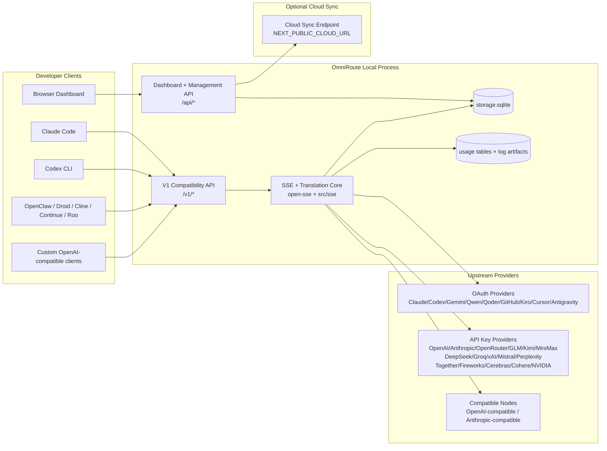
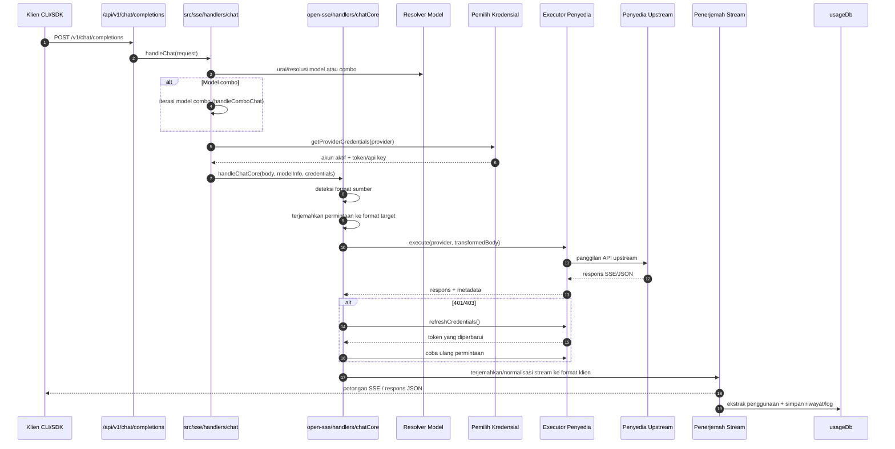
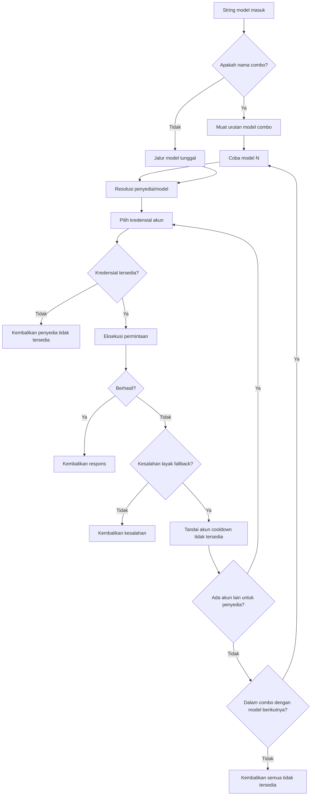
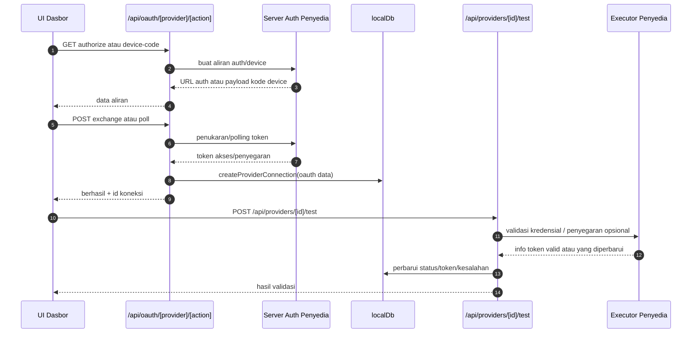
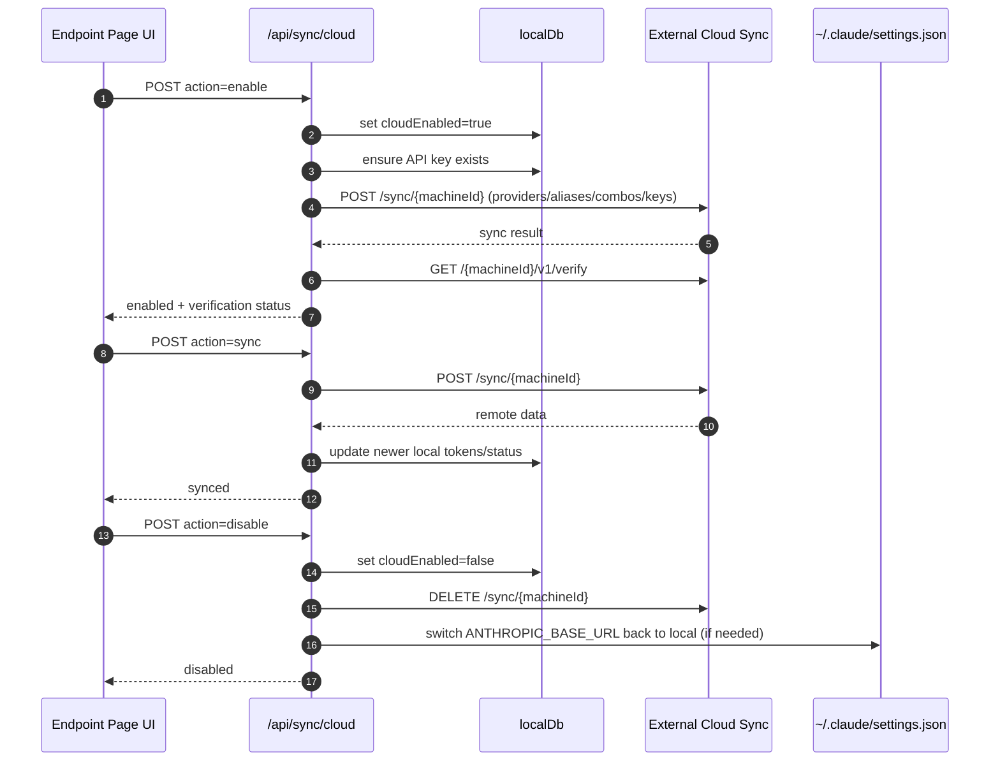
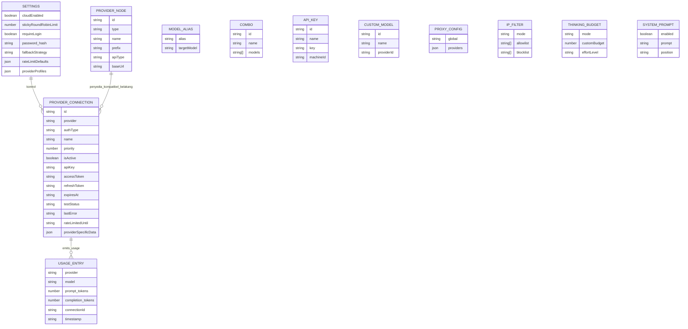
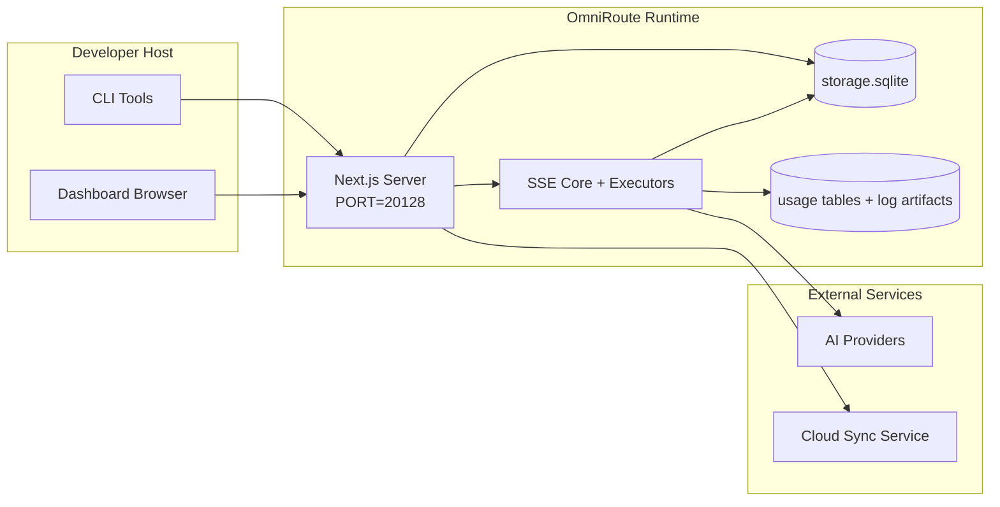

# Arsitektur OmniRoute (Bahasa Indonesia)

🌐 **Languages:** 🇺🇸 [English](../../../../docs/ARCHITECTURE.md) · 🇸🇦 [ar](../../ar/docs/ARCHITECTURE.md) · 🇧🇬 [bg](../../bg/docs/ARCHITECTURE.md) · 🇧🇩 [bn](../../bn/docs/ARCHITECTURE.md) · 🇨🇿 [cs](../../cs/docs/ARCHITECTURE.md) · 🇩🇰 [da](../../da/docs/ARCHITECTURE.md) · 🇩🇪 [de](../../de/docs/ARCHITECTURE.md) · 🇪🇸 [es](../../es/docs/ARCHITECTURE.md) · 🇮🇷 [fa](../../fa/docs/ARCHITECTURE.md) · 🇫🇮 [fi](../../fi/docs/ARCHITECTURE.md) · 🇫🇷 [fr](../../fr/docs/ARCHITECTURE.md) · 🇮🇳 [gu](../../gu/docs/ARCHITECTURE.md) · 🇮🇱 [he](../../he/docs/ARCHITECTURE.md) · 🇮🇳 [hi](../../hi/docs/ARCHITECTURE.md) · 🇭🇺 [hu](../../hu/docs/ARCHITECTURE.md) · 🇮🇩 [id](../../id/docs/ARCHITECTURE.md) · 🇮🇹 [it](../../it/docs/ARCHITECTURE.md) · 🇯🇵 [ja](../../ja/docs/ARCHITECTURE.md) · 🇰🇷 [ko](../../ko/docs/ARCHITECTURE.md) · 🇮🇳 [mr](../../mr/docs/ARCHITECTURE.md) · 🇲🇾 [ms](../../ms/docs/ARCHITECTURE.md) · 🇳🇱 [nl](../../nl/docs/ARCHITECTURE.md) · 🇳🇴 [no](../../no/docs/ARCHITECTURE.md) · 🇵🇭 [phi](../../phi/docs/ARCHITECTURE.md) · 🇵🇱 [pl](../../pl/docs/ARCHITECTURE.md) · 🇵🇹 [pt](../../pt/docs/ARCHITECTURE.md) · 🇧🇷 [pt-BR](../../pt-BR/docs/ARCHITECTURE.md) · 🇷🇴 [ro](../../ro/docs/ARCHITECTURE.md) · 🇷🇺 [ru](../../ru/docs/ARCHITECTURE.md) · 🇸🇰 [sk](../../sk/docs/ARCHITECTURE.md) · 🇸🇪 [sv](../../sv/docs/ARCHITECTURE.md) · 🇰🇪 [sw](../../sw/docs/ARCHITECTURE.md) · 🇮🇳 [ta](../../ta/docs/ARCHITECTURE.md) · 🇮🇳 [te](../../te/docs/ARCHITECTURE.md) · 🇹🇭 [th](../../th/docs/ARCHITECTURE.md) · 🇹🇷 [tr](../../tr/docs/ARCHITECTURE.md) · 🇺🇦 [uk-UA](../../uk-UA/docs/ARCHITECTURE.md) · 🇵🇰 [ur](../../ur/docs/ARCHITECTURE.md) · 🇻🇳 [vi](../../vi/docs/ARCHITECTURE.md) · 🇨🇳 [zh-CN](../../zh-CN/docs/ARCHITECTURE.md)

---

_Last updated: 2026-04-15_

## Ringkasan Eksekutif

OmniRoute adalah gateway routing AI lokal dan dasbor yang dibangun di atas Next.js.
Sistem ini menyediakan satu endpoint yang kompatibel dengan OpenAI (`/v1/*`) dan merutekan lalu lintas ke berbagai penyedia upstream dengan kemampuan translasi, fallback, pembaruan token, dan pelacakan penggunaan.

Kemampuan inti:

- Antarmuka API yang kompatibel dengan OpenAI untuk CLI/tools (100+ penyedia, 16 executor)
- Translasi permintaan/respons antar format penyedia
- Fallback combo model (urutan multi-model)
- Langkah combo terstruktur (`provider + model + connection`) dengan pengurutan runtime melalui `compositeTiers`
- Fallback di tingkat akun (multi-akun per penyedia)
- Preflight kuota dan pemilihan akun P2C yang sadar kuota pada jalur chat utama
- Manajemen koneksi penyedia OAuth + API-key (13 modul OAuth)
- Pembuatan embedding melalui `/v1/embeddings` (6 penyedia, 9 model)
- Pembuatan gambar melalui `/v1/images/generations` (10+ penyedia, 20+ model)
- Transkripsi audio melalui `/v1/audio/transcriptions` (7 penyedia)
- Text-to-speech melalui `/v1/audio/speech` (10 penyedia)
- Pembuatan video melalui `/v1/videos/generations` (ComfyUI + SD WebUI)
- Pembuatan musik melalui `/v1/music/generations` (ComfyUI)
- Pencarian web melalui `/v1/search` (5 penyedia)
- Moderasi melalui `/v1/moderations`
- Reranking melalui `/v1/rerank`
- Penguraian think tag (`<think>...</think>`) untuk model penalaran
- Sanitasi respons untuk kompatibilitas ketat OpenAI SDK
- Normalisasi peran (developer→system, system→user) untuk kompatibilitas lintas penyedia
- Konversi output terstruktur (json_schema → Gemini responseSchema)
- Persistensi lokal untuk penyedia, kunci, alias, combo, pengaturan, harga (26 modul DB)
- Pelacakan penggunaan/biaya dan pencatatan permintaan
- Sinkronisasi cloud opsional untuk sinkronisasi multi-perangkat/status
- Daftar izin/blokir IP untuk kontrol akses API
- Manajemen anggaran berpikir (passthrough/auto/custom/adaptive)
- Injeksi system prompt global
- Pelacakan sesi dan fingerprinting
- Pembatasan laju yang ditingkatkan per akun dengan profil khusus penyedia
- Pola circuit breaker untuk ketahanan penyedia
- Perlindungan anti-thundering herd dengan penguncian mutex
- Cache deduplikasi permintaan berbasis tanda tangan
- Lapisan domain: aturan biaya, kebijakan fallback, kebijakan lockout
- Context Relay: ringkasan handoff sesi untuk kesinambungan rotasi akun
- Persistensi status domain (cache write-through SQLite untuk fallback, anggaran, lockout, circuit breaker)
- Mesin kebijakan untuk evaluasi permintaan terpusat (lockout → budget → fallback)
- Telemetri permintaan dengan agregasi latensi p50/p95/p99
- Telemetri target combo dan kesehatan target combo historis melalui `combo_execution_key` / `combo_step_id`
- Correlation ID (X-Request-Id) untuk pelacakan end-to-end
- Pencatatan audit kepatuhan dengan opsi keluar per API key
- Kerangka eval untuk penjaminan kualitas LLM
- Dasbor kesehatan dengan status circuit breaker penyedia secara real-time
- MCP Server (25 tools) dengan 3 transport (stdio/SSE/Streamable HTTP)
- A2A Server (JSON-RPC 2.0 + SSE) dengan skill dan siklus hidup tugas
- Sistem memori (ekstraksi, injeksi, pengambilan, perangkuman)
- Sistem skill (registry, executor, sandbox, skill bawaan)
- Proxy MITM dengan manajemen sertifikat dan penanganan DNS
- Middleware penjaga injeksi prompt
- Registry ACP (Agent Communication Protocol)
- Penyedia OAuth modular (13 modul individual di bawah `src/lib/oauth/providers/`)
- Skrip uninstall/full-uninstall
- Aksi perbaikan lingkungan OAuth
- Jembatan WebSocket untuk klien WS yang kompatibel dengan OpenAI (`/v1/ws`)
- Manajemen token sinkronisasi (penerbitan/pencabutan, unduhan bundel konfigurasi berversi ETag)
- Preset penyedia utama GLM Thinking (`glmt`)
- Penghitungan token hybrid (sisi penyedia `/messages/count_tokens` dengan fallback estimasi)
- Penyemaian alias model otomatis (30+ normalisasi dialek lintas proxy saat startup)
- Pengambilan outbound aman dengan penjaga SSRF, pemblokiran URL privat, dan percobaan ulang yang dapat dikonfigurasi
- Percobaan ulang chat yang sadar cooldown dengan `requestRetry` dan `maxRetryIntervalSec` yang dapat dikonfigurasi
- Validasi lingkungan runtime dengan Zod saat startup
- Audit kepatuhan v2 dengan paginasi, event CRUD penyedia, dan pencatatan validasi yang diblokir SSRF

Waktu proses model utama:

- Route aplikasi Next.js di bawah `src/app/api/*` mengimplementasikan API dasbor dan API kompatibilitas
- Inti SSE/routing bersama dalam `src/sse/*` + `open-sse/*` menangani eksekusi penyedia, translasi, streaming, fallback, dan penggunaan

## Ruang Lingkup dan Batasan

### Dalam Ruang Lingkup

- Runtime gateway lokal
- API manajemen dasbor
- Autentikasi penyedia dan pembaruan token
- Translasi permintaan dan streaming SSE
- Persistensi status lokal + penggunaan
- Orkestrasi sinkronisasi cloud opsional

### Di Luar Ruang Lingkup

- Implementasi layanan cloud di balik `NEXT_PUBLIC_CLOUD_URL`
- SLA/control plane penyedia di luar proses lokal
- Biner CLI eksternal itu sendiri (Claude CLI, Codex CLI, dll.)

## Tampilan Dasbor (Saat Ini)

Halaman utama di bawah `src/app/(dashboard)/dashboard/`:

- `/dashboard` — panduan cepat + ikhtisar penyedia
- `/dashboard/endpoint` — tab proxy endpoint + MCP + A2A + endpoint API
- `/dashboard/providers` — koneksi penyedia dan kredensial
- `/dashboard/combos` — strategi combo, template, pembuat berbasis langkah, aturan routing model, pengurutan persisten manual
- `/dashboard/costs` — agregasi biaya dan visibilitas harga
- `/dashboard/analytics` — analitik penggunaan, evaluasi, kesehatan target combo
- `/dashboard/limits` — kontrol kuota/laju
- `/dashboard/cli-tools` — orientasi CLI, deteksi runtime, pembuatan konfigurasi
- `/dashboard/agents` — agen ACP yang terdeteksi + pendaftaran agen kustom
- `/dashboard/media` — playground gambar/video/musik
- `/dashboard/search-tools` — pengujian penyedia pencarian dan riwayat
- `/dashboard/health` — uptime, circuit breaker, batas laju, sesi yang dipantau kuota
- `/dashboard/logs` — log permintaan/proxy/audit/konsol
- `/dashboard/settings` — tab pengaturan sistem (umum, routing, default combo, dll.)
- `/dashboard/api-manager` — siklus hidup API key dan izin model

## Konteks Sistem Tingkat Tinggi



## Komponen Runtime Inti

## 1) Lapisan API dan Routing (Next.js App Routes)

Direktori utama:

- `src/app/api/v1/*` dan `src/app/api/v1beta/*` untuk API kompatibilitas
- `src/app/api/*` untuk API manajemen/konfigurasi
- Selanjutnya penulisan ulang di `next.config.mjs` peta `/v1/*` menjadi `/api/v1/*`

Route kompatibilitas penting:

- `src/app/api/v1/chat/completions/route.ts`
- `src/app/api/v1/messages/route.ts`
- `src/app/api/v1/responses/route.ts`
- `src/app/api/v1/models/route.ts` — termasuk model khusus dengan `custom: true`
- `src/app/api/v1/embeddings/route.ts` — generasi penyematan (6 penyedia)
- `src/app/api/v1/images/generations/route.ts` — pembuatan gambar (4+ penyedia termasuk Antigravitasi/Nebius)
- `src/app/api/v1/messages/count_tokens/route.ts`
- `src/app/api/v1/providers/[provider]/chat/completions/route.ts` — obrolan khusus per penyedia
- `src/app/api/v1/providers/[provider]/embeddings/route.ts` — penyematan khusus per penyedia
- `src/app/api/v1/providers/[provider]/images/generations/route.ts` — gambar khusus per penyedia
- `src/app/api/v1beta/models/route.ts`
- `src/app/api/v1beta/models/[...path]/route.ts`

Domain manajemen:

- Auth/pengaturan: `src/app/api/auth/*`, `src/app/api/settings/*`
- Penyedia/koneksi: `src/app/api/providers*`
- Node penyedia: `src/app/api/provider-nodes*`
- Model kustom: `src/app/api/provider-models` (GET/POST/DELETE)
- Katalog model: `src/app/api/models/route.ts` (GET)
- Konfigurasi proxy: `src/app/api/settings/proxy` (GET/PUT/DELETE) + `src/app/api/settings/proxy/test` (POST)
- OAuth: `src/app/api/oauth/*`
- Kunci/alias/combo/harga: `src/app/api/keys*`, `src/app/api/models/alias`, `src/app/api/combos*`, `src/app/api/pricing`
- Penggunaan: `src/app/api/usage/*`
- Sync/cloud: `src/app/api/sync/*`, `src/app/api/cloud/*`
- Pembantu alat CLI: `src/app/api/cli-tools/*`
- Filter IP: `src/app/api/settings/ip-filter` (GET/PUT)
- Anggaran berpikir: `src/app/api/settings/thinking-budget` (GET/PUT)
- System prompt: `src/app/api/settings/system-prompt` (GET/PUT)
- Sesi: `src/app/api/sessions` (GET)
- Batas laju: `src/app/api/rate-limits` (GET)
- Ketahanan: `src/app/api/resilience` (GET/PATCH) — antrean permintaan, cooldown koneksi, breaker penyedia, konfigurasi wait-for-cooldown
- Reset ketahanan: `src/app/api/resilience/reset` (POST) — reset breaker penyedia
- Statistik cache: `src/app/api/cache/stats` (GET/DELETE)
- Telemetri: `src/app/api/telemetry/summary` (GET)
- Anggaran: `src/app/api/usage/budget` (GET/POST)
- Rantai fallback: `src/app/api/fallback/chains` (GET/POST/DELETE)
- Audit kepatuhan: `src/app/api/compliance/audit-log` (GET, dengan paginasi + metadata terstruktur)
- Eval: `src/app/api/evals` (GET/POST), `src/app/api/evals/[suiteId]` (GET)
- Kebijakan: `src/app/api/policies` (GET/POST)
- Token sinkronisasi: `src/app/api/sync/tokens` (GET/POST), `src/app/api/sync/tokens/[id]` (GET/DELETE)
- Bundel konfigurasi: `src/app/api/sync/bundle` (GET, snapshot berversi ETag dari pengaturan/penyedia/combo/kunci)
- WebSocket: `src/app/api/v1/ws/route.ts` — handler Upgrade untuk klien WS yang kompatibel dengan OpenAI

## 2) Inti SSE + Translasi

Modul aliran utama:

- Entri: `src/sse/handlers/chat.ts`
- Orkestrasi inti: `open-sse/handlers/chatCore.ts`
- Adaptor eksekusi penyedia: `open-sse/executors/*`
- Deteksi format/konfigurasi penyedia: `open-sse/services/provider.ts`
- Penguraian/resolusi model: `src/sse/services/model.ts`, `open-sse/services/model.ts`
- Logika fallback akun: `open-sse/services/accountFallback.ts`
- Registry translasi: `open-sse/translator/index.ts`
- Transformasi stream: `open-sse/utils/stream.ts`, `open-sse/utils/streamHandler.ts`
- Ekstraksi/normalisasi penggunaan: `open-sse/utils/usageTracking.ts`
- Pengurai think tag: `open-sse/utils/thinkTagParser.ts`
- Handler embedding: `open-sse/handlers/embeddings.ts`
- Registry penyedia embedding: `open-sse/config/embeddingRegistry.ts`
- Handler pembuatan gambar: `open-sse/handlers/imageGeneration.ts`
- Registry penyedia gambar: `open-sse/config/imageRegistry.ts`
- Sanitasi respons: `open-sse/handlers/responseSanitizer.ts`
- Normalisasi peran: `open-sse/services/roleNormalizer.ts`

Layanan (logika bisnis):

- Pemilihan/penilaian akun: `open-sse/services/accountSelector.ts`
- Manajemen siklus hidup konteks: `open-sse/services/contextManager.ts`
- Penegakan filter IP: `open-sse/services/ipFilter.ts`
- Pelacakan sesi: `open-sse/services/sessionManager.ts`
- Deduplikasi permintaan: `open-sse/services/signatureCache.ts`
- Injeksi system prompt: `open-sse/services/systemPrompt.ts`
- Manajemen anggaran berpikir: `open-sse/services/thinkingBudget.ts`
- Routing model wildcard: `open-sse/services/wildcardRouter.ts`
- Manajemen batas laju: `open-sse/services/rateLimitManager.ts`
- Circuit breaker: `open-sse/services/circuitBreaker.ts`
- Handoff konteks: `open-sse/services/contextHandoff.ts` — pembuatan dan injeksi ringkasan handoff untuk strategi context-relay
- Pengambil kuota Codex: `open-sse/services/codexQuotaFetcher.ts` — mengambil kuota Codex untuk keputusan handoff context-relay
- Percobaan ulang yang sadar cooldown: `src/sse/services/cooldownAwareRetry.ts` — percobaan ulang cooldown per model dengan `requestRetry` / `maxRetryIntervalSec` yang dapat dikonfigurasi
- Pengambilan outbound aman: `src/shared/network/safeOutboundFetch.ts` — pengambilan penyedia/model yang dijaga dengan penjaga SSRF, pemblokiran URL privat, percobaan ulang, dan batas waktu
- Penjaga URL outbound: `src/shared/network/outboundUrlGuard.ts` — memvalidasi URL penyedia terhadap rentang CIDR privat/localhost
- Default permintaan penyedia: `open-sse/services/providerRequestDefaults.ts` — default `maxTokens`, `temperature`, `thinkingBudgetTokens` tingkat penyedia
- Konstanta penyedia GLM: `open-sse/config/glmProvider.ts` — model GLM bersama, URL kuota, timeout/default GLMT
- Upstream Antigravity: `open-sse/config/antigravityUpstream.ts` — konstanta base URL dan jalur discovery
- Konstanta klien Codex: `open-sse/config/codexClient.ts` — nilai user-agent dan client-version berversi
- Seed alias model: `src/lib/modelAliasSeed.ts` — menyemai 30+ alias dialek lintas proxy saat startup

Modul lapisan domain:

- Aturan biaya/anggaran: `src/lib/domain/costRules.ts`
- Kebijakan fallback: `src/lib/domain/fallbackPolicy.ts`
- Resolver combo: `src/lib/domain/comboResolver.ts`
- Kebijakan lockout: `src/lib/domain/lockoutPolicy.ts`
- Mesin kebijakan: `src/domain/policyEngine.ts` — evaluasi terpusat lockout → budget → fallback
- Katalog kode kesalahan: `src/lib/domain/errorCodes.ts`
- ID permintaan: `src/lib/domain/requestId.ts`
- Batas waktu pengambilan: `src/lib/domain/fetchTimeout.ts`
- Telemetri permintaan: `src/lib/domain/requestTelemetry.ts`
- Kepatuhan/audit: `src/lib/domain/compliance/index.ts`
- Pelari eval: `src/lib/domain/evalRunner.ts`
- Persistensi status domain: `src/lib/db/domainState.ts` — CRUD SQLite untuk rantai fallback, anggaran, riwayat biaya, status lockout, circuit breaker

Modul penyedia OAuth (13 file individual di bawah `src/lib/oauth/providers/`):

- Indeks registry: `src/lib/oauth/providers/index.ts`
- Penyedia individual: `claude.ts`, `codex.ts`, `gemini.ts`, `antigravity.ts`, `qoder.ts`, `qwen.ts`, `kimi-coding.ts`, `github.ts`, `kiro.ts`, `cursor.ts`, `kilocode.ts`, `cline.ts`
- Pembungkus tipis: `src/lib/oauth/providers.ts` — re-ekspor dari modul individual

## 3) Lapisan Persistensi

DB status utama (SQLite):

- Infrastruktur inti: `src/lib/db/core.ts` (better-sqlite3, migrasi, WAL)
- Fasad re-ekspor: `src/lib/localDb.ts` (lapisan kompatibilitas tipis untuk pemanggil)
- File: `${DATA_DIR}/storage.sqlite` (atau `$XDG_CONFIG_HOME/omniroute/storage.sqlite` jika diatur, jika tidak `~/.omniroute/storage.sqlite`)
- Entitas (tabel + namespace KV): providerConnections, providerNodes, modelAliases, combos, apiKeys, settings, pricing, **customModels**, **proxyConfig**, **ipFilter**, **thinkingBudget**, **systemPrompt**

Persistensi penggunaan:

- Fasad: `src/lib/usageDb.ts` (modul terurai dalam `src/lib/usage/*`)
- Tabel SQLite dalam `storage.sqlite`: `usage_history`, `call_logs`, `proxy_logs`
- Artefak file opsional tetap ada untuk kompatibilitas/debug (`${DATA_DIR}/log.txt`, `${DATA_DIR}/call_logs/`, `<repo>/logs/...`)
- File JSON lama dimigrasikan ke SQLite oleh migrasi startup jika ada

DB Status Domain (SQLite):

- `src/lib/db/domainState.ts` — operasi CRUD untuk status domain
- Tabel (dibuat di `src/lib/db/core.ts`): `domain_fallback_chains`, `domain_budgets`, `domain_cost_history`, `domain_lockout_state`, `domain_circuit_breakers`
- Pola cache write-through: Map dalam memori bersifat otoritatif saat runtime; mutasi ditulis secara sinkron ke SQLite; status dipulihkan dari DB saat cold start

## 4) Permukaan Auth + Keamanan

- Auth cookie dasbor: `src/proxy.ts`, `src/app/api/auth/login/route.ts`
- Pembuatan/verifikasi API key: `src/shared/utils/apiKey.ts`
- Rahasia penyedia yang disimpan dalam entri `providerConnections`
- Dukungan proxy outbound melalui `open-sse/utils/proxyFetch.ts` (env var) dan `open-sse/utils/networkProxy.ts` (dapat dikonfigurasi per penyedia atau global)
- Penjaga SSRF/URL outbound: `src/shared/network/outboundUrlGuard.ts` — memblokir rentang privat/loopback/link-local untuk semua panggilan penyedia
- Validasi env runtime: `src/lib/env/runtimeEnv.ts` — skema Zod untuk semua variabel lingkungan, ditampilkan sebagai kesalahan/peringatan saat startup
- Token sinkronisasi: `src/lib/db/syncTokens.ts` — token bercakupan untuk endpoint unduhan bundel konfigurasi; didukung oleh tabel SQLite `sync_tokens` (migrasi `024_create_sync_tokens.sql`)
- Auth handshake WebSocket: `src/lib/ws/handshake.ts` — memvalidasi permintaan upgrade WS melalui API key atau cookie sesi

## 5) Sinkronisasi Cloud

- Inisialisasi penjadwal: `src/lib/initCloudSync.ts`, `src/shared/services/initializeCloudSync.ts`, `src/shared/services/modelSyncScheduler.ts`
- Tugas berkala: `src/shared/services/cloudSyncScheduler.ts`
- Tugas berkala: `src/shared/services/modelSyncScheduler.ts`
- Route kontrol: `src/app/api/sync/cloud/route.ts`

## Siklus Hidup Permintaan (`/v1/chat/completions`)



## Aliran Fallback Combo + Akun



Keputusan fallback dikendalikan oleh `open-sse/services/accountFallback.ts` menggunakan kode status dan heuristik pesan kesalahan. Routing combo menambahkan satu penjaga ekstra: 400 yang bercakupan penyedia seperti kegagalan blokir konten upstream dan validasi peran diperlakukan sebagai kegagalan lokal model sehingga target combo berikutnya masih bisa berjalan.

## Siklus Hidup Orientasi OAuth dan Pembaruan Token



Pembaruan selama lalu lintas langsung dieksekusi di dalam `open-sse/handlers/chatCore.ts` melalui executor `refreshCredentials()`.

## Siklus Hidup Sinkronisasi Cloud (Aktifkan / Sinkronkan / Nonaktifkan)



Sinkronisasi berkala dipicu oleh `CloudSyncScheduler` saat cloud diaktifkan.

## Model Data dan Peta Penyimpanan



Physical storage files:

- DB waktu proses utama: `${DATA_DIR}/storage.sqlite`
- baris log permintaan: `${DATA_DIR}/log.txt` (artefak compat/debug)
- arsip muatan panggilan terstruktur: `${DATA_DIR}/call_logs/`
- sesi debug penerjemah/permintaan opsional: `<repo>/logs/...`

## Topologi Deployment



## Pemetaan Modul (Kritis Keputusan)

### Rute dan Modul API

- `src/app/api/v1/*`, `src/app/api/v1beta/*`: API kompatibilitas
- `src/app/api/v1/providers/[provider]/*`: rute khusus per penyedia (obrolan, penyematan, gambar)
- `src/app/api/providers*` : penyedia CRUD, validasi, pengujian
- `src/app/api/provider-nodes*`: manajemen node khusus yang kompatibel
- `src/app/api/provider-models`: manajemen model khusus (CRUD)
- `src/app/api/models/route.ts`: API katalog model (alias + model khusus)
- `src/app/api/oauth/*`: OAuth/kode perangkat mengalir
- `src/app/api/keys*`: siklus hidup kunci API lokal
- `src/app/api/models/alias`: manajemen alias
- `src/app/api/combos*`: manajemen kombo cadangan
- `src/app/api/pricing`: penggantian harga untuk penghitungan biaya
- `src/app/api/settings/proxy`: konfigurasi proksi (GET/PUT/DELETE)
- `src/app/api/settings/proxy/test`: uji konektivitas proxy keluar (POST)
- `src/app/api/usage/*`: API penggunaan dan log
- `src/app/api/sync/*` + `src/app/api/cloud/*`: sinkronisasi cloud dan bantuan yang menghadap cloud
- `src/app/api/cli-tools/*`: penulis/pemeriksa konfigurasi CLI lokal
- `src/app/api/settings/ip-filter`: Daftar IP yang diizinkan/daftar blokir (GET/PUT)
- `src/app/api/settings/thinking-budget`: konfigurasi anggaran token pemikiran (GET/PUT)
- `src/app/api/settings/system-prompt`: perintah sistem global (GET/PUT)
- `src/app/api/sessions`: daftar sesi aktif (GET)
- `src/app/api/rate-limits`: status batas tarif per akun (GET)
- `src/app/api/sync/tokens`: token sinkronisasi CRUD (GET/POST)
- `src/app/api/sync/tokens/[id]`: dapatkan/hapus token sinkronisasi (GET/DELETE)
- `src/app/api/sync/bundle`: pengunduhan bundel konfigurasi (GET, versi ETag)
- `src/app/api/v1/ws`: Pengendali pemutakhiran WebSocket untuk klien WS yang kompatibel dengan OpenAI

### Perutean dan Inti Eksekusi

- `src/sse/handlers/chat.ts`: penguraian permintaan, penanganan kombo, putaran pemilihan akun
- `open-sse/handlers/chatCore.ts`: terjemahan, pengiriman eksekutor, penanganan coba lagi/segarkan, pengaturan streaming
- `open-sse/executors/*`: perilaku jaringan dan format khusus penyedia

### Registri Terjemahan dan Pengonversi Format

- `open-sse/translator/index.ts`: registrasi dan orkestrasi penerjemah
- Permintaan penerjemah: `open-sse/translator/request/*`
- Penerjemah tanggapan: `open-sse/translator/response/*`
- Konstanta format: `open-sse/translator/formats.ts`

### Persistensi

- `src/lib/db/*`: konfigurasi/status persisten dan persistensi domain di SQLite
- `src/lib/localDb.ts`: ekspor ulang kompatibilitas untuk modul DB
- `src/lib/usageDb.ts`: riwayat penggunaan/log panggilan fasad di atas tabel SQLite

## Cakupan Pelaksana Penyedia (Pola Strategi)

Setiap penyedia memiliki pelaksana khusus yang memperluas `BaseExecutor` (dalam `open-sse/executors/base.ts`), yang menyediakan pembuatan URL, konstruksi header, percobaan ulang dengan backoff eksponensial, kait penyegaran kredensial, dan metode orkestrasi `execute()`.

| Executor               | Provider(s)                                                                                                                                                 | Special Handling                                                     |
| ---------------------- | ----------------------------------------------------------------------------------------------------------------------------------------------------------- | -------------------------------------------------------------------- |
| `DefaultExecutor`      | OpenAI, Claude, Gemini, Qwen, OpenRouter, GLM, Kimi, MiniMax, DeepSeek, Groq, xAI, Mistral, Perplexity, Together, Fireworks, Cerebras, Cohere, NVIDIA, etc. | Konfigurasi URL/tajuk dinamis per penyedia                               |
| `AntigravityExecutor`  | Google Antigravity                                                                                                                                          | Custom project/session IDs, Retry-After parsing                      |
| `CliProxyApiExecutor`  | Penyedia yang kompatibel dengan CLIProxyAPI                                                                                                                            | Penanganan autentikasi dan protokol khusus                                    |
| `CloudflareAiExecutor` | Cloudflare Workers AI                                                                                                                                       | Injeksi ID Akun, pelacakan penggunaan berbasis Neuron                   |
| `CodexExecutor`        | OpenAI Codex                                                                                                                                                | Injects system instructions, forces reasoning effort                 |
| `CursorExecutor`       | Cursor IDE                                                                                                                                                  | Protokol ConnectRPC, pengkodean Protobuf, penandatanganan permintaan melalui checksum |
| `GithubExecutor`       | GitHub Copilot                                                                                                                                              | Copilot token refresh, VSCode-mimicking headers                      |
| `KiroExecutor`         | AWS CodeWhisperer/Kiro                                                                                                                                      | Format biner AWS EventStream → konversi SSE                       |
| `OpenCodeExecutor`     | OpenCode                                                                                                                                                    | Penyiapan penyedia yang kompatibel dengan AI SDK                                     |
| `PollinationsExecutor` | Pollinations AI                                                                                                                                             | Tidak diperlukan kunci API, permintaan dengan tarif terbatas                           |
| `PuterExecutor`        | Puter                                                                                                                                                       | Integrasi penyedia berbasis browser                                   |
| `QoderExecutor`        | Qoder AI                                                                                                                                                    | Dukungan PAT dan OAuth, tingkat gratis multi-model                         |
| `VertexExecutor`       | Google Vertex AI                                                                                                                                            | Otentikasi akun layanan, titik akhir berbasis wilayah                         |

Semua penyedia lain (termasuk node khusus yang kompatibel) menggunakan `DefaultExecutor`.

## Matriks Kompatibilitas Penyedia

| Provider         | Format           | Auth                  | Stream           | Non-Stream | Token Refresh | Usage API          |
| ---------------- | ---------------- | --------------------- | ---------------- | ---------- | ------------- | ------------------ |
| Claude           | claude           | Kunci API / OAuth       | ✅               | ✅         | ✅            | ⚠️ Admin only      |
| Gemini           | gemini           | Kunci API / OAuth       | ✅               | ✅         | ✅            | ⚠️ Cloud Console   |
| Antigravity      | antigravity      | OAuth                 | ✅               | ✅         | ✅            | ✅ API kuota penuh  |
| OpenAI           | openai           | API Key               | ✅               | ✅         | ❌            | ❌                 |
| Codex            | openai-responses | OAuth                 | ✅ forced        | ❌         | ✅            | ✅ Rate limits     |
| GitHub Copilot   | openai           | OAuth + Copilot Token | ✅               | ✅         | ✅            | ✅ Quota snapshots |
| Cursor           | cursor           | Custom checksum       | ✅               | ✅         | ❌            | ❌                 |
| Kiro             | kiro             | AWS SSO OIDC          | ✅ (EventStream) | ❌         | ✅            | ✅ Usage limits    |
| Qwen             | openai           | OAuth                 | ✅               | ✅         | ✅            | ⚠️ Per request     |
| Qoder            | openai           | OAuth / PAT           | ✅               | ✅         | ✅            | ⚠️ Per request     |
| Kilo Code        | openai           | OAuth                 | ✅               | ✅         | ✅            | ❌                 |
| Cline            | openai           | OAuth                 | ✅               | ✅         | ✅            | ❌                 |
| Kimi Coding      | openai           | OAuth                 | ✅               | ✅         | ✅            | ❌                 |
| OpenRouter       | openai           | API Key               | ✅               | ✅         | ❌            | ❌                 |
| GLM/Kimi/MiniMax | claude           | API Key               | ✅               | ✅         | ❌            | ❌                 |
| DeepSeek         | openai           | API Key               | ✅               | ✅         | ❌            | ❌                 |
| Groq             | openai           | API Key               | ✅               | ✅         | ❌            | ❌                 |
| xAI (Grok)       | openai           | API Key               | ✅               | ✅         | ❌            | ❌                 |
| Mistral          | openai           | API Key               | ✅               | ✅         | ❌            | ❌                 |
| Perplexity       | openai           | API Key               | ✅               | ✅         | ❌            | ❌                 |
| Together AI      | openai           | API Key               | ✅               | ✅         | ❌            | ❌                 |
| Fireworks AI     | openai           | API Key               | ✅               | ✅         | ❌            | ❌                 |
| Cerebras         | openai           | API Key               | ✅               | ✅         | ❌            | ❌                 |
| Cohere           | openai           | API Key               | ✅               | ✅         | ❌            | ❌                 |
| NVIDIA NIM       | openai           | API Key               | ✅               | ✅         | ❌            | ❌                 |
| Cloudflare AI    | openai           | API Token + Acct ID   | ✅               | ✅         | ❌            | ❌                 |
| Pollinations     | openai           | Tidak ada (tidak ada kunci)         | ✅               | ✅         | ❌            | ❌                 |
| Scaleway AI      | openai           | API Key               | ✅               | ✅         | ❌            | ❌                 |
| LongCat          | openai           | API Key               | ✅               | ✅         | ❌            | ❌                 |
| Ollama Cloud     | openai           | Kunci API (opsional)| ✅               | ✅         | ❌            | ❌                 |
| HuggingFace      | openai           | API Key               | ✅               | ✅         | ❌            | ❌                 |
| Nebius           | openai           | API Key               | ✅               | ✅         | ❌            | ❌                 |
| SiliconFlow      | openai           | API Key               | ✅               | ✅         | ❌            | ❌                 |
| Hyperbolic       | openai           | API Key               | ✅               | ✅         | ❌            | ❌                 |
| Vertex AI        | gemini           | Service Account       | ✅               | ✅         | ✅            | ⚠️ Cloud Console   |
| Puter            | openai           | API Key               | ✅               | ✅         | ❌            | ❌                 |

## Format Cakupan Terjemahan

Format sumber yang terdeteksi meliputi:

- `openai`
- `openai-responses`
- `claude`
- `gemini`

Format sasarannya meliputi:

- OpenAI chat/Responses
- Claude
- Gemini/Antigravity envelope
- Kiro
- Cursor

Penerjemahan menggunakan **OpenAI sebagai format hub** — semua konversi melalui OpenAI sebagai perantara:

```
Source Format → OpenAI (hub) → Target Format
```

Terjemahan dipilih secara dinamis berdasarkan bentuk muatan sumber dan format target penyedia.

Lapisan pemrosesan tambahan dalam alur terjemahan:

- **Sanitasi respons** — Menghapus kolom non-standar dari respons format OpenAI (streaming dan non-streaming) untuk memastikan kepatuhan SDK yang ketat
- **Normalisasi peran** — Mengonversi `developer` → `system` untuk target non-OpenAI; menggabungkan `system` → `user` untuk model yang menolak peran sistem (GLM, ERNIE)
- **Pikirkan ekstraksi tag** — Mengurai `<think>...</think>` blok dari konten ke dalam bidang `reasoning_content`
- **Output terstruktur** — Mengonversi OpenAI `response_format.json_schema` menjadi `responseMimeType` + `responseSchema` Gemini

## Titik Akhir API yang Didukung

| Endpoint                                           | Format             | Handler                                                             |
| -------------------------------------------------- | ------------------ | ------------------------------------------------------------------- |
| `POST /v1/chat/completions`                        | OpenAI Chat        | `src/sse/handlers/chat.ts`                                          |
| `POST /v1/messages`                                | Claude Messages    | Same handler (auto-detected)                                        |
| `POST /v1/responses`                               | OpenAI Responses   | `open-sse/handlers/responsesHandler.ts`                             |
| `POST /v1/embeddings`                              | OpenAI Embeddings  | `open-sse/handlers/embeddings.ts`                                   |
| `GET /v1/embeddings`                               | Model listing      | API route                                                           |
| `POST /v1/images/generations`                      | OpenAI Images      | `open-sse/handlers/imageGeneration.ts`                              |
| `GET /v1/images/generations`                       | Model listing      | API route                                                           |
| `POST /v1/providers/{provider}/chat/completions`   | OpenAI Chat        | Per penyedia khusus dengan validasi model                        |
| `POST /v1/providers/{provider}/embeddings`         | OpenAI Embeddings  | Per penyedia khusus dengan validasi model                        |
| `POST /v1/providers/{provider}/images/generations` | OpenAI Images      | Per penyedia khusus dengan validasi model                        |
| `POST /v1/messages/count_tokens`                   | Claude Token Count | API route                                                           |
| `GET /v1/models`                                   | Daftar Model OpenAI | Rute API (obrolan + penyematan + gambar + model khusus)                |
| `GET /api/models/catalog`                          | Catalog            | Semua model dikelompokkan berdasarkan penyedia + jenis                               |
| `POST /v1beta/models/*:streamGenerateContent`      | Gemini native      | API route                                                           |
| `GET/PUT/DELETE /api/settings/proxy`               | Proxy Config       | Konfigurasi proksi jaringan                                         |
| `POST /api/settings/proxy/test`                    | Proxy Connectivity | Titik akhir pengujian kesehatan/konektivitas proxy                             |
| `GET/POST/DELETE /api/provider-models`             | Provider Models    | Metadata model penyedia mendukung model kustom dan terkelola yang tersedia |

## Handler Bypass

Penangan bypass (`open-sse/utils/bypassHandler.ts`) mencegat permintaan "sekali pakai" yang diketahui dari Claude CLI — ping pemanasan, ekstraksi judul, dan jumlah token — dan mengembalikan **respons palsu** tanpa menggunakan token penyedia upstream. Ini dipicu hanya ketika `User-Agent` berisi `claude-cli`.

## Minta Pencatatan dan Artefak

Pencatat permintaan berbasis file yang lebih lama (`open-sse/utils/requestLogger.ts`) dipertahankan hanya untuk
kompatibilitas warisan. Kontrak runtime saat ini menggunakan:

- `APP_LOG_TO_FILE=true` untuk log aplikasi dan audit yang ditulis di bawah `<repo>/logs/`
- Catatan log panggilan yang didukung SQLite di `call_logs`
- `${DATA_DIR}/call_logs/YYYY-MM-DD/...` artefak saat pipa log panggilan diaktifkan

## Mode Kegagalan dan Ketahanan

## 1) Ketersediaan Akun/Penyedia

- cooldown koneksi pada kegagalan upstream yang dapat dicoba lagi
- penggantian akun sebelum permintaan gagal
- penggantian model kombo ketika jalur model/penyedia saat ini habis

## 2) Kedaluwarsa Token

- pra-periksa dan segarkan dengan coba lagi untuk penyedia yang dapat disegarkan
- 401/403 percobaan ulang setelah upaya penyegaran di jalur inti

## 3) Keamanan Stream

- pengontrol aliran yang sadar akan pemutusan hubungan
- aliran terjemahan dengan flush akhir aliran dan penanganan `[DONE]`
- penggantian estimasi penggunaan ketika metadata penggunaan penyedia tidak ada

## 4) Degradasi Sinkronisasi Cloud

- kesalahan sinkronisasi muncul tetapi runtime lokal terus berlanjut
- penjadwal memiliki logika yang mampu mencoba ulang, namun eksekusi berkala saat ini memanggil sinkronisasi upaya tunggal secara default

## 5) Integritas Data

- SQLite schema migrations and auto-upgrade hooks at startup
- legacy JSON → SQLite migration compatibility path

## 6) SSRF / Penjaga URL Outbound

- `src/shared/network/outboundUrlGuard.ts` memblokir semua URL target pribadi/loopback/link-lokal sebelum mencapai pelaksana penyedia
- Rute penemuan dan validasi model penyedia menggunakan `src/shared/network/safeOutboundFetch.ts` yang menerapkan penjagaan sebelum setiap permintaan keluar
- Kesalahan penjaga muncul sebagai `URL_GUARD_BLOCKED` dengan HTTP 422 dan dicatat ke jejak audit kepatuhan melalui `providerAudit.ts`

## Observabilitas dan Sinyal Operasional

Sumber visibilitas waktu proses:

- log konsol dari `src/sse/utils/logger.ts`
- agregat penggunaan per permintaan di SQLite (`usage_history`, `call_logs`, `proxy_logs`)
- pengambilan muatan terperinci empat tahap dalam SQLite (`request_detail_logs`) ketika `settings.detailed_logs_enabled=true`
- status permintaan tekstual masuk `log.txt` (opsional/sesuai)
- file log aplikasi opsional di bawah `logs/` ketika `APP_LOG_TO_FILE=true`
- artefak permintaan opsional di bawah `${DATA_DIR}/call_logs/` ketika saluran log panggilan diaktifkan
- titik akhir penggunaan dasbor (`/api/usage/*`) untuk konsumsi UI

Detailed request payload capture stores up to four JSON payload stages per routed call:

- permintaan mentah diterima dari klien
- permintaan yang diterjemahkan sebenarnya dikirim ke hulu
- respons penyedia direkonstruksi sebagai JSON; tanggapan yang dialirkan dipadatkan ke ringkasan akhir ditambah metadata aliran
- respons klien akhir yang dikembalikan oleh OmniRoute; tanggapan yang dialirkan disimpan dalam bentuk ringkasan ringkas yang sama

## Batasan yang Sensitif terhadap Keamanan

- Rahasia JWT (`JWT_SECRET`) mengamankan verifikasi/penandatanganan cookie sesi dasbor
- Bootstrap kata sandi awal (`INITIAL_PASSWORD`) harus dikonfigurasi secara eksplisit untuk provisi yang dijalankan pertama kali
- Rahasia HMAC kunci API (`API_KEY_SECRET`) mengamankan format kunci API lokal yang dihasilkan
- Rahasia penyedia (kunci/token API) disimpan di DB lokal dan harus dilindungi di tingkat sistem file
- Titik akhir sinkronisasi cloud mengandalkan autentikasi kunci API + semantik id mesin

## Matriks Lingkungan dan Runtime

Variabel lingkungan yang aktif digunakan oleh kode:

- Aplikasi/autentikasi: `JWT_SECRET`, `INITIAL_PASSWORD`
- Penyimpanan: `DATA_DIR`
- Perilaku node yang kompatibel: `ALLOW_MULTI_CONNECTIONS_PER_COMPAT_NODE`
- Penggantian basis penyimpanan opsional (Linux/macOS ketika `DATA_DIR` tidak disetel): `XDG_CONFIG_HOME`
- Pencirian keamanan: `API_KEY_SECRET`, `MACHINE_ID_SALT`
- Pencatatan: `APP_LOG_TO_FILE`, `APP_LOG_RETENTION_DAYS`, `CALL_LOG_RETENTION_DAYS`
- URL sinkronisasi/cloud: `NEXT_PUBLIC_BASE_URL`, `NEXT_PUBLIC_CLOUD_URL`
- Proksi keluar: `HTTP_PROXY`, `HTTPS_PROXY`, `ALL_PROXY`, `NO_PROXY` dan varian huruf kecil
- Bendera fitur SOCKS5: `ENABLE_SOCKS5_PROXY`, `NEXT_PUBLIC_ENABLE_SOCKS5_PROXY`
- Pembantu platform/runtime (bukan konfigurasi khusus aplikasi): `APPDATA`, `NODE_ENV`, `PORT`, `HOSTNAME`

## Catatan Arsitektur yang Diketahui

1. `usageDb` dan `localDb` berbagi kebijakan direktori dasar yang sama (`DATA_DIR` -> `XDG_CONFIG_HOME/omniroute` -> `~/.omniroute`) dengan migrasi file lama.
2. `/api/v1/route.ts` mendelegasikan ke pembuat katalog terpadu yang sama yang digunakan oleh `/api/v1/models` (`src/app/api/v1/models/catalog.ts`) untuk menghindari penyimpangan semantik.
3. Pencatat permintaan menulis header/isi lengkap saat diaktifkan; memperlakukan direktori log sebagai sensitif.
4. Perilaku cloud bergantung pada `NEXT_PUBLIC_BASE_URL` yang benar dan jangkauan titik akhir cloud.
5. Direktori `open-sse/` diterbitkan sebagai `@omniroute/open-sse` **paket ruang kerja npm**. Kode sumber mengimpornya melalui `@omniroute/open-sse/...` (diselesaikan oleh Next.js `transpilePackages`). Jalur file dalam dokumen ini masih menggunakan nama direktori `open-sse/` untuk konsistensi.
6. Bagan di dasbor menggunakan **Recharts** (berbasis SVG) untuk visualisasi analitik interaktif yang mudah diakses (diagram batang penggunaan model, tabel perincian penyedia dengan tingkat keberhasilan).
7. Tes E2E menggunakan **Playwright** (`tests/e2e/`), dijalankan melalui `npm run test:e2e`. Pengujian unit menggunakan **Node.js test runner** (`tests/unit/`), dijalankan melalui `npm run test:unit`. Kode sumber di bawah `src/` adalah **TypeScript** (`.ts`/`.tsx`); ruang kerja `open-sse/` tetap JavaScript (`.js`).
8. Halaman pengaturan disusun dalam 7 tab: Umum, Tampilan, AI, Keamanan, Perutean, Ketahanan, Lanjutan. Halaman Ketahanan hanya mengonfigurasi antrean permintaan, waktu tunggu koneksi, pemutus penyedia, dan perilaku menunggu waktu tunggu; status runtime pemutus langsung ditampilkan di halaman Kesehatan.
9. Strategi **Relai Konteks** (`context-relay`) dibagi menjadi dua lapisan: `combo.ts` memutuskan apakah handoff harus dibuat, `chat.ts` memasukkan handoff setelah resolusi akun. Data handoff ada di tabel SQLite `context_handoffs`. Pemisahan ini disengaja karena hanya `chat.ts` yang mengetahui apakah akun sebenarnya berubah.
10. **Penerapan proxy** kini komprehensif: `tokenHealthCheck.ts` menyelesaikan proxy per koneksi, `/api/providers/validate` menggunakan `runWithProxyContext`, dan `proxyFetch.ts` menggunakan `undici.fetch()` untuk menjaga kompatibilitas operator di Node 22.
11. **Deteksi kebijakan runtime Node.js**: `/api/settings/require-login` mengembalikan kolom `nodeVersion` dan `nodeCompatible`. Halaman login menampilkan spanduk peringatan ketika runtime berada di luar garis aman Node.js yang didukung.

## Daftar Periksa Verifikasi Operasional

- Bangun dari sumber: `npm run build`
- Bangun gambar Docker: `docker build -t omniroute .`
- Mulai layanan dan verifikasi:
- `GET /api/settings`
- `GET /api/v1/models`
- URL dasar target CLI harus `http://<host>:20128/v1` ketika `PORT=20128`
