# omniroute — Codebase Documentation (Bahasa Indonesia)

🌐 **Languages:** 🇺🇸 [English](../../../../docs/CODEBASE_DOCUMENTATION.md) · 🇸🇦 [ar](../../ar/docs/CODEBASE_DOCUMENTATION.md) · 🇧🇬 [bg](../../bg/docs/CODEBASE_DOCUMENTATION.md) · 🇧🇩 [bn](../../bn/docs/CODEBASE_DOCUMENTATION.md) · 🇨🇿 [cs](../../cs/docs/CODEBASE_DOCUMENTATION.md) · 🇩🇰 [da](../../da/docs/CODEBASE_DOCUMENTATION.md) · 🇩🇪 [de](../../de/docs/CODEBASE_DOCUMENTATION.md) · 🇪🇸 [es](../../es/docs/CODEBASE_DOCUMENTATION.md) · 🇮🇷 [fa](../../fa/docs/CODEBASE_DOCUMENTATION.md) · 🇫🇮 [fi](../../fi/docs/CODEBASE_DOCUMENTATION.md) · 🇫🇷 [fr](../../fr/docs/CODEBASE_DOCUMENTATION.md) · 🇮🇳 [gu](../../gu/docs/CODEBASE_DOCUMENTATION.md) · 🇮🇱 [he](../../he/docs/CODEBASE_DOCUMENTATION.md) · 🇮🇳 [hi](../../hi/docs/CODEBASE_DOCUMENTATION.md) · 🇭🇺 [hu](../../hu/docs/CODEBASE_DOCUMENTATION.md) · 🇮🇩 [id](../../id/docs/CODEBASE_DOCUMENTATION.md) · 🇮🇹 [it](../../it/docs/CODEBASE_DOCUMENTATION.md) · 🇯🇵 [ja](../../ja/docs/CODEBASE_DOCUMENTATION.md) · 🇰🇷 [ko](../../ko/docs/CODEBASE_DOCUMENTATION.md) · 🇮🇳 [mr](../../mr/docs/CODEBASE_DOCUMENTATION.md) · 🇲🇾 [ms](../../ms/docs/CODEBASE_DOCUMENTATION.md) · 🇳🇱 [nl](../../nl/docs/CODEBASE_DOCUMENTATION.md) · 🇳🇴 [no](../../no/docs/CODEBASE_DOCUMENTATION.md) · 🇵🇭 [phi](../../phi/docs/CODEBASE_DOCUMENTATION.md) · 🇵🇱 [pl](../../pl/docs/CODEBASE_DOCUMENTATION.md) · 🇵🇹 [pt](../../pt/docs/CODEBASE_DOCUMENTATION.md) · 🇧🇷 [pt-BR](../../pt-BR/docs/CODEBASE_DOCUMENTATION.md) · 🇷🇴 [ro](../../ro/docs/CODEBASE_DOCUMENTATION.md) · 🇷🇺 [ru](../../ru/docs/CODEBASE_DOCUMENTATION.md) · 🇸🇰 [sk](../../sk/docs/CODEBASE_DOCUMENTATION.md) · 🇸🇪 [sv](../../sv/docs/CODEBASE_DOCUMENTATION.md) · 🇰🇪 [sw](../../sw/docs/CODEBASE_DOCUMENTATION.md) · 🇮🇳 [ta](../../ta/docs/CODEBASE_DOCUMENTATION.md) · 🇮🇳 [te](../../te/docs/CODEBASE_DOCUMENTATION.md) · 🇹🇭 [th](../../th/docs/CODEBASE_DOCUMENTATION.md) · 🇹🇷 [tr](../../tr/docs/CODEBASE_DOCUMENTATION.md) · 🇺🇦 [uk-UA](../../uk-UA/docs/CODEBASE_DOCUMENTATION.md) · 🇵🇰 [ur](../../ur/docs/CODEBASE_DOCUMENTATION.md) · 🇻🇳 [vi](../../vi/docs/CODEBASE_DOCUMENTATION.md) · 🇨🇳 [zh-CN](../../zh-CN/docs/CODEBASE_DOCUMENTATION.md)

---

> Panduan lengkap dan ramah-pemula untuk router proxy AI multi-penyedia **omniroute**.

---

## 1. Apa Itu omniroute?

omniroute adalah sebuah **router proxy** yang berada di antara klien AI (Claude CLI, Codex, Cursor IDE, dll.) dan penyedia AI (Anthropic, Google, OpenAI, AWS, GitHub, dll.). Ia memecahkan satu masalah besar:

> **Klien AI yang berbeda berbicara "bahasa" yang berbeda (format API), dan penyedia AI yang berbeda pun mengharapkan "bahasa" yang berbeda pula.** omniroute menerjemahkan di antara mereka secara otomatis.

Bayangkan seperti penerjemah universal di Perserikatan Bangsa-Bangsa — delegasi mana pun dapat berbicara dalam bahasa apa pun, dan penerjemah mengubahnya untuk delegasi lainnya.

---

## 2. Ikhtisar Arsitektur

```mermaid
graph LR
    subgraph Clients
        A[Claude CLI]
        B[Codex]
        C[Cursor IDE]
        D[OpenAI-compatible]
    end

    subgraph omniroute
        E[Handler Layer]
        F[Translator Layer]
        G[Executor Layer]
        H[Services Layer]
    end

    subgraph Providers
        I[Anthropic Claude]
        J[Google Gemini]
        K[OpenAI / Codex]
        L[GitHub Copilot]
        M[AWS Kiro]
        N[Antigravity]
        O[Cursor API]
    end

    A --> E
    B --> E
    C --> E
    D --> E
    E --> F
    F --> G
    G --> I
    G --> J
    G --> K
    G --> L
    G --> M
    G --> N
    G --> O
    H -.-> E
    H -.-> G
```

### Prinsip Inti: Terjemahan Hub-and-Spoke

Semua terjemahan format melewati **format OpenAI sebagai hub**:

```
Client Format → [OpenAI Hub] → Provider Format    (request)
Provider Format → [OpenAI Hub] → Client Format    (response)
```

Artinya Anda hanya membutuhkan **N penerjemah** (satu per format), bukan **N²** (setiap pasangan).

---

## 3. Struktur Proyek

```
omniroute/
├── open-sse/                  ← Library proxy inti (portabel, framework-agnostic)
│   ├── index.js               ← Titik masuk utama, mengekspor segalanya
│   ├── config/                ← Konfigurasi & konstanta
│   ├── executors/             ← Eksekusi permintaan khusus penyedia
│   ├── handlers/              ← Orkestrasi penanganan permintaan
│   ├── services/              ← Logika bisnis (auth, model, fallback, penggunaan)
│   ├── translator/            ← Mesin terjemahan format
│   │   ├── request/           ← Penerjemah permintaan (8 file)
│   │   ├── response/          ← Penerjemah respons (7 file)
│   │   └── helpers/           ← Utilitas terjemahan bersama (6 file)
│   └── utils/                 ← Fungsi utilitas
├── src/                       ← Lapisan aplikasi (runtime Express/Worker)
│   ├── app/                   ← Antarmuka web, rute API, middleware
│   ├── lib/                   ← Database, auth, dan kode library bersama
│   ├── mitm/                  ← Utilitas proxy man-in-the-middle
│   ├── models/                ← Model database
│   ├── shared/                ← Utilitas bersama (wrapper open-sse)
│   ├── sse/                   ← Handler endpoint SSE
│   └── store/                 ← Manajemen state
├── data/                      ← Data runtime (kredensial, log)
│   └── provider-credentials.json   (override kredensial eksternal, diabaikan git)
└── tester/                    ← Utilitas pengujian
```

---

## 4. Rincian Modul per Modul

### 4.1 Config (`open-sse/config/`)

**Satu-satunya sumber kebenaran** untuk semua konfigurasi penyedia.

| File                          | Tujuan                                                                                                                                                                                                                   |
| ----------------------------- | ------------------------------------------------------------------------------------------------------------------------------------------------------------------------------------------------------------------------- |
| `constants.ts`                | Objek `PROVIDERS` dengan URL dasar, kredensial OAuth (default), header, dan system prompt default untuk setiap penyedia. Juga mendefinisikan `HTTP_STATUS`, `ERROR_TYPES`, `COOLDOWN_MS`, `BACKOFF_CONFIG`, dan `SKIP_PATTERNS`. |
| `credentialLoader.ts`         | Memuat kredensial eksternal dari `data/provider-credentials.json` dan menggabungkannya ke atas nilai default yang ter-hardcode di `PROVIDERS`. Menjaga rahasia di luar source control sambil mempertahankan kompatibilitas mundur. |
| `providerModels.ts`           | Registry model terpusat: memetakan alias penyedia → ID model. Fungsi-fungsi seperti `getModels()`, `getProviderByAlias()`.                                                                                                |
| `codexInstructions.ts`        | Instruksi sistem yang disuntikkan ke dalam permintaan Codex (batasan pengeditan, aturan sandbox, kebijakan persetujuan).                                                                                                  |
| `defaultThinkingSignature.ts` | Tanda tangan "berpikir" default untuk model Claude dan Gemini.                                                                                                                                                            |
| `ollamaModels.ts`             | Definisi skema untuk model Ollama lokal (nama, ukuran, keluarga, kuantisasi).                                                                                                                                             |

#### Alur Pemuatan Kredensial

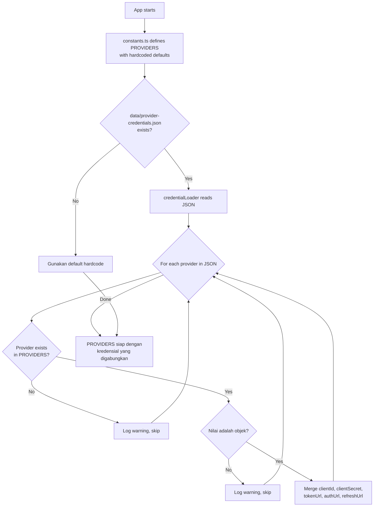

---

### 4.2 Executors (`open-sse/executors/`)

Executor merangkum **logika khusus penyedia** menggunakan **Strategy Pattern**. Setiap executor mengganti metode dasar sesuai kebutuhan.

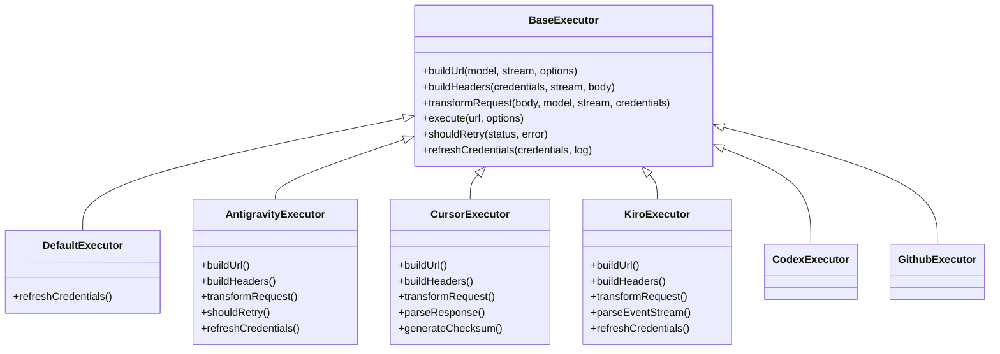

| Executor         | Penyedia                                   | Spesialisasi Utama                                                                                                  |
| ---------------- | ------------------------------------------ | ------------------------------------------------------------------------------------------------------------------- |
| `base.ts`        | —                                          | Basis abstrak: pembangunan URL, header, logika percobaan ulang, pembaruan kredensial                                |
| `default.ts`     | Claude, Gemini, OpenAI, GLM, Kimi, MiniMax | Pembaruan token OAuth generik untuk penyedia standar                                                                |
| `antigravity.ts` | Google Cloud Code                          | Pembuatan ID proyek/sesi, fallback multi-URL, parsing percobaan ulang kustom dari pesan error ("reset after 2h7m23s") |
| `cursor.ts`      | Cursor IDE                                 | **Paling kompleks**: autentikasi checksum SHA-256, encoding permintaan Protobuf, parsing binary EventStream → respons SSE |
| `codex.ts`       | OpenAI Codex                               | Menyuntikkan instruksi sistem, mengelola tingkat berpikir, menghapus parameter yang tidak didukung                  |
| `github.ts`      | GitHub Copilot                             | Sistem token ganda (GitHub OAuth + token Copilot), peniruan header VSCode                                           |
| `kiro.ts`        | AWS CodeWhisperer                          | Parsing binary AWS EventStream, frame event AMZN, estimasi token                                                   |
| `index.ts`       | —                                          | Factory: memetakan nama penyedia → kelas executor, dengan fallback default                                          |

---

### 4.3 Handlers (`open-sse/handlers/`)

**Lapisan orkestrasi** — mengoordinasikan terjemahan, eksekusi, streaming, dan penanganan error.

| File                  | Tujuan                                                                                                                                                                                                                 |
| --------------------- | ---------------------------------------------------------------------------------------------------------------------------------------------------------------------------------------------------------------------- |
| `chatCore.ts`         | **Orkestrator pusat** (~600 baris). Menangani siklus hidup permintaan secara lengkap: deteksi format → terjemahan → dispatch executor → respons streaming/non-streaming → pembaruan token → penanganan error → pencatatan penggunaan. |
| `responsesHandler.ts` | Adaptor untuk Responses API OpenAI: mengonversi format Responses → Penyelesaian Obrolan → mengirim ke `chatCore` → mengonversi SSE kembali ke format Responses.                                                            |
| `embeddings.ts`       | Handler pembuatan embedding: me-resolve model embedding → penyedia, mengirim ke API penyedia, mengembalikan respons embedding yang kompatibel dengan OpenAI. Mendukung 6+ penyedia.                                    |
| `imageGeneration.ts`  | Handler pembuatan gambar: me-resolve model gambar → penyedia, mendukung mode kompatibel-OpenAI, Gemini-image (Antigravity), dan fallback (Nebius). Mengembalikan gambar base64 atau URL.                               |

#### Siklus Hidup Permintaan (chatCore.ts)

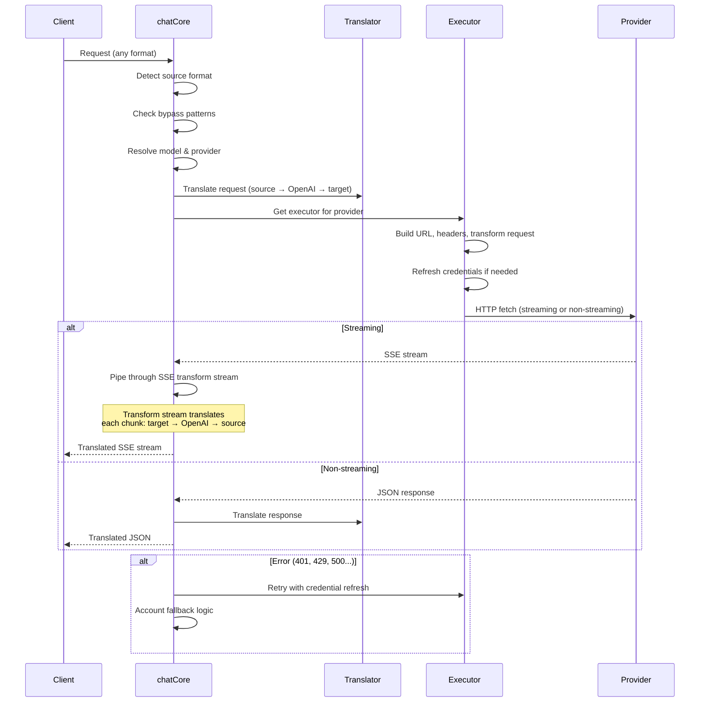

---

### 4.4 Services (`open-sse/services/`)

Logika bisnis yang mendukung handler dan executor.

| File                 | Tujuan                                                                                                                                                                                                                                                                                                                                 |
| -------------------- | -------------------------------------------------------------------------------------------------------------------------------------------------------------------------------------------------------------------------------------------------------------------------------------------------------------------------------------- |
| `provider.ts`        | **Deteksi format** (`detectFormat`): menganalisis struktur body permintaan untuk mengidentifikasi format Claude/OpenAI/Gemini/Antigravity/Responses (mencakup heuristik `max_tokens` untuk Claude). Juga: pembangunan URL, pembangunan header, normalisasi konfigurasi berpikir. Mendukung penyedia dinamis `openai-compatible-*` dan `anthropic-compatible-*`. |
| `model.ts`           | Parsing string model (`claude/model-name` → `{provider: "claude", model: "model-name"}`), resolusi alias dengan deteksi tabrakan, sanitasi input (menolak path traversal/karakter kontrol), dan resolusi info model dengan dukungan getter alias asinkron.                                                                             |
| `accountFallback.ts` | Penanganan rate-limit: backoff eksponensial (1d → 2d → 4d → maks 2min), manajemen cooldown akun, klasifikasi error (error mana yang memicu fallback vs. tidak).                                                                                                                                                                        |
| `tokenRefresh.ts`    | Pembaruan token OAuth untuk **setiap penyedia**: Google (Gemini, Antigravity), Claude, Codex, Qwen, Qoder, GitHub (OAuth + token ganda Copilot), Kiro (AWS SSO OIDC + Social Auth). Mencakup cache deduplikasi promise in-flight dan percobaan ulang dengan backoff eksponensial.                                                      |
| `combo.ts`           | **Model combo**: rantai model fallback. Jika model A gagal dengan error yang memenuhi syarat fallback, coba model B, lalu C, dst. Mengembalikan kode status upstream yang sebenarnya.                                                                                                                                                  |
| `usage.ts`           | Mengambil data kuota/penggunaan dari API penyedia (kuota GitHub Copilot, kuota model Antigravity, batas laju Codex, rincian penggunaan Kiro, pengaturan Claude).                                                                                                                                                                       |
| `accountSelector.ts` | Pemilihan akun cerdas dengan algoritma penilaian: mempertimbangkan prioritas, status kesehatan, posisi round-robin, dan kondisi cooldown untuk memilih akun optimal setiap permintaan.                                                                                                                                                  |
| `contextManager.ts`  | Manajemen siklus hidup konteks permintaan: membuat dan melacak objek konteks per-permintaan dengan metadata (ID permintaan, stempel waktu, info penyedia) untuk debugging dan pencatatan.                                                                                                                                               |
| `ipFilter.ts`        | Kontrol akses berbasis IP: mendukung mode allowlist dan blocklist. Memvalidasi IP klien terhadap aturan yang dikonfigurasi sebelum memproses permintaan API.                                                                                                                                                                            |
| `sessionManager.ts`  | Pelacakan sesi dengan fingerprinting klien: melacak sesi aktif menggunakan identifier klien yang di-hash, memantau jumlah permintaan, dan menyediakan metrik sesi.                                                                                                                                                                     |
| `signatureCache.ts`  | Cache deduplikasi berbasis tanda tangan permintaan: mencegah permintaan duplikat dengan menyimpan cache tanda tangan permintaan terbaru dan mengembalikan respons tersimpan untuk permintaan identik dalam jendela waktu tertentu.                                                                                                      |
| `systemPrompt.ts`    | Injeksi system prompt global: menambahkan di depan atau di belakang system prompt yang dapat dikonfigurasi ke semua permintaan, dengan penanganan kompatibilitas per-penyedia.                                                                                                                                                          |
| `thinkingBudget.ts`  | Manajemen anggaran token penalaran: mendukung mode passthrough, auto (hapus konfigurasi berpikir), kustom (anggaran tetap), dan adaptif (skala kompleksitas) untuk mengendalikan token berpikir/penalaran.                                                                                                                              |
| `wildcardRouter.ts`  | Routing pola model wildcard: me-resolve pola wildcard (mis., `*/claude-*`) ke pasangan penyedia/model konkret berdasarkan ketersediaan dan prioritas.                                                                                                                                                                                  |

#### Deduplikasi Pembaruan Token

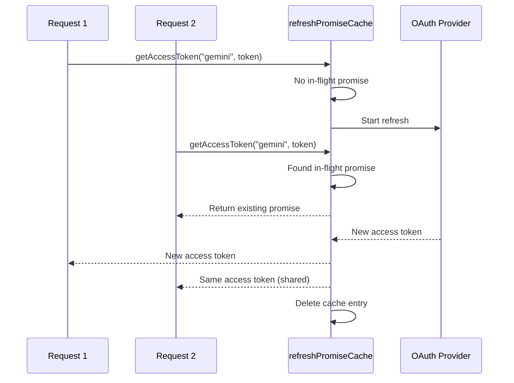

#### Mesin Status Fallback Akun

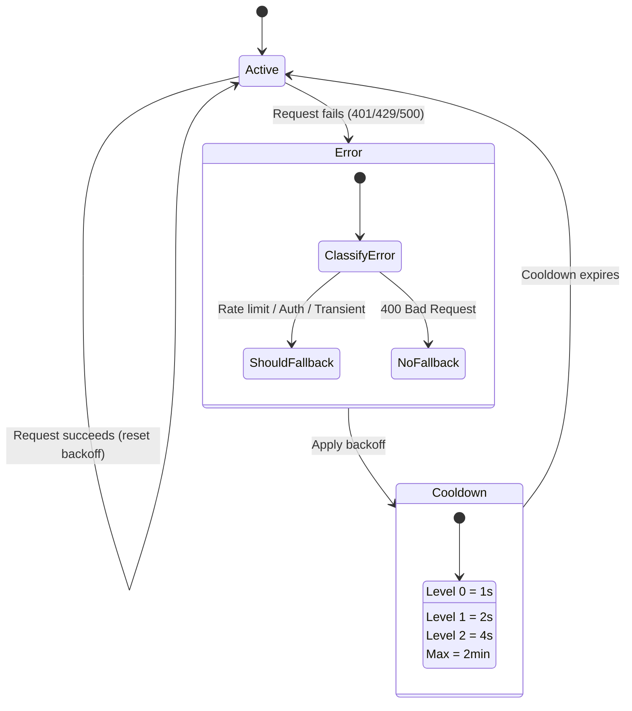

#### Model Rantai Kombo

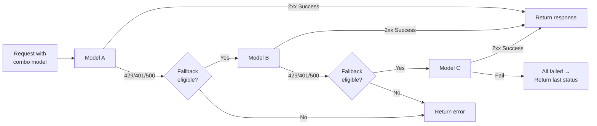

---

### 4.5 Translator (`open-sse/translator/`)

**Mesin terjemahan format** yang menggunakan sistem plugin pendaftaran-diri.

#### Arsitektur

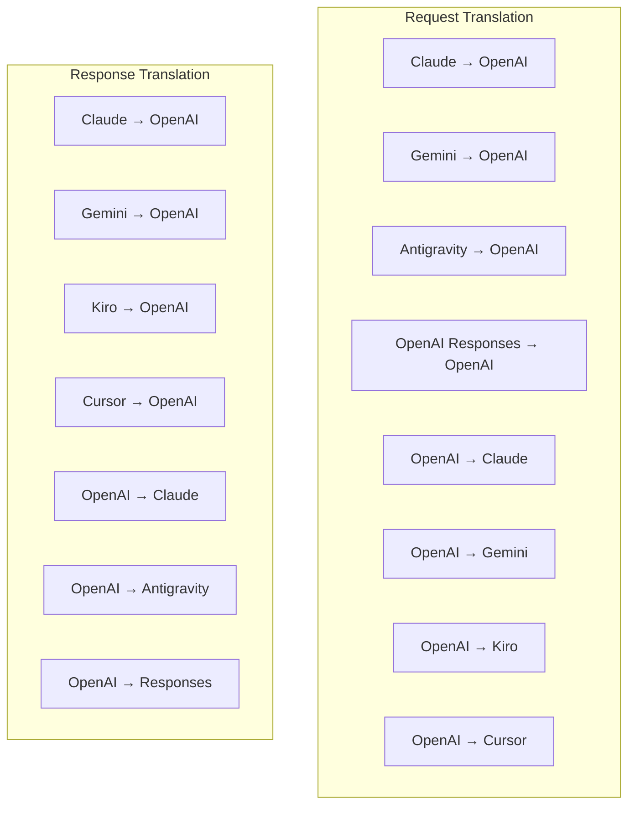

| Direktori    | File          | Deskripsi                                                                                                                                                                                                                                                        |
| ------------ | ------------- | ---------------------------------------------------------------------------------------------------------------------------------------------------------------------------------------------------------------------------------------------------------------- |
| `request/`   | 8 penerjemah  | Mengonversi body permintaan antar format. Setiap file mendaftar sendiri melalui `register(from, to, fn)` saat diimpor.                                                                                                                                           |
| `response/`  | 7 penerjemah  | Mengonversi potongan respon streaming antar format. berpartisipasi tipe acara SSE, blok berpikir, panggilan alat.                                                                                                                                                        |
| `helpers/`   | 6 pembantu    | Utilitas bersama: `claudeHelper` (ekstraksi system prompt, konfigurasi berpikir), `geminiHelper` (pemetaan parts/contents), `openaiHelper` (pemfilteran format), `toolCallHelper` (pembuatan ID, injeksi respons yang hilang), `maxTokensHelper`, `responsesApiHelper`. |
| `index.ts`   | —             | Mesin terjemahan: `translateRequest()`, `translateResponse()`, manajemen state, registry.                                                                                                                                                                        |
| `formats.ts` | —             | Konstanta format: `OPENAI`, `CLAUDE`, `GEMINI`, `ANTIGRAVITY`, `KIRO`, `CURSOR`, `OPENAI_RESPONSES`.                                                                                                                                                             |

#### Desain Utama: Plugin Pendaftaran-Diri

```javascript
// Setiap file penerjemah memanggil register() saat diimpor:
import { register } from "../index.js";
register("claude", "openai", translateClaudeToOpenAI);

// index.js mengimpor semua file penerjemah, memicu pendaftaran:
import "./request/claude-to-openai.js"; // ← mendaftar sendiri
```

---

### 4.6 Utils (`open-sse/utils/`)

| File               | Tujuan                                                                                                                                                                                                                                                                               |
| ------------------ | ------------------------------------------------------------------------------------------------------------------------------------------------------------------------------------------------------------------------------------------------------------------------------------ |
| `error.ts`         | Pembangunan respons error (format kompatibel-OpenAI), parsing error upstream, ekstraksi waktu percobaan ulang Antigravity dari pesan error, streaming error SSE.                                                                                                                     |
| `stream.ts`        | **SSE Transform Stream** — inti streaming saluran pipa. Mode dua: `TRANSLATE` (terjemahan format penuh) dan `PASSTHROUGH` (normalisasi + penggunaan ekstraksi). menyertakan buffering potongan, estimasi penggunaan, pelacakan panjang konten. Encoder/decoder instance per-stream menghindari status bersama. |
| `streamHelpers.ts` | Utilitas SSE tingkat rendah: `parseSSELine` (toleran terhadap spasi), `hasValuableContent` (menyaring potongan kosong untuk OpenAI/Claude/Gemini), `fixInvalidId`, `formatSSE` (serialisasi SSE yang peka format dengan pembersihan `perf_metrics`).                                |
| `usageTracking.ts` | Ekstraksi penggunaan token dari format apa pun (Claude/OpenAI/Gemini/Responses), estimasi dengan rasio karakter-per-token terpisah untuk tool/pesan, penambahan buffer (margin keamanan 2000 token), pemfilteran field spesifik-format, pencatatan konsol dengan warna ANSI.          |
| `requestLogger.ts` | Pembantu pencatatan permintaan berbasis file lawas yang dipertahankan untuk kompatibilitas. Deployment saat ini sebaiknya menggunakan `APP_LOG_TO_FILE` untuk log aplikasi dan pipeline log panggilan untuk artefak permintaan yang dipersistensikan.                                 |
| `bypassHandler.ts` | Mengintersep pola tertentu dari Claude CLI (ekstraksi judul, pemanasan, penghitungan) dan mengembalikan respons palsu tanpa memanggil penyedia apa pun. Mendukung streaming maupun non-streaming. Sengaja dibatasi hanya untuk cakupan Claude CLI.                                   |
| `networkProxy.ts`  | Me-resolve URL proxy keluar untuk penyedia tertentu dengan urutan prioritas: konfigurasi spesifik-penyedia → konfigurasi global → variabel lingkungan (`HTTPS_PROXY`/`HTTP_PROXY`/`ALL_PROXY`). Mendukung pengecualian `NO_PROXY`. Menyimpan cache konfigurasi selama 30d.           |

#### SSE Streaming Saluran Pipa

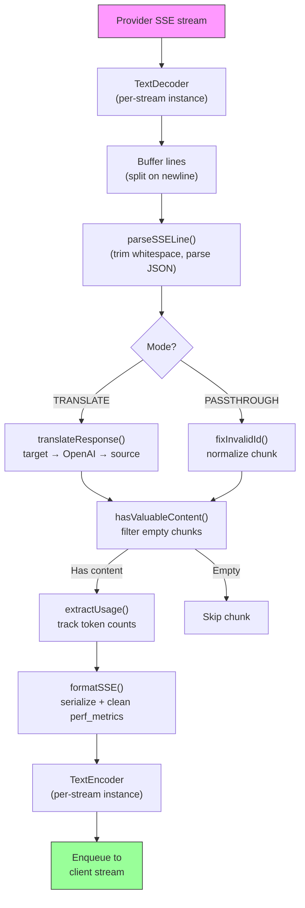

#### Struktur Sesi Permintaan Logger

```
logs/
└── claude_gemini_claude-sonnet_20260208_143045/
    ├── 1_req_client.json      ← Permintaan klien mentah
    ├── 2_req_source.json      ← Setelah konversi awal
    ├── 3_req_openai.json      ← Format perantara OpenAI
    ├── 4_req_target.json      ← Format target akhir
    ├── 5_res_provider.txt     ← Potongan SSE penyedia (streaming)
    ├── 5_res_provider.json    ← Respons penyedia (non-streaming)
    ├── 6_res_openai.txt       ← Potongan perantara OpenAI
    ├── 7_res_client.txt       ← Potongan SSE yang menghadap klien
    └── 6_error.json           ← Detail error (jika ada)
```

---

### 4.7 Lapisan Aplikasi (`src/`)

| Direktori     | Tujuan                                                                          |
| ------------- | ------------------------------------------------------------------------------- |
| `src/app/`    | Antarmuka web, rute API, middleware Express, handler callback OAuth              |
| `src/lib/`    | Akses database (`localDb.ts`, `usageDb.ts`), autentikasi, kode bersama          |
| `src/mitm/`   | Utilitas proxy man-in-the-middle untuk mengintersep lalu lintas penyedia        |
| `src/models/` | Definisi model basis data                                                          |
| `src/shared/` | Wrapper fungsi open-sse (penyedia, stream, error, dll.)                          |
| `src/sse/`    | Handler endpoint SSE yang menghubungkan library open-sse ke rute Express        |
| `src/store/`  | Manajemen state aplikasi                                                         |

#### Rute API Penting

| Rute                                          | Metode          | Tujuan                                                                                   |
| --------------------------------------------- | --------------- | ---------------------------------------------------------------------------------------- |
| `/api/provider-models`                        | GET/POST/DELETE | CRUD untuk model kustom per penyedia                                                     |
| `/api/models/catalog`                         | GET             | Katalog gabungan semua model (chat, embedding, gambar, kustom) yang dikelompokkan per penyedia |
| `/api/settings/proxy`                         | GET/PUT/DELETE  | Konfigurasi proxy keluar hierarkis (`global/providers/combos/keys`)                      |
| `/api/settings/proxy/test`                    | POST            | Memvalidasi konektivitas proxy dan mengembalikan IP publik/latensi                       |
| `/v1/providers/[provider]/chat/completions`   | POST            | Chat completions khusus per-penyedia dengan validasi model                               |
| `/v1/providers/[provider]/embeddings`         | POST            | Embedding khusus per-penyedia dengan validasi model                                      |
| `/v1/providers/[provider]/images/generations` | POST            | Pembuatan gambar khusus per-penyedia dengan validasi model                               |
| `/api/settings/ip-filter`                     | GET/PUT         | Manajemen allowlist/blocklist IP                                                         |
| `/api/settings/thinking-budget`               | GET/PUT         | Konfigurasi anggaran token penalaran (passthrough/auto/custom/adaptive)                  |
| `/api/settings/system-prompt`                 | GET/PUT         | Injeksi system prompt global untuk semua permintaan                                      |
| `/api/sessions`                               | GET             | Pelacakan sesi aktif dan metrik                                                          |
| `/api/rate-limits`                            | GET             | Status batas laju per-akun                                                               |

---

## 5. Pola Desain Utama

### 5.1 Terjemahan Hub-and-Spoke

Semua format diterjemahkan melalui **format OpenAI sebagai hub**. Menambahkan penyedia baru hanya membutuhkan penulisan **satu pasang** penerjemah (ke/dari OpenAI), bukan N pasangan.

### 5.2 Strategy Pattern pada Executor

Setiap penyedia memiliki kelas executor khusus yang mewarisi dari `BaseExecutor`. Factory di `executors/index.ts` memilih yang tepat saat runtime.

### 5.3 Sistem Plugin Pendaftaran-Diri

Modul penerjemah mendaftarkan diri saat diimpor melalui `register()`. Menambahkan penerjemah baru cukup dengan membuat file dan mengimpornya.

### 5.4 Fallback Akun dengan Backoff Eksponensial

Ketika penyedia mengembalikan 429/401/500, sistem dapat beralih ke akun berikutnya, menerapkan cooldown eksponensial (1d → 2d → 4d → maks 2min).

### 5.5 Model Rantai Kombo

Sebuah "combo" mengelompokkan beberapa string `provider/model`. Jika yang pertama gagal, otomatis beralih ke berikutnya.

### 5.6 Terjemahan Streaming dengan State

Terjemahan respons mempertahankan state di seluruh potongan SSE (pelacakan blok berpikir, akumulasi tool call, pengindeksan blok konten) melalui mekanisme `initState()`.

### 5.7 Buffer Keamanan Penggunaan

Buffer 2000 token ditambahkan ke penggunaan yang dilaporkan untuk mencegah klien mencapai batas jendela konteks akibat overhead dari system prompt dan terjemahan format.

---

## 6. Format yang Didukung

| Format                  | Arah            | Identifier         |
| ----------------------- | --------------- | ------------------ |
| OpenAI Chat Completions | sumber + target | `openai`           |
| API Respons OpenAI    | sumber + target | `openai-responses` |
| Anthropic Claude        | sumber + target | `claude`           |
| Google Gemini           | sumber + target | `gemini`           |
| Antigravity             | sumber + target | `antigravity`      |
| AWS Kiro                | target saja     | `kiro`             |
| Cursor                  | target saja     | `cursor`           |

---

## 7. Penyedia yang Didukung

| Penyedia                 | Metode Autentikasi     | Executor    | Catatan Utama                                         |
| ------------------------ | ---------------------- | ----------- | ----------------------------------------------------- |
| Anthropic Claude         | Kunci API atau OAuth     | Default     | Menggunakan header `x-api-key`                        |
| Google Gemini            | Kunci API atau OAuth     | Default     | Menggunakan header `x-goog-api-key`                   |
| Antigravity              | OAuth                  | Antigravity | Penggantian multi-URL, penguraian percobaan ulang kustom    |
| OpenAI                   | API key                | Default     | Autentikasi Bearer standar                            |
| Codex                    | OAuth                  | Codex       | Menyuntikkan instruksi sistem, mengelola berpikir     |
| GitHub Copilot           | OAuth + token Copilot  | Github      | Token ganda, peniruan header VSCode                   |
| Kiro (AWS)               | AWS SSO OIDC atau Social | Kiro      | Parsing binary EventStream                            |
| Cursor IDE               | Autentikasi checksum   | Cursor      | Encoding Protobuf, checksum SHA-256                   |
| Qwen                     | OAuth                  | Default     | Autentikasi standar                                   |
| Qoder                    | OAuth (Basic + Bearer) | Default     | Autentikasi header ganda|
| OpenRouter               | API key                | Default     | Autentikasi Bearer standar                            |
| GLM, Kimi, MiniMax       | API key                | Default     | Kompatibel-Claude, menggunakan `x-api-key`            |
| `openai-compatible-*`    | API key                | Default     |Dinamis: endpoint kompatibel-OpenAI apa pun           |
| `anthropic-compatible-*` | API key                | Default     | Dinamis: endpoint kompatibel-Claude apa pun           |

---

## 8. Ringkasan Alur Data

### Permintaan Streaming

```mermaid
flowchart LR
    A["Client"] --> B["detectFormat()"]
    B --> C["translateRequest()\nsource → OpenAI → target"]
    C --> D["Executor\nbuildUrl + buildHeaders"]
    D --> E["fetch(providerURL)"]
    E --> F["createSSEStream()\nTRANSLATE mode"]
    F --> G["parseSSELine()"]
    G --> H["translateResponse()\ntarget → OpenAI → source"]
    H --> I["extractUsage()\n+ addBuffer"]
    I --> J["formatSSE()"]
    J --> K["Client receives\ntranslated SSE"]
    K --> L["logUsage()\nsaveRequestUsage()"]
```

### Permintaan Non-Streaming

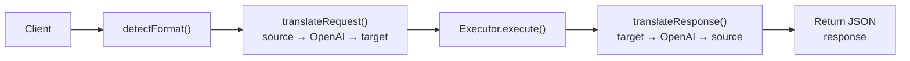

### Alur Bypass (Claude CLI)

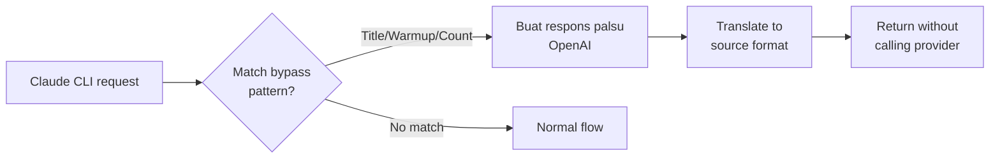
