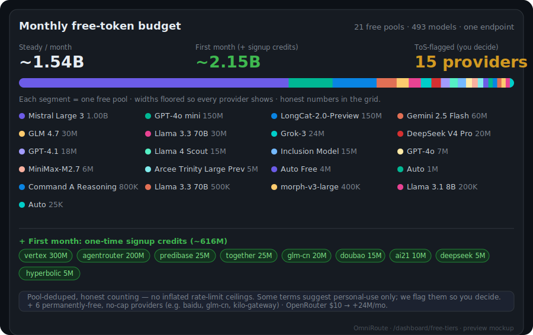
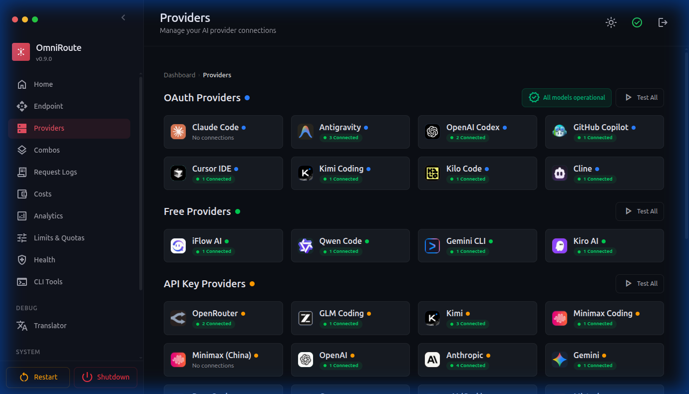
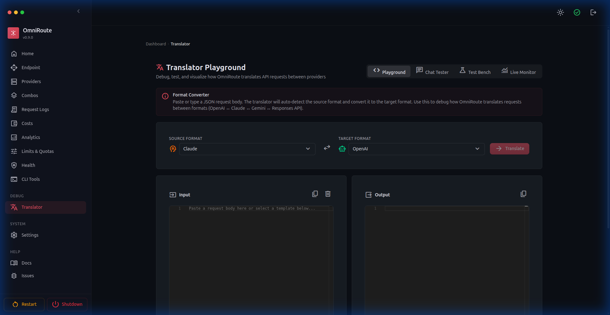
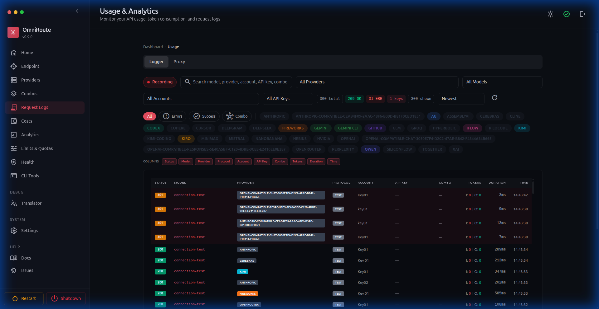

# 🚀 OmniRoute — 免费 AI 网关

🌐 **语言:** 🇺🇸 [English](../../../README.md) · 🇸🇦 [ar](../ar/README.md) · 🇧🇬 [bg](../bg/README.md) · 🇧🇩 [bn](../bn/README.md) · 🇨🇿 [cs](../cs/README.md) · 🇩🇰 [da](../da/README.md) · 🇩🇪 [de](../de/README.md) · 🇪🇸 [es](../es/README.md) · 🇮🇷 [fa](../fa/README.md) · 🇫🇮 [fi](../fi/README.md) · 🇫🇷 [fr](../fr/README.md) · 🇮🇳 [gu](../gu/README.md) · 🇮🇱 [he](../he/README.md) · 🇮🇳 [hi](../hi/README.md) · 🇭🇺 [hu](../hu/README.md) · 🇮🇩 [id](../id/README.md) · 🇮🇹 [it](../it/README.md) · 🇯🇵 [ja](../ja/README.md) · 🇰🇷 [ko](../ko/README.md) · 🇮🇳 [mr](../mr/README.md) · 🇲🇾 [ms](../ms/README.md) · 🇳🇱 [nl](../nl/README.md) · 🇳🇴 [no](../no/README.md) · 🇵🇭 [phi](../phi/README.md) · 🇵🇱 [pl](../pl/README.md) · 🇵🇹 [pt](../pt/README.md) · 🇧🇷 [pt-BR](../pt-BR/README.md) · 🇷🇴 [ro](../ro/README.md) · 🇷🇺 [ru](../ru/README.md) · 🇸🇰 [sk](../sk/README.md) · 🇸🇪 [sv](../sv/README.md) · 🇰🇪 [sw](../sw/README.md) · 🇮🇳 [ta](../ta/README.md) · 🇮🇳 [te](../te/README.md) · 🇹🇭 [th](../th/README.md) · 🇹🇷 [tr](../tr/README.md) · 🇺🇦 [uk-UA](../uk-UA/README.md) · 🇵🇰 [ur](../ur/README.md) · 🇻🇳 [vi](../vi/README.md) · 🇨🇳 [zh-CN](../zh-CN/README.md) · 🇹🇼 [zh-TW](../zh-TW/README.md)

---

<div align="center">


<br/>

# 🚀 OmniRoute — 免费 AI 网关

### 永远不要停止开发。通过一个端点，将每个 AI 工具连接到 **231 个供应商** — **50+ 免费**。

**将 Claude Code、Codex、Cursor、Cline、Copilot 和 Antigravity 连接到免费的 Claude / GPT / Gemini。自动故障转移。**

<br/>

**RTK + Caveman 压缩可节省 15–95% 的 Token。永远不会达到限制。**

<br/>

**~1.6B 有记录的免费 Token/月** — 首月通过注册奖励最高可达 **~2.1B** — 聚合所有免费层的配额，再加上永久免费、无上限的供应商，而上述压缩进一步延长每一分 Token。([统计方法 →](../../reference/FREE_TIERS.md#tldr--how-much-free-inference-does-omniroute-actually-aggregate))

<br/>

[](#-231-ai-providers--50-free)
[](#-231-ai-providers--50-free)
[](../../reference/FREE_TIERS.md)
[](#%EF%B8%8F-save-1595-tokens--automatically)
[](#-combos--the-flagship)
[](#-quick-start)

<br/>

### 💬 加入社区

[](https://discord.gg/EkzRkpzKYt)
[](https://t.me/omnirouteOficial)
[](https://chat.whatsapp.com/JI7cDQ1GyaiDHhVBpLxf8b?mode=gi_t)
[](https://chat.whatsapp.com/BTGJXIyjeNIIgExvTMGGhI)

**问题、供应商技巧、路线图和支持 → [Discord](https://discord.gg/EkzRkpzKYt) · [Telegram](https://t.me/omnirouteOficial) · WhatsApp [🌍 全球](https://chat.whatsapp.com/JI7cDQ1GyaiDHhVBpLxf8b?mode=gi_t) / [🇧🇷 巴西](https://chat.whatsapp.com/BTGJXIyjeNIIgExvTMGGhI)**

<br/>

<a href="https://trendshift.io/repositories/23589" target="_blank"></a>

[](https://www.npmjs.com/package/omniroute)
[](../../LICENSE)
[](../../package.json)
[](https://github.com/diegosouzapw/OmniRoute)

<div align="center">

[](https://www.npmjs.com/package/omniroute)

[](https://hub.docker.com/r/diegosouzapw/omniroute)


[](https://omniroute.online)

</div>

<br/>

[**🚀 快速开始**](#-quick-start) • [**🎯 组合策略**](#-combos--the-flagship) • [**🌐 供应商**](#-231-ai-providers--50-free) • [**🔌 CLI 与 MCP**](#-full-cli--a2a--mcp) • [**🗜️ 压缩**](#%EF%B8%8F-save-1595-tokens--automatically) • [**🌍 网站**](https://omniroute.online)

[💥 承诺](#-the-promise) • [🤔 为什么](#-why-omniroute) • [🏆 优势](#-what-sets-omniroute-apart) • [🤖 兼容 CLI](#-compatible-clis--coding-agents) • [🖥️ 运行平台](#%EF%B8%8F-where-omniroute-runs--anywhere) • [🔒 隐私](#-private--local-first) • [🎬 实际演示](#-omniroute-in-action) • [📚 探索更多](#-explore-more) • [📧 支持](#-support--community)

</div>

<div align="center">
 <b>🌐 支持 41+ 种语言</b>
 <table>
  <tr>
    <td align="center"><a href="README.md">🇺🇸</a></td>
    <td align="center"><a href="docs/i18n/pt-BR/README.md">🇧🇷</a></td>
    <td align="center"><a href="docs/i18n/es/README.md">🇪🇸</a></td>
    <td align="center"><a href="docs/i18n/fr/README.md">🇫🇷</a></td>
    <td align="center"><a href="docs/i18n/it/README.md">🇮🇹</a></td>
    <td align="center"><a href="docs/i18n/ru/README.md">🇷🇺</a></td>
    <td align="center"><a href="docs/i18n/zh-CN/README.md">🇨🇳</a></td>
    <td align="center"><a href="docs/i18n/zh-TW/README.md">🇹🇼</a></td>
    <td align="center"><a href="docs/i18n/de/README.md">🇩🇪</a></td>
    <td align="center"><a href="docs/i18n/ja/README.md">🇯🇵</a></td>
    <td align="center"><a href="docs/i18n/ko/README.md">🇰🇷</a></td>
  </tr>
  <tr>
    <td align="center"><a href="docs/i18n/th/README.md">🇹🇭</a></td>
    <td align="center"><a href="docs/i18n/vi/README.md">🇻🇳</a></td>
    <td align="center"><a href="docs/i18n/id/README.md">🇮🇩</a></td>
    <td align="center"><a href="docs/i18n/ms/README.md">🇲🇾</a></td>
    <td align="center"><a href="docs/i18n/phi/README.md">🇵🇭</a></td>
    <td align="center"><a href="docs/i18n/ar/README.md">🇸🇦</a></td>
    <td align="center"><a href="docs/i18n/he/README.md">🇮🇱</a></td>
    <td align="center"><a href="docs/i18n/az/README.md">🇦🇿</a></td>
    <td align="center"><a href="docs/i18n/uk-UA/README.md">🇺🇦</a></td>
    <td align="center"><a href="docs/i18n/pl/README.md">🇵🇱</a></td>
    <td align="center"><a href="docs/i18n/cs/README.md">🇨🇿</a></td>
  </tr>
  <tr>
    <td align="center"><a href="docs/i18n/nl/README.md">🇳🇱</a></td>
    <td align="center"><a href="docs/i18n/bg/README.md">🇧🇬</a></td>
    <td align="center"><a href="docs/i18n/da/README.md">🇩🇰</a></td>
    <td align="center"><a href="docs/i18n/fi/README.md">🇫🇮</a></td>
    <td align="center"><a href="docs/i18n/no/README.md">🇳🇴</a></td>
    <td align="center"><a href="docs/i18n/sv/README.md">🇸🇪</a></td>
    <td align="center"><a href="docs/i18n/hu/README.md">🇭🇺</a></td>
    <td align="center"><a href="docs/i18n/ro/README.md">🇷🇴</a></td>
    <td align="center"><a href="docs/i18n/sk/README.md">🇸🇰</a></td>
    <td align="center"><a href="docs/i18n/pt/README.md">🇵🇹</a></td>
    <td align="center"></td>
  </tr>
</table>
</div>

<br/>

<div align="center">

# 💰 ~1.6B 免费 Token/月

</div>

> 手动堆叠免费层很痛苦 — 数十个 SDK、数十个速率限制，且不清楚自己到底有多少配额。OmniRoute 将 **40+ 供应商池 / 500+ 模型**的**有记录**免费层聚合为一个真实数字，并在仪表板上实时展示 (`/dashboard/free-tiers`)。

- **~1.6B 免费 Token/月**（稳定） — 首月通过注册奖励最高可达 **~2.1B**。
- **池去重，诚实** — 每个共享免费池只计算**一次**，因此标题不会被速率限制上限所夸大。（如果按全天候速率限制计算，可能会显示 ~10B；我们不发布那个数字。）
- **加上不可计数的** — 永久免费、无 Token 上限的供应商（SiliconFlow、Z.AI GLM-Flash、Kilo、OpenCode Zen…）以及 **$10 OpenRouter 充值**可解锁 **+24M/月**，两者分别列示，不会夸大标题数字。
- **按模型细分**，当月**已用/剩余**实时显示，以及每个供应商的透明**条款标志**。



> 预览模型 — 实际截图将在 `/dashboard/free-tiers` 页面验证后上线。完整方法（池去重、信用层级、供应商条款）：**[docs/reference/FREE_TIERS.md](../../reference/FREE_TIERS.md)**。

<br/>

<div align="center">

# 💥 承诺

</div>

> 一个端点。**231 个供应商。** 永远不要停止构建 — 让 OmniRoute 选择最便宜且有效的方案。

<table>
  <tr>
    <td width="33%" valign="top"><b>🚫 永远不会达到限制</b><br/><sub>跨 231 个供应商毫秒级自动故障转移。配额用尽？下一个供应商立即接管 — 零停机。</sub></td>
    <td width="33%" valign="top"><b>💸 节省高达 95% 的 Token</b><br/><sub>RTK + Caveman 堆叠压缩可削减 15–95% 的合格 Token（工具密集型会话平均约 89%）。</sub></td>
    <td width="33%" valign="top"><b>🆓 零成本开始</b><br/><sub>50+ 供应商提供免费层，11 个永久免费（Kiro、Qoder、Pollinations、LongCat…）。无需信用卡。</sub></td>
  </tr>
  <tr>
    <td width="33%" valign="top"><b>🔌 每个工具都兼容</b><br/><sub>16+ 编码代理 — Claude Code、Codex、Cursor、Cline、Copilot、Antigravity — 通过一个配置即可使用。</sub></td>
    <td width="33%" valign="top"><b>🧩 一个端点</b><br/><sub>OpenAI ↔ Claude ↔ Gemini ↔ Responses API 转换。将任何工具指向 <code>/v1</code> 即可使用。</sub></td>
    <td width="33%" valign="top"><b>🛡️ 生产级别</b><br/><sub>断路器、TLS 隐身、MCP（87 工具）、A2A、记忆、护栏、评估。14,965 个测试。</sub></td>
  </tr>
</table>

<br/>
<br/>

<div align="center">

# 🤔 为什么选择 OmniRoute？

</div>

> 告别管理 10 个仪表板、失效的 API 密钥和意外账单的烦恼。

| ❌ 日常痛点 | ✅ OmniRoute 的解决方案 |
|---|---|
| 📉 订阅配额每月用不完就浪费 | **最大化订阅** — 追踪配额，在重置前用尽每个 Token |
| 🛑 速率限制中断编码 | **4 层自动故障转移** — 订阅 → API → 廉价 → 免费，毫秒级切换 |
| 🔥 工具输出消耗大量 Token | **RTK + Caveman 压缩** — 每次请求节省 15–95% 合格 Token |
| 💸 昂贵的 API（每个供应商 $20–50/月） | **成本优化路由** — 自动路由到最便宜的可行模型 |
| 🧰 每个 AI 工具需要不同的设置 | **一个端点，所有工具，一个仪表板** |
| 🌍 所在国家/地区封锁 AI | **3 层代理** + TLS 指纹隐身 — 从任何地方使用 AI |

<div align="center">

```
┌──────────────────────────────────────────────────────────┐
│        Your IDE / CLI  (Claude Code, Cursor, Cline…)       │
└─────────────────────────┬──────────────────────────────────┘
                          │ http://localhost:20128/v1
                          ▼
┌──────────────────────────────────────────────────────────┐
│                  OmniRoute — Smart Router                  │
│  RTK + Caveman compression · 17 routing strategies         │
│  Circuit breakers · TLS stealth · MCP · A2A · Guardrails   │
└─────────────────────────┬──────────────────────────────────┘
        ┌─────────────┬────┴────────┬─────────────┐
        ▼ Tier 1      ▼ Tier 2      ▼ Tier 3       ▼ Tier 4
   SUBSCRIPTION     API KEY        CHEAP          FREE
   Claude Code,     DeepSeek,      GLM $0.5,      Kiro, Qoder,
   Codex, Copilot   Groq, xAI      MiniMax $0.2   Pollinations
   quota out? ───▶  budget hit? ─▶ budget hit? ─▶ always on
```

</div>

<br/>

<div align="center">

# 🎯 Combo — 旗舰功能

</div>

> **Combo** 是 OmniRoute **自动**路由的模型链。配额用尽、供应商失败或成本飙升 — Combo 自动滑动到下一个模型。**这就是 OmniRoute 不可中断的原因。** 🛡️

### ⚡ 零配置 — 只需使用 `auto`

无需创建 Combo。将模型设置为 `auto`（或变体），OmniRoute 会根据您连接的供应商实时评分构建虚拟 Combo：

| 模型 ID | 优化目标 |
|---|---|
| `auto` | 🎯 平衡默认（LKGP — 沿用上次好的供应商） |
| `auto/coding` | 🧑‍💻 代码生成优先质量权重 |
| `auto/fast` | ⚡ 最低延迟优先 |
| `auto/cheap` | 💰 每 Token 最低价优先 |
| `auto/offline` | 🔋 最多配额/速率限制余量优先 |
| `auto/smart` | 🔭 质量优先 + 10% 探索以发现更好模型 |

##

### 🔀 或自行构建 — 17 种路由策略

| 目标 | 策略 / Combo |
|---|---|
| 🥇 先用完订阅再付费 | `priority` / `fill-first` |
| ⚖️ 跨账户分散负载 | `round-robin` · `weighted` · `p2c` · `least-used` |
| 💸 始终选最便宜的可行模型 | `cost-optimized` · `auto/cheap` |
| 🧠 模型间移交长上下文 | `context-relay` · `context-optimized` |
| 🎲 随机/隐私路由 | `random` · `strict-random` |
| 🧬 分发到专家组 + 裁判合成 | `fusion` |
| 📊 按剩余配额余量路由 | `reset-window` · `headroom` |
| 🤖 智能路由 | `auto`（9 因素评分）· `lkgp` · `reset-aware` |

<sub>Auto-Combo 引擎根据 **9 个因素**（健康度、配额、成本、延迟、成功率、新鲜度…）为每个候选模型评分 — 参见 [`docs/routing/AUTO-COMBO.md`](../../routing/AUTO-COMBO.md)。</sub>

##

### 🧱 内置弹性（3 个独立层）

| 层 | 范围 | 作用 |
|---|---|---|
| 🔌 **断路器** | 整个供应商 | 停止重复调用上游失败的供应商；自动探测恢复 |
| 💤 **连接冷却** | 一个账户/密钥 | 跳过速率受限的密钥，其他密钥继续提供服务 |
| 🎯 **模型锁定** | 供应商 + 模型 | 仅隔离配额受限的模型，不影响整个连接 |

```
Combo: "always-on"                         Strategy: priority
  1. cc/claude-opus-4-7   ← subscription (use it fully)
  2. cx/gpt-5.5           ← second subscription
  3. glm/glm-5.1          ← cheap backup ($0.5/1M)
  4. kr/claude-sonnet-4.5 ← FREE, unlimited (never fails)
Result: 4 layers of fallback = zero downtime
```

<sub>📖 [Auto-Combo Engine](../../routing/AUTO-COMBO.md) · [Resilience Guide](../../architecture/RESILIENCE_GUIDE.md)</sub>

<br/>

<div align="center">

# 🏆 OmniRoute 的独特优势

</div>

| 功能 | OmniRoute | 其他路由器 |
|---|---|---|
| 🌐 供应商数量 | **231** | 20–100 |
| 🆓 免费供应商 | **50+（11 个永久免费）** | 1–5 |
| 🔀 路由策略 | **17 种**（优先级、加权、成本优化、上下文中继、融合…） | 1–3 |
| 🗜️ Token 压缩 | **RTK + Caveman 堆叠（15–95%）** | 无 / 20–40% |
| 🧰 内置 MCP 服务器 | **87 个工具、3 种传输、30 个范围** | 少有 |
| 🤝 A2A 代理协议 | **6 项技能、JSON-RPC 2.0** | 无 |
| 🧠 记忆（FTS5 + 向量） | **支持** | 少有 |
| 🛡️ 护栏（PII、注入、视觉） | **支持** | 少有 |
| ☁️ 云代理 | **Codex、Devin、Jules** | 无 |
| 🥷 TLS 指纹隐身 | **JA3/JA4 通过 wreq-js** | 无 |
| 🖥️ 多平台 | **Web · 桌面 · Termux · PWA** | 仅 Web |
| 🌍 国际化 | **42 种语言环境** | 0–4 |

<sub>📊 与 LiteLLM、OpenRouter 和 Portkey 的详细比较 → [`docs/comparison/OMNIROUTE_VS_ALTERNATIVES.md`](../../comparison/OMNIROUTE_VS_ALTERNATIVES.md)</sub>

<br/>

<div align="center">

# ✨ 新功能

</div>

> **v3.8.20 → v3.8.38** 重点更新。完整记录见 [`CHANGELOG.md`](../../CHANGELOG.md)。

- **⚖️ Quota-Share 路由** — 一个专用的 Combo 策略，按可用配额跨账户分配负载：Deficit-Round-Robin 调度、每连接 `max_concurrent` 配合冷却等待队列、多窗口使用量桶（5h / 7d / 每模型）、每(密钥,模型)上限、会话粘性确保提示缓存完整性，以及基于上游 Token 使用标头的主动饱和检测。→ [Resilience Guide](../../architecture/RESILIENCE_GUIDE.md)
- **🛰️ 远程模式** — 通过范围访问令牌从任何机器驱动远程 OmniRoute（`omniroute connect` / `omniroute contexts` / `omniroute tokens`）。→ [Remote Mode](../../guides/REMOTE-MODE.md)
- **🧭 更智能的自动路由** — OpenRouter 风格的 `auto/<category>:<tier>` Combo（如 `auto/coding:fast`、`auto/reasoning:pro`）、**Fusion** 策略（第 16 种 — 并行分发到多个模型，然后通过裁判合成）、**任务感知路由**（按任务类型选择最佳连接）、每请求 `X-Route-Model` 覆盖、实时 Arena-ELO + models.dev 模型智能、每步骤账户允许列表、供应商通配符 Combo 步骤、嵌套 Combo 引用执行、粘性加权选择以及 `web_search` 感知路由。→ [Auto-Combo](../../routing/AUTO-COMBO.md)
- **🗜️ 可插拔压缩** — **9 个可组合引擎**的异步流水线，带 Compression Studios、LLMLingua-2 ONNX 引擎和启发式/SLM 双层 **Ultra**、RTK、委托式 Anthropic 上下文编辑、**输出样式**（输出轴控制：简洁文章 / 少代码 / 简洁 CJK）、**自适应上下文预算拨盘**（仅扩展到适合上下文窗口所需的最低限度）、每请求 `x-omniroute-compression` 控制、可选的离线评估工具、仪表板上一键 **Headroom** 代理生命周期管理（支持 Docker 边车）、合成**压缩游乐场**（Play 赛道 + A/B 比较，附 USD 上限保真度判定）、可选的**每步骤保真度门控**（在损失性引擎降低提示质量前拒绝它），以及统一面板带命名配置文件 + 活动配置文件选择器。→ [Compression](../../compression/COMPRESSION_ENGINES.md)
- **🕵️ 透明 MITM 解密（TPROXY）** — 捕获并转换忽略代理环境变量的 CLI 流量，带每 SNI 证书颁发机构和信任存储安装程序。→ [MITM/TPROXY](../../security/MITM-TPROXY-DECRYPT.md)
- **💸 全方位成本遥测** — 每个端点上的 `X-OmniRoute-*` 成本/使用量标头（包括媒体）、非 Token 成本引擎、缓存命中 `X-OmniRoute-Cost-Saved` 标头，以及每密钥美元花费配额。→ [API Reference](../../reference/API_REFERENCE.md)
- **🧠 可控记忆** — 可选的 int8 向量量化（Qdrant + sqlite-vec）、默认关闭记忆、每请求 `x-omniroute-no-memory` 标头。→ [Memory](../../frameworks/MEMORY.md)
- **🛡️ 安全** — 所有 LLM 路由的提示注入防护（由红队套件支持），加上免费的 DuckDuckGo 最终手段网页搜索。→ [Guardrails](../../security/GUARDRAILS.md)
- **🤝 更多供应商和代理** — Cursor Cloud Agent（第 4 个云代理）、CodeBuddy CN（`copilot.tencent.com`）、Google Flow 视频生成供应商、新网关 **DGrid** 和 **Pioneer AI**（Fastino Labs）、入站 **xAI Grok** 转换器加 **Grok Build (xAI)**（带 OAuth 导入令牌流程）、GitHub Copilot 供应商上的 GPT-4 / GPT-4o-mini、多模型 **Factory Droid**、**ZenMux Free**（会话 Cookie 免费层）、**Alibaba DashScope** 文本转视频（`wan2.7-t2v`）、刷新后的 231 供应商目录（OrcaRouter、Wafer AI、OpenAdapter、dit.ai、TokenRouter…）、Vertex AI 媒体生成（语音/转录/音乐/视频），以及一键从 CLIProxyAPI 导入账户（`~/.cli-proxy-api/`）。→ [Providers](../../reference/PROVIDER_REFERENCE.md)
- **⚡ 本地性能与基础设施** — 一键本地 Redis 启动器（`omniroute redis up`，加仪表板 Redis 面板）、一键 **Cloudflare Workers** 和 **Deno Deploy** 中继部署器（连接到代理池），以及可选的 Bifrost Go 边车（卸载最热的中继路径，`BIFROST_BASE_URL`，超时时自动回退到 TypeScript 路径）。→ [Environment](../../reference/ENVIRONMENT.md)

<br/>

<div align="center">

# 🤖 兼容的 CLI 和编码代理

</div>

> 一个配置 — `http://localhost:20128/v1` — 每个 AI IDE 或 CLI 都可以在免费和低成本模型上运行。

<div align="center">
<table>
  <tr>
    <td align="center" width="120"><a href="https://github.com/anthropics/claude-code"><br/><b>Claude Code</b></a></td>
    <td align="center" width="120"><a href="https://github.com/openai/codex"><br/><b>Codex CLI</b></a></td>
    <td align="center" width="120"><br/><b>Cursor</b></td>
    <td align="center" width="120"><br/><b>Copilot</b></td>
    <td align="center" width="120"><br/><b>Continue</b></td>
  </tr>
  <tr>
    <td align="center" width="120"><a href="https://github.com/anomalyco/opencode"><br/><b>OpenCode</b></a></td>
    <td align="center" width="120"><a href="https://github.com/Kilo-Org/kilocode"><br/><b>Kilo Code</b></a></td>
    <td align="center" width="120"><br/><b>Droid</b></td>
    <td align="center" width="120"><br/><b>OpenClaw</b></td>
    <td align="center" width="120"><br/><b>Kiro</b></td>
    <td align="center" width="120"><br/><b>Command</b></td>
  </tr>
</table>
</div>

<div align="center">
<b>＋ 也可搭配</b> · Cline · Antigravity · Windsurf · AMP · Hermes · Qwen CLI · Roo · Continue · <b>任何兼容 OpenAI 的工具</b>
</div>

<sub>📖 所有 16+ 工具的逐个设置 → [`docs/reference/CLI-TOOLS.md`](../../reference/CLI-TOOLS.md) · 🧩 OpenCode 插件 → [`@omniroute/opencode-provider`](https://www.npmjs.com/package/@omniroute/opencode-provider)</sub>

<br/>

<div align="center">

# 🌐 231 个 AI 供应商 — 50+ 免费

</div>

> 最完整的开源路由器目录：**231 个供应商**、**50+ 具有免费层**、**11 个永久免费**。

<div align="center">

### 🆓 永久免费 — $0，无需信用卡

<table>
  <tr>
    <td align="center" width="150"><br/><sub>GPT-5, Claude, Gemini<br/>$100 免费额度</sub></td>
    <td align="center" width="150"><br/><sub>Kimi-K2, DeepSeek-R1<br/>无限免费</sub></td>
    <td align="center" width="150"><br/><sub>GPT-5, Claude, Llama 4<br/>无需密钥</sub></td>
    <td align="center" width="150"><br/><sub>Flash-Lite<br/>5 千万 Token/天 🔥</sub></td>
  </tr>
  <tr>
    <td align="center" width="150"><br/><sub>50+ 模型<br/>1 万神经元/天</sub></td>
    <td align="center" width="150"><br/><sub>129 个模型<br/>~40 RPM 免费</sub></td>
    <td align="center" width="150"><br/><sub>Qwen3 235B<br/>1M Token/天</sub></td>
  </tr>
</table>

📖 完整机器可读目录 → [`docs/reference/PROVIDER_REFERENCE.md`](../../reference/PROVIDER_REFERENCE.md)

<br/>
</div>

<div align="center">

# 🖥️ OmniRoute 的运行平台 — 无处不在

</div>

> 相同的应用，您的机器，您的规则。从全局 npm 安装到通过 Termux **在手机上**运行。

| 平台 | 安装方式 | 亮点 |
|---|---|---|
| 📦 **npm（全局）** | `npm install -g omniroute` | 一条命令，任何操作系统 |
| 🐳 **Docker** | `docker run … diegosouzapw/omniroute` | 多架构 AMD64 + ARM64 |
| 🖥️ **桌面（Electron）** | `npm run electron:build` | 原生窗口 + 系统托盘 — Windows / macOS / Linux |
| 💪 **ARM** | 原生 `arm64` | Raspberry Pi、ARM 服务器、Apple Silicon |
| 📱 **Android（Termux）** | `pkg install nodejs-lts && npx -y omniroute` | **在手机上**运行，24/7，无需 Root |
| 📲 **PWA** | "添加到主屏幕" | 全屏、离线、可从浏览器安装 |
| 🧩 **OpenCode 插件** | `@omniroute/opencode-provider` | 原生 OpenCode 集成 |
| 🛠️ **从源码构建** | `npm install && npm run dev` | 参与开发 |

<sub>📖 [Docker Guide](../../guides/DOCKER_GUIDE.md) · [Desktop](../../electron/README.md) · [Termux](../../guides/TERMUX_GUIDE.md) · [PWA](../../guides/PWA_GUIDE.md) · [OpenCode](../../frameworks/OPENCODE.md)</sub>

<br/>

<div align="center">

# 🔒 私有与本地优先

</div>

> 您的密钥、您的机器、您的数据。OmniRoute 是**本地代理** — 从不向外部报告。

- 🏠 **100% 在您的硬件上运行** — npm、Docker、桌面或手机。请求路径中不经过任何 OmniRoute 云。
- 🔐 **凭证静态加密** — API 密钥和 OAuth 令牌使用 **AES-256-GCM** 加密。
- 🚫 **默认零遥测** — 您的提示仅发送给您选择的供应商，不发送到其他地方。
- 🛡️ **强化网关** — API 密钥范围限制、IP 过滤、速率限制、提示注入防护、仅回环进程路由。
- 📜 **MIT 许可且完全开源** — 审计每一行代码，永久自托管。

<sub>📖 [Authorization](../../architecture/AUTHZ_GUIDE.md) · [Guardrails](../../security/GUARDRAILS.md) · [Compliance](../../security/COMPLIANCE.md)</sub>

<br/>

<div align="center">

# 🔌 完整 CLI + A2A 和 MCP

</div>

> OmniRoute 不仅仅是服务器 — 它拥有 **60+ 命令**的**完整命令行控制台**，以及开放的代理协议，AI 代理可以**自行**驱动 OmniRoute。

### ⌨️ 真正的 CLI（不仅仅是 `start`）

```bash
omniroute               # 启动网关 + 仪表板（端口 20128）
omniroute chat          # 交互式 TUI 聊天客户端（斜杠命令：/model /combo /skill /memory）
omniroute setup         # 引导式首次运行向导
omniroute doctor        # 诊断供应商、端口、原生依赖
```

### 🛰️ 远程模式 — 在此处运行 CLI，OmniRoute 在 VPS 上

OmniRoute 在服务器上？通过**相同的 CLI** 从笔记本电脑驱动它。登录一次，使用范围访问令牌；每个命令随后都指向远程。

```bash
omniroute connect 192.168.0.15            # 密码 → 范围令牌，保存为上下文
omniroute models list                     # ← 在远程服务器上运行
omniroute configure codex                 # ← 选择远程模型，写入本地 Codex 配置文件
omniroute tokens create --name ci --scope read   # 为其他机器铸造更窄范围的令牌
omniroute contexts use default            # ← 切换回本地服务器
```

令牌范围为 `read` / `write` / `admin`；生成进程的路由保持仅回环。
<sub>📖 [Remote Mode](../../guides/REMOTE-MODE.md)</sub>

<div align="center">

`providers` · `oauth` · `keys` · `combo` · `nodes` · `models` · `cache` · `compression` · `cost` · `usage` · `quota` · `health` · `resilience` · `telemetry` · `logs` · `audit` · `mcp` · `a2a` · `cloud` · `memory` · `skills` · `eval` · `tunnel` · `backup` · `sync` · `webhooks` · `policy` · `pricing` · `translator` · `simulate` …

</div>

### 🤝 连接代理 — 代理自行控制 OmniRoute

通过 **MCP** 或 **A2A** 暴露 OmniRoute，任何有能力的代理都能获得整个网关的密钥 — 路由、供应商、Combo、缓存、压缩、记忆 — 自主运作。

| 协议 | 端点 | 用途 |
|---|---|---|
| 🧰 **MCP（stdio）** | `omniroute --mcp` | 接入 Claude Desktop、Cursor 等 MCP 客户端 |
| 🌊 **MCP（HTTP）** | `http://localhost:20128/api/mcp/stream` | 远程 MCP — **87 个工具**、30 个范围、完整审计跟踪 |
| 📡 **MCP（SSE）** | `http://localhost:20128/api/mcp/sse` | 流式 MCP 传输 |
| 🤝 **A2A** | `http://localhost:20128/.well-known/agent.json` | 代理间通信，**JSON-RPC 2.0** + SSE、6 项技能 |

```bash
# 给 Claude Code 完整的 OmniRoute 工具集，通过 MCP：
claude mcp add-server omniroute --type http --url http://localhost:20128/api/mcp/stream
```

<sub>📖 [MCP Server](../../frameworks/MCP-SERVER.md) · [A2A Server](../../frameworks/A2A-SERVER.md) · [Agent Protocols](../../frameworks/AGENT_PROTOCOLS_GUIDE.md)</sub>

<br/>

<div align="center">

# 🗜️ 自动节省 15–95% 的 Token

</div>

> **为什么用很多 Token 而不用少量 Token？** 每个请求**透明地**通过 OmniRoute 的压缩流水线 — 无需更改客户端。它现在是**9 个可组合引擎的堆栈**，按顺序运行并按路由 Combo 混合搭配 — 基于 [RTK](https://github.com/rtk-ai/rtk)、[Caveman](https://github.com/JuliusBrussee/caveman)（⭐ 51K+）、[LLMLingua-2](https://github.com/microsoft/LLMLingua) 和 [Troglodita](https://github.com/leninejunior/troglodita)（PT-BR）的理念构建。

### 🧱 9 引擎堆栈

引擎按流水线顺序运行；每个引擎可独立切换并按 Combo 配置：

| # | 引擎 | 作用 |
|---|---|---|
| 1 | **Session-Dedup** | 删除跨轮次重复的内容（内容寻址、跨轮次） |
| 2 | **CCR** | 将大块内容归档到检索标记后，按需获取 |
| 3 | **RTK** | 智能工具结果过滤、去重和截断（命令感知） |
| 4 | **Headroom** | 同构 JSON 数组的无损表格压缩（~30%+） |
| 5 | **Caveman** | 基于规则的文章压缩（输出约 65–75%） |
| 6 | **LLMLingua-2** | 通过 MobileBERT ONNX 进行 ML 语义剪枝 — 代码安全、异步 |
| 7 | **Lite** | 空白字符和图片 URL 修剪（低延迟基准） |
| 8 | **Aggressive** | 摘要 + 逐步淘汰旧轮次 |
| 9 | **Ultra** | 启发式 Token 剪枝 + 可选小模型（SLM）层 |

代码块、URL 和结构化数据**始终按字节完美保留**。**一键预设**组合引擎：

| 模式 | 节省比例 | 最佳用途 |
|---|---|---|
| 🪶 **Lite** | ~15% | 始终开启的安全默认 |
| 🪨 **Standard（Caveman）** | ~30% | 日常编码 |
| ⚡ **Aggressive** | ~50% | 长时间工具密集型会话 |
| 🔥 **Ultra** | ~75% | 最大节省 |
| 🧰 **RTK** | 60–90% | Shell/测试/构建/Git 输出 |
| 🔗 **堆叠（RTK → Caveman）** | **78–95%** | 混合提示 + 工具日志 |

**真实示例 — Standard 模式：**

> **Before（69 Token）：** _"The reason your React component is re-rendering is likely because you're creating a new object reference on each render cycle. When you pass an inline object as a prop, React's shallow comparison sees it as a different object every time, which triggers a re-render. I would recommend using useMemo to memoize the object."_
>
> **After（19 Token）：** _"New object ref each render. Inline object prop = new ref = re-render. Wrap in useMemo."_
>
> **相同的回答。减少了 72% 的 Token。精度零损失。** ✅

**PT-BR 示例 — [Troglodita](https://github.com/leninejunior/troglodita) 模式：**

> **Antes（42 Token）：** _"O problema é que o componente está re-renderizando porque uma nova referência de objeto está sendo criada em cada ciclo de renderização. Eu recomendaria usar useMemo."_
>
> **Depois（12 Token）：** _"Re-render: ref nova cada ciclo (objeto inline recriado). Usar `useMemo`."_
>
> **相同的回答。~70% 更少的 Token。技术精度完整保留。** ✅

<br/>

### 📖 工作原理 — 流水线、架构与节省计算

```
Client (10,000 tok) ──▶ OmniRoute Compression (9 engines) ──▶ Provider (~1,080 tok, 节省高达 95%)
```

默认堆叠组合运行 `RTK → Caveman`。当两者同时作用于相同的工具/上下文负载时，节省效果叠加：

```txt
combined = 1 − (1 − RTK) × (1 − Caveman_input)
average  = 1 − (1 − 0.80) × (1 − 0.46) = 89.2%
range    = 78.4 – 94.6%
```

代码块、URL、JSON 和结构化数据**始终受到**保留引擎的保护。

### 🎚️ 超越引擎 — 输出样式、自适应拨盘与每请求控制

上面 9 个引擎缩小**输入**。还有三个更多层塑造**如何**、**何时**以及输出什么：

- **🪄 输出样式** _（输出轴控制）_ — 注入确定性、缓存安全的响应塑形指令；可组合，每个在 `lite` / `full` / `ultra` 强度。添加样式只需一行注册：
  - **简洁文章** — 去掉填充词/冠词/含糊语；保持技术内容精确。
  - **少代码** — "懒惰高级开发者" YAGNI：最小可行更改，不请求不添加脚手架。
  - **简洁 CJK（文言）** — 文言文超简洁风格（仅限于 `zh` 语言环境）。
- **🎯 自适应上下文预算** _（拨盘）_ — 不再使用单一的打开/关闭 Token 阈值，而是仅升级最便宜、无损的引擎，刚好到**适合模型的上下文窗口**所需程度。策略：`reserve-output`（默认，模型感知）· `percentage` · `absolute`。模式：`floor`（保证适合）· `replace-autotrigger`（您的明确选择优先）· `off`（传统阈值）。
- **🎛️ 压缩决策位置** _（优先级，高 → 低）_ — 每请求 `x-omniroute-compression` 标头 › 路由 Combo 覆盖 › 活动命名配置文件 › 自适应/自动触发 › 面板默认 › 关闭。应用的方案在 `X-OmniRoute-Compression: <mode>; source=<source>` 响应标头中回显。

通过 Token 阈值自动触发、拨动自适应拨盘、固定命名配置文件、为每个请求设置一次性压缩，或为每个路由 Combo 分配流水线 — 任选最适合工作负载的方式。可选的离线**评估工具**（`npm run eval:compression`）在固定语料库上评分保真度与节省效果，然后在您推广更改前使用。

📖 [`COMPRESSION_GUIDE.md`](../../compression/COMPRESSION_GUIDE.md) · [`RTK_COMPRESSION.md`](../../compression/RTK_COMPRESSION.md) · [`COMPRESSION_ENGINES.md`](../../compression/COMPRESSION_ENGINES.md)

<br/>

<div align="center">

# ⚡ 快速开始

</div>

**1) 安装并运行**

```bash
npm install -g omniroute
omniroute
```

仪表板：`http://localhost:20128` · API：`http://localhost:20128/v1`

**2) 连接免费供应商（无需注册）**

仪表板 → **Providers** → 连接 **Kiro AI**（免费 Claude，约 50 积分/月/账户）或 **OpenCode Free**（无需认证）→ 完成。

**3) 配置您的编码工具**

```txt
Base URL: http://localhost:20128/v1
API Key:  [从仪表板 → Endpoints 复制]
Model:    auto            （零配置智能路由 — 或任何供应商/模型）
```

**4) 验证是否正常工作**

```bash
curl http://localhost:20128/v1/models -H "Authorization: Bearer ***
```

您应该能看到已连接的模型列表。🎉 搞定了 — 开始编码，OmniRoute 会自动路由和故障转移。

如果您的客户端无法发送自定义标头，OmniRoute 还提供令牌化兼容别名：

```txt
OpenAI 目录：   http://localhost:20128/vscode/YOUR_KEY/
OpenAI 模型：   http://localhost:20128/vscode/YOUR_KEY/models
OpenAI 聊天：   http://localhost:20128/vscode/YOUR_KEY/chat/completions
OpenAI 响应：   http://localhost:20128/vscode/YOUR_KEY/responses
Ollama 聊天：   http://localhost:20128/vscode/YOUR_KEY/api/chat
Ollama 标签：   http://localhost:20128/vscode/YOUR_KEY/api/tags
```

仅用于无法附加 `Authorization: Bearer ***` 标头的客户端。标头认证是首选方式。

<br/>

## 📦 更多安装方式 — Docker、源码、pnpm、Arch

**🐳 Docker**

```bash
docker run -d --name omniroute --restart unless-stopped --stop-timeout 40 \
  -p 20128:20128 -v omniroute-data:/app/data diegosouzapw/omniroute:latest
```

**🛠️ 从源码构建**

```bash
cp .env.example .env && npm install
PORT=20128 npm run dev
```

**📦 pnpm**

```bash
pnpm install -g omniroute && pnpm approve-builds -g && omniroute
```

**🐧 Arch Linux（AUR）**

```bash
yay -S omniroute-bin && systemctl --user enable --now omniroute.service
```

**🔧 Nix（Flake）**

```bash
# 使用 Nix flakes
nix develop
npm run dev

# 或使用 devbox
devbox run npm run dev
```

📖 [Docker Guide](../../guides/DOCKER_GUIDE.md) — Compose 配置文件、Caddy HTTPS、Cloudflare 隧道。

**🦭 Podman**

```bash
# 1. 构建镜像
podman build --target runner-base -t omniroute:base .

# 2. 修复无 Root Podman 的数据目录权限
mkdir -p data && podman unshare chown 1000:1000 ./data

# 3. 在 .env 中设置运行时，然后运行（参见 contrib/podman/ 中的 Quadlet）
echo "CONTAINER_HOST=podman" >> .env
podman compose --profile base up -d
```

📖 [Podman Guide](../../contrib/podman/README.md) — Quadlet 设置、podman-compose、Quadlet。

<br/>

<div align="center">

# 🎬 OmniRoute 实际演示

</div>

<div align="center">
<table>
  <tr>
    <td align="center" width="280">
      <a href="https://www.youtube.com/watch?v=Rxdc36yUyOQ"></a><br/>
      <b>🇧🇷 Português</b><br/><sub>Guia completo</sub>
    </td>
    <td align="center" width="280">
      <a href="https://www.youtube.com/watch?v=CMzyOiUyEVc"></a><br/>
      <b>🇺🇸 English</b><br/><sub>Complete walkthrough</sub>
    </td>
    <td align="center" width="280">
      <a href="https://www.youtube.com/watch?v=il_5Ii6v4-Y"></a><br/>
      <b>🇷🇺 Русский</b><br/><sub>Полное руководство</sub>
    </td>
  </tr>
</table>
</div>

<div align="center">

> 🎬 **制作了关于 OmniRoute 的视频？** 通过链接打开 [issue](https://github.com/diegosouzapw/OmniRoute/issues/new) 或 [discussion](https://github.com/diegosouzapw/OmniRoute/discussions) — 我们会在这里展示它。

<br/>
</div>

<div align="center">

# 📚 探索更多

</div>

<details>
<summary><b>💰 价格一览与 $0 免费堆栈（11 个供应商）</b></summary>

<br/>

| 层级 | 示例 | 成本 |
|---|---|---|
| 💳 **订阅** | Claude Code Pro / Codex / Copilot | $10–200/月 |
| 🔑 **API 密钥（免费层）** | NVIDIA NIM、Cerebras、Groq | **免费** |
| 💰 **廉价** | GLM-5 $0.5/1M · MiniMax M2.5 $0.3/1M | 几分钱 |
| 🆓 **永久免费** | Kiro、Qoder、Qwen、Pollinations、LongCat | **$0** |

**$0 免费堆栈 — 组合成一个不可中断的 Combo：**

| 供应商 | 前缀 | 免费模型 | 配额 |
|---|---|---|---|
| **Kiro** | `kr/` | Claude Sonnet 4.5、Haiku 4.5、Opus 4.6 | 50 积分/月 |
| **Qoder** | `if/` | kimi-k2-thinking、qwen3-coder-plus、deepseek-r1 | ♾️ 无限 |
| **Qwen** | `qw/` | qwen3-coder-plus/flash/next | ♾️ 无限 |
| **Pollinations** | `pol/` | GPT-5、Claude、Gemini、DeepSeek、Llama 4 | 无需密钥 |
| **LongCat** | `lc/` | LongCat-Flash-Lite | 5 千万 Token/天 🔥 |
| **Cloudflare AI** | `cf/` | 50+ 模型 | 1 万神经元/天 |
| **NVIDIA NIM** | `nvidia/` | 129 个模型 | ~40 RPM |
| **Cerebras** | `cerebras/` | Qwen3 235B、GPT-OSS 120B | 1M Token/天 |

> 💡 仪表板上的"成本"是**节省追踪器**，不是账单 — OmniRoute 从不向您收费。使用免费模型显示的"$290 总成本"意味着**节省了 $290**。

📖 完整免费目录 → [`docs/reference/FREE_TIERS.md`](../../reference/FREE_TIERS.md) — 25+ 供应商、配额、基本 URL。

</details>

<details>
<summary><b>🎯 用例 — 现成 Combo 剧本</b></summary>

<br/>

**$0 永久免费：**

```
1. kr/claude-sonnet-4.5   (Kiro — ~50 积分/月/账户)
2. if/kimi-k2-thinking    (Qoder — 无限)
3. pol/gpt-5              (Pollinations — 无需密钥)
4. lc/longcat-flash-lite  (5 千万 Token/天 备用)
压缩：aggressive (~50%) → 翻倍您的免费配额 · 成本：$0/月
```

**24/7 无中断：** 串联 2 个订阅 → 廉价 → 免费，5 层故障转移。
**被封锁地区：** 免费供应商 + 全局/每供应商代理 → 从任何国家访问 AI。
**最大节省：** 订阅 + 廉价备用 + `ultra` 压缩（~75%）→ 重度用户每月节省 ~$150–300。

</details>

<details>
<summary><b>🌍 绕过地理封锁 — 3 层代理 + 隐身</b></summary>

<br/>

🇷🇺 🇨🇳 🇮🇷 🇨🇺 🇹🇷 在被封锁的地区？OmniRoute 的 **3 层代理**（全局/每供应商/每连接）代理 API 请求、OAuth 流程、连接测试、Token 刷新和模型同步。

- **协议：** HTTP/HTTPS、SOCKS5、认证代理
- **🆓 1proxy 市场** — 数百个免费验证代理、质量评分、自动轮换
- **反检测** — TLS 指纹欺骗（`wreq-js`）、CLI 指纹匹配、代理 IP 保持

📖 [`docs/ops/PROXY_GUIDE.md`](../../ops/PROXY_GUIDE.md)

</details>

<details>
<summary><b>✨ 完整功能列表 — 30+ 能力（记忆、评估、可观测性）</b></summary>

<br/>

**路由：** 15 种策略 · 任务感知智能路由 · 思考预算控制 · 通配符路由 · 系统提示注入。
**兼容性：** OpenAI ↔ Claude ↔ Gemini ↔ Responses API · 自动 OAuth 刷新（PKCE、8 个供应商）· 多账户轮询 · Batch + Files API · 实时 OpenAPI 3.0。
**协议：** MCP（87 工具、3 种传输、30 个范围）· A2A（JSON-RPC 2.0、SSE、6 项技能）· ACP · 云代理（Codex、Devin、Jules）。
**插件：** 自定义插件市场（系统配置的注册 URL，带 SSRF 保护获取）· 安装/启用/禁用 · Notion + Obsidian 知识库集成（WebDAV 文件服务器、库搜索、笔记 CRUD）。
**嵌入式服务：** 一键安装和生命周期管理本地边车服务（CLIProxy、NineRouter）。
**质量与运维：** 内置 **Evals**（黄金集：精确/包含/正则/自定义）· 护栏（PII、注入、视觉）· 健康仪表板 · p50/p95/p99 遥测 · Webhooks · 合规审计。
**AI 代理技能：** 即插即用 markdown 清单 — 将任何代理指向 `skills/*/SKILL.md` 清单。43 个可用技能。

📖 [MCP Server](../../open-sse/mcp-server/README.md) · [A2A Server](../../src/lib/a2a/README.md) · [Resilience Guide](../../architecture/RESILIENCE_GUIDE.md) · [Features Gallery](../../guides/FEATURES.md)

</details>

<details>
<summary><b>📖 设置、环境变量与 FAQ</b></summary>

<br/>

| 环境变量 | 默认值 | 用途 |
|---|---|---|
| `PORT` | `20128` | API + 仪表板端口 |
| `REQUIRE_API_KEY` | `false` | 是否需要 API 密钥 |
| `DATA_DIR` | `~/.omniroute` | 数据库和配置存储 |

**OmniRoute 会向我收费吗？** 不会 — 它是免费的开源软件，运行在您的机器上。您只直接向付费供应商付款。OmniRoute 没有计费系统。
**免费供应商真的无限吗？** 基本上是的 — Qoder、Pollinations、LongCat 和 Cloudflare 免费且无每账户信用上限。Kiro 也免费但限制为每月约 50 积分/账户。在 Combo 中堆叠多个免费供应商，自动故障转移让您可以以 $0 持续服务。
**压缩会损害质量吗？** 不会 — 它只压缩**输入**；代码、URL、JSON 始终受到保护。
**在被封锁 AI 的地区能用吗？** 可以 — 3 层代理 + 1proxy 市场可覆盖所有 231 个供应商。

📖 [User Guide](../../guides/USER_GUIDE.md) · [API Reference](../../reference/API_REFERENCE.md) · [Environment Config](../../reference/ENVIRONMENT.md)

</details>

<details>
<summary><b>🐛 故障排除</b></summary>

<br/>

| 问题 | 快速修复 |
|---|---|
| "Language model did not provide messages" | 供应商配额用尽 → 使用 Combo 故障转移 |
| 速率限制（429） | 添加故障转移：`cc/claude → glm/glm-4.7 → if/kimi-k2-thinking` |
| OAuth Token 过期 | 自动刷新；如果卡住，在 Providers 中删除并重新认证 |
| `unsupported_country_region_territory` | 在设置 → 代理中配置代理 |
| Docker SQLite 锁定 | 使用 `--stop-timeout 40` 进行干净的 WAL 检查点 |
| Node 运行时错误 | 使用 Node `>=22.0.0 <23` 或 `>=24.0.0 <27` |

🐛 **报告 Bug？** 运行 `npm run system-info` 并附上 `system-info.txt`。📖 [`docs/guides/TROUBLESHOOTING.md`](../../guides/TROUBLESHOOTING.md)

</details>

<details>
<summary><b>📸 仪表板截图</b></summary>

<br/>

| 页面 | 截图 | 页面 | 截图 |
|---|---|---|---|
| Providers |  | Combos |  |
| Analytics |  | Health |  |
| Translator |  | Settings |  |
| CLI Tools |  | Usage Logs |  |

</details>

<br/>

<div align="center">

# 📧 支持与社区

> 💬 **与社区聊天** — Discord、Telegram 和 WhatsApp（🌍 / 🇧🇷）链接在 [本 README 顶部](#-加入社区)。

- 🌍 **网站**：[omniroute.online](https://omniroute.online)
- 🐙 **GitHub**：[github.com/diegosouzapw/OmniRoute](https://github.com/diegosouzapw/OmniRoute)
- 🐛 **Issues**：[报告 Bug](https://github.com/diegosouzapw/OmniRoute/issues)（请附上 `npm run system-info` 输出）
- 🤝 **贡献**：参见 [CONTRIBUTING.md](../../CONTRIBUTING.md) 或选择 `good first issue`

</div>

---

<br/>
<div align="center">

## 🛠️ 技术栈

</div>

- **运行时**：Node.js 22.x 或 24.x LTS（推荐 24 LTS）— `>=22.0.0 <23 || >=24.0.0 <27`
- **语言**：TypeScript 6.0 — 跨 `src/` 和 `open-sse/` **100% TypeScript**（自 v2.0 起核心模块零 `any`）
- **框架**：Next.js 16 + React 19 + Tailwind CSS 4
- **数据库**：better-sqlite3 (SQLite) + LowDB（JSON 旧版）— 域状态、代理日志、MCP 审计、路由决策、记忆、技能
- **架构**：Zod（MCP 工具 I/O 验证、API 合约）
- **协议**：MCP（stdio/HTTP）+ A2A v0.3（JSON-RPC 2.0 + SSE）
- **流式传输**：服务器推送事件（SSE）+ WebSocket 桥接（`/v1/ws`）
- **认证**：OAuth 2.0（PKCE）+ JWT + API 密钥 + MCP 范围授权
- **测试**：Node.js 测试运行器 + Vitest（**14,965 个测试用例**，跨 517 个文件 — 单元、集成、E2E、安全、生态）
- **平台**：桌面（Electron）、Android（Termux）、PWA（任何浏览器）
- **CI/CD**：GitHub Actions（发布时自动 npm 发布 + Docker Hub）
- **网站**：[omniroute.online](https://omniroute.online)
- **包**：[npmjs.com/package/omniroute](https://www.npmjs.com/package/omniroute)
- **Docker**：[hub.docker.com/r/diegosouzapw/omniroute](https://hub.docker.com/r/diegosouzapw/omniroute)
- **弹性**：断路器、指数退避、反惊群效应、TLS 欺骗、自动 Combo 自愈

<div align="center">

<br/>

## 📖 文档

</div>

### 📘 入门指南

| 文档 | 说明 |
|---|---|
| [User Guide](../../guides/USER_GUIDE.md) | 供应商、Combo、CLI 集成、部署 |
| [Setup Guide](../../guides/SETUP_GUIDE.md) | 完整安装方法、CLI 工具配置、协议设置、超时调优 |
| [CLI Tools Guide](../../reference/CLI-TOOLS.md) | Claude Code、Codex、Cursor、Cline、OpenClaw、Kilo、Copilot 逐个工具设置 |
| [Remote Mode](../../guides/REMOTE-MODE.md) | 通过范围访问令牌从笔记本电脑 CLI 驱动远程 OmniRoute（VPS） |
| [Claude Code Config](../../guides/CLAUDE-CODE-CONFIGURATION.md) | 使用 `launch` + 每模型配置文件将 Claude Code 指向 OmniRoute |
| [Quick Start](../../README.md#-quick-start) | 3 步安装 → 连接 → 配置 |

### 🔧 运维与部署

| 文档 | 说明 |
|---|---|
| [Docker Guide](../../guides/DOCKER_GUIDE.md) | Docker 运行、Compose 配置文件、Caddy HTTPS、隧道、镜像标签 |
| [Podman Guide](../../contrib/podman/README.md) | Quadlet systemd 集成、podman-compose、SELinux |
| [VM Deployment](../../ops/VM_DEPLOYMENT_GUIDE.md) | 完整指南：VM + nginx + Cloudflare 设置 |
| [Fly.io Deployment](../../ops/FLY_IO_DEPLOYMENT_GUIDE.md) | 部署到 Fly.io，带持久存储 |
| [Termux Guide](../../guides/TERMUX_GUIDE.md) | 在 Android 上通过 Termux 运行 OmniRoute |
| [PWA Guide](../../guides/PWA_GUIDE.md) | 渐进式 Web 应用安装、缓存、架构 |
| [Uninstall Guide](../../guides/UNINSTALL.md) | 所有安装方式的干净移除 |
| [Environment Config](../../reference/ENVIRONMENT.md) | 完整的 `.env` 变量和参考 |

### 🧠 功能与架构

| 文档 | 说明 |
|---|---|
| [Architecture](../../architecture/ARCHITECTURE.md) | 系统架构、数据流和内部结构 |
| [Compression Guide](../../compression/COMPRESSION_GUIDE.md) | 7 选项流水线：off / lite / standard / aggressive / ultra / RTK / stacked |
| [RTK Compression](../../compression/RTK_COMPRESSION.md) | 命令输出压缩、过滤器、信任、验证、原始输出恢复 |
| [Compression Engines](../../compression/COMPRESSION_ENGINES.md) | Caveman、RTK、堆叠流水线、仪表板/API/MCP 界面 |
| [Compression Rules Format](../../compression/COMPRESSION_RULES_FORMAT.md) | Caveman 和 RTK 过滤器的 JSON 规则包架构 |
| [Compression Language Packs](../../compression/COMPRESSION_LANGUAGE_PACKS.md) | 语言检测和 Caveman 规则包创作 |
| [Resilience Guide](../../architecture/RESILIENCE_GUIDE.md) | 断路器、冷却、队列、反惊群效应、TLS 欺骗 |
| [Auto-Combo Engine](../../routing/AUTO-COMBO.md) | 9 因素评分、模式包、自愈 |
| [Proxy Guide](../../ops/PROXY_GUIDE.md) | 3 层代理系统、1proxy 市场、注册 CRUD |
| [Free Tiers](../../reference/FREE_TIERS.md) | 25+ 免费 API 供应商合并目录 |
| [Features Gallery](../../guides/FEATURES.md) | 带截图的视觉仪表板导览 |
| [Codebase Documentation](../../architecture/CODEBASE_DOCUMENTATION.md) | 新手友好的代码库介绍 |

### 🤖 协议与 API

| 文档 | 说明 |
|---|---|
| [API Reference](../../reference/API_REFERENCE.md) | 所有端点及示例 |
| [OpenAPI Spec](../../openapi.yaml) | OpenAPI 3.0 规范 |
| [MCP Server](../../open-sse/mcp-server/README.md) | 87 个 MCP 工具、IDE 配置、Python/TS/Go 客户端 |
| [MCP Server Guide](../../frameworks/MCP-SERVER.md) | MCP 安装、传输和工具参考 |
| [A2A Server](../../src/lib/a2a/README.md) | JSON-RPC 2.0 协议、技能、流式传输、任务管理 |
| [A2A Server Guide](../../frameworks/A2A-SERVER.md) | A2A 代理卡片、任务、技能和流式传输 |

### 📋 项目与质量

| 文档 | 说明 |
|---|---|
| [Contributing](../../CONTRIBUTING.md) | 开发设置和指南 |
| [Changelog](../../CHANGELOG.md) | 完整的每版本发布历史 |
| [Security Policy](../../SECURITY.md) | 漏洞报告和安全实践 |
| [i18n Guide](../../guides/I18N.md) | 40+ 语言支持、翻译工作流、RTL |
| [Release Checklist](../../ops/RELEASE_CHECKLIST.md) | 发布前验证步骤 |
| [Coverage Plan](../../ops/COVERAGE_PLAN.md) | 测试覆盖策略和 14,965 测试套件 |

<br/>

<div align="center">

# ⭐ 顶级贡献者

> OmniRoute 由充满激情的开源社区塑造。以下个人做出了卓越贡献，直接影响了项目的质量、稳定性和影响力。**感谢你们。**

<table>
  <tr>
    <td align="center" width="160">
      <a href="https://github.com/oyi77">
        <br/>
        <b>oyi77</b>
      </a><br/>
      <sub>🥇 190 次提交 • +72K 行</sub><br/>
      <sub>分析引擎、SQL 聚合、<br/>代理市场、测试覆盖</sub>
    </td>
    <td align="center" width="160">
      <a href="https://github.com/christopher-s">
        <br/>
        <b>Chris Staley</b>
      </a><br/>
      <sub>🥈 72 次提交 • +5.7K 行</sub><br/>
      <sub>SSE 流加固、Responses API、<br/>Gemini 分页、测试回归修复</sub>
    </td>
    <td align="center" width="160">
      <a href="https://github.com/zenobit">
        <br/>
        <b>zenobit</b>
      </a><br/>
      <sub>🥉 62 次提交 • +24K 行</sub><br/>
      <sub>CI/CD 流水线、33 种语言的 i18n、<br/>Void Linux 包、平台修复</sub>
    </td>
    <td align="center" width="160">
      <a href="https://github.com/rdself">
        <br/>
        <b>R.D. & Randi</b>
      </a><br/>
      <sub>🏅 107 次提交 • +28K 行</sub><br/>
      <sub>Endpoints 页面、隧道集成、<br/>Docker 工作流、A2A 状态、压缩 UI</sub>
    </td>
    <td align="center" width="160">
      <a href="https://github.com/benzntech">
        <br/>
        <b>benzntech</b>
      </a><br/>
      <sub>🏅 20 次提交 • +7.5K 行</sub><br/>
      <sub>Electron 桌面应用、自动更新、<br/>发布构建工作流、跨平台 CI</sub>
    </td>
  </tr>
</table>

> 🙏 这些贡献者的功能、Bug 修复和基础设施改进是 OmniRoute 可靠且功能丰富的**核心部分**。每个 Pull Request、每个测试用例、每个 i18n 翻译文件都很重要。开源由像他们这样的人构建。

</div>

---

<br/>

<div align="center">

## 👥 贡献者

</div>

[](https://github.com/diegosouzapw/OmniRoute/graphs/contributors)

### 如何贡献

1. Fork 仓库
2. 创建功能分支（`git checkout -b feature/amazing-feature`）
3. 提交更改（`git commit -m 'Add amazing feature'`）
4. 推送到分支（`git push origin feature/amazing-feature`）
5. 创建 Pull Request

参见 [CONTRIBUTING.md](../../CONTRIBUTING.md) 获取详细指南。

### 发布新版本

```bash
# 创建发布 — npm 发布自动进行
gh release create v3.8.2 --title "v3.8.2" --generate-notes
```

<br/>

<div align="center">

## 📊 星标历史

<a href="https://www.star-history.com/?repos=diegosouzapw%2Fomniroute&type=date&legend=top-left">
 <picture>
   <source media="(prefers-color-scheme: dark)" srcset="https://api.star-history.com/chart?repos=diegosouzapw/omniroute&type=date&theme=dark&legend=top-left" />
   <source media="(prefers-color-scheme: light)" srcset="https://api.star-history.com/chart?repos=diegosouzapw/omniroute&type=date&legend=top-left" />
   
 </picture>
</a>
</div>

<br/>

<div align="center">

## 🌍 StarMapper

<a href="https://starmapper.bruniaux.com/diegosouzapw/omniroute">
  <picture>
    <source media="(prefers-color-scheme: dark)" srcset="https://starmapper.bruniaux.com/api/map-image/diegosouzapw/omniroute?theme=dark" />
    <source media="(prefers-color-scheme: light)" srcset="https://starmapper.bruniaux.com/api/map-image/diegosouzapw/omniroute?theme=light" />
    
  </picture>
</a>
</div>

<br/>

<div align="center">

## 🙏 致谢

</div>

OmniRoute 站在巨人的肩膀上。它始于 **[9router](https://github.com/decolua/9router)** 的一个 Fork 和 Go 项目 **[CLIProxyAPI](https://github.com/router-for-me/CLIProxyAPI)** 的 TypeScript 移植 — 从此，下面的每个子系统都受到了先行开源项目的启发。每个项目都塑造了 OmniRoute 的具体部分。这是我们对所有项目的感谢。🙏

> ⭐ 星标数为 2026 年 6 月数据 — 去给这些项目加个星吧。

### 🧬 渊源与网关

| 项目 | ⭐ | 对 OmniRoute 的启发 |
|---|---|---|
| **[9router](https://github.com/decolua/9router)** · decolua | 17.9k | 此 Fork 所基于的原始项目 — 在此扩展了多模态 API 和完整的 TypeScript 重写。 |
| **[CLIProxyAPI](https://github.com/router-for-me/CLIProxyAPI)** · router-for-me | 37.8k | 启发此 JavaScript/TypeScript 移植的 Go 实现。 |
| **[LiteLLM](https://github.com/BerriAI/litellm)** · BerriAI | 50.8k | AI 网关，其公开定价数据集为我们的成本追踪同步提供数据，其供应商规范化模型启发了我们的路由。 |

### 🗜️ 上下文与 Token 压缩 — 引擎

| 项目 | ⭐ | 对 OmniRoute 的启发 |
|---|---|---|
| **[Caveman](https://github.com/JuliusBrussee/caveman)** · JuliusBrussee | 74.5k | "为什么用很多 Token 而不用少量 Token" 的爆款项目 — 其原始人语言哲学驱动我们的标准压缩模式和 30+ 填充词/浓缩规则。 |
| **[RTK – Rust Token Killer](https://github.com/rtk-ai/rtk)** · rtk-ai | 63.6k | 高性能命令输出压缩 — 启发了我们的 RTK 引擎、JSON 过滤器 DSL、原始输出恢复和堆叠 RTK → Caveman 流水线。 |
| **[headroom](https://github.com/chopratejas/headroom)** · chopratejas | 33.6k | 可逆上下文压缩（SmartCrusher）— 启发了我们的 `headroom` 引擎和 `ccr` 检索标记模式。 |
| **[LLMLingua](https://github.com/microsoft/LLMLingua)** · Microsoft | 6.3k | 提示压缩研究（LLMLingua / LLMLingua-2）— 启发了我们的异步、代码安全、失败开放 `llmlingua` 引擎。 |
| **[llmlingua-2-js](https://github.com/atjsh/llmlingua-2-js)** · atjsh | 27 | JS/ONNX 移植（MobileBERT / XLM-RoBERTa），用作我们 LLMLingua 引擎的工作线程后端。 |
| **[Troglodita](https://github.com/leninejunior/troglodita)** · Lenine Júnior | 15 | PT-BR Token 压缩 — 驱动我们的 pt-BR 语言包：针对巴西葡萄牙语语法优化的赘语减少和填充词移除。 |
| **[ponytail](https://github.com/DietrichGebert/ponytail)** · DietrichGebert | 51.4k | "懒惰高级开发者" YAGNI 编码技能 — 启发了我们的 **少代码** 输出样式：最小工作更改引导，减少生成代码。 |

### 🧩 紧凑格式、Token 研究与代码感知工具

| 项目 | ⭐ | 对 OmniRoute 的启发 |
|---|---|---|
| **[TOON](https://github.com/toon-format/toon)** · toon-format | 24.6k | Token 导向对象表示法 — 其列式、表头加行模型塑造了我们的表格压缩阶段。 |
| **[GCF – Graph Compact Format](https://github.com/blackwell-systems/gcf)** · Blackwell Systems | 11 | 架构感知的"LLM 版 JSON"表示法 — 共同启发了我们使用 `[N rows]` 标记的无损同构数组压缩。 |
| **[ts-morph](https://github.com/dsherret/ts-morph)** · David Sherret | 6.1k | TypeScript 编译器 API 工具包 — 启发了我们基于解析器的注释移除，保留字符串、模板和正则字面量。 |

### 🧠 记忆与 RAG

| 项目 | ⭐ | 对 OmniRoute 的启发 |
|---|---|---|
| **[Mem0](https://github.com/mem0ai/mem0)** · mem0ai | 58.9k | 通用记忆层 — 其代理即写入/读取边界模型塑造了我们的记忆架构。 |
| **[Letta (MemGPT)](https://github.com/letta-ai/letta)** · letta-ai | 23.4k | 具有分层记忆的有状态代理 — 启发了我们的上下文控制与恢复（CCR）分层模型。 |

### 🛰️ 流量检查、MITM 与透明代理

| 项目 | ⭐ | 对 OmniRoute 的启发 |
|---|---|---|
| **[llm-interceptor](https://github.com/chouzz/llm-interceptor)** · chouzz | 46 | 编码助手 ↔ LLM 流量的 MITM 拦截/分析 — 我们的流量检查器移植了其 SSE 合并、对话归一化、主机穿透和秘密掩码。 |
| **[ProxyBridge](https://github.com/InterceptSuite/ProxyBridge)** · InterceptSuite | 5.1k | 透明的每进程代理路由 — 启发了我们的崩溃安全 MITM 拆卸、套接字空闲超时、`/proc` 进程归属和 TPROXY 捕获。 |

### 📚 模型数据、可观测性与 UI

| 项目 | ⭐ | 对 OmniRoute 的启发 |
|---|---|---|
| **[models.dev](https://github.com/anomalyco/models.dev)** · SST / OpenCode | 5.1k | AI 模型规格、定价和能力的开放数据库 — 原生同步到我们的模型目录。 |
| **[React Flow / xyflow](https://github.com/xyflow/xyflow)** · xyflow | 37.1k | 驱动我们实时 Compression Studio 和 Combo/Routing Studio 的基于节点的图形库。 |
| **[Langfuse](https://github.com/langfuse/langfuse)** · Langfuse | 29.3k | 其 trace → span → generation 可观测性模型塑造了我们的 Compression Studio 瀑布图。 |
| **[lobe-icons](https://github.com/lobehub/lobe-icons)** · LobeHub | 2.1k | 在仪表板上渲染供应商图标的 AI/LLM 品牌徽标。 |

## ❤️ 支持

OmniRoute 是免费且开源的，在公开环境中构建和维护。如果它为您节省了时间或金钱，请考虑支持其开发：

- ⭐ **为仓库加星** — 这确实有助于提高能见度
- 💖 **[GitHub Sponsors](https://github.com/sponsors/diegosouzapw)** — 资助持续维护和新供应商
- 🐛 **在 [Discussions](https://github.com/diegosouzapw/OmniRoute/discussions) 中报告 Bug 和分享反馈**

## 📄 许可证

MIT 许可证 — 详情见 [LICENSE](../../LICENSE)。

---

<div align="center">

**[⬆ 返回顶部](#-omniroute)** · 为开源 AI 社区用心构建。

<sub>OmniRoute v3.8.24 · Node ≥22.0.0 · MIT License · <a href="https://omniroute.online">omniroute.online</a></sub>

</div>
<!-- GitHub Discussions enabled for community Q&A -->
