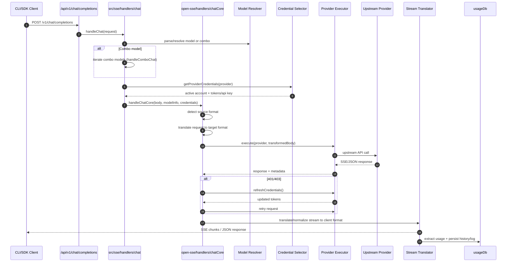
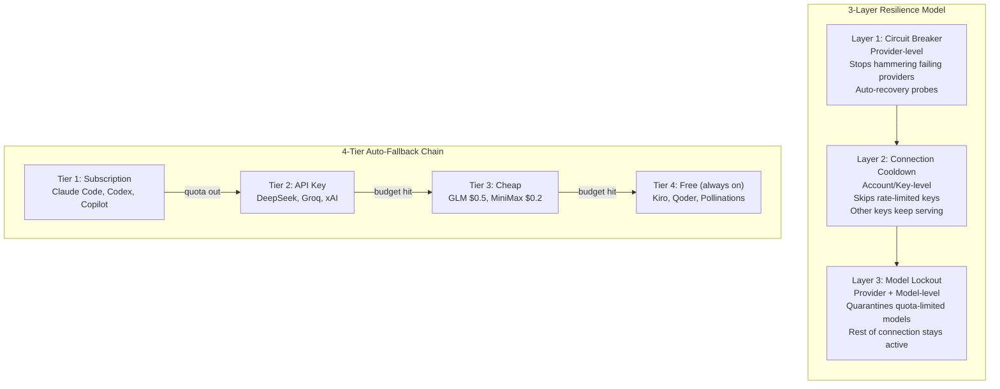
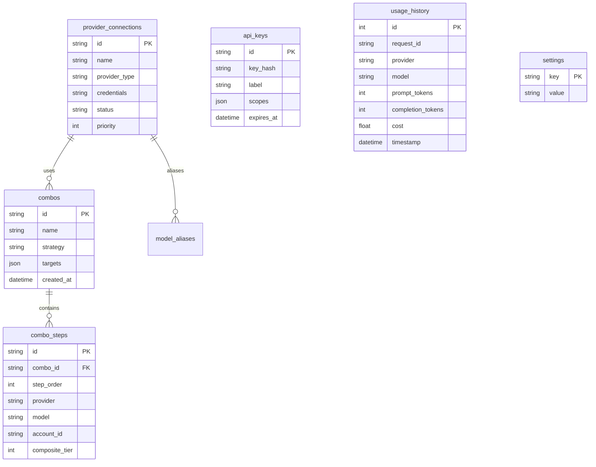

# 🏗️ OmniRoute — Architecture Diagram

> Comprehensive system architecture showing the full request flow from clients through the routing engine to upstream providers.

---

## 📐 High-Level Architecture Overview

```mermaid
graph TB
    %% ──── Client Layer ────
    subgraph Clients["Client Layer — IDEs, CLIs & Browsers"]
        C1["Claude Code / Codex / Cursor / Cline"]
        C2["Copilot / Antigravity / OpenCode"]
        C3["OpenAI-compatible SDKs & Custom Tools"]
        C4["Browser Dashboard"]
    end

    %% ──── API Gateway Layer ────
    subgraph API["API Gateway — Next.js App Router"]
        direction LR
        A1["/v1/chat/completions\n/v1/responses"]
        A2["/v1/embeddings\n/v1/images\n/v1/audio\n/v1/videos\n/v1/search"]
        A3["Management APIs\n/api/settings/*\n/api/providers/*\n/api/combos/*"]
        A4["OAuth + Auth Routes\n/api/oauth/*\n/api/auth/*"]
    end

    %% ──── Core Engine ────
    subgraph Engine["Core Routing Engine — open-sse/"]
        direction TB
        E1["Request Pipeline\n(chatCore.ts)"]
        E2["Combo Routing Engine\n(handleComboChat)"]
        E3["Auto-Combo Scorer\n(9-factor scoring)"]
        E4["Translator Layer\n(OpenAI ↔ Claude ↔ Gemini)"]
        E5["Provider Executors\n(68 executors)"]
        E6["SSE Stream Transformer\n(responsesTransformer)"]
    end

    %% ──── Services Layer ────
    subgraph Services["Services Layer"]
        S1["Routing Strategies\n(17 strategies)"]
        S2["Prompt Compression\n(RTK + Caveman)"]
        S3["Resilience Layer\n(Circuit Breaker/Cooldown/Lockout)"]
        S4["Authz Pipeline\n(classify → policies → enforce)"]
        S5["Guardrails\n(PII / Injection / Vision)"]
        S6["Memory System\n(FTS5 + vector)"]
        S7["Webhooks + Evals\n+ Reasoning Cache"]
    end

    %% ──── Protocol Layer ────
    subgraph Protocols["Protocol Servers"]
        P1["MCP Server\n(94 tools · 3 transports)"]
        P2["A2A Server\n(JSON-RPC 2.0 · 6 skills)"]
        P3["ACP Registry\n(Agent Communication)"]
    end

    %% ──── Domain Layer ────
    subgraph Domain["Domain Layer — src/domain/"]
        D1["Policy Engine\n(lockout→budget→fallback)"]
        D2["Cost Rules · Fallback Policy\nLockout Policy · Tag Router"]
        D3["Combo Resolver · Quota Cache\nModel Availability"]
    end

    %% ──── Persistence Layer ────
    subgraph DB["Persistence Layer — SQLite"]
        DB1["Storage DB\n(providers, combos, keys, settings)"]
        DB2["Usage DB\n(usage_history, call_logs)"]
        DB3["Domain State DB\n(fallbacks, budgets, lockouts)"]
        DB4["Migrations\n(99 schema migrations)"]
    end

    %% ──── Provider Layer ────
    subgraph Providers["Upstream Providers — 237 entries"]
        P4["OAuth Providers\n(Claude/Codex/Gemini/Kiro/Cursor/…)"]
        P5["API Key Providers\n(OpenAI/Anthropic/DeepSeek/Groq/xAI/…)"]
        P6["Free Tier Providers\n(Qoder/Pollinations/LongCat/…)"]
        P7["Self-Hosted & Compatible\n(LM Studio/vLLM/Ollama/…)"]
    end

    %% ──── Infrastructure ────
    subgraph Infra["Infrastructure"]
        I1["Electron Desktop App"]
        I2["MITM Proxy\n(cert mgmt + TPROXY)"]
        I3["Cloud Sync\n(optional multi-device)"]
        I4["Tunnels\n(Cloudflare/ngrok/Tailscale)"]
    end

    %% ──── EDGES ────
    Clients -->|"http://localhost:20128/v1"| A1
    Clients -->|"http://localhost:20128"| A3
    Clients -->|"http://localhost:20128"| A4
    C4 -->|"Dashboard UI"| A3

    A1 --> E1
    A2 --> E1
    A3 --> DB1

    E1 --> E2
    E1 --> E4
    E2 --> E3
    E4 --> E5
    E5 --> E6

    E1 -.-> S1
    E1 -.-> S2
    E1 -.-> S3
    E1 -.-> S4
    E1 -.-> S5
    E1 -.-> S6
    E1 -.-> S7

    E1 -.-> D1
    D2 -.-> D1
    D3 -.-> D2

    E1 -.-> P1
    E1 -.-> P2
    E1 -.-> P3

    E2 --> DB2
    D1 --> DB3
    E1 -.-> DB2
    E1 -.-> DB3

    E5 --> P4
    E5 --> P5
    E5 --> P6
    E5 --> P7

    I1 -.-> C4
    I2 -->|"Traffic capture"| E1
    I3 -.-> DB1
```



---

## 🔄 Request Lifecycle (Sequence Diagram)



---

## 🧱 Resilience Architecture (3 Layers)



---

## 🗃️ Database Schema Overview



---

## 📁 Directory Structure

```
OmniRoute/
├── src/                          # Next.js App (TypeScript)
│   ├── app/
│   │   ├── api/v1/               # Compatibility APIs
│   │   ├── api/settings/         # Management APIs
│   │   ├── (dashboard)/          # Dashboard pages
│   │   └── auth/                 # Auth routes
│   ├── domain/                   # Policy engine layer
│   ├── lib/
│   │   ├── db/                   # SQLite persistence (83 modules)
│   │   ├── auth/                 # Auth & API key management
│   │   ├── oauth/                # OAuth providers (17 modules)
│   │   ├── guardrails/           # PII / injection / vision
│   │   ├── memory/               # Conversational memory
│   │   ├── skills/               # Skills framework
│   │   ├── evals/                # Eval framework
│   │   ├── webhooks/             # Webhook dispatcher
│   │   ├── a2a/                  # A2A protocol server
│   │   ├── acp/                  # Agent Communication Protocol
│   │   ├── compliance/           # Audit & compliance
│   │   ├── compression/          # Compression engine
│   │   └── cloudAgent/           # Cloud agent integration
│   ├── shared/                   # Shared constants, utils
│   ├── server/                   # Authz pipeline
│   ├── middleware/               # Middleware (prompt injection)
│   └── mitm/                     # MITM proxy
│
├── open-sse/                     # Core streaming engine (JS/TS)
│   ├── handlers/                 # Request handlers
│   ├── executors/                # Provider executors (68)
│   ├── services/                 # Business logic (115+ modules)
│   │   ├── autoCombo/            # Auto-combo engine
│   │   └── compression/          # Compression services
│   ├── translator/               # Format translators
│   ├── transformer/              # Response transformers
│   ├── mcp-server/               # MCP server (94 tools)
│   ├── config/                   # Provider configurations
│   └── utils/                    # Utilities
│
├── electron/                     # Electron desktop app
├── bin/                          # CLI binaries
├── skills/                       # CLI skill packages
├── docs/                         # Documentation
├── tests/                        # Test suite
└── config/                       # Configuration files
```

---

## 🔑 Key Numbers (v3.8.40)

| Category | Count |
|---|---|
| Providers | **237** |
| Free Tier Providers | **50+** |
| Free Tokens/Month | **~1.6B** |
| MCP Tools | **94** |
| MCP Scopes | **30** |
| A2A Skills | **6** |
| Routing Strategies | **17** |
| Auto-Combo Scoring Factors | **12** |
| DB Modules | **83** |
| DB Migrations | **99** |
| Executors | **68** |
| i18n Locales | **42** |
| Tests | **~15,000** |

---

## 🌐 Data Flow Summary

```
Client Request (OpenAI format)
    │
    ▼
Route: /v1/chat/completions
    │
    ▼
Authz Pipeline: classify → policies → enforce
    │
    ▼
Guardrails: PII / Injection / Vision check
    │
    ▼
Core Engine: translateRequest() → handleChatCore()
    │
    ├─ Combo? → resolveComboTargets() → iterate targets
    │
    ▼
Provider Executor: buildUrl() → buildHeaders() → fetch()
    │
    ▼
Upstream Provider (Claude/GPT/Gemini/etc.)
    │
    ▼
Response Translation + SSE Streaming
    │
    ▼
Usage Extraction → Persist to SQLite
    │
    ▼
Client Response (OpenAI format)
```

---

> **Source**: Based on OmniRoute v3.8.40 architecture.  
> See [`docs/architecture/ARCHITECTURE.md`](../docs/architecture/ARCHITECTURE.md) for full details.