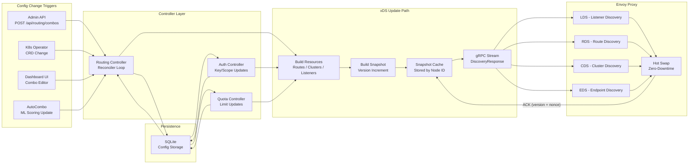
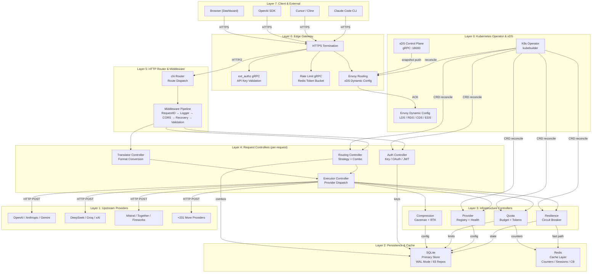
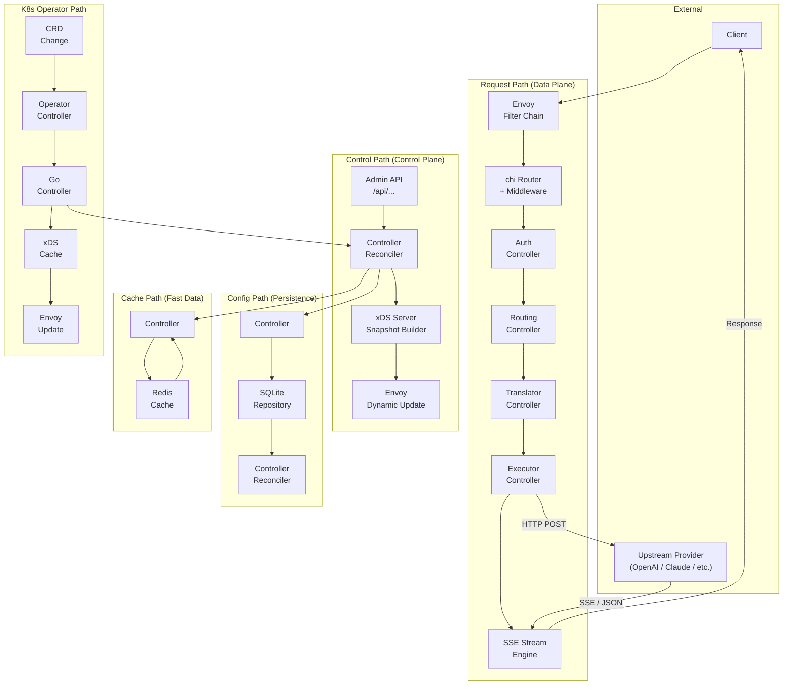
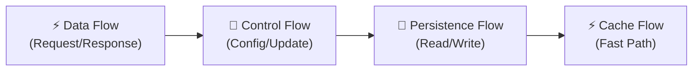

# 🌊 OmniRoute Go — Flow Architecture Diagram

> High-level flow architecture showing how data, requests, and configuration move through the **Go + Envoy + xDS + Kubernetes Operator** system.

---

## 🗺️ SYSTEM FLOW ARCHITECTURE — OVERVIEW

```mermaid
flowchart TB
    subgraph Users["👤 Users & Clients"]
        CLI["Claude Code CLI"]
        CURSOR["Cursor IDE"]
        CLINE["Cline"]
        SDK["OpenAI SDK / HTTP Client"]
        DASH["Dashboard UI (Next.js)"]
    end

    subgraph Gateway["🚪 Gateway Layer (Port 20128)"]
        ENV["Envoy Proxy<br/>L7 Reverse Proxy"]
        EXT_AUTH["ext_authz gRPC Server<br/>Port 9001"]
        RL_GRPC["Rate Limit gRPC Server<br/>Port 9003"]
    end

    subgraph Backend["⚙️ Go Backend (Port 8080)"]
        CHI["chi HTTP Router<br/>net/http"]
        MIDDLEWARE["Middleware Pipeline<br/>RequestID → Logger → CORS → Recovery → Validation"]
        
        subgraph Controllers["🎮 Controller Layer"]
            AUTH["Auth Controller<br/>• API Key Validation<br/>• OAuth (14 providers)<br/>• JWT Sessions<br/>• ext_authz Server"]
            ROUTE["Routing Controller<br/>• 17 Strategies<br/>• Combo Resolution<br/>• AutoCombo Scoring<br/>• Task-Aware FSM"]
            TRANS["Translator Controller<br/>• OpenAI↔Claude↔Gemini<br/>• Role Normalizer<br/>• Think Parser<br/>• Structured Output"]
            EXEC["Executor Controller<br/>• 68 Provider Executors<br/>• Retry + Backoff<br/>• OAuth Token Refresh<br/>• SSE Streaming"]
            PROV["Provider Controller<br/>• 237 Providers<br/>• Health Probes<br/>• Registry"]
            RSV["Resilience Controller<br/>• Circuit Breaker<br/>• Cooldown / Lockout<br/>• Herd Protection"]
            QUOTA["Quota Controller<br/>• Rate Limiter (Redis)<br/>• Budget Tracking<br/>• Token Counter"]
            COMP["Compression Controller<br/>• Caveman Engine<br/>• RTK Engine<br/>• Pipeline"]
            MCP["MCP Controller<br/>• 94 Tools<br/>• 3 Transports<br/>• 30 Scopes"]
            A2A["A2A Controller<br/>• JSON-RPC 2.0<br/>• 6 Skills<br/>• Task Manager"]
            MEM["Memory Controller<br/>• FTS5 + Vector<br/>• Extract / Inject"]
            SKILL["Skills Controller<br/>• Registry / Executor<br/>• Sandbox"]
            GRD["Guardrails Controller<br/>• PII Masker<br/>• Injection Detection"]
            WH["Webhook Controller<br/>• HMAC Delivery<br/>• 7 Event Types"]
            EVAL["Eval Controller<br/>• Runner / Runtime<br/>• Targets"]
            TUN["Tunnel Controller<br/>• Cloudflare / ngrok<br/>• Tailscale Funnel"]
            MITM["MITM Controller<br/>• Cert Manager<br/>• TPROXY"]
            SYNC["Sync Controller<br/>• Cloud Sync"]
        end

        subgraph Data["🗄️ Data Layer"]
            SQL["SQLite (WAL Mode)<br/>• 83 Repositories<br/>• 17 Tables<br/>• 99 Migrations"]
            REDIS["Redis Cache<br/>• Rate Counters<br/>• Sessions<br/>• CB State<br/>• Provider Health"]
        end

        subgraph Stream["📡 Streaming Engine"]
            SSE["SSE Writer / Reader<br/>Event Parser + Transform"]
            WS["WebSocket Bridge<br/>OpenAI-Compatible"]
        end
    end

    subgraph K8s["☸️ Kubernetes Operator"]
        OP["Operator<br/>kubebuilder"]
        CRD_PROV["CRD: Provider"]
        CRD_COMBO["CRD: Combo"]
        CRD_KEY["CRD: ApiKey"]
        CRD_CB["CRD: CircuitBreaker"]
        CRD_RL["CRD: RateLimit"]
        CRD_WH["CRD: Webhook"]
        CRD_MCP["CRD: MCPTool"]
        CRD_TUN["CRD: Tunnel"]
    end

    subgraph xDS["🔄 xDS Control Plane (Port 18000)"]
        XDS_SRV["xDS gRPC Server<br/>LDS / RDS / CDS / EDS"]
        SNAP_CACHE["Snapshot Cache<br/>Versioned Configs"]
        RESOURCE_BUILD["Resource Builders<br/>Routes / Clusters / Listeners"]
    end

    subgraph Upstream["🔌 Upstream Providers (237)"]
        UP_OA["OpenAI / Anthropic / Gemini"]
        UP_DS["DeepSeek / Groq / xAI / Mistral"]
        UP_OT["Together / Fireworks / Cerebras / Cohere"]
        UP_MO["+231 More: Free(3) OAuth(14) API Key(120+) Self-Hosted(8+)"]
    end

    %% ─── DATA FLOWS ───
    
    %% Client → Gateway
    CLI -->|"HTTPS :20128"| ENV
    CURSOR -->|"HTTPS :20128"| ENV
    CLINE -->|"HTTPS :20128"| ENV
    SDK -->|"HTTPS :20128"| ENV
    DASH -->|"HTTPS :20128"| ENV

    %% Envoy internal flows
    ENV -->|"gRPC ext_authz"| EXT_AUTH
    ENV -->|"gRPC rate limit"| RL_GRPC
    ENV -->|"xDS config push"| XDS_SRV
    
    %% Envoy → Backend
    ENV -->|"HTTP/2 :8080"| CHI

    %% Router → Middleware → Controllers
    CHI --> MIDDLEWARE
    
    %% Auth flow
    MIDDLEWARE --> AUTH
    AUTH -->|"read/write"| SQL
    AUTH -->|"cache"| REDIS
    EXT_AUTH -->|"key lookup"| AUTH
    RL_GRPC -->|"quota check"| QUOTA

    %% Routing flow
    MIDDLEWARE --> ROUTE
    ROUTE -->|"load combos"| SQL
    ROUTE -->|"cache"| REDIS
    ROUTE -->|"translate"| TRANS
    ROUTE -->|"execute"| EXEC

    %% Executor flow
    EXEC -->|"circuit check"| RSV
    EXEC -->|"provider lookup"| PROV
    EXEC -->|"quota check"| QUOTA
    EXEC -->|"compress"| COMP
    EXEC -->|"SSE stream"| SSE
    EXEC -->|"WS stream"| WS
    
    %% Executor → Upstream
    EXEC -->|"HTTP POST"| UP_OA
    EXEC -->|"HTTP POST"| UP_DS
    EXEC -->|"HTTP POST"| UP_OT
    EXEC -->|"HTTP POST"| UP_MO

    %% Supporting controllers → Data
    RSV -->|"CB state"| REDIS
    RSV -->|"persist"| SQL
    QUOTA -->|"counters"| REDIS
    QUOTA -->|"persist"| SQL
    PROV -->|"registry"| SQL
    COMP -->|"config"| SQL
    MCP -->|"audit + config"| SQL
    A2A -->|"tasks + skills"| SQL
    MEM -->|"vectors + text"| SQL
    SKILL -->|"registry"| SQL
    GRD -->|"rules"| SQL
    WH -->|"events"| SQL
    EVAL -->|"results"| SQL
    TUN -->|"config"| SQL
    MITM -->|"certs"| SQL
    SYNC -->|"state"| SQL

    %% xDS flow
    ROUTE -->|"UpdateRoutes()"| XDS_SRV
    AUTH -->|"UpdateAuthConfig()"| XDS_SRV
    QUOTA -->|"UpdateRateLimits()"| XDS_SRV
    XDS_SRV --> RESOURCE_BUILD
    RESOURCE_BUILD --> SNAP_CACHE
    SNAP_CACHE -->|"DiscoveryResponse"| ENV

    %% Kubernetes Operator → Controllers
    OP -->|"reconcile"| PROV
    OP -->|"reconcile"| ROUTE
    OP -->|"reconcile"| AUTH
    OP -->|"reconcile"| RSV
    OP -->|"reconcile"| QUOTA
    OP -->|"reconcile"| WH
    OP -->|"reconcile"| MCP
    OP -->|"reconcile"| TUN
    
    %% CRDs → Operator
    CRD_PROV --> OP
    CRD_COMBO --> OP
    CRD_KEY --> OP
    CRD_CB --> OP
    CRD_RL --> OP
    CRD_WH --> OP
    CRD_MCP --> OP
    CRD_TUN --> OP
```

---

## 🔄 REQUEST FLOW (Client → Upstream → Response)

```mermaid
flowchart LR
    subgraph Inbound["Inbound"]
        direction LR
        A["Client<br/>HTTP Request"] --> B["Envoy<br/>TLS + Auth + RateLimit"]
        B --> C["Go Router<br/>chi :8080"]
    end

    subgraph Process["Processing Pipeline"]
        direction TB
        C --> D["Middleware<br/>RequestID → Logger → CORS → Recovery → Validate"]
        D --> E{"Auth?<br/>API Key / OAuth / JWT"}
        E -->|"Valid"| F{"Rate Limit?<br/>Redis Token Bucket"}
        E -->|"Invalid"| ERR1["401 Unauthorized"]
        F -->|"Under Limit"| G["Routing<br/>17 Strategies + Combo"]
        F -->|"Over Limit"| ERR2["429 Too Many Requests"]
        G --> H{"Translate?<br/>Cross-Format?"}
        H -->|"Yes"| I["Translator<br/>OpenAI↔Claude↔Gemini"]
        H -->|"No"| J
        I --> J{"Circuit Breaker?<br/>Redis Fast Path"}
        J -->|"CLOSED"| K["Build Request<br/>URL + Headers + Body"]
        J -->|"OPEN"| FALLBACK["Try Fallback Target"]
        FALLBACK --> G
        K --> L["Execute<br/>HTTP POST + Retry x3"]
    end

    subgraph UpstreamCall["Upstream"]
        L --> M["Provider API<br/>237 Providers"]
        M --> N{"Streaming?<br/>SSE Mode?"}
        N -->|"Yes"| O["SSE Reader<br/>Parse Events"]
        N -->|"No"| P["JSON Response<br/>Parse Body"]
    end

    subgraph Response["Response Pipeline"]
        O --> Q{"Translate?<br/>Response Format"}
        P --> Q
        Q -->|"Yes"| R["Response Translator<br/>Claude→OpenAI Format"]
        Q -->|"No"| S
        R --> S["SSE Writer / JSON Writer"]
        S --> T["Add Headers<br/>RateLimit + RequestID"]
        T --> U["Async Logging<br/>Usage → SQLite"]
        U --> V["Response to Client<br/>200 / SSE Stream"]
    end

    subgraph Errors["Error Paths"]
        ERR1 --> V
        ERR2 --> V
        M -->|"401"| TOKEN["OAuth Token Refresh"]
        TOKEN --> L
        M -->|"5xx"| RETRY["Retry with Backoff<br/>100ms→200ms→400ms+jitter"]
        RETRY --> L
    end
```

---

## 🔧 CONTROL PLANE FLOW (xDS Config Updates)

---

## 🏗️ LAYERED ARCHITECTURE FLOW

---

## 🎯 COMPONENT INTERACTION FLOW (Data & Control)

---

## 📊 LEGEND

---

> **See also:**
> - `GOLANG_E2E_FLOW_ARCHITECTURE.md` — End-to-end request sequence (16-step detailed)
> - `ARCHITECTURE_DIAGRAM.md` — Component architecture
> - `GOLANG_ENVOY_K8S_OPERATOR_ROADMAP.md` — 7-month implementation plan