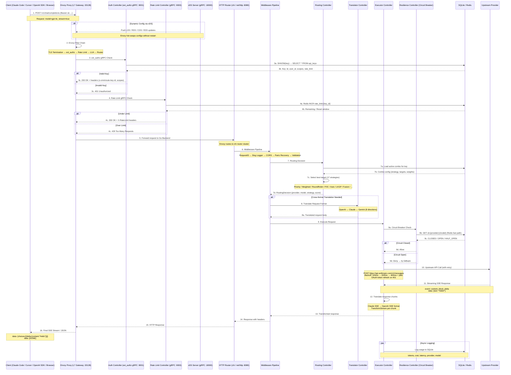
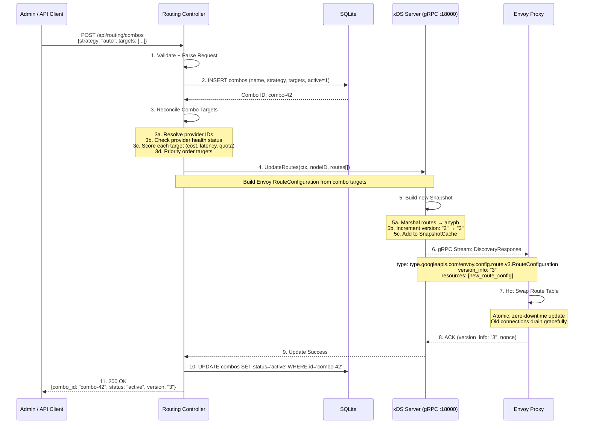
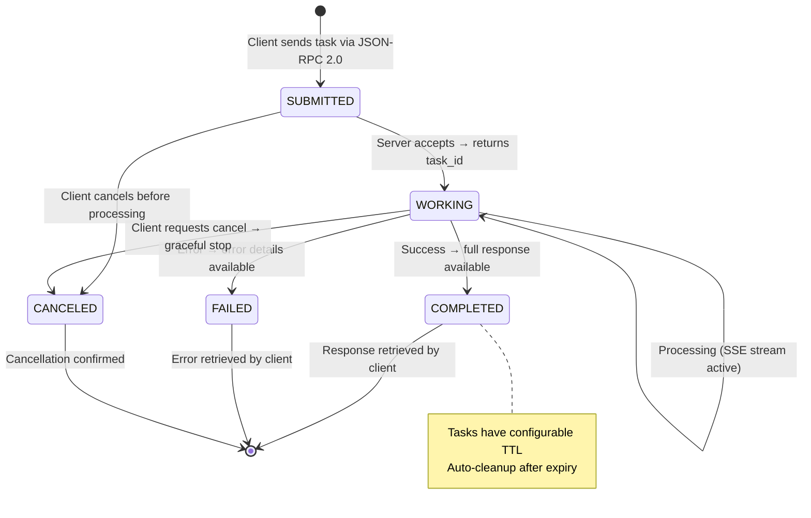
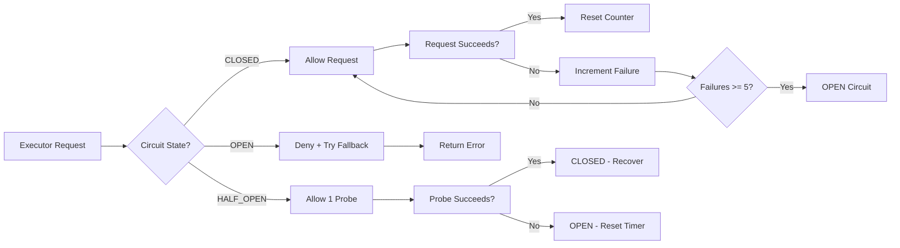

# 🚀 OmniRoute Go — End-to-End Request Flow Architecture

> How a single request flows through the **Go + Envoy + xDS** system from client to upstream provider and back. Complete request lifecycle with every component and data transformation explained.

---

## 📊 END-TO-END REQUEST SEQUENCE (Mermaid)



---

## 🏗️ COMPONENT ARCHITECTURE (Mermaid)

```mermaid
graph TB
    subgraph "🌐 External Layer"
        CL["Client<br/>Claude Code / Cursor / Cline / OpenAI SDK / Browser"]
    end

    subgraph "🚪 Envoy Proxy Layer (Port 20128)"
        ENV["Envoy L7 Proxy<br/>TLS → ext_authz → Rate Limit → Router"]
        EXT["ext_authz gRPC Server<br/>Port 9001"]
        RLS["Rate Limit gRPC Server<br/>Port 9003"]
        XDS["xDS Control Plane<br/>gRPC Port 18000"]
    end

    subgraph "⚙️ Go Backend (Port 8080)"
        CHI["chi HTTP Router + net/http"]
        
        subgraph "🧩 Middleware"
            MID1["RequestID Injector"]
            MID2["Slog Request Logger"]
            MID3["CORS Handler"]
            MID4["Panic Recovery"]
            MID5["Input Validation<br/>(go-playground/validator)"]
        end
        
        subgraph "🎮 Pipeline Controllers (per-request)"
            AUTH["Auth Controller<br/>• API Key SHA256 lookup<br/>• OAuth (14 providers)<br/>• JWT Dashboard Sessions<br/>• Envoy ext_authz gRPC"]
            ROUTE["Routing Controller<br/>• 17 Routing Strategies<br/>• Combo Resolution (DB)<br/>• AutoCombo Scoring (9 factors)<br/>• Task-aware FSM"]
            TRANS["Translator Controller<br/>• OpenAI ↔ Claude ↔ Gemini<br/>• Role Normalizer<br/>• Think Tag Parser<br/>• Structured Output Converter"]
            EXEC["Executor Controller<br/>• 68 Provider Executors<br/>• Retry x3 + Backoff<br/>• OAuth Token Refresh<br/>• SSE Stream Handling"]
        end
        
        subgraph "🛡️ Supporting Controllers"
            PROV["Provider Controller<br/>• 237 Providers<br/>• Health Probes<br/>• Registry"]
            RSV["Resilience Controller<br/>• Circuit Breaker (3-state)<br/>• Cooldown Manager<br/>• Lockout Manager<br/>• Herd Protection"]
            QUOTA["Quota Controller<br/>• Token Bucket (Redis)<br/>• Budget Tracking<br/>• Token Counter<br/>• Envoy Rate Limit gRPC"]
            COMP["Compression Controller<br/>• Caveman Engine<br/>• RTK Engine<br/>• Stacked Pipeline<br/>• Language Packs"]
        end
        
        subgraph "🔌 Protocol Controllers"
            MCP["MCP Controller<br/>• 94 Tools<br/>• 3 Transports (stdio/SSE/HTTP)<br/>• 30 Scopes<br/>• Audit Logging"]
            A2A["A2A Controller<br/>• JSON-RPC 2.0<br/>• 6 Skills<br/>• Task Manager (TTL)<br/>• Agent Card"]
        end
        
        subgraph "🧠 Stateful Controllers"
            MEM["Memory Controller<br/>• FTS5 + Vector<br/>• Extraction<br/>• Injection<br/>• Summarization"]
            SKL["Skills Controller<br/>• Registry<br/>• Executor<br/>• Sandbox<br/>• Built-ins"]
            GRD["Guardrails Controller<br/>• PII Masker<br/>• Injection Detection<br/>• Vision Bridge<br/>• Hot Reload"]
            WH["Webhook Controller<br/>• HMAC Delivery<br/>• Retry + Backoff<br/>• 7 Event Types<br/>• Auto-disable"]
            EVAL["Eval Controller<br/>• Runner<br/>• Runtime<br/>• Targets: combo/model/suite"]
            TUN["Tunnel Controller<br/>• Cloudflare (Quick/Named)<br/>• ngrok<br/>• Tailscale Funnel"]
            MITM["MITM Controller<br/>• Cert Manager<br/>• TPROXY Router"]
            SYNC["Sync Controller<br/>• Cloud Sync"]
        end
        
        subgraph "🗄️ Data Layer"
            SQL["SQLite (WAL Mode)<br/>• 83 Domain Repositories<br/>• 17 Base Tables<br/>• 99 Migrations<br/>• FTS5 Memory Index"]
            REDIS["Redis Cache<br/>• Rate Counters<br/>• Sessions<br/>• Circuit Breaker State<br/>• Provider Health<br/>• Combo Cache"]
        end
        
        subgraph "📡 Streaming"
            SSE["SSE Engine<br/>• Writer / Reader<br/>• Event Parser<br/>• Transform Pipeline"]
            WS["WebSocket Bridge<br/>• OpenAI-compatible<br/>• Bidirectional"]
        end
    end

    subgraph "☸️ Kubernetes Operator (kubebuilder)"
        K8S["Operator Controllers"]
        CRD1["CRD: Provider"]
        CRD2["CRD: Combo"]
        CRD3["CRD: ApiKey"]
        CRD4["CRD: CircuitBreaker"]
        CRD5["CRD: RateLimit"]
        CRD6["CRD: Webhook"]
        CRD7["CRD: MCPTool"]
        CRD8["CRD: Tunnel"]
    end

    subgraph "🔌 Upstream Providers (237)"
        UP1["OpenAI"]
        UP2["Anthropic"]
        UP3["Gemini"]
        UP4["DeepSeek"]
        UP5["Groq / xAI / Mistral"]
        UP6["Together / Fireworks / Cerebras"]
        UP7["+231 More Providers<br/>• Free (3) • OAuth (14)<br/>• API Key (120+)<br/>• Self-Hosted (8+)<br/>• Custom (92+)"]
    end

    %% Connections
    CL -->|"HTTP/HTTPS"| ENV
    ENV -->|"gRPC ext_authz"| EXT
    ENV -->|"gRPC rate limit"| RLS
    ENV -->|"xDS gRPC"| XDS
    ENV -->|"HTTP/2"| CHI
    
    CHI --> MID1 --> MID2 --> MID3 --> MID4 --> MID5
    
    MID5 --> AUTH
    MID5 --> ROUTE
    MID5 --> QUOTA
    
    AUTH --> SQL
    AUTH --> REDIS
    
    ROUTE --> SQL
    ROUTE --> REDIS
    ROUTE --> TRANS
    ROUTE --> EXEC
    
    EXEC --> RSV
    EXEC --> PROV
    EXEC --> QUOTA
    EXEC --> SSE
    EXEC --> WS
    
    RSV --> REDIS
    RSV --> SQL
    QUOTA --> REDIS
    QUOTA --> SQL
    PROV --> SQL
    COMP --> SQL
    
    MCP --> SQL
    MCP --> AUTH
    A2A --> SQL
    MEM --> SQL
    SKL --> SQL
    GRD --> SQL
    WH --> SQL
    EVAL --> SQL
    TUN --> SQL
    MITM --> SQL
    SYNC --> SQL
    
    EXEC -->|"HTTP POST"| UP1
    EXEC --> UP2
    EXEC --> UP3
    EXEC --> UP4
    EXEC --> UP5
    EXEC --> UP6
    EXEC --> UP7
    
    XDS -->|"Snapshot Updates"| ENV
    XDS --> SQL
    
    K8S -->|"Reconcile CRDs"| AUTH
    K8S --> ROUTE
    K8S --> PROV
    K8S --> RSV
    K8S --> QUOTA
    K8S --> WH
    K8S --> MCP
    K8S --> TUN
    
    CRD1 --> K8S
    CRD2 --> K8S
    CRD3 --> K8S
    CRD4 --> K8S
    CRD5 --> K8S
    CRD6 --> K8S
    CRD7 --> K8S
    CRD8 --> K8S
```



---

## 🔄 Envoy xDS → Controller Update Flow (Mermaid)



---

## 🔧 STATE MACHINES (Mermaid)

### Circuit Breaker State Machine

```mermaid
stateDiagram-v2
    [*] --> CLOSED: Initial State (all requests allowed)
    
    CLOSED --> CLOSED: Request Succeeds → Reset Counter to 0
    CLOSED --> OPEN: 5 Failures in 30s Window → Open Circuit
    
    OPEN --> HALF_OPEN: 30s Timeout Expired → Allow Probe
    OPEN --> OPEN: Request Blocked → Return Error
    
    HALF_OPEN --> CLOSED: Probe Succeeds → Full Recovery
    HALF_OPEN --> OPEN: Probe Fails → Re-open Circuit + Reset Timer
    
    state CLOSED {
        [*] --> Counting
        Counting --> Counting: Success → counter = 0
        Counting --> Counting: Failure → counter++
    }
    
    state OPEN {
        [*] --> Timer
        Timer --> [*]: 30s elapsed → HALF_OPEN
        Reject --> Reject: All requests denied immediately
    }
    
    state HALF_OPEN {
        [*] --> Probing
        Probing --> Probing: Allow 1 request only
        Probing --> [*]: Pass/Fail → CLOSED or OPEN
    }
    
    note right of OPEN: Redis key: cb:{provider}:{model}<br/>Key exists = OPEN (fast deny)
```

### A2A Task Lifecycle



---

## 🔄 16-STEP REQUEST FLOW — DETAILED BREAKDOWN

### Step 1: Client Sends Request

```
POST /v1/chat/completions HTTP/1.1
Host: api.omniroute.io
Authorization: Bearer sk-omniroute-abc123
Content-Type: application/json

{
  "model": "gpt-4o",
  "messages": [{"role": "user", "content": "Hello!"}],
  "stream": true
}
```

### Step 2: Envoy Filter Chain

```yaml
# Envoy Listener (pushed dynamically via xDS LDS)
listener_filters:
  - envoy.filters.listener.tls_inspector

filter_chains:
  - filters:
      # Filter 1: Authentication
      - name: envoy.filters.http.ext_authz
        typed_config:
          "@type": type.googleapis.com/envoy.extensions.filters.http.ext_authz.v3.ExtAuthz
          grpc_service:
            envoy_grpc:
              cluster_name: auth_controller  # → :9001
          transport_api_version: V3
      
      # Filter 2: Rate Limiting
      - name: envoy.filters.http.ratelimit
        typed_config:
          "@type": type.googleapis.com/envoy.extensions.filters.http.ratelimit.v3.RateLimit
          domain: omniroute
          grpc_service:
            envoy_grpc:
              cluster_name: rate_limit_controller  # → :9003
      
      # Filter 3: Router
      - name: envoy.filters.http.router
```

### Step 3: Auth gRPC Check (Go ext_authz Server)

```go
// Envoy calls this gRPC endpoint for EVERY request
func (s *EnvoyExtAuthzServer) Check(ctx context.Context, 
    req *authv3.CheckRequest) (*authv3.CheckResponse, error) {
    
    // 3a. Extract Bearer token
    authHeader := req.GetAttributes().GetRequest().GetHttp().GetHeaders()["authorization"]
    apiKey := strings.TrimPrefix(authHeader, "Bearer ")
    
    // 3b. SHA256 hash
    keyHash := sha256.Sum256([]byte(apiKey))
    
    // 3c. Lookup in SQLite
    key, err := s.store.GetByHash(ctx, keyHash[:])
    if err != nil {
        // 3d. Invalid key → 401
        return denied("invalid api key"), nil
    }
    
    // 3e. Valid → attach metadata headers for downstream
    return ok(map[string]string{
        "x-omniroute-key-id":  key.ID,
        "x-omniroute-user-id": key.UserID,
        "x-omniroute-scopes":  strings.Join(key.Scopes, ","),
    }), nil
}
```

### Step 4: Rate Limit gRPC Check (Go Rate Limit Server)

```go
func (s *RateLimitServer) ShouldRateLimit(ctx context.Context,
    req *ratelimit.RateLimitRequest) (*ratelimit.RateLimitResponse, error) {
    
    keyID := extractKeyID(req)
    
    // Redis token bucket check
    allowed, remaining, reset := s.limiter.Check(keyID)
    
    if !allowed {
        return overLimit(), nil  // → 429
    }
    return ok(remaining, reset), nil  // → headers attached
}
```

### Step 5-6: Go chi Router + Middleware

```go
func main() {
    // --- Init all controllers ---
    db := sqlite.NewDB(config.DataDir)
    rdb := cache.NewRedis(config.RedisAddr)
    xds := envoy.NewXDSServer(18000)
    authCtrl := auth.NewController(db, rdb)
    routingCtrl := routing.NewController(db, rdb)
    executorCtrl := executor.NewController(db, rdb)
    translatorCtrl := translator.NewController()
    
    // --- chi Router ---
    r := chi.NewRouter()
    r.Use(middleware.RequestID)
    r.Use(middleware.SlogLogger)
    r.Use(middleware.CORS)
    r.Use(middleware.Recovery)
    r.Use(middleware.Validator)
    
    // --- Routes ---
    r.Get("/health", healthHandler)
    r.Route("/v1", func(r chi.Router) {
        r.Post("/chat/completions", chatHandler(routingCtrl, executorCtrl, translatorCtrl))
        r.Post("/embeddings", embeddingHandler(executorCtrl))
        r.Post("/images/generations", imageHandler(executorCtrl))
        r.Post("/audio/transcriptions", audioHandler(executorCtrl))
        r.Get("/models", modelsHandler(routingCtrl))
    })
    
    // --- Start ---
    srv := &http.Server{Addr: ":8080", Handler: r}
    // graceful shutdown with signal handling
}
```

### Step 7: Routing Controller — Strategy Selection

```go
func (r *RoutingReconciler) Reconcile(ctx context.Context, req RoutingRequest) (*RoutingDecision, error) {
    // 7a. Load combo config for this API key
    combo, _ := r.store.GetActiveCombo(ctx, req.KeyID)
    
    // 7b. Resolve combo targets (provider + model + weight)
    targets, _ := r.comboResolver.ResolveTargets(ctx, combo)
    
    // 7c. Select strategy
    strategy := strategies.GetStrategy(combo.Strategy)
    // 17 strategies: priority, weighted, round_robin, fill_first, p2c,
    //                random, least_used, reset_aware, reset_window,
    //                cost_optimized, strict_random, auto, lkgp,
    //                context_optimized, context_relay, fusion
    
    // 7d. Score and select best target
    selected := strategy.Select(ctx, targets, ScoringContext{
        Model:    req.Model,
        Messages: req.Messages,
    })
    
    slog.Info("routing decision",
        "strategy", combo.Strategy,
        "provider", selected.ProviderID,
        "model", selected.ModelID,
        "score", selected.Score,
    )
    
    return &RoutingDecision{
        Provider: selected.ProviderID,
        Model:    selected.ModelID,
        Strategy: combo.Strategy,
        Score:    selected.Score,
        Target:   selected,
    }, nil
}
```

### Step 8: Translator Controller

Translates between API formats when the client format differs from the target provider format.

**8 Translation Paths:**
- OpenAI → Claude (Anthropic format)
- OpenAI → Gemini
- OpenAI → DeepSeek (v4)
- Claude → OpenAI
- Claude → Gemini
- Gemini → OpenAI
- Gemini → Claude
- Any → Any (via role normalizers)

```go
// Translation example: OpenAI request → Anthropic format
func translateOpenAItoClaude(req *ChatRequest) (*AnthropicRequest, error) {
    return &AnthropicRequest{
        Model:     mapModel(req.Model),    // "gpt-4o" → "claude-3.5-sonnet"
        Messages:  convertMessages(req.Messages),  // roles: system→developer, etc.
        MaxTokens: req.MaxTokens,
        Stream:    req.Stream,
        Tools:     convertTools(req.Tools),        // function calling → tool use
    }, nil
}
```

### Step 9: Circuit Breaker Check



### Step 10: Executor — Upstream Call with Retry

```go
func (e *BaseExecutor) execute(ctx context.Context, decision *RoutingDecision) (*Result, error) {
    provider := e.providerRegistry.Get(decision.Provider)
    
    // Build request
    url := e.buildUrl(provider)
    headers := e.buildHeaders(ctx, provider)
    body := e.transformRequest(ctx, req, provider)
    
    // Execute with retry
    var lastErr error
    for attempt := 0; attempt < provider.MaxRetries; attempt++ {
        if attempt > 0 {
            backoff := time.Duration(100 * math.Pow(2, float64(attempt))) * time.Millisecond
            jitter := time.Duration(rand.Intn(50)) * time.Millisecond
            time.Sleep(backoff + jitter)
        }
        
        resp, err := e.httpClient.Post(url, headers, body)
        if err == nil {
            e.circuitBreaker.RecordSuccess(decision.Provider)
            
            // Log usage asynchronously
            go e.logUsage(ctx, decision, resp)
            
            return resp, nil
        }
        
        // Token refresh on 401
        if IsAuthError(err) && provider.SupportsOAuth {
            e.tokenRefresher.Refresh(ctx, provider)
            headers = e.buildHeaders(ctx, provider) // rebuild with new token
        }
        
        lastErr = err
    }
    
    // All retries failed
    e.circuitBreaker.RecordFailure(decision.Provider)
    return nil, lastErr
}
```

### Step 11-12: SSE Streaming Response

```mermaid
flowchart LR
    A[Upstream SSE Stream] --> B[SSE Reader]
    B --> C[Parse Event]
    C --> D{Event Type?}
    D -->|content_block_delta| E[Translate to OpenAI format]
    D -->|message_stop| F[Send [DONE] signal]
    D -->|error| G[Send error event]
    E --> H[SSE Writer]
    H --> I[Client]
    F --> I
    G --> I
    
    subgraph Translation
        E1[Claude: text:'Hello'] --> T1[OpenAI: choices[0].delta.content:'Hello']
        E2[Claude: tool_use] --> T2[OpenAI: tool_calls]
        E3[Claude: thinking] --> T3[OpenAI: reasoning_content]
    end
```

### Step 13: Async Logging

```go
// Runs in a goroutine — does not block the response
go func() {
    usage := &UsageLog{
        RequestID:       reqID,
        KeyID:           keyID,
        Provider:        decision.Provider,
        Model:           decision.Model,
        PromptTokens:    result.Usage.PromptTokens,
        CompletionTokens: result.Usage.CompletionTokens,
        TotalTokens:     result.Usage.TotalTokens,
        Cost:            calculateCost(decision.Provider, result.Usage),
        Latency:         time.Since(start),
        Strategy:        decision.Strategy,
        ComboID:         decision.ComboID,
        StatusCode:      result.StatusCode,
    }
    
    err := db.InsertUsageLog(ctx, usage)
    if err != nil {
        slog.Error("failed to log usage", "error", err)
    }
}()
```

---

## 📊 REQUEST FLOW PERFORMANCE

```mermaid
gantt
    title Request Processing Timeline (P50)
    dateFormat  X
    axisFormat %s
    
    section Envoy Layer
    TLS Termination           : 0, 1
    ext_authz gRPC            : 1, 3
    Rate Limit gRPC           : 3, 4
    
    section Go Backend
    Middleware Pipeline        : 4, 5
    Routing Decision           : 5, 8
    Translation (if needed)   : 8, 9
    Circuit Breaker Check     : 9, 10
    
    section Upstream (dominates)
    HTTP POST + Response      : 10, 210
    
    section Response
    Transform + Stream        : 210, 212
```



| Stage | Component | Latency | Sequential? |
|-------|-----------|---------|-------------|
| 1 | Client → Envoy (Network) | varies | Sequential |
| 2 | Envoy TLS Termination | ~1ms | Sequential |
| 3 | ext_authz gRPC (Auth) | ~2ms | Sequential |
| 4 | Rate Limit gRPC | ~1ms | Sequential |
| 5 | Envoy → Go Router | ~0.5ms | Sequential |
| 6 | Middleware Pipeline (5) | ~0.5ms | Sequential |
| 7 | Routing Strategy | ~3ms | Sequential |
| 8 | Translation (if needed) | ~1ms | Sequential |
| 9 | Circuit Breaker Check | ~0.5ms | Sequential |
| 10 | Executor → Upstream | 200ms-5s* | Sequential |
| 11 | Response Transform | ~1ms | Sequential |
| 12 | Response Streaming | ~0.5ms/chunk | Sequential |
| 13 | Async Logging | ~2ms | **Parallel** |
| **P50 Overhead** | **(excl. upstream)** | **~10.5ms** | |
| **P99 Overhead** | **(excl. upstream)** | **~50ms** | |

---

## 📂 GO PROJECT STRUCTURE

```
omniroute/
├── cmd/
│   ├── omniroute/main.go               # Main binary — wires all controllers, xDS, router
│   ├── envoy-bootstrap/main.go         # Generates envoy.yaml bootstrap config
│   ├── operator/main.go                # Kubernetes operator entry point
│   └── cli/main.go                     # CLI subcommands (serve, mcp, version, ...)
│
├── internal/
│   ├── envoy/                          # Envoy Control Plane (xDS)
│   │   ├── xds_server.go              # gRPC xDS server (LDS, RDS, CDS, EDS, SDS)
│   │   ├── snapshot_cache.go          # Snapshot cache for atomic config updates
│   │   ├── routes.go                  # RouteConfiguration builder
│   │   ├── clusters.go                # Cluster builder (upstream backends)
│   │   ├── listeners.go               # Listener builder (ports, filters)
│   │   └── resources.go               # Resource generators (anypb marshaling)
│   │
│   ├── controllers/                    # All controllers (14 total)
│   │   ├── base.go                    # Generic Controller interface + Watcher/Reconciler
│   │   │
│   │   ├── auth/                      # Auth Controller
│   │   │   ├── controller.go          # Watcher + Reconciler
│   │   │   ├── reconciler.go          # Business logic
│   │   │   ├── store.go               # SQLite repository
│   │   │   ├── envoy_extauth.go       # gRPC ext_authz server for Envoy
│   │   │   └── oauth/                 # 14 OAuth providers
│   │   │       ├── handler.go         # OAuthHandler interface
│   │   │       ├── registry.go        # Provider registry
│   │   │       ├── claude.go, codex.go, gemini.go, github.go
│   │   │       ├── kiro.go, cursor.go, antigravity.go, qoder.go
│   │   │       ├── qwen.go, kimi.go, kilocode.go, cline.go
│   │   │       ├── windsurf.go, gitlab-duo.go, trae.go
│   │   │       └── test/
│   │   │
│   │   ├── routing/                   # Routing Controller
│   │   │   ├── controller.go
│   │   │   ├── reconciler.go
│   │   │   ├── store.go
│   │   │   ├── combo_resolver.go
│   │   │   ├── auto_combo.go          # 9-factor scoring engine
│   │   │   ├── task_aware.go          # Workflow FSM
│   │   │   └── strategies/            # 17 routing strategies
│   │   │       ├── strategy.go        # Strategy interface
│   │   │       ├── priority.go, weighted.go, round_robin.go
│   │   │       ├── fill_first.go, p2c.go, random.go
│   │   │       ├── least_used.go, reset_aware.go, reset_window.go
│   │   │       ├── cost_optimized.go, strict_random.go, auto.go
│   │   │       ├── lkgp.go, context_optimized.go, context_relay.go
│   │   │       ├── fusion.go
│   │   │       └── test/
│   │   │
│   │   ├── provider/                  # Provider Controller
│   │   │   ├── controller.go
│   │   │   ├── reconciler.go
│   │   │   ├── store.go
│   │   │   ├── registry.go           # 237 provider entries
│   │   │   ├── health_checker.go
│   │   │   └── test/
│   │   │
│   │   ├── translator/               # Translator Controller
│   │   │   ├── controller.go
│   │   │   ├── request.go            # Request translation entry
│   │   │   ├── response.go           # Response translation entry
│   │   │   ├── openai_to_claude.go
│   │   │   ├── openai_to_gemini.go
│   │   │   ├── claude_to_openai.go
│   │   │   ├── gemini_to_openai.go
│   │   │   ├── role_normalizer.go
│   │   │   ├── think_tag_parser.go
│   │   │   ├── structured_output.go
│   │   │   ├── image_handler.go, audio_handler.go, video_handler.go
│   │   │   └── test/
│   │   │
│   │   ├── executor/                  # Executor Controller (68 executors)
│   │   │   ├── controller.go
│   │   │   ├── base_executor.go       # BaseExecutor with retry, circuit breaker
│   │   │   ├── default.go             # OpenAI-compatible generic executor
│   │   │   ├── anthropic.go, gemini.go, deepseek.go
│   │   │   ├── groq.go, xai.go, mistral.go
│   │   │   ├── together.go, fireworks.go, cerebras.go
│   │   │   ├── cohere.go, nvidia.go, vertex.go
│   │   │   ├── cloudflare.go, huggingface.go, openrouter.go
│   │   │   ├── ... (68 total executor files)
│   │   │   └── test/
│   │   │
│   │   ├── quota/                    # Quota Controller
│   │   │   ├── controller.go
│   │   │   ├── rate_limiter.go        # Token bucket (Redis)
│   │   │   ├── budget_tracker.go
│   │   │   ├── token_counter.go
│   │   │   ├── envoy_rate_limit.go    # gRPC rate limit service for Envoy
│   │   │   └── test/
│   │   │
│   │   ├── resilience/               # Resilience Controller
│   │   │   ├── controller.go
│   │   │   ├── circuit_breaker.go     # 3-state: CLOSED → OPEN → HALF_OPEN
│   │   │   ├── cooldown.go
│   │   │   ├── lockout.go
│   │   │   ├── herd_protection.go
│   │   │   └── test/
│   │   │
│   │   ├── compression/              # Compression Controller
│   │   │   ├── controller.go
│   │   │   ├── caveman.go            # Caveman engine (5 techniques)
│   │   │   ├── caveman_rules.go
│   │   │   ├── rtk.go                # RTK engine (terminal output compression)
│   │   │   ├── rtk_filters.go
│   │   │   ├── pipeline.go           # Stacked engine pipeline
│   │   │   ├── language_packs.go
│   │   │   ├── stats.go
│   │   │   └── test/
│   │   │
│   │   ├── mcp/                      # MCP Controller (94 tools)
│   │   │   ├── controller.go
│   │   │   ├── server.go             # Transport dispatcher
│   │   │   ├── stdio.go, sse.go, streamable_http.go  # 3 transports
│   │   │   ├── tools.go              # Tool registry
│   │   │   ├── scopes.go             # 30 auth scopes
│   │   │   ├── audit.go              # MCP audit logging
│   │   │   └── tools/                # 94 tool implementations
│   │   │       ├── get_health.go, list_combos.go, ...
│   │   │       └── (94 files)
│   │   │
│   │   ├── a2a/                      # A2A Controller
│   │   │   ├── controller.go
│   │   │   ├── server.go             # JSON-RPC 2.0 handler
│   │   │   ├── task_manager.go       # Task lifecycle (TTL, cleanup)
│   │   │   ├── agent_card.go         # /.well-known/agent.json
│   │   │   └── skills/               # 6 A2A skills
│   │   │       ├── smart_routing.go, quota_management.go
│   │   │       ├── provider_discovery.go, cost_analysis.go
│   │   │       ├── health_report.go, list_capabilities.go
│   │   │
│   │   ├── memory/                   # Memory Controller
│   │   │   ├── controller.go
│   │   │   ├── extractor.go, injector.go, retriever.go
│   │   │   ├── summarizer.go, store.go
│   │   │   └── test/
│   │   │
│   │   ├── skills/                   # Skills Controller
│   │   │   ├── controller.go
│   │   │   ├── registry.go, executor.go, sandbox.go
│   │   │   ├── builtin/             # Built-in skills
│   │   │   ├── custom/              # Custom skill support
│   │   │   └── test/
│   │   │
│   │   ├── guardrails/               # Guardrails Controller
│   │   │   ├── controller.go
│   │   │   ├── pii_masker.go, prompt_injection.go, vision_bridge.go
│   │   │   ├── hot_reload.go
│   │   │   └── test/
│   │   │
│   │   ├── webhook/                  # Webhook Controller
│   │   │   ├── controller.go, dispatcher.go, hmac.go, retry.go, store.go
│   │   │   └── test/
│   │   │
│   │   ├── eval/                     # Eval Controller
│   │   │   ├── controller.go, runner.go, runtime.go, store.go
│   │   │   └── test/
│   │   │
│   │   ├── tunnel/                   # Tunnel Controller
│   │   │   ├── controller.go, cloudflare.go, ngrok.go, tailscale.go
│   │   │   └── test/
│   │   │
│   │   ├── mitm/                     # MITM Controller
│   │   │   ├── controller.go, cert_manager.go, tproxy.go
│   │   │   └── test/
│   │   │
│   │   └── sync/                     # Sync Controller
│   │       ├── controller.go, cloud.go, store.go
│   │       └── test/
│   │
│   ├── persistence/
│   │   ├── sqlite/                   # SQLite (primary)
│   │   │   ├── db.go                # Singleton + WAL mode
│   │   │   ├── migrations.go        # 99 migration files
│   │   │   └── repositories/        # 83 domain repositories
│   │   │       ├── provider_repo.go, combo_repo.go, api_key_repo.go
│   │   │       ├── usage_repo.go, settings_repo.go, mcp_audit_repo.go
│   │   │       └── ... (83 files)
│   │   └── postgres/                # PostgreSQL (optional pgx v5)
│   │       └── ... (same repository pattern)
│   │
│   ├── cache/
│   │   ├── redis.go                  # go-redis client setup
│   │   ├── rate_limiter.go           # Redis-based sliding window
│   │   └── session.go                # Session store
│   │
│   ├── streaming/
│   │   ├── sse.go                    # SSE writer + reader
│   │   ├── sse_parser.go            # Event stream parser
│   │   ├── websocket.go              # WebSocket bridge
│   │   └── transformer.go           # Responses API transform
│   │
│   └── pkg/
│       ├── logger/slog.go            # Slog setup (JSON/text, levels)
│       ├── config/config.go          # Koanf config (YAML + ENV + flags)
│       ├── errors/errors.go          # Error types + wrapping
│       ├── middleware/               # CORS, logging, recovery, request_id
│       ├── validator/validator.go    # Input validation
│       ├── httputil/                 # Response helpers, stream utils
│       └── testutil/                 # Fixtures, mocks
│
├── operator/                         # Kubernetes Operator
│   ├── api/v1alpha1/                 # 8 CRD type definitions
│   │   ├── provider_types.go, combo_types.go, apikey_types.go
│   │   ├── circuitbreaker_types.go, ratelimit_types.go
│   │   ├── webhook_types.go, mcptool_types.go, tunnel_types.go
│   │   ├── groupversion_info.go
│   │   └── zz_generated.deepcopy.go
│   ├── controllers/                  # 8 operator controllers
│   │   ├── provider_controller.go, combo_controller.go
│   │   ├── apikey_controller.go, circuitbreaker_controller.go
│   │   ├── ratelimit_controller.go, webhook_controller.go
│   │   ├── mcptool_controller.go, tunnel_controller.go
│   ├── webhooks/                     # Admission webhooks
│   │   └── provider_webhook.go
│   ├── config/                       # CRD YAML + RBAC + Manager
│   └── main.go                       # Operator entry point
│
├── dashboard/                        # Next.js frontend (unchanged)
├── envoy/envoy.yaml                  # Envoy bootstrap config
├── config/config.yaml                # Default configuration
├── proto/                            # Protobuf definitions
├── Makefile
├── Dockerfile
├── go.mod / go.sum
└── README.md
```

---

## 🎯 KEY GO INTERFACES

```go
// Controller — every component implements this
type Controller interface {
    Name() string
    Start(ctx context.Context) error
    Stop() error
}

// Reconciler — processes events and returns desired state
type Reconciler[T any] interface {
    Reconcile(ctx context.Context, event T) (Result, error)
}

// Executor — every provider executor implements this
type Executor interface {
    Execute(ctx context.Context, req *ExecuteRequest) (*ExecuteResult, error)
    BuildUrl(provider *ProviderConfig) string
    BuildHeaders(ctx context.Context, provider *ProviderConfig) map[string]string
    TransformRequest(req *ExecuteRequest) ([]byte, error)
    TransformResponse(resp *http.Response) (*ExecuteResult, error)
}

// Strategy — every routing strategy implements this
type Strategy interface {
    Name() string
    Select(ctx context.Context, targets []ResolvedComboTarget,
        ctx ScoringContext) (*SelectedTarget, error)
}

// RequestTranslator — translates requests between API formats
type RequestTranslator interface {
    SourceFormat() string
    TargetFormat() string
    TranslateRequest(ctx context.Context, req *Request) (*Request, error)
}

// ResponseTranslator — translates responses between API formats
type ResponseTranslator interface {
    SourceFormat() string
    TargetFormat() string
    TranslateResponse(ctx context.Context, resp *Response) (*Response, error)
}
```

---

> **See also:**
> - `GOLANG_ENVOY_K8S_OPERATOR_ROADMAP.md` — 7-month implementation plan
> - `ARCHITECTURE_DIAGRAM.md` — Go → K8s → Envoy architecture
> - `CURRENT_FRONTEND_BACKEND_ARCHITECTURE.md` — Current TS architecture reference