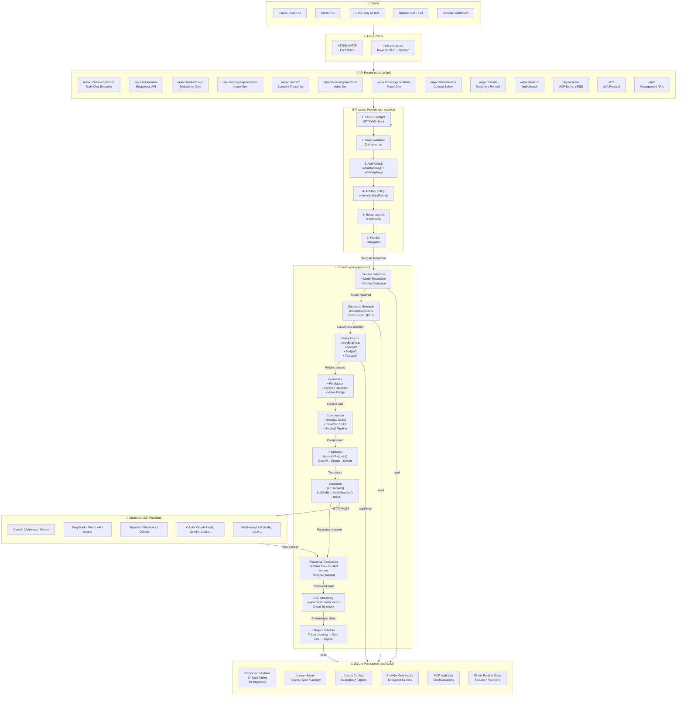
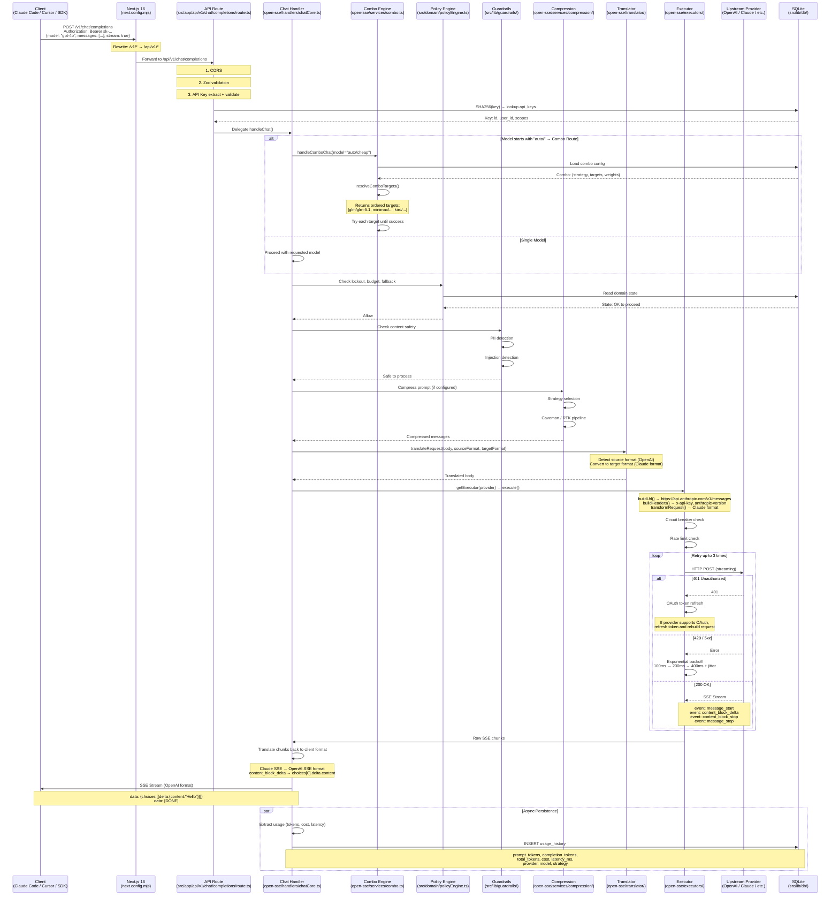
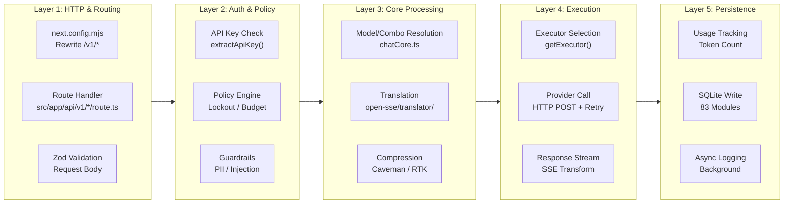
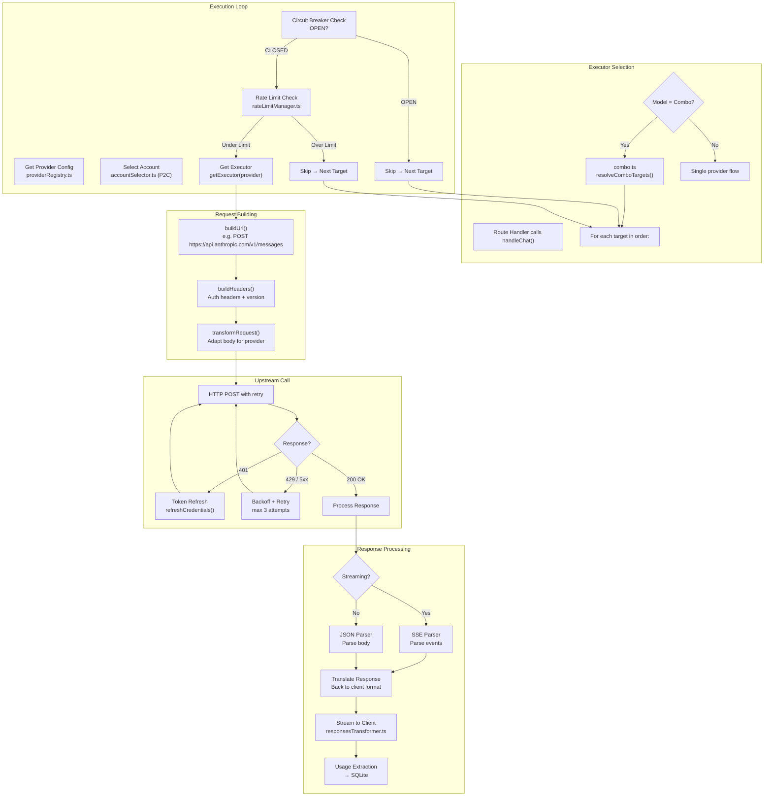
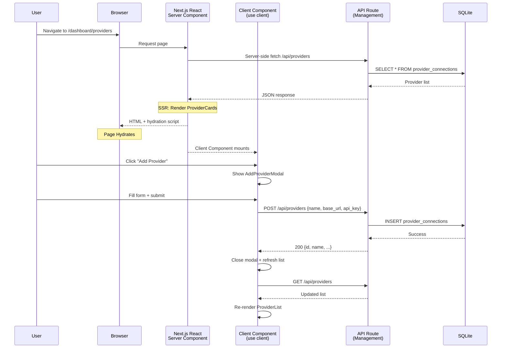
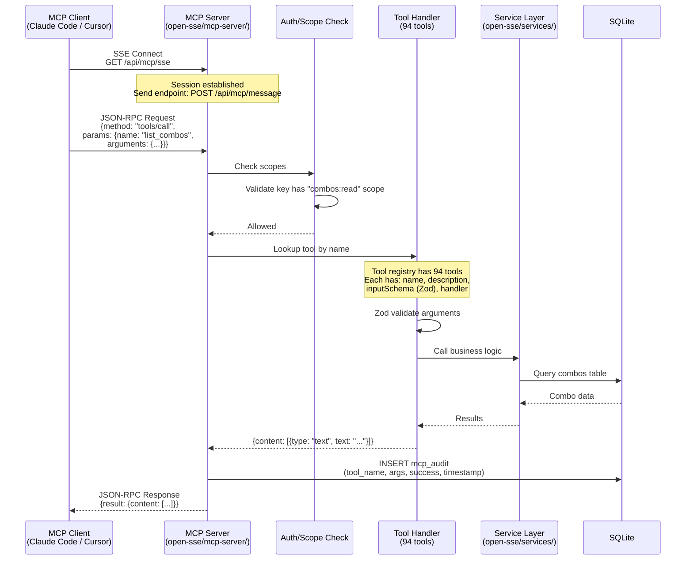
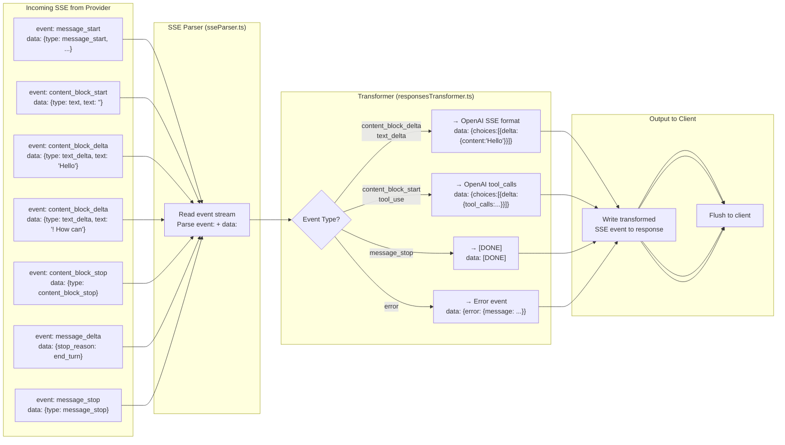
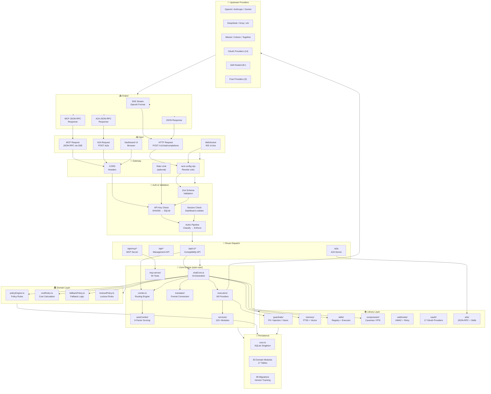

# 🔄 OmniRoute — Current Workflow Architecture

> How the **current TypeScript/Next.js 16 system** processes requests through its workflow pipeline. No Go, no Envoy, no Controller patterns — just the actual flow as it exists today.

---

## 📊 HIGH-LEVEL WORKFLOW

---

## 🔄 CHAT COMPLETION WORKFLOW (Most Common Path)

---

## 🏗️ LAYER-BY-LAYER WORKFLOW

---

## 🔧 PROVIDER EXECUTOR WORKFLOW

---

## 🗄️ DATA FLOW WORKFLOW (SQLite Reads/Writes)

```mermaid
flowchart TB
    subgraph Reads["Read Path (Combo Resolution)"]
        direction LR
        R1["chatCore.ts<br/>handleChatCore()"] --> R2["combo.ts<br/>handleComboChat()"]
        R2 --> R3["src/lib/db/combos.ts<br/>getComboByKey()"]
        R3 --> R4["SQLite<br/>combos table"]
        R4 --> R5["Combo Config<br/>strategy + targets"]
        R5 --> R2
        R2 --> R6["src/lib/db/providers.ts<br/>getProvider()"]
        R6 --> R4
        R4 --> R7["Provider Config<br/>base_url + auth_type"]
    end

    subgraph Writes["Write Path (Usage Logging)"]
        direction LR
        W1["Executor<br/>Response received"] --> W2["usageExtractor.ts<br/>Extract tokens"]
        W2 --> W3["Calculate cost<br/>provider pricing"]
        W3 --> W4["src/lib/db/usage*.ts<br/>INSERT usage_history"]
        W4 --> W5["SQLite<br/>usage_history table"]
    end

    subgraph State["State Path (Policy/Resilience)"]
        direction LR
        S1["policyEngine.ts<br/>Check lockout/budget"] --> S2["src/lib/db/domainState.ts<br/>read state"]
        S2 --> S3["SQLite<br/>domain_state table"]
        S3 --> S4["Return: ALLOW / DENY"]
        S4 --> S1
        S1 --> S5["circuitBreaker.ts<br/>Check provider"]
        S5 --> S6["src/lib/db/circuitBreakers.ts<br/>read/write"]
    end
```

---

## 🖥️ FRONTEND WORKFLOW (Dashboard)

---

## 📡 MCP TOOL WORKFLOW

---

## ⚡ STREAMING SSE WORKFLOW

---

## 🗺️ FULL SYSTEM WORKFLOW MAP

---

## 📁 KEY FILES IN THE WORKFLOW

| Step | File | What It Does |
|------|------|-------------|
| **Entry** | `next.config.mjs` | Rewrites `/v1/*` → `/api/v1/*` |
| **Route** | `src/app/api/v1/chat/completions/route.ts` | CORS, Zod validation, auth check, delegate |
| **Handler** | `open-sse/handlers/chatCore.ts` | Main orchestration — resolves model, calls services |
| **Combo** | `open-sse/services/combo.ts` | Resolves combo targets, iterates until success |
| **Scoring** | `open-sse/services/autoCombo/` | 9-factor ML scoring engine |
| **Policy** | `src/domain/policyEngine.ts` | Lockout, budget, fallback checks |
| **Guard** | `src/lib/guardrails/` | PII masking, injection detection |
| **Compress** | `open-sse/services/compression/` | Caveman / RTK engines |
| **Translate** | `open-sse/translator/index.ts` | Format conversion between APIs |
| **Execute** | `open-sse/executors/base.ts` | HTTP call with retry, circuit breaker |
| **Stream** | `open-sse/transformer/responsesTransformer.ts` | SSE chunk transformation |
| **Persist** | `src/lib/db/usage*.ts` | Usage logging to SQLite |

---

> **See also:**
> - `CURRENT_FRONTEND_BACKEND_ARCHITECTURE.md` — Full component-level architecture
> - `GOLANG_MIGRATION_ROADMAP.md` — Future Go migration plan