# 🚀 OmniRoute — TypeScript → Go Migration Roadmap

> **Goal**: Migrate the backend core (API routes, engine, services, persistence) from TypeScript/Next.js to Go, while keeping the Next.js dashboard frontend unchanged.
>
> **Strategy**: Progressive migration using a Go reverse-proxy sidecar pattern. No big-bang rewrite. Each phase builds on the last, with the Go service gradually consuming more traffic until the TS backend is fully replaced.

---

## 📐 MIGRATION ARCHITECTURE

```mermaid
flowchart TB
    subgraph Phase0["Phase 0: Current (TypeScript Monolith)"]
        LB["HTTP Load<br/>Balancer"] --> Next["Next.js 16<br/>(TS Backend + Frontend)"]
        Next -->|"API routes"| TSServices["open-sse (TS)<br/>Engine + Services"]
        Next -->|"Dashboard"| React["React Dashboard<br/>(unchanged)"]
        TSServices --> SQLite["SQLite<br/>Data"]
    end

    subgraph Sidecar["Phase 1-3: Sidecar Pattern"]
        LB2["HTTP Load<br/>Balancer"] -->|"API traffic"| GoProxy["Go Proxy<br/>(Gin/Echo)"]
        GoProxy -->|"route requests"| Next2["Next.js 16<br/>(TS Backend)"]
        Next2 -->|"dashboard"| React2["React Dashboard<br/>(unchanged)"]
        GoProxy -->|"direct handler"| GoServices["Go Backend<br/>(migrated)"]
        GoServices --> SQLite2["SQLite<br/>Data"]
        Next2 --> SQLite2
    end

    subgraph Final["Phase 4: Target State"]
        LB3["HTTP Load<br/>Balancer"] -->|"API traffic"| GoFinal["Go Backend<br/>(Gin/Echo/Fiber)"]
        GoFinal --> SQLite3["SQLite +<br/>Postgres (optional)"]
        LB3 -->|"dashboard"| Next3["Next.js 16<br/>(React Frontend only)"]
        Next3 -->|"management API"| GoFinal
    end
```

---

## 🗺️ MIGRATION ORDER

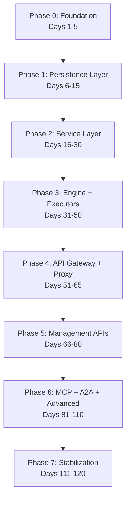

---

## 📅 PHASE 0: Foundation & Infrastructure (Days 1-5)

**What**: Set up Go project structure, build system, CI/CD, shared libraries.

| Day | Task | Details | Files to Create |
|-----|------|---------|-----------------|
| 1 | **Go project init** | `go mod init github.com/omniroute/core`; directory structure: `cmd/`, `internal/`, `pkg/`, `api/`, `migrations/` | `go.mod`, `Makefile`, `cmd/omniroute/main.go` |
| 2 | **Build system** | Makefile targets: `build`, `test`, `lint`, `fmt`, `migrate`, `dev`; Docker multi-stage build; CI integration | `Makefile`, `Dockerfile`, `.goreleaser.yml` |
| 3 | **Shared types** | Define Go structs for: `ChatRequest`, `ChatResponse`, `SSEEvent`, `RequestOptions`, `ModelConfig`, `ProviderConnection`, `ComboConfig`, `UsageRecord` | `pkg/types/request.go`, `pkg/types/response.go`, `pkg/types/provider.go`, `pkg/types/combo.go` |
| 4 | **Config + logging** | YAML config loader with env overrides; structured logging (slog/zerolog); graceful shutdown | `internal/config/config.go`, `internal/logger/logger.go`, `config.yaml` |
| 5 | **Testing framework** | Test helpers, mock providers, testcontainers for SQLite; benchmark harness | `internal/testutil/`, `internal/assert/` |

**Phase 0 Total: 5 days**

---

## 📅 PHASE 1: Persistence Layer (Days 6-15)

**What**: Migrate all SQLite database modules from `src/lib/db/` (83 TS modules → ~20 Go packages).

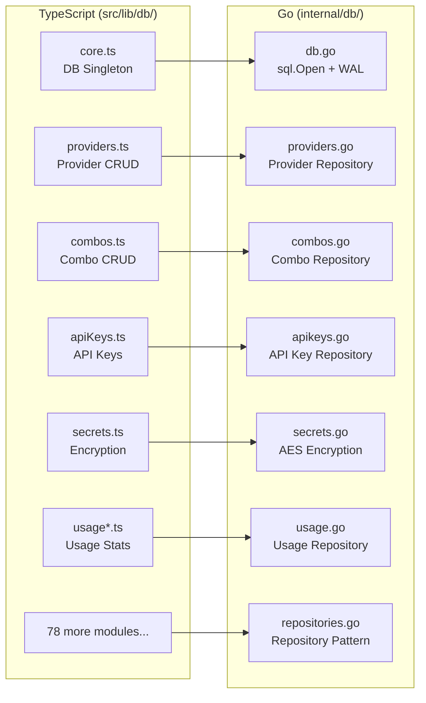

| Day | Task | Details | Key Go Files |
|-----|------|---------|--------------|
| 6 | **DB connection + migrations** | Go `database/sql` + `mattn/go-sqlite3` wrapper; WAL mode; migration runner that reads `.sql` files | `internal/db/db.go`, `internal/db/migrations.go`, `internal/db/migrate/` |
| 7 | **Core repositories** | Provider connections, models, settings | `internal/db/providers.go`, `internal/db/models.go`, `internal/db/settings.go` |
| 8 | **Combo + routing repos** | Combos, combo steps, model combo mappings, domain state | `internal/db/combos.go`, `internal/db/combo_steps.go`, `internal/db/domain_state.go` |
| 9 | **Auth repositories** | API keys (SHA256 hash), secrets (AES-256-GCM encryption), registered keys, session affinity | `internal/db/apikeys.go`, `internal/db/secrets.go`, `internal/db/registered_keys.go` |
| 10 | **Usage + billing repos** | Usage history, quota snapshots, credit balance | `internal/db/usage.go`, `internal/db/quota.go`, `internal/db/credits.go` |
| 11 | **Resilience repos** | Circuit breakers, backup, cleanup, health check | `internal/db/circuit_breakers.go`, `internal/db/backup.go`, `internal/db/health.go` |
| 12 | **Compliance repos** | Webhooks, evals, reasoning cache, read cache | `internal/db/webhooks.go`, `internal/db/evals.go`, `internal/db/reasoning_cache.go` |
| 13 | **Advanced repos 1** | Compression config, compression combos, batch jobs, file storage | `internal/db/compression.go`, `internal/db/compression_combos.go`, `internal/db/batches.go`, `internal/db/files.go` |
| 14 | **Advanced repos 2** | CLI tool state, prompts, detailed logs, context handoffs, sync tokens, proxies | `internal/db/cli_tool_state.go`, `internal/db/prompts.go`, `internal/db/proxies.go` |
| 15 | **Integration tests** | Test each repository with in-memory SQLite; verify schema matches TS migrations exactly | `internal/db/*_test.go` |

**Phase 1 Total: 10 days**

---

## 📅 PHASE 2: Service Layer (Days 16-30)

**What**: Migrate `open-sse/services/` (115+ modules) to Go service layer.

| Day | Task | Details | Key Go Files |
|-----|------|---------|--------------|
| 16 | **Rate limiter** | Token bucket per provider; sync.Map for state; configurable limits + window | `internal/service/rate_limiter.go` |
| 17 | **Circuit breaker** | 3-state (closed/open/half-open); failure count + timeout config; SQLite persistence | `internal/service/circuit_breaker.go` |
| 18 | **Account selector** | P2C (Power of Two Choices) algorithm; weighted random selection; least-used fallback | `internal/service/account_selector.go` |
| 19 | **Account fallback** | Multi-account rotation; credential refresh on 401; dead account tracking | `internal/service/account_fallback.go` |
| 20 | **Context manager** | Token counting (tiktoken-go); max context enforcement; truncation strategy | `internal/service/context_manager.go` |
| 21 | **Auth + OAuth** | API key validation; OAuth token refresh (17 providers); session manager | `internal/service/auth.go`, `internal/service/oauth.go` |
| 22 | **Combo routing** | Priority, weighted, round-robin, random, P2C, cost-optimized, auto-scoring strategies | `internal/service/combo.go`, `internal/service/routing_strategies.go` |
| 23 | **Auto-combo engine** | 9-factor scoring (latency, cost, success rate, availability, etc.) | `internal/service/auto_combo/` (multi-file package) |
| 24 | **Policy engine** | Lockout policy, budget guards, fallback policy, cost rules, model availability | `internal/service/policy.go`, `internal/service/budget.go`, `internal/service/fallback.go` |
| 25 | **Emergency + model fallback** | Intra-family fallback (GPT-4 → GPT-4-mini); emergency fallback providers | `internal/service/emergency_fallback.go`, `internal/service/model_fallback.go` |
| 26 | **Token refresh** | OAuth token lifecycle; refresh before expiry; concurrent refresh prevention | `internal/service/token_refresh.go` |
| 27 | **IP filter + guardrails** | IP allowlist/blocklist (CIDR); guardrail evaluation (PII, injection, vision) | `internal/service/ip_filter.go`, `internal/service/guardrails.go` |
| 28 | **Compression services** | Strategy selection; compression stats tracking; API for compression configs | `internal/service/compression.go` |
| 29 | **Workflow + detectors** | Workflow FSM; background task detector; volume detector; intent classifier | `internal/service/workflow.go`, `internal/service/intent.go` |
| 30 | **Service integration tests** | Integration test each service with real SQLite; mock providers for end-to-end flows | `internal/service/*_test.go` |

**Phase 2 Total: 15 days**

---

## 📅 PHASE 3: Core Engine + Executors (Days 31-50)

**What**: Migrate `open-sse/handlers/` + `open-sse/executors/` (the heart of the system).

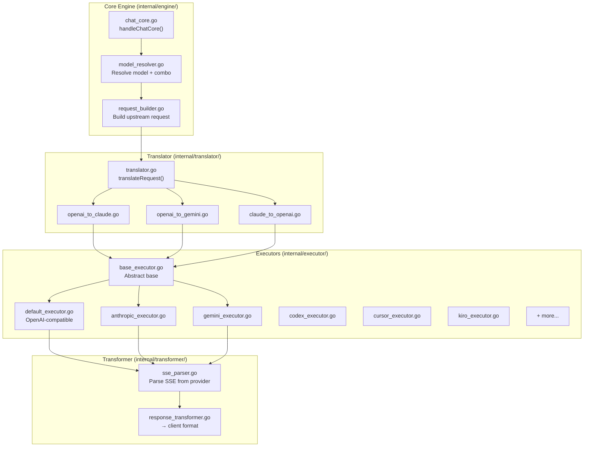

| Day | Task | Details | Key Go Files |
|-----|------|---------|--------------|
| 31 | **Chat core engine** | `handleChatCore()` — model resolution, combo detection, delegation to services | `internal/engine/chat_core.go` |
| 32 | **Model resolver** | Resolve model name → provider; detect auto/combo prefixes; model-mapping logic | `internal/engine/model_resolver.go` |
| 33 | **Request builder** | Build upstream request URL, headers, body from resolved config + credentials | `internal/engine/request_builder.go` |
| 34 | **Base executor** | HTTP client with retry (3 attempts, exponential backoff + jitter); timeout; abort signals | `internal/executor/base.go` |
| 35 | **Default executor** | OpenAI-compatible providers; reads provider registry for base URL + auth header format | `internal/executor/default.go` |
| 36 | **Anthropic executor** | Anthropic-specific: version header, request/response format, tool use blocks | `internal/executor/anthropic.go` |
| 37 | **Gemini executor** | Google AI/Vertex: OAuth token, safety settings, generation config | `internal/executor/gemini.go` |
| 38 | **OAuth executors** | Codex, Cursor, Kiro, Qoder, Pollinations, Puter — each with unique auth flows | `internal/executor/codex.go`, `internal/executor/cursor.go`, `internal/executor/kiro.go` |
| 39 | **Translator: OpenAI↔Claude** | Detect source format; convert messages, tools, system prompts between formats | `internal/translator/openai_to_claude.go`, `internal/translator/claude_to_openai.go` |
| 40 | **Translator: OpenAI↔Gemini** | OpenAI ↔ Gemini format conversion; handling of content parts, safety settings | `internal/translator/openai_to_gemini.go`, `internal/translator/gemini_to_openai.go` |
| 41 | **SSE parser** | Parse provider SSE events; handle streaming, non-streaming; error recovery | `internal/transformer/sse_parser.go` |
| 42 | **Response transformer** | TransformStream logic: provider SSE → OpenAI SSE format; tool call translation | `internal/transformer/response_transformer.go` |
| 43 | **Think tag parser** | Extract `<think>` tags from reasoning content; re-inject on next turn | `internal/engine/think_tag.go` |
| 44 | **Usage extractor** | Token counting (tiktoken-go); cost calculation from provider pricing; latency tracking | `internal/engine/usage.go` |
| 45–47 | **10 more executors** | Vertex AI, Cloudflare AI, HuggingFace, DeepInfra, SambaNova, Together, Fireworks, Cohere, NVIDIA, Cerebras | `internal/executor/` (10 files) |
| 48–49 | **20 more executors** | Pollinations, Puter, OpenAI-compatible-*, Anthropic-compatible-* | `internal/executor/` (20 files) |
| 50 | **Engine integration tests** | End-to-end tests: mock upstream → engine → response; verify streaming, retry, errors | `internal/engine/*_test.go` |

**Phase 3 Total: 20 days**

---

## 📅 PHASE 4: API Gateway + Proxy Sidecar (Days 51-65)

**What**: Build the Go HTTP server (Gin/Echo/Fiber) with all API routes. Start routing traffic through it while keeping the TS backend as fallback.

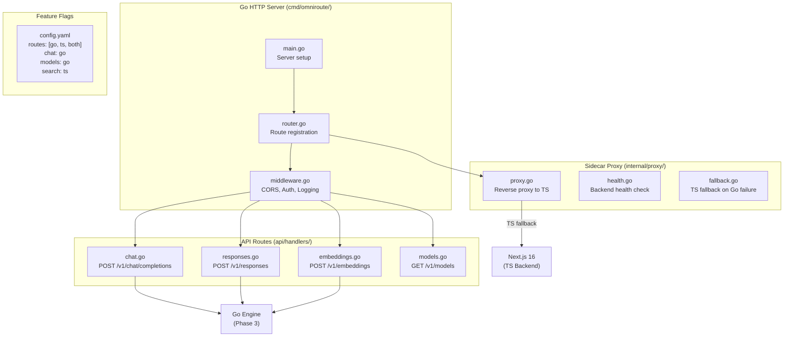

| Day | Task | Details | Key Go Files |
|-----|------|---------|--------------|
| 51 | **HTTP server scaffold** | Gin/Echo server; graceful shutdown; TLS; CORS middleware; request logging | `cmd/omniroute/main.go`, `api/router.go`, `api/middleware.go` |
| 52 | **Chat completions route** | POST /v1/chat/completions — Zod-equivalent validation, delegate to engine | `api/handlers/chat.go` |
| 53 | **Responses API route** | POST /v1/responses — Responses API format with transform stream | `api/handlers/responses.go` |
| 54 | **Streaming response writer** | SSE writer; flush control; client disconnect detection; context cancellation | `api/stream.go` |
| 55 | **Embeddings + models routes** | POST /v1/embeddings, GET /v1/models, GET /v1/models/:id | `api/handlers/embeddings.go`, `api/handlers/models.go` |
| 56 | **Reverse proxy sidecar** | Proxy un-migrated routes to TS backend; configurable route-by-route | `internal/proxy/proxy.go`, `internal/proxy/health.go` |
| 57 | **Auth middleware** | API key extraction + validation; authz pipeline (classify → policies → enforce); scope check | `api/middleware/auth.go`, `internal/auth/pipeline.go` |
| 58 | **Rate limit middleware** | Per-route rate limiting; usage-based rate limiting; IP-based limits | `api/middleware/ratelimit.go` |
| 59 | **Feature flag system** | Per-route toggle (go/ts/both); gradual migration control; A/B testing support | `internal/config/feature_flags.go`, `config.yaml` |
| 60 | **Image + audio routes** | POST /v1/images/generations, POST /v1/audio/transcriptions, POST /v1/audio/speech | `api/handlers/image.go`, `api/handlers/audio.go` |
| 61 | **Video + music routes** | POST /v1/videos/generations, POST /v1/music/generations | `api/handlers/video.go`, `api/handlers/music.go` |
| 62 | **Moderation + rerank routes** | POST /v1/moderations, POST /v1/rerank | `api/handlers/moderation.go`, `api/handlers/rerank.go` |
| 63 | **Search + health routes** | POST /v1/search, GET /v1/health, GET /v1/version | `api/handlers/search.go`, `api/handlers/health.go` |
| 64 | **Error handling + recovery** | Panic recovery middleware; structured error responses; consistent error format | `api/middleware/recovery.go`, `internal/errors/errors.go` |
| 65 | **Gateway integration tests** | Test all routes with mock engine; test streaming, errors, auth, rate limits | `api/handlers/*_test.go` |

**Phase 4 Total: 15 days**

---

## 📅 PHASE 5: Management APIs (Days 66-80)

**What**: Migrate all `/api/*` management endpoints (settings, providers, combos, keys) from Next.js to Go.

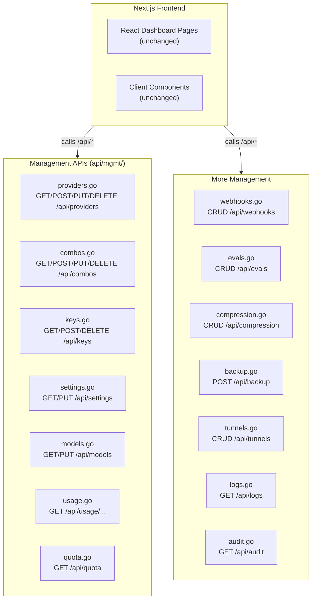

| Day | Task | Details | Key Go Files |
|-----|------|---------|--------------|
| 66 | **Provider management** | CRUD provider_connections; list, create, update, delete + test connection | `api/mgmt/providers.go` |
| 67 | **Combo management** | CRUD combos + combo steps; drag-and-drop reordering; strategy selection | `api/mgmt/combos.go` |
| 68 | **API key management** | CRUD api_keys; generate key, revoke, set scopes, list keys | `api/mgmt/keys.go` |
| 69 | **Settings management** | CRUD settings (key-value); system settings; user preferences | `api/mgmt/settings.go` |
| 70 | **Model management** | Add/edit/remove models; model-catalog sync from providers | `api/mgmt/models.go` |
| 71 | **Usage + billing APIs** | GET usage history; usage stats aggregation; quota status | `api/mgmt/usage.go`, `api/mgmt/quota.go` |
| 72 | **Webhook management** | CRUD webhooks; test delivery; view delivery history | `api/mgmt/webhooks.go` |
| 73 | **Eval management** | CRUD evals; run eval; view eval results | `api/mgmt/evals.go` |
| 74 | **Compression management** | CRUD compression configs; engine selection; combo assignments | `api/mgmt/compression.go` |
| 75 | **Backup + restore** | Manual backup trigger; backup list; restore from backup | `api/mgmt/backup.go` |
| 76 | **Tunnel management** | CRUD tunnels; Cloudflare/ngrok/Tailscale tunnel status | `api/mgmt/tunnels.go` |
| 77 | **Log + audit APIs** | GET detailed logs; audit trail; log level management | `api/mgmt/logs.go`, `api/mgmt/audit.go` |
| 78 | **File + batch APIs** | File upload/list/delete; batch job CRUD | `api/mgmt/files.go`, `api/mgmt/batches.go` |
| 79 | **Auth management** | Session management; OAuth provider config; password change | `api/mgmt/auth.go` |
| 80 | **Mgmt API integration** | Test all management APIs against Go backend; verify Next.js frontend still works | `api/mgmt/*_test.go` |

**Phase 5 Total: 15 days**

---

## 📅 PHASE 6: MCP + A2A + Advanced Features (Days 81-110)

**What**: Migrate MCP server, A2A protocol, compression engines, memory, skills.

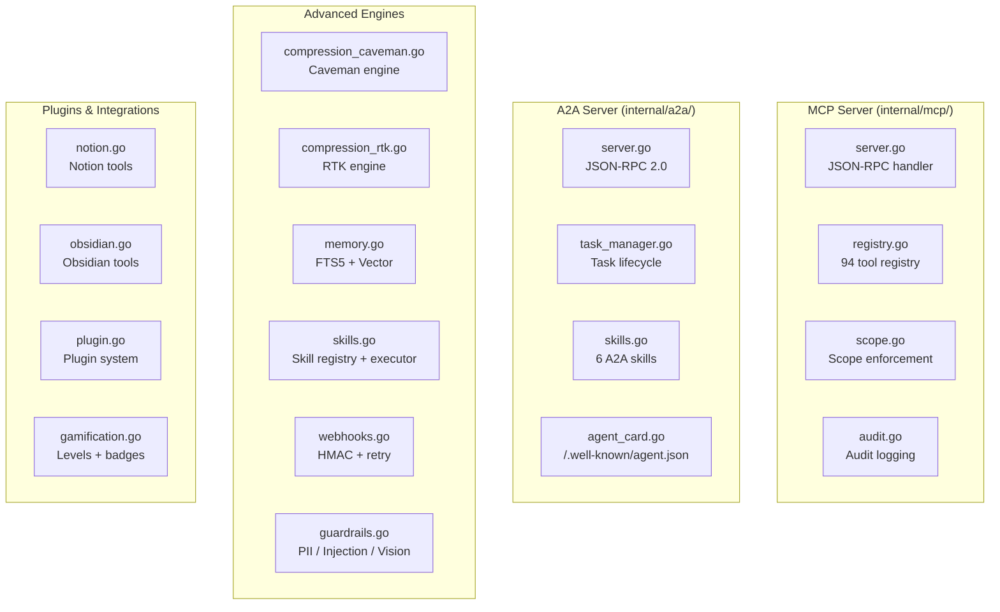

| Day | Task | Details | Key Go Files |
|-----|------|---------|--------------|
| 81 | **MCP server scaffold** | JSON-RPC over SSE; session management; endpoint discovery | `internal/mcp/server.go`, `internal/mcp/session.go` |
| 82 | **MCP tool registry** | 20 core tools: get_health, list_combos, get_combo_metrics, switch_combo, check_quota, route_request, cost_report, etc. | `internal/mcp/tools_core.go` |
| 83 | **MCP cache + compression tools** | cache_stats, cache_flush, compression_status, compression_configure, set_compression_engine, list_compression_combos, compression_combo_stats | `internal/mcp/tools_cache.go`, `internal/mcp/tools_compression.go` |
| 84 | **MCP proxy tools** | oneproxy_fetch, oneproxy_rotate, oneproxy_stats | `internal/mcp/tools_proxy.go` |
| 85 | **MCP memory + skill tools** | memory_search, memory_add, memory_clear, skills_list, skills_enable, skills_execute, skills_executions | `internal/mcp/tools_memory.go`, `internal/mcp/tools_skills.go` |
| 86 | **MCP gamification tools** | levels, badges, leaderboard, community-federation | `internal/mcp/tools_gamification.go` |
| 87 | **MCP plugin tools** | Plugin marketplace listing, install/enable/disable, runtime inspection | `internal/mcp/tools_plugins.go` |
| 88 | **MCP Notion tools** | 6 Notion integration tools (list, read, search, create, update, delete) | `internal/mcp/tools_notion.go` |
| 89 | **MCP Obsidian tools** | 22 Obsidian tools (vault search, note CRUD, WebDAV operations) | `internal/mcp/tools_obsidian.go` |
| 90 | **MCP scope enforcement** | 30 scopes; validate key scopes before handler dispatch; scope ↔ tool mapping | `internal/mcp/scope.go` |
| 91 | **MCP audit + testing** | Audit logging to SQLite; MCP integration tests for all 94 tools | `internal/mcp/audit.go`, `internal/mcp/*_test.go` |
| 92 | **A2A server scaffold** | JSON-RPC 2.0 handler; task manager; SSE streaming for `message/stream` | `internal/a2a/server.go`, `internal/a2a/task_manager.go` |
| 93 | **A2A skills** | 6 skills: smartRouting, quotaManagement, providerDiscovery, costAnalysis, healthReport, listCapabilities | `internal/a2a/skills/` (6 files) |
| 94 | **A2A agent card** | `/.well-known/agent.json` handler; capability discovery | `api/handlers/well_known.go`, `internal/a2a/agent_card.go` |
| 95 | **A2A integration tests** | Test task lifecycle; test streaming; test all 6 skills | `internal/a2a/*_test.go` |
| 96 | **Compression: Caveman engine** | Caveman-style semantic condensation; built-in rules + language packs | `internal/compression/caveman.go`, `internal/compression/caveman_rules.go` |
| 97 | **Compression: RTK engine** | Rule-based terminal/tool-output compression; JSON filter packs | `internal/compression/rtk.go`, `internal/compression/rtk_rules.go` |
| 98 | **Compression: Strategy + pipeline** | Strategy selector; stacked pipelines; per-request stats tracking | `internal/compression/strategy.go`, `internal/compression/pipeline.go` |
| 99 | **Memory system** | FTS5 full-text search; vector similarity; extract/inject/retrieve/summarize | `internal/memory/` |
| 100 | **Skills system** | Registry, executor, sandbox; built-in + custom skills; interception | `internal/skills/` |
| 101 | **Guardrails (full)** | PII masker, prompt injection detector, vision bridge; hot-reloadable | `internal/guardrails/` |
| 102 | **Webhook dispatcher** | HMAC-signed delivery; exponential backoff; auto-disable after 10 failures | `internal/webhook/dispatcher.go` |
| 103 | **OAuth system (full)** | 17 OAuth providers; token lifecycle; refresh; credential resolution | `internal/oauth/` |
| 104 | **Reasoning cache** | Hybrid in-memory + SQLite cache for `reasoning_content`; re-inject on multi-turn | `internal/cache/reasoning_cache.go` |
| 105 | **Signature cache** | Request deduplication; TTL-based expiry; LRU eviction | `internal/cache/signature_cache.go` |
| 106 | **Cloud agents** | Codex Cloud, Devin, Jules; task management; polling | `internal/cloud_agent/` |
| 107 | **Compliance** | Policy index; compliance rule evaluation; audit trail | `internal/compliance/` |
| 108 | **Eval framework** | Eval runner; test suites; combo/model/suite-default targets | `internal/eval/` |
| 109 | **Tunnels** | Cloudflare Quick/Named, ngrok, Tailscale Funnel | `internal/tunnel/` |
| 110 | **Advanced integration tests** | Full integration: MCP + A2A + compression + memory + guardrails | `internal/tests/` |

**Phase 6 Total: 30 days**

---

## 📅 PHASE 7: Stabilization & Cutover (Days 111-120)

**What**: Final testing, performance tuning, bug fixes, cutover.

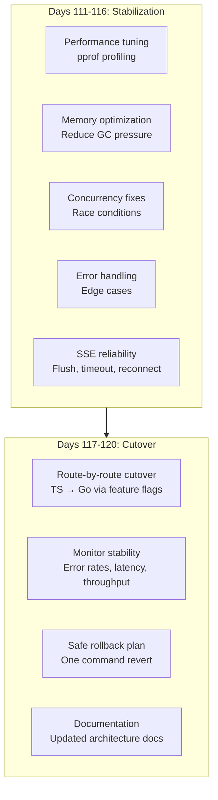

| Day | Task | Details |
|-----|------|---------|
| 111 | **Performance profiling** | pprof CPU + memory profiles; identify hot spots; optimize hot paths |
| 112 | **Memory optimization** | Reduce allocations in hot loops; optimize SSE streaming buffer; object pooling |
| 113 | **Concurrency audit** | Race detector (`-race`); fix data races in shared state (rate limiters, circuit breakers) |
| 114 | **Edge case hardening** | Empty responses, partial SSE, timeouts, connection drops, large payloads |
| 115 | **SSE reliability** | Flush strategy; client disconnect detection; stream cleanup; timeout handling |
| 116 | **Load testing** | k6/r6: simulate 1000 concurrent requests; measure P50/P95/P99 latency vs TS |
| 117 | **Route-by-route cutover** | Switch feature flags: chat → go, models → go, management → go, etc. |
| 118 | **Canary + monitoring** | Route 10% of traffic to Go; monitor error rate, latency, throughput; increase to 50% → 100% |
| 119 | **Rollback plan + dry run** | Test revert procedure; document one-command rollback; verify TS backend still works |
| 120 | **Documentation + cleanup** | Update architecture docs; remove TS backend code; final review |

**Phase 7 Total: 10 days**

---

## 📊 TOTAL PROJECT TIMELINE

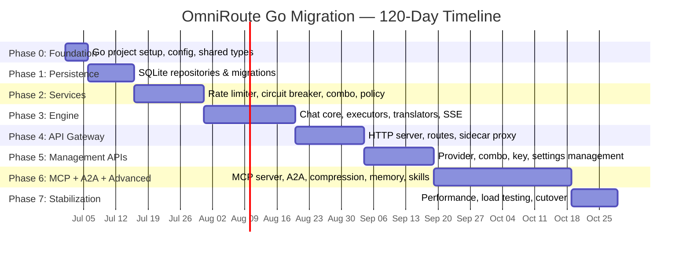

### Summary

| Phase | Duration | Components |
|-------|----------|------------|
| **0: Foundation** | 5 days | Go project structure, build system, shared types, config |
| **1: Persistence** | 10 days | SQLite: 83 TS modules → 20 Go packages, 99 migrations |
| **2: Services** | 15 days | 115+ service modules → rate limit, circuit breaker, combo, policy |
| **3: Engine** | 20 days | Chat core, 68 executors, translators, SSE transformer |
| **4: API Gateway** | 15 days | HTTP server, API routes, sidecar proxy, streaming |
| **5: Management** | 15 days | 30+ management API endpoints |
| **6: MCP + A2A** | 30 days | MCP (94 tools), A2A, compression, memory, skills, guardrails |
| **7: Stabilization** | 10 days | Performance, load testing, cutover |
| **Total** | **120 days** | Full Go backend replacing all TS backend code |

---

## 🎯 WHERE TO START — IMMEDIATE NEXT STEPS

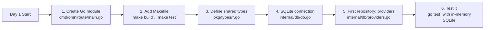

### Commands to Start

```bash
# Day 1
mkdir -p omniroute-go/cmd/omniroute omniroute-go/internal omniroute-go/pkg
cd omniroute-go
go mod init github.com/omniroute/core
mkdir -p internal/{db,service,engine,executor,translator,transformer,mcp,a2a,config,logger} \
         api/{handlers,mgmt,middleware} \
         pkg/types migrations

# Day 1 Makefile
cat > Makefile << 'EOF'
.PHONY: build test lint clean

build:
	go build -o bin/omniroute ./cmd/omniroute

test:
	go test ./... -v -count=1

lint:
	golangci-lint run ./...

fmt:
	go fmt ./...

EOF

# Day 2 Run
make build  
```

> **Key decision**: Start with Phase 0 and Phase 1 (SQLite persistence). The DB layer has no dependencies on other Go packages, making it the safest place to start and test in isolation.

---

## 📈 RISK & MITIGATION

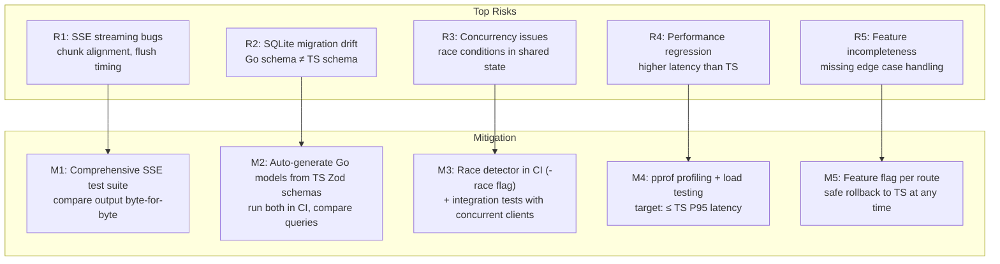

---

> **See also:**
> - `GOLANG_ENVOY_K8S_OPERATOR_ROADMAP.md` — 7-month post-migration plan (Envoy + K8s Operator)
> - `GOLANG_E2E_FLOW_ARCHITECTURE.md` — Go end-to-end flow architecture (future state)