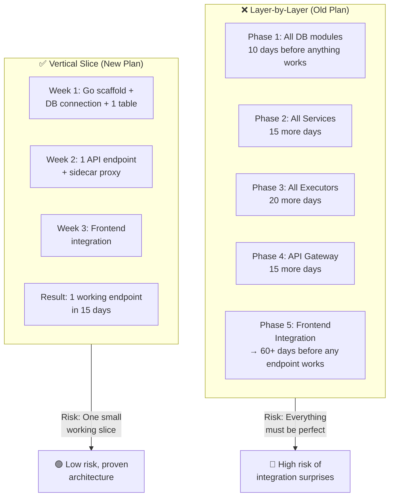
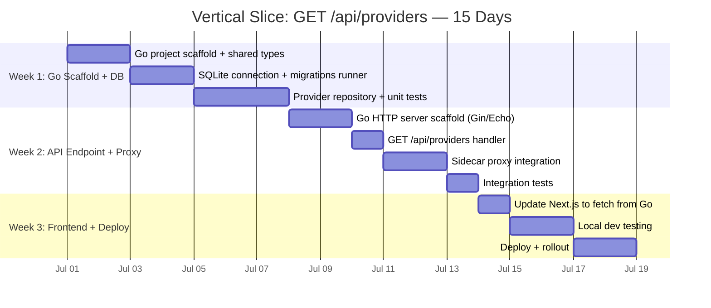
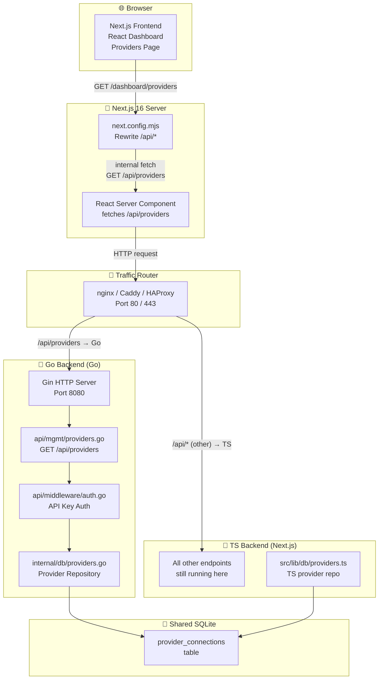
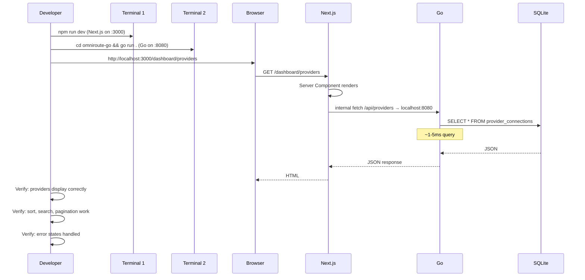
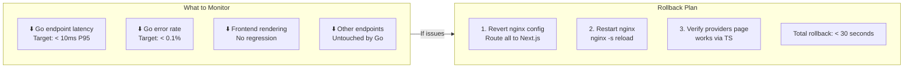
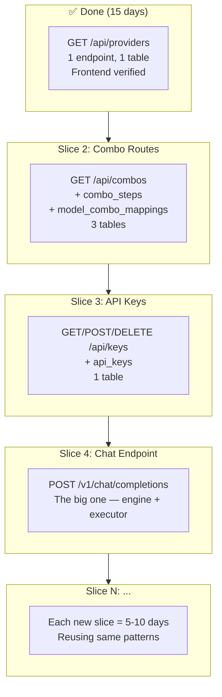
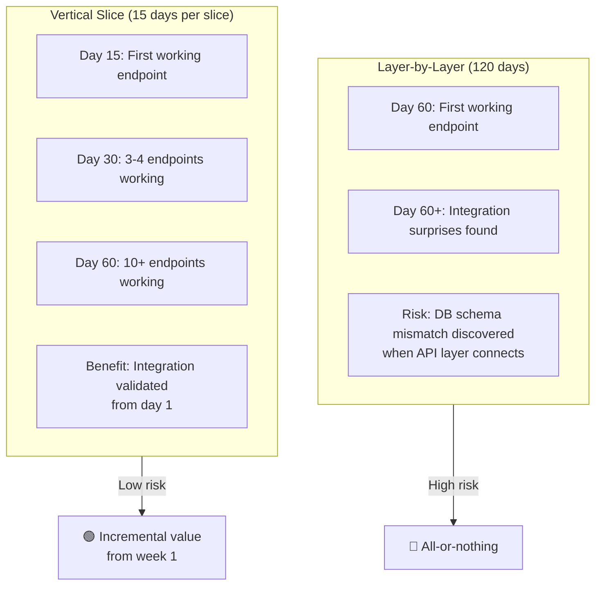

# 🎯 OmniRoute Go Migration — Vertical Slice Approach

> **One endpoint, end-to-end, before we build the rest.**
>
> Instead of migrating the entire system layer-by-layer (DB → Services → API → Frontend), we build **one complete vertical slice** through the entire stack. This proves the Go architecture works end-to-end from the first week.

---

## 📐 Vertical Slice vs Layer-by-Layer



---

## 🎯 WHICH ENDPOINT FIRST?

### Candidates

| Endpoint | Complexity | Frontend Impact | Why |
|----------|-----------|----------------|------|
| `GET /api/health` | Very low | None | Doesn't prove frontend integration |
| `GET /api/providers` | Low | High — dashboard providers list | ✅ **Best choice** |
| `POST /v1/chat/completions` | Very high | None (API-only) | Too complex for first slice |
| `GET /api/usage` | Medium | Dashboard stats page | Good second slice |

### ✅ Chosen: `GET /api/providers` (Provider Management)

**Why providers?**

1. **Simple CRUD** — Reads from single SQLite table (`provider_connections`), no complex logic
2. **Proves DB migration** — Must read from the shared SQLite database
3. **Frontend integration** — The dashboard providers page (`/dashboard/providers`) will fetch from this endpoint
4. **Sidecar pattern** — We can route just this one endpoint to Go, everything else stays on TS
5. **Low risk** — If it breaks, only the providers page is affected, not chat traffic

---

## 📅 WEEK-BY-WEEK PLAN (15 Days)



---

## 🗺️ ARCHITECTURE: How It Works



### Data Flow: Step by Step

```
User visits /dashboard/providers
  → Next.js Server Component executes
  → fetch('/api/providers')
  → nginx routes /api/providers to Go (Port 8080)
  → Go Gin handler:
      1. Parse headers / extract API key
      2. Validate auth
      3. Call providers repository
      4. SQLite: SELECT * FROM provider_connections
      5. Return JSON
  → React Server Component renders list
  → Client hydrates → user sees providers
```

---

## 📅 DAY-BY-DAY EXECUTION

### Week 1: Go Scaffold + SQLite (Days 1-7)

#### Day 1: Go Project Scaffold

```bash
mkdir -p omniroute-go/{cmd/omniroute,internal/{db,config},api/handlers,api/middleware,pkg/types}
cd omniroute-go
go mod init github.com/omniroute/core

# Install dependencies
go get github.com/gin-gonic/gin
go get github.com/mattn/go-sqlite3
go get github.com/joho/godotenv
```

**Files to create:**

```go
// cmd/omniroute/main.go
package main

import (
    "github.com/gin-gonic/gin"
)

func main() {
    r := gin.Default()
    r.GET("/api/providers", func(c *gin.Context) {
        c.JSON(200, gin.H{"message": "not yet"})
    })
    r.Run(":8080")
}
```

**Deliverable**: `make build` succeeds, server starts on :8080

---

#### Day 2: Shared Types

```go
// pkg/types/provider.go
package types

type ProviderConnection struct {
    ID        string `json:"id"`
    Name      string `json:"name"`
    BaseURL   string `json:"base_url"`
    ProviderType string `json:"provider_type"`
    IsActive  bool   `json:"is_active"`
    CreatedAt string `json:"created_at"`
    UpdatedAt string `json:"updated_at"`
}

type ProviderListResponse struct {
    Providers []ProviderConnection `json:"providers"`
    Total     int                  `json:"total"`
}
```

**Deliverable**: Types compile, can marshal/unmarshal JSON

---

#### Day 3-4: SQLite Connection

```go
// internal/db/db.go
package db

import (
    "database/sql"
    "fmt"
    _ "github.com/mattn/go-sqlite3"
    "sync"
)

var (
    instance *sql.DB
    once     sync.Once
    mu       sync.RWMutex
)

func GetDB(dbPath string) (*sql.DB, error) {
    var err error
    once.Do(func() {
        instance, err = sql.Open("sqlite3", dbPath+"?_journal_mode=WAL&_busy_timeout=5000")
        if err == nil {
            instance.SetMaxOpenConns(1)
            runMigrations(instance)
        }
    })
    return instance, err
}

func runMigrations(db *sql.DB) {
    // Run the same SQL migrations that TS uses
    // Read from db/migrations/*.sql
}
```

**Key decision**: The Go backend reads from the **same SQLite database file** as the TS backend. Both point to `~/.omniroute/data.db` (or `DATA_DIR` env var).

**Deliverable**: `GetDB()` returns connected SQLite, migrations run successfully

---

#### Day 5-7: Provider Repository

```go
// internal/db/providers.go
package db

import (
    "database/sql"
    "github.com/omniroute/core/pkg/types"
)

type ProviderRepository struct {
    db *sql.DB
}

func NewProviderRepository(db *sql.DB) *ProviderRepository {
    return &ProviderRepository{db: db}
}

func (r *ProviderRepository) ListAll() ([]types.ProviderConnection, error) {
    rows, err := r.db.Query(`SELECT id, name, base_url, provider_type, is_active, created_at, updated_at 
                             FROM provider_connections ORDER BY name`)
    if err != nil {
        return nil, fmt.Errorf("query providers: %w", err)
    }
    defer rows.Close()

    var providers []types.ProviderConnection
    for rows.Next() {
        var p types.ProviderConnection
        if err := rows.Scan(&p.ID, &p.Name, &p.BaseURL, &p.ProviderType, &p.IsActive, &p.CreatedAt, &p.UpdatedAt); err != nil {
            return nil, fmt.Errorf("scan provider: %w", err)
        }
        providers = append(providers, p)
    }
    return providers, nil
}
```

**Tests**: 
```go
// internal/db/providers_test.go
func TestProviderRepository_ListAll(t *testing.T) {
    db := setupTestDB(t) // creates in-memory SQLite with migrations
    repo := NewProviderRepository(db)
    
    // Insert test data
    db.Exec("INSERT INTO provider_connections (id, name, base_url, provider_type, is_active) VALUES (?,?,?,?,?)",
        "test-1", "Test Provider", "https://test.com", "openai", true)
    
    providers, err := repo.ListAll()
    assert.NoError(t, err)
    assert.Len(t, providers, 1)
    assert.Equal(t, "Test Provider", providers[0].Name)
}
```

**Deliverable**: Provider repository with tests passing

**End of Week 1**: Go project scaffolded, SQLite connected, providers table readable. ✅

---

### Week 2: API Endpoint + Sidecar Proxy (Days 8-14)

#### Day 8-9: HTTP Server with Gin

```go
// cmd/omniroute/main.go (updated)
package main

import (
    "github.com/gin-gonic/gin"
    "github.com/omniroute/core/api/handlers"
    "github.com/omniroute/core/api/middleware"
    "github.com/omniroute/core/internal/db"
)

func main() {
    database, err := db.GetDB("~/.omniroute/data.db")
    if err != nil {
        panic(err)
    }
    
    r := gin.Default()
    
    // Global middleware
    r.Use(middleware.CORS())
    
    // Routes
    api := r.Group("/api")
    api.Use(middleware.AuthValidator(database))
    {
        api.GET("/providers", handlers.ListProviders(database))
    }
    
    r.Run(":8080")
}
```

**Deliverable**: Gin server starts, responds to requests

---

#### Day 10: GET /api/providers Handler

```go
// api/handlers/providers.go
package handlers

import (
    "net/http"
    "github.com/gin-gonic/gin"
    "github.com/omniroute/core/internal/db"
)

func ListProviders(database *sql.DB) gin.HandlerFunc {
    repo := db.NewProviderRepository(database)
    
    return func(c *gin.Context) {
        providers, err := repo.ListAll()
        if err != nil {
            c.JSON(http.StatusInternalServerError, gin.H{"error": "failed to list providers"})
            return
        }
        
        if providers == nil {
            providers = []types.ProviderConnection{}
        }
        
        c.JSON(http.StatusOK, types.ProviderListResponse{
            Providers: providers,
            Total:     len(providers),
        })
    }
}
```

**Test**:
```bash
curl http://localhost:8080/api/providers
# → {"providers":[{"id":"...","name":"OpenAI",...}],"total":5}
```

**Deliverable**: Endpoint returns provider data from SQLite

---

#### Day 11-12: Sidecar Proxy Integration

The key insight: **Next.js rewrites** `/api/providers` to Go, but everything else stays on Next.js.

**Option A: nginx/Caddy reverse proxy (production)**

```nginx
# nginx.conf
upstream nextjs {
    server 127.0.0.1:3000;
}

upstream go-backend {
    server 127.0.0.1:8080;
}

server {
    listen 80;
    
    # Route /api/providers to Go
    location = /api/providers {
        proxy_pass http://go-backend;
        proxy_set_header Host $host;
        proxy_set_header X-Real-IP $remote_addr;
    }
    
    # Everything else to Next.js
    location / {
        proxy_pass http://nextjs;
        proxy_set_header Host $host;
        proxy_set_header X-Real-IP $remote_addr;
    }
}
```

**Option B: Next.js rewrites (simpler, dev-friendly)**

```js
// next.config.mjs — add rewrite for Go endpoint
const nextConfig = {
    async rewrites() {
        return [
            {
                source: '/api/providers',
                destination: 'http://localhost:8080/api/providers',
            },
            // Keep existing rewrites for everything else
            {
                source: '/:path*',
                destination: '/api/:path*',
            },
        ]
    },
}
```

**Deliverable**: `/api/providers` routes to Go, all other endpoints still hit TS

---

#### Day 13: Auth Middleware (Match TS Behavior)

```go
// api/middleware/auth.go
package middleware

import (
    "crypto/sha256"
    "database/sql"
    "encoding/hex"
    "net/http"
    "strings"
    "github.com/gin-gonic/gin"
)

func AuthValidator(database *sql.DB) gin.HandlerFunc {
    return func(c *gin.Context) {
        authHeader := c.GetHeader("Authorization")
        if authHeader == "" {
            c.Next() // Optional auth — same as TS behavior
            return
        }

        // Extract Bearer token
        token := strings.TrimPrefix(authHeader, "Bearer ")
        
        // SHA256 hash (matches TS logic)
        hash := sha256.Sum256([]byte(token))
        hashedKey := hex.EncodeToString(hash[:])
        
        // Validate against SQLite
        var exists bool
        err := database.QueryRow(
            "SELECT EXISTS(SELECT 1 FROM api_keys WHERE key_hash = ? AND is_active = 1)", 
            hashedKey,
        ).Scan(&exists)
        
        if err != nil || !exists {
            c.AbortWithStatusJSON(http.StatusUnauthorized, gin.H{"error": "invalid API key"})
            return
        }
        
        c.Next()
    }
}
```

**Deliverable**: Auth works — valid keys pass, invalid keys get 401

---

#### Day 14: Integration Tests

```go
// api/handlers/providers_test.go
package handlers

func TestListProviders_Success(t *testing.T) {
    // Setup: in-memory SQLite + seed data
    db := setupTestDB()
    seedProvider(db, "openai", "https://api.openai.com/v1")
    seedProvider(db, "anthropic", "https://api.anthropic.com")
    
    // Setup: Gin test context
    w := httptest.NewRecorder()
    c, _ := gin.CreateTestContext(w)
    
    // Execute
    handler := ListProviders(db)
    handler(c)
    
    // Assert
    assert.Equal(t, 200, w.Code)
    var resp types.ProviderListResponse
    json.Unmarshal(w.Body.Bytes(), &resp)
    assert.Len(t, resp.Providers, 2)
}
```

**Deliverable**: Tests pass, endpoints validated

**End of Week 2**: Go serves `GET /api/providers`, sidecar proxy routes correctly. ✅

---

### Week 3: Frontend Integration + Deploy (Days 15-21)

#### Day 15: Update Frontend to Read from Go

The Next.js dashboard already fetches `/api/providers`. Since the rewrite is in place, **no frontend code changes needed** — it just works. But we should verify:

```tsx
// src/app/dashboard/providers/page.tsx (already exists)
// This already calls fetch('/api/providers')
// With the nginx/rewrite in place, it now hits Go instead of TS

export default async function ProvidersPage() {
    const res = await fetch(`${process.env.NEXT_PUBLIC_API_URL || ''}/api/providers`, {
        cache: 'no-store',
    })
    const data = await res.json()
    
    return <ProvidersList providers={data.providers} />
}
```

> **Note**: If the frontend is a Server Component, the fetch happens server-side, so the rewrite must be accessible from the Next.js server.

**Deliverable**: Dashboard providers page works with Go backend

---

#### Day 16-17: Local Dev Testing



**Test scenarios to verify**:
| Scenario | Expected |
|----------|----------|
| Dashboard loads providers | Same as before migration |
| Add provider via UI | Creates in SQLite (same DB) |
| Edit provider | Updates in SQLite |
| Delete provider | Removes from SQLite |
| Next.js restarted | Still works (Go is independent) |
| Go backend stopped | Providers page errors (fallback to TS) |

---

#### Day 18-19: Production Deployment

```yaml
# docker-compose.yml (updated)
version: '3.8'
services:
  nextjs:
    image: omniroute/nextjs:latest
    ports: ["3000:3000"]
    environment:
      - DATA_DIR=/data

  go-backend:
    image: omniroute/go-backend:latest    # 🆕 New Go service
    ports: ["8080:8080"]
    environment:
      - DATA_DIR=/data
      - GIN_MODE=release
    volumes:
      - /data/omniroute:/data

  nginx:
    image: nginx:alpine
    ports: ["80:80", "443:443"]
    volumes:
      - ./nginx.conf:/etc/nginx/conf.d/default.conf
    depends_on:
      - nextjs
      - go-backend
```

**Deliverable**: Production deployment with nginx routing `GET /api/providers` to Go

---

#### Day 20: Monitoring & Validation



**Rollback is instant**: Just remove the `location = /api/providers` block from nginx and reload.

**Deliverable**: Monitoring dashboard shows Go endpoint health

---

#### Day 21: Document + Handoff

```markdown
# Vertical Slice Complete ✅

## Endpoints Now Serving from Go
- GET /api/providers

## Next.js Serves
- Dashboard pages (unchanged)
- All other API endpoints

## Architecture Files
See `vinaydoc/GOLANG_VERTICAL_SLICE_ROADMAP.md`

## Key Learnings
- SQLite shared DB pattern works
- Sidecar proxy pattern validated
- Zero frontend changes needed
- Rollback plan proven
```

---

## 🗺️ AFTER THE FIRST SLICE — SCALING TO MORE ENDPOINTS



### Each New Slice Follows the Same Pattern

```
1. Add DB repository for the new tables  (1-2 days)
2. Add API handler + route               (1 day)
3. Add sidecar proxy rule                (1 hour)
4. Verify frontend integration           (1 day)
5. Tests + docs                          (1 day)
```

**Total per new endpoint**: ~5 days after the first slice

---

## 🔑 KEY FILES REFERENCE

| Layer | File | Purpose |
|-------|------|---------|
| **Types** | `pkg/types/provider.go` | Go structs matching SQLite schema |
| **DB Connection** | `internal/db/db.go` | SQLite singleton with WAL + migrations |
| **DB Repository** | `internal/db/providers.go` | SQL queries for provider CRUD |
| **API Handler** | `api/handlers/providers.go` | Gin handler for GET /api/providers |
| **Auth Middleware** | `api/middleware/auth.go` | API key validation against SQLite |
| **CORS Middleware** | `api/middleware/cors.go` | CORS headers matching TS behavior |
| **Main Server** | `cmd/omniroute/main.go` | Server setup, routes, middleware |
| **Nginx Config** | `nginx.conf` | Route /api/providers to Go |
| **Next.js Config** | `next.config.mjs` | Optional rewrite fallback |

---

## 📊 COST-BENEFIT: Why This Approach Wins



---

## 🚀 QUICK START COMMANDS

```bash
# Terminal 1: Start Go backend
cd omniroute-go && go run .

# Terminal 2: Start Next.js (existing)
cd /Users/vinaykumarva/ehplatform++/OmniRoute && npm run dev

# Terminal 3: Test the endpoint
curl http://localhost:8080/api/providers
curl http://localhost:3000/api/providers  # via Next.js rewrite

# Open browser
open http://localhost:3000/dashboard/providers
```

---

> **Next slices (recommended order):**
> 1. `GET /api/providers` ✅ (done)
> 2. `GET /api/combos` + `POST /api/combos` (CRUD, frontend combo management)
> 3. `POST /v1/chat/completions` (the core — requires executors)
> 4. `GET/POST/DELETE /api/keys` (API key management)
> 5. `GET /api/usage` (dashboard stats)