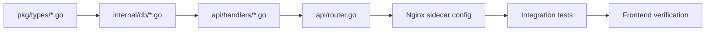

# 📋 Slice Master Index — Go API Migration

**Total: 21 slices covering ~300+ Next.js API routes → Go**

---

## 🗺️ Slice Overview

| # | Slice | Route Groups | Endpoints | Tasks | Priority |
|---|-------|-------------|-----------|-------|----------|
| 01 | [Providers](SLICE_01_PROVIDERS.md) | `/api/providers/*`, `/api/provider-models`, `/api/provider-metrics`, `/api/provider-nodes` | ~40 | 7+40 | 🔴 P0 |
| 02 | [Combos](SLICE_02_COMBOS.md) | `/api/combos/*` | ~15 | 10+83 | 🔴 P0 |
| 03 | [API Keys](SLICE_03_API_KEYS.md) | `/api/keys/*`, `/api/keys/groups/*` | ~15 | 10+80 | 🔴 P0 |
| 04 | [Usage & Quota](SLICE_04_USAGE.md) | `/api/usage/*`, `/api/quota/*`, `/api/costs`, `/api/usage/analytics` | ~25 | 10+76 | 🔴 P0 |
| 05 | [Models](SLICE_05_MODELS.md) | `/api/models/*`, `/api/model-combo-mappings/*`, `/api/synced-available-models` | ~15 | 10+62 | 🔴 P0 |
| 06 | [Cache](SLICE_06_CACHE.md) | `/api/cache/*`, `/api/cache/entries`, `/api/cache/reasoning` | ~10 | 9+49 | 🟡 P1 |
| 07 | [Health & Logs](SLICE_07_HEALTH.md) | `/api/health/*`, `/api/logs/*`, `/api/audit`, `/api/monitoring` | ~15 | 10+60 | 🟡 P1 |
| 08 | [Compression](SLICE_08_COMPRESSION.md) | `/api/compression/*`, `/api/context/*` | ~20 | 9+37 | 🟡 P1 |
| 09 | [Auto-Combo & MCP](SLICE_09_AUTOCOMBO_MCP.md) | `/api/auto-combo/*`, `/api/mcp/*`, `/api/mcp/sse`, `/api/mcp/stream` | ~15 | 9+55 | 🟡 P1 |
| 10 | [Settings](SLICE_10_SETTINGS.md) | `/api/settings/*` (system, DB, Qdrant, feature flags) | ~40 | 11+72 | 🟡 P1 |
| 11 | [OAuth & CLI Auth](SLICE_11_OAUTH_CLI_AUTH.md) | `/api/oauth/*`, `/api/providers/*/claude-auth/*`, `/api/cloud/auth` | ~25 | 5+ | 🟠 P2 |
| 12 | [CLI Tools](SLICE_12_CLI_TOOLS.md) | `/api/cli-tools/*`, `/api/cli/*` | ~35 | 4+ | 🟠 P2 |
| 13 | [Proxy & Network](SLICE_13_PROXY_NETWORK.md) | `/api/settings/proxies/*`, `/api/tunnels/*`, `/api/network/*` | ~30 | 4+ | 🟠 P2 |
| 14 | [Batches & Files](SLICE_14_BATCHES_FILES_STORAGE.md) | `/api/batches/*`, `/api/files/*`, `/api/storage/*` | ~12 | 4+ | 🟠 P2 |
| 15 | [Skills & Plugins](SLICE_15_SKILLS_PLUGINS.md) | `/api/skills/*`, `/api/plugins/*`, `/api/agent-skills/*` | ~20 | 4+ | 🟠 P2 |
| 16 | [Memory & Gamification](SLICE_16_MEMORY_GAMIFICATION.md) | `/api/memory/*`, `/api/gamification/*`, `/api/evals/*` | ~30 | 4+ | 🟠 P2 |
| 17 | [Webhooks & Compliance](SLICE_17_WEBOOKS_COMPLIANCE.md) | `/api/webhooks/*`, `/api/compliance/*`, `/api/guardrails/*` | ~15 | 4+ | 🟢 P3 |
| 18 | [DevOps & Infra](SLICE_18_DEVOPS_INFRA.md) | `/api/version-manager/*`, `/api/db-backups/*`, `/api/sync/*`, `/api/system/*` | ~25 | 4+ | 🟢 P3 |
| 19 | [A2A, ACP & Agents](SLICE_19_A2A_ACP_PROTOCOLS.md) | `/api/a2a/*`, `/api/acp/*`, `/api/v1/agents/*` | ~15 | 4+ | 🟢 P3 |
| 20 | [Agent Bridge & Traffic](SLICE_20_AGENT_BRIDGE_TOOLS.md) | `/api/tools/agent-bridge/*`, `/api/tools/traffic-inspector/*` | ~35 | 4+ | 🟢 P3 |
| 21 | [Analytics & Misc](SLICE_21_ANALYTICS_TRANSLATOR.md) | `/api/analytics/*`, `/api/translator/*`, `/api/pricing/*`, `/api/auth/*` | ~35 | 4+ | 🟢 P3 |

---

## 📊 Resource Summary

| Metric | Count |
|--------|-------|
| **Total slices** | 21 |
| **P0 (critical) slices** | 5 (Slices 01-05) |
| **P1 (high) slices** | 5 (Slices 06-10) |
| **P2 (medium) slices** | 5 (Slices 11-15) |
| **P3 (low) slices** | 6 (Slices 16-21) |
| **Estimated Go files** | ~200+ (`pkg/types/*.go` + `internal/db/*.go` + `api/handlers/*.go`) |
| **Estimated route handlers** | ~300+ |
| **Estimated SQL queries** | ~500+ |

---

## 🔄 Execution Plan

### Phase 1: P0 (Critical Path) — Weeks 1-4
| Week | Slice(s) | Key Deliverables |
|------|----------|-----------------|
| 1 | 01 (Providers) | Provider CRUD, health matrix, model sync |
| 2 | 02 (Combos) | Combo CRUD, strategies, routing logic |
| 3 | 03 (API Keys) | Key CRUD, groups, auth, scopes |
| 4 | 04-05 (Usage + Models) | Usage tracking, model catalog, mappings |

### Phase 2: P1 (High Priority) — Weeks 5-8
| Week | Slice(s) | Key Deliverables |
|------|----------|-----------------|
| 5 | 06-07 (Cache + Health) | Cache stats, health endpoints, audit logs |
| 6 | 08 (Compression) | Compression config, combos, engines |
| 7 | 09 (Auto-Combo MCP) | Auto-combo scoring, MCP server routes |
| 8 | 10 (Settings) | System settings, DB config, Qdrant, proxies |

### Phase 3: P2 (Medium Priority) — Weeks 9-12
| Week | Slice(s) | Key Deliverables |
|------|----------|-----------------|
| 9 | 11-12 (OAuth + CLI Tools) | OAuth flows, import/export, tool settings |
| 10 | 13 (Proxy & Tunnels) | Proxy assignments, Cloudflare/ngrok tunnels |
| 11 | 14-15 (Batches + Skills) | Batch processing, skill CRUD, plugin marketplace |
| 12 | Edge cleanup, integration testing | |

### Phase 4: P3 (Lower Priority) — Weeks 13-16
| Week | Slice(s) | Key Deliverables |
|------|----------|-----------------|
| 13 | 16 (Memory + Gamification) | Memory search, badges, leaderboards |
| 14 | 17-18 (Webhooks + DevOps) | Webhook delivery, DB backups, version manager |
| 15 | 19-20 (Protocols + Bridge) | A2A/ACP tasks, agent bridge, traffic inspector |
| 16 | 21 (Analytics + Misc) | Analytics reports, translator, pricing, auth |

---

## 🛠️ Common Boilerplate Per Slice

Each slice follows the same patterns:



### 1. Types (`pkg/types/*.go`)
- Go structs with `json:` tags matching TS snake_case
- Zod-equivalent validation via `validate` methods

### 2. Repository (`internal/db/*.go`)
- Full CRUD with SQL queries
- Sensitive field encryption where needed
- `go test` for each repo

### 3. Handlers (`api/handlers/*.go`)
- One HTTP handler per route
- Body validation → repo → JSON response
- Auth middleware applied

### 4. Router (`api/router.go`)
- Register all routes with method + path + handler
- Group by slice prefix

### 5. Sidecar (Nginx)
```nginx
location /api/XXX/ {
    proxy_pass http://go-backend:8080;
}
```

### 6. Frontend Verification
- Open dashboard pages, confirm data loads
- Test Create/Read/Update/Delete flows

---

## 📁 Directory Structure (Target)

```
omniroute-go/
├── pkg/types/
│   ├── provider.go
│   ├── combo.go
│   ├── apikey.go
│   ├── model.go
│   ├── usage.go
│   ├── cache.go
│   ├── health.go
│   ├── compression.go
│   ├── autocombo.go
│   ├── mcp.go
│   ├── settings.go
│   ├── oauth.go
│   ├── cli_tools.go
│   ├── proxy.go
│   ├── tunnel.go
│   ├── batch.go
│   ├── file.go
│   ├── skill.go
│   ├── plugin.go
│   ├── memory.go
│   ├── gamification.go
│   ├── eval.go
│   ├── webhook.go
│   ├── compliance.go
│   ├── guardrail.go
│   ├── devops.go
│   ├── sync.go
│   ├── a2a.go
│   ├── agent_bridge.go
│   ├── traffic.go
│   ├── analytics.go
│   └── misc.go
├── internal/db/
│   ├── provider.go
│   ├── combo.go
│   ├── apikey.go
│   ├── ... (per slice)
│   └── db.go (connection pool)
├── api/
│   ├── router.go
│   ├── middleware/
│   │   ├── auth.go
│   │   ├── cors.go
│   │   └── logging.go
│   └── handlers/
│       ├── provider.go
│       ├── combo.go
│       ├── ... (per slice)
│       └── misc.go
├── cmd/server/main.go
├── go.mod
└── go.sum
```

---

## 🎯 How to Use These Slices

1. **Pick a slice** from the priority order
2. **Open the slice README** (`SLICE_XX_*.md`) for detailed tasks
3. **Follow the task list** in order: Types → Repo → Handlers → Router → Sidecar → Tests → Frontend
4. **Check off tasks** as completed
5. **Move to next slice** when all tasks are done

> **Tip**: Start with **Slice 01 (Providers)** — it's the foundation. Everything depends on providers.