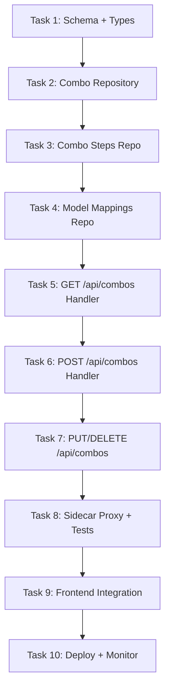

# 🎯 Slice 2: Go Backend for Combo Routes (`/api/combos`)

**Goal**: Migrate combo management endpoints (CRUD + strategy config) from TypeScript to Go. The combo dashboard page (`/dashboard/combos`) displays and manages routing combos.

**Why this endpoint next**: After providers, combos are the most-used management feature. They control routing strategy (priority, weighted, round-robin, auto, etc.) and involve 3 tables: `combos`, `combo_steps`, `model_combo_mappings`.

---

## 📋 TASK LIST



---

## ✅ TASK 1: Schema + Shared Types

**What**: Define Go structs matching the `combos`, `combo_steps`, and `model_combo_mappings` tables.

**Files to create**: `pkg/types/combo.go`

```go
// pkg/types/combo.go
package types

type Combo struct {
    ID              string `json:"id"`
    Name            string `json:"name"`
    Strategy        string `json:"strategy"`          // priority, weighted, round-robin, auto, etc.
    ModelID         string `json:"model_id"`
    ProviderID      string `json:"provider_id"`
    FallbackModelID string `json:"fallback_model_id,omitempty"`
    IsActive        bool   `json:"is_active"`
    Priority        int    `json:"priority"`
    Config          string `json:"config"`            // JSON string for strategy-specific config
    CreatedAt       string `json:"created_at"`
    UpdatedAt       string `json:"updated_at"`
}

type ComboStep struct {
    ID        string `json:"id"`
    ComboID   string `json:"combo_id"`
    StepOrder int    `json:"step_order"`
    ProviderID string `json:"provider_id"`
    ModelID   string `json:"model_id"`
    Weight    int    `json:"weight"`                  // for weighted strategies
    Condition string `json:"condition,omitempty"`     // optional condition JSON
    CreatedAt string `json:"created_at"`
}

type ModelComboMapping struct {
    ID        string `json:"id"`
    ComboID   string `json:"combo_id"`
    ModelID   string `json:"model_id"`
    ProviderID string `json:"provider_id"`
    IsActive  bool   `json:"is_active"`
    Priority  int    `json:"priority"`
}
```

| # | Step | Done |
|---|------|------|
| 1.1 | Create `pkg/types/combo.go` with Combo struct | ☐ |
| 1.2 | Add ComboStep struct | ☐ |
| 1.3 | Add ModelComboMapping struct | ☐ |
| 1.4 | Add `ComboListResponse` and `ComboDetailResponse` | ☐ |
| 1.5 | Add JSON field tags matching TS snake_case | ☐ |
| 1.6 | Run `go build` to verify types compile | ☐ |

---

## ✅ TASK 2: Combo Repository

**What**: CRUD operations on the `combos` table.

**Files to create**: `internal/db/combos.go`, `internal/db/combos_test.go`

```go
type ComboRepository struct { db *sql.DB }
func (r *ComboRepository) ListAll() ([]types.Combo, error)
func (r *ComboRepository) GetByID(id string) (*types.Combo, error)
func (r *ComboRepository) Create(p *types.Combo) error
func (r *ComboRepository) Update(p *types.Combo) error
func (r *ComboRepository) Delete(id string) error
func (r *ComboRepository) ListByStrategy(strategy string) ([]types.Combo, error)
```

| # | Step | Done |
|---|------|------|
| 2.1 | Implement `ListAll()` → `SELECT * FROM combos ORDER BY priority, name` | ☐ |
| 2.2 | Implement `GetByID(id)` → `SELECT * WHERE id = ?` | ☐ |
| 2.3 | Implement `Create(p)` → `INSERT INTO combos ...` | ☐ |
| 2.4 | Implement `Update(p)` → `UPDATE combos SET ... WHERE id = ?` | ☐ |
| 2.5 | Implement `Delete(id)` → `DELETE FROM combos WHERE id = ?` | ☐ |
| 2.6 | Implement `ListByStrategy(strategy)` → filter by strategy type | ☐ |
| 2.7 | Write unit test: ListAll with 3 seeded combos | ☐ |
| 2.8 | Write unit test: Create + GetByID round-trip | ☐ |
| 2.9 | Write unit test: Update changes strategy field | ☐ |
| 2.10 | `go test ./internal/db/ -run Combo` → passes | ☐ |

---

## ✅ TASK 3: Combo Steps Repository

**What**: CRUD operations on `combo_steps` (the ordered steps in each combo).

**Files to create**: `internal/db/combo_steps.go`, `internal/db/combo_steps_test.go`

```go
type ComboStepRepository struct { db *sql.DB }
func (r *ComboStepRepository) ListByComboID(comboID string) ([]types.ComboStep, error)
func (r *ComboStepRepository) Create(step *types.ComboStep) error
func (r *ComboStepRepository) UpdateOrder(comboID string, steps []types.ComboStep) error
func (r *ComboStepRepository) Delete(id string) error
```

| # | Step | Done |
|---|------|------|
| 3.1 | Implement `ListByComboID(id)` → `SELECT * FROM combo_steps WHERE combo_id = ? ORDER BY step_order` | ☐ |
| 3.2 | Implement `Create(step)` → `INSERT INTO combo_steps ...` | ☐ |
| 3.3 | Implement `UpdateOrder(comboID, steps)` → batch UPDATE or DELETE+INSERT | ☐ |
| 3.4 | Implement `Delete(id)` → `DELETE FROM combo_steps WHERE id = ?` | ☐ |
| 3.5 | Handle cascade: deleting a combo deletes its steps | ☐ |
| 3.6 | Write test: ListByComboID returns steps in order | ☐ |
| 3.7 | Write test: Create step and verify order | ☐ |
| 3.8 | `go test ./internal/db/ -run Step` → passes | ☐ |

---

## ✅ TASK 4: Model Combo Mappings Repository

**What**: CRUD on `model_combo_mappings` table.

**Files to create**: `internal/db/model_mappings.go`, `internal/db/model_mappings_test.go`

```go
type ModelMappingRepository struct { db *sql.DB }
func (r *ModelMappingRepository) ListByComboID(comboID string) ([]types.ModelComboMapping, error)
func (r *ModelMappingRepository) Create(mapping *types.ModelComboMapping) error
func (r *ModelMappingRepository) Delete(id string) error
func (r *ModelMappingRepository) SetActive(id string, active bool) error
```

| # | Step | Done |
|---|------|------|
| 4.1 | Implement `ListByComboID(id)` | ☐ |
| 4.2 | Implement `Create(mapping)` | ☐ |
| 4.3 | Implement `Delete(id)` | ☐ |
| 4.4 | Implement `SetActive(id, active)` toggle | ☐ |
| 4.5 | Write test: full CRUD cycle | ☐ |
| 4.6 | `go test ./internal/db/ -run Mapping` → passes | ☐ |

---

## ✅ TASK 5: GET /api/combos Handler

**What**: List all combos with their steps and mapping counts.

**Files to create**: `api/handlers/combos.go`

```go
// GET /api/combos — list all combos
// GET /api/combos?strategy=priority — filter by strategy
// GET /api/combos/:id — get single combo with steps + mappings
```

| # | Step | Done |
|---|------|------|
| 5.1 | Create `api/handlers/combos.go` | ☐ |
| 5.2 | `ListCombos` handler: call `repo.ListAll()` | ☐ |
| 5.3 | Support `?strategy=` query param filter | ☐ |
| 5.4 | Support `?page=1&per_page=20` pagination | ☐ |
| 5.5 | Include step count and mapping count in list response | ☐ |
| 5.6 | Create `GetCombo` handler for `GET /api/combos/:id` | ☐ |
| 5.7 | Include full steps + mappings in detail response | ☐ |
| 5.8 | Wire routes in `cmd/omniroute/main.go` | ☐ |
| 5.9 | `curl localhost:8080/api/combos` → returns data | ☐ |
| 5.10 | `curl localhost:8080/api/combos/abc-123` → detail with steps | ☐ |

**Verification**: GET response matches TS endpoint format (field names, pagination shape).

---

## ✅ TASK 6: POST /api/combos Handler

**What**: Create a new combo with validation.

| # | Step | Done |
|---|------|------|
| 6.1 | Parse JSON body into `types.Combo` | ☐ |
| 6.2 | Validate: strategy is one of `ROUTING_STRATEGY_VALUES` | ☐ |
| 6.3 | Validate: name is non-empty | ☐ |
| 6.4 | Validate: at least one step is provided | ☐ |
| 6.5 | Generate UUID for new combo ID | ☐ |
| 6.6 | Insert combo + steps in a transaction | ☐ |
| 6.7 | Return `201` with created combo | ☐ |
| 6.8 | Return `400` with validation errors on bad input | ☐ |
| 6.9 | `curl -X POST -d '{...}' localhost:8080/api/combos` → 201 | ☐ |
| 6.10 | Test: duplicate name returns 409 | ☐ |

---

## ✅ TASK 7: PUT + DELETE /api/combos Handlers

**What**: Update and delete combos.

| # | Step | Done |
|---|------|------|
| 7.1 | `PUT /api/combos/:id` → update combo fields | ☐ |
| 7.2 | Support partial update (PATCH-like via PUT with existing fields) | ☐ |
| 7.3 | Update steps if provided in same request | ☐ |
| 7.4 | `DELETE /api/combos/:id` → delete combo + cascade steps + mappings | ☐ |
| 7.5 | `PUT /api/combos/:id/reorder` → reorder combo steps | ☐ |
| 7.6 | Return `404` if combo not found | ☐ |
| 7.7 | `curl -X PUT ...` → returns updated combo | ☐ |
| 7.8 | `curl -X DELETE ...` → returns 204 | ☐ |
| 7.9 | Test: delete non-existent returns 404 | ☐ |
| 7.10 | Test: update with invalid strategy returns 400 | ☐ |

---

## ✅ TASK 8: Sidecar Proxy + Integration Tests

**What**: Route combo endpoints to Go. Full test suite.

| # | Step | Done |
|---|------|------|
| 8.1 | Update nginx.conf: add `/api/combos` location → Go | ☐ |
| 8.2 | Update `next.config.mjs` rewrite: add `/api/combos` → Go | ☐ |
| 8.3 | Test: `curl localhost:80/api/combos` → Go response | ☐ |
| 8.4 | Test: `curl localhost:80/api/providers` → still Go | ☐ |
| 8.5 | Test: `curl localhost:80/api/keys` → still TS (not migrated yet) | ☐ |
| 8.6 | Integration test: create combo via Go → list via Go → verify | ☐ |
| 8.7 | Integration test: create combo → read via Go → matches | ☐ |
| 8.8 | Integration test: delete combo → steps also deleted | ☐ |
| 8.9 | Test: auth middleware works on all combo routes | ☐ |
| 8.10 | `go test ./...` → all tests pass | ☐ |

---

## ✅ TASK 9: Frontend Integration

**What**: Verify combo dashboard page (`/dashboard/combos`) works with Go.

| # | Step | Done |
|---|------|------|
| 9.1 | Start Go, Next.js, nginx | ☐ |
| 9.2 | Open `http://localhost:3000/dashboard/combos` | ☐ |
| 9.3 | Verify: combo list displays correctly | ☐ |
| 9.4 | Verify: strategy filter works | ☐ |
| 9.5 | Verify: create new combo via UI | ☐ |
| 9.6 | Verify: edit combo (name, strategy, steps) | ☐ |
| 9.7 | Verify: reorder steps by drag-and-drop | ☐ |
| 9.8 | Verify: delete combo | ☐ |
| 9.9 | Verify: live studio page (`/dashboard/combos/live`) works | ☐ |
| 9.10 | Verify: playground page (`/dashboard/combos/playground`) works | ☐ |

---

## ✅ TASK 10: Deploy + Monitor

**What**: Deploy combo endpoints, measure, document.

| # | Step | Done |
|---|------|------|
| 10.1 | `docker-compose up` → all services start | ☐ |
| 10.2 | `curl localhost/api/combos` → Go response | ☐ |
| 10.3 | `curl localhost/dashboard/combos` → HTML | ☐ |
| 10.4 | Measure: latency < 15ms P95 | ☐ |
| 10.5 | Monitor: error rate < 0.1% | ☐ |
| 10.6 | Document combo API format | ☐ |
| 10.7 | Document rollback: remove `/api/combos` from nginx → TS fallback | ☐ |
| 10.8 | Update main migration status README | ☐ |

---

## 🚀 QUICK START

```bash
# Terminal 1: Go
cd omniroute-go && go run .

# Terminal 2: Next.js
npm run dev

# Test
curl localhost:8080/api/combos
curl localhost:8080/api/combos?strategy=priority
curl -X POST localhost:8080/api/combos \
  -H 'Content-Type: application/json' \
  -d '{"name":"My Combo","strategy":"priority","steps":[{"provider_id":"p1","model_id":"m1","step_order":1}]}'

# Browser
open http://localhost:3000/dashboard/combos
```

---

## 📊 COMPARISON: TS vs Go

| Aspect | TypeScript (current) | Go (new) |
|--------|---------------------|----------|
| Route | `src/app/api/combos/route.ts` | `api/handlers/combos.go` |
| DB | `src/lib/db/combos.ts` | `internal/db/combos.go` |
| Frontend | `/dashboard/combos/page.tsx` | No change (same API format) |
| Tables | `combos`, `combo_steps`, `model_combo_mappings` | Same (shared SQLite) |