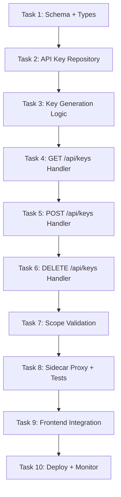
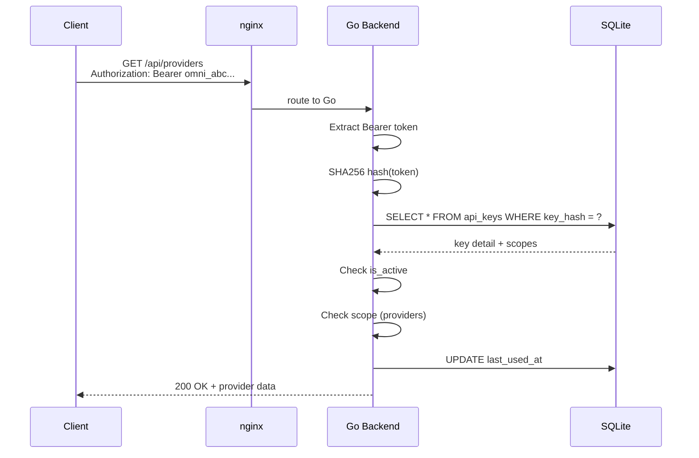

# 🎯 Slice 3: Go Backend for API Key Routes (`/api/keys`)

**Goal**: Migrate API key management (CRUD + auth validation) from TypeScript to Go. This proves the auth pipeline works end-to-end — keys created via Go are immediately usable for authentication.

**Why this endpoint next**: API keys are the authentication backbone. Both the providers page and combos page require API key auth to function. Having key management in Go unblocks auth for all future migrated endpoints. The `/dashboard/api-manager` page displays and manages keys.

---

## 📋 TASK LIST



---

## ✅ TASK 1: Schema + Shared Types

**What**: Define Go structs matching the `api_keys` table and key-related request/response types.

**Files to create**: `pkg/types/apikey.go`

```go
// pkg/types/apikey.go
package types

type APIKey struct {
    ID          string   `json:"id"`
    Name        string   `json:"name"`
    KeyPrefix   string   `json:"key_prefix"`    // first 8 chars for display (e.g., "omni_ab12...")
    KeyHash     string   `json:"-"`             // SHA256 hash — never returned in API responses
    Scopes      []string `json:"scopes"`        // ["chat", "models", "providers", "admin"]
    IsActive    bool     `json:"is_active"`
    LastUsedAt  string   `json:"last_used_at,omitempty"`
    ExpiresAt   string   `json:"expires_at,omitempty"`
    CreatedAt   string   `json:"created_at"`
    UpdatedAt   string   `json:"updated_at"`
}

type CreateKeyRequest struct {
    Name    string   `json:"name" validate:"required"`
    Scopes  []string `json:"scopes" validate:"required,min=1"`
}

type CreateKeyResponse struct {
    Key         string  `json:"key"`          // The raw key — only shown once at creation
    KeyDetail   APIKey  `json:"key_detail"`
}

type KeyListResponse struct {
    Keys  []APIKey `json:"keys"`
    Total int      `json:"total"`
}
```

| # | Step | Done |
|---|------|------|
| 1.1 | Create `pkg/types/apikey.go` with APIKey struct | ☐ |
| 1.2 | Add CreateKeyRequest/CreateKeyResponse structs | ☐ |
| 1.3 | Add KeyListResponse struct | ☐ |
| 1.4 | Add Scope constants: ScopeChat, ScopeModels, ScopeProviders, ScopeAdmin | ☐ |
| 1.5 | Add ValidScopes() function to validate scope names | ☐ |
| 1.6 | Run `go build` to verify types compile | ☐ |

---

## ✅ TASK 2: API Key Repository

**What**: CRUD operations on the `api_keys` table. Hash comparison for auth.

**Files to create**: `internal/db/apikeys.go`, `internal/db/apikeys_test.go`

```go
type APIKeyRepository struct { db *sql.DB }

func (r *APIKeyRepository) ListAll() ([]types.APIKey, error)
func (r *APIKeyRepository) GetByID(id string) (*types.APIKey, error)
func (r *APIKeyRepository) Create(key *types.APIKey) error
func (r *APIKeyRepository) Delete(id string) error
func (r *APIKeyRepository) ValidateKey(rawKey string) (*types.APIKey, error)
func (r *APIKeyRepository) UpdateLastUsed(id string) error
func (r *APIKeyRepository) GetByHash(hash string) (*types.APIKey, error)
```

| # | Step | Done |
|---|------|------|
| 2.1 | Implement `ListAll()` → `SELECT * FROM api_keys ORDER BY created_at DESC` | ☐ |
| 2.2 | Implement `GetByID(id)` → `SELECT * WHERE id = ?` | ☐ |
| 2.3 | Implement `Create(key)` → `INSERT INTO api_keys ...` | ☐ |
| 2.4 | Implement `Delete(id)` → `DELETE FROM api_keys WHERE id = ?` (soft: SET is_active = 0) | ☐ |
| 2.5 | Implement `GetByHash(hash)` → `SELECT * WHERE key_hash = ?` | ☐ |
| 2.6 | Implement `ValidateKey(rawKey)` → SHA256 hash → GetByHash → check is_active | ☐ |
| 2.7 | Implement `UpdateLastUsed(id)` → `UPDATE SET last_used_at = NOW() WHERE id = ?` | ☐ |
| 2.8 | Write test: Create + validate round-trip | ☐ |
| 2.9 | Write test: invalid key returns error | ☐ |
| 2.10 | `go test ./internal/db/ -run APIKey` → passes | ☐ |

---

## ✅ TASK 3: Key Generation Logic

**What**: Generate cryptographically-secure API keys with prefix.

**Files to create**: `internal/service/keygen.go`

```go
// internal/service/keygen.go
package service

const KeyPrefix = "omni_"

func GenerateAPIKey() (rawKey string, hash string, prefix string, error)
```

**Key format**: `omni_<random-32-hex-chars>` (e.g., `omni_a1b2c3d4e5f6...`)

| # | Step | Done |
|---|------|------|
| 3.1 | Use `crypto/rand` to generate 32 random bytes | ☐ |
| 3.2 | Hex-encode bytes → 64-char hex string | ☐ |
| 3.3 | Prepend `omni_` prefix | ☐ |
| 3.4 | SHA256 hash the raw key (matches TS `crypto.createHash('sha256')`) | ☐ |
| 3.5 | Extract first 8 chars after prefix as `key_prefix` for display | ☐ |
| 3.6 | Write test: generated key format matches `^omni_[a-f0-9]{64}$` | ☐ |
| 3.7 | Write test: hash is deterministic (same key → same hash) | ☐ |
| 3.8 | Write test: different keys → different hashes | ☐ |
| 3.9 | Write test: key_prefix is first 8 chars of hex portion | ☐ |
| 3.10 | `go test ./internal/service/ -run KeyGen` → passes | ☐ |

---

## ✅ TASK 4: GET /api/keys Handler

**What**: List all API keys (without exposing the raw keys).

**Files to create**: `api/handlers/keys.go`

```go
// GET /api/keys — list all active keys
// GET /api/keys?show_disabled=true — include disabled keys
// GET /api/keys/:id — get single key detail
```

| # | Step | Done |
|---|------|------|
| 4.1 | Create `api/handlers/keys.go` | ☐ |
| 4.2 | `ListKeys` handler: call `repo.ListAll()` | ☐ |
| 4.3 | Support `?show_disabled=true` query param to include inactive | ☐ |
| 4.4 | Never return `key_hash` in JSON response (use `json:"-"`) | ☐ |
| 4.5 | Create `GetKey` handler for `GET /api/keys/:id` | ☐ |
| 4.6 | Wire routes in `cmd/omniroute/main.go` | ☐ |
| 4.7 | `curl localhost:8080/api/keys` → returns key list (no hashes) | ☐ |
| 4.8 | `curl localhost:8080/api/keys/some-id` → single key | ☐ |
| 4.9 | Verify: `key_hash` is NOT present in response JSON | ☐ |
| 4.10 | Verify: `key_prefix` shows first 8 chars only | ☐ |

---

## ✅ TASK 5: POST /api/keys Handler

**What**: Create a new API key. Return the raw key only once.

| # | Step | Done |
|---|------|------|
| 5.1 | Parse JSON body into `CreateKeyRequest` | ☐ |
| 5.2 | Validate: name is 3-100 chars | ☐ |
| 5.3 | Validate: at least one scope is selected | ☐ |
| 5.4 | Validate: all scopes are valid (chat, models, providers, admin) | ☐ |
| 5.5 | Generate new key via `keygen.GenerateAPIKey()` | ☐ |
| 5.6 | Store key hash (never raw key) in SQLite | ☐ |
| 5.7 | Return `201` with `CreateKeyResponse` containing the raw key | ☐ |
| 5.8 | Return `400` with validation errors on bad input | ☐ |
| 5.9 | `curl -X POST -d '{"name":"Dev Key","scopes":["chat","models"]}'` → returns raw key | ☐ |
| 5.10 | Verify: calling GET after CREATE does NOT include raw key | ☐ |

**⚠️ Critical**: The raw key is shown **only once** at creation time. Store the hash, discard the raw key.

---

## ✅ TASK 6: DELETE /api/keys Handler

**What**: Soft-delete (deactivate) API keys.

| # | Step | Done |
|---|------|------|
| 6.1 | `DELETE /api/keys/:id` → set `is_active = 0` | ☐ |
| 6.2 | Actually DELETE from table (hard delete) per TS behavior | ☐ |
| 6.3 | Return `204 No Content` on success | ☐ |
| 6.4 | Return `404` if key not found | ☐ |
| 6.5 | Return `403` if trying to delete the last admin key | ☐ |
| 6.6 | `curl -X DELETE localhost:8080/api/keys/abc-123` → 204 | ☐ |
| 6.7 | Test: deleted key cannot validate | ☐ |
| 6.8 | Test: delete non-existent key → 404 | ☐ |

---

## ✅ TASK 7: Scope Validation

**What**: Integrate key scopes with auth middleware so endpoints can require specific scopes.

**Files to modify**: `api/middleware/auth.go`

```go
// RequireScope(scope string) gin.HandlerFunc
// Returns middleware that checks if the API key has the required scope
```

| # | Step | Done |
|---|------|------|
| 7.1 | Add `RequireScope(scope string)` middleware function | ☐ |
| 7.2 | Parse scopes from DB result (stored as JSON array) | ☐ |
| 7.3 | Check if required scope is in key's scopes list | ☐ |
| 7.4 | Return `403` if scope missing | ☐ |
| 7.5 | Add scope requirement to combo routes: `api.Use(middleware.RequireScope("combos"))` | ☐ |
| 7.6 | Add scope requirement to key routes: only admin can manage keys | ☐ |
| 7.7 | Test: key without `admin` scope gets 403 on key management | ☐ |
| 7.8 | Test: key with `admin` scope succeeds | ☐ |
| 7.9 | Test: anonymous request (no auth header) can still read public endpoints | ☐ |
| 7.10 | `go test ./api/middleware/` → passes | ☐ |

---

## ✅ TASK 8: Sidecar Proxy + Integration Tests

**What**: Route key endpoints to Go. Full test suite.

| # | Step | Done |
|---|------|------|
| 8.1 | Update nginx.conf: add `/api/keys` location → Go | ☐ |
| 8.2 | Update `next.config.mjs` rewrite: add `/api/keys` → Go | ☐ |
| 8.3 | Test: `curl localhost:80/api/keys` → Go response | ☐ |
| 8.4 | Test: `curl localhost:80/api/providers` → still Go | ☐ |
| 8.5 | Test: `curl localhost:80/api/combos` → still Go | ☐ |
| 8.6 | Integration test: create key → use key to call providers → works | ☐ |
| 8.7 | Integration test: revoke key → use same key → 401 | ☐ |
| 8.8 | Test: `go test ./...` → all tests pass | ☐ |

---

## ✅ TASK 9: Frontend Integration

**What**: Verify API key dashboard page works with Go backend.

**Dashboard pages**: `/dashboard/api-manager`

| # | Step | Done |
|---|------|------|
| 9.1 | Start Go, Next.js, nginx | ☐ |
| 9.2 | Open `http://localhost:3000/dashboard/api-manager` | ☐ |
| 9.3 | Verify: key list displays correctly (prefix, name, scopes) | ☐ |
| 9.4 | Verify: create new key → shows raw key once | ☐ |
| 9.5 | Verify: copy key to clipboard works | ☐ |
| 9.6 | Verify: revoke (delete) key | ☐ |
| 9.7 | Verify: test key against an endpoint (e.g., providers) | ☐ |
| 9.8 | Verify: sorting by name/created_at works | ☐ |
| 9.9 | Verify: pagination works if many keys exist | ☐ |
| 9.10 | Verify: error state when Go is down | ☐ |

---

## ✅ TASK 10: Deploy + Monitor

**What**: Deploy key endpoints, measure, document.

| # | Step | Done |
|---|------|------|
| 10.1 | `docker-compose up` → all services start | ☐ |
| 10.2 | `curl localhost/api/keys` → Go response | ☐ |
| 10.3 | `curl localhost/dashboard/api-manager` → HTML | ☐ |
| 10.4 | Measure: key creation < 50ms | ☐ |
| 10.5 | Measure: key validation < 5ms (hot path) | ☐ |
| 10.6 | Document: auth pipeline flow (request → middleware → DB) | ☐ |
| 10.7 | Document: rollback: remove `/api/keys` from nginx | ☐ |
| 10.8 | Update main migration status README | ☐ |

---

## 🔐 AUTH FLOW (After Migration)



---

## 🚀 QUICK START

```bash
# Terminal 1: Go
cd omniroute-go && go run .

# Terminal 2: Next.js
npm run dev

# Test
curl localhost:8080/api/keys
curl -X POST localhost:8080/api/keys \
  -H 'Content-Type: application/json' \
  -d '{"name":"Dev Key","scopes":["chat","models","providers"]}'
# → {"key":"omni_a1b2c3d4...","key_detail":{"name":"Dev Key",...}}

# Use the key:
curl -H 'Authorization: Bearer omni_a1b2c3d4...' localhost:8080/api/providers

# Browser
open http://localhost:3000/dashboard/api-manager
```

---

## 📊 COMPARISON: TS vs Go

| Aspect | TypeScript (current) | Go (new) |
|--------|---------------------|----------|
| Route | `src/app/api/keys/route.ts` | `api/handlers/keys.go` |
| DB | `src/lib/db/apiKeys.ts` | `internal/db/apikeys.go` |
| Key Gen | `crypto.randomBytes` + `sha256` | `crypto/rand` + `sha256` |
| Frontend | `/dashboard/api-manager/page.tsx` | No change |
| Auth Middleware | `extractApiKey()` + `isValidApiKey()` | Auth middleware → RequireScope() |