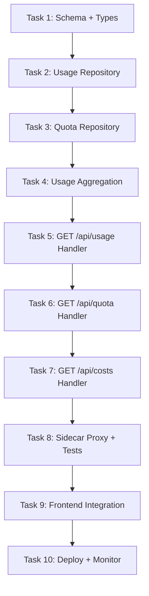
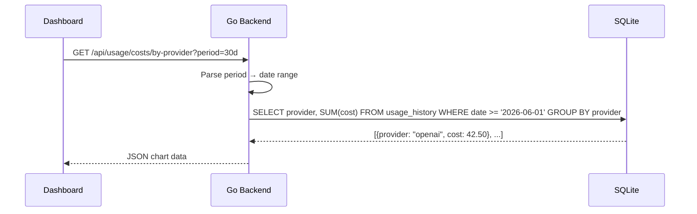

# 🎯 Slice 4: Go Backend for Usage & Quota Routes (`/api/usage`, `/api/quota`)

**Goal**: Migrate usage tracking and quota management from TypeScript to Go. The dashboard usage pages (`/dashboard/activity`, `/dashboard/costs`, `/dashboard/limits`) display token usage, cost breakdowns, and quota status.

**Why this endpoint next**: Usage data comes from the chat completions pipeline. With providers, combos, and keys already in Go, migrating usage means all the "read" side of the system is complete. The dashboard analytics, costs, and activity pages depend on these endpoints.

**Tables involved**: `usage_history`, `usage_daily`, `quota_snapshots`, `credit_balance`, `compression_cache_stats`

---

## 📋 TASK LIST



---

## ✅ TASK 1: Schema + Shared Types

**What**: Define Go structs for usage records, daily aggregations, quotas, and credits.

**Files to create**: `pkg/types/usage.go`

```go
// pkg/types/usage.go
package types

type UsageRecord struct {
    ID           string  `json:"id"`
    RequestID    string  `json:"request_id"`
    ProviderID   string  `json:"provider_id"`
    ModelID      string  `json:"model_id"`
    ComboID      string  `json:"combo_id,omitempty"`
    PromptTokens int     `json:"prompt_tokens"`
    CompTokens   int     `json:"completion_tokens"`
    TotalTokens  int     `json:"total_tokens"`
    Cost         float64 `json:"cost"`
    LatencyMs    int     `json:"latency_ms"`
    Success      bool    `json:"success"`
    ErrorType    string  `json:"error_type,omitempty"`
    CreatedAt    string  `json:"created_at"`
}

type DailyUsage struct {
    Date         string  `json:"date"`
    TotalTokens  int     `json:"total_tokens"`
    TotalCost    float64 `json:"total_cost"`
    RequestCount int     `json:"request_count"`
    SuccessCount int     `json:"success_count"`
    ErrorCount   int     `json:"error_count"`
}

type UsageSummary struct {
    TotalTokens  int64   `json:"total_tokens"`
    TotalCost    float64 `json:"total_cost"`
    TotalRequests int64  `json:"total_requests"`
    ByProvider   map[string]*DailyUsage  `json:"by_provider,omitempty"`
    ByModel      map[string]*DailyUsage  `json:"by_model,omitempty"`
}

type QuotaSnapshot struct {
    ID             string  `json:"id"`
    ProviderID     string  `json:"provider_id"`
    MonthlyLimit   float64 `json:"monthly_limit"`
    CurrentSpend   float64 `json:"current_spend"`
    TokenLimit     int64   `json:"token_limit"`
    CurrentTokens  int64   `json:"current_tokens"`
    ResetAt        string  `json:"reset_at"`
}

type CreditBalance struct {
    ID        string  `json:"id"`
    Balance   float64 `json:"balance"`
    Lifetime  float64 `json:"lifetime_spend"`
    UpdatedAt string  `json:"updated_at"`
}
```

| # | Step | Done |
|---|------|------|
| 1.1 | Create `pkg/types/usage.go` | ☐ |
| 1.2 | Add UsageRecord, DailyUsage, UsageSummary structs | ☐ |
| 1.3 | Add QuotaSnapshot, CreditBalance structs | ☐ |
| 1.4 | Add response wrappers: UsageListResponse, UsageSummaryResponse | ☐ |
| 1.5 | Run `go build` to verify | ☐ |

---

## ✅ TASK 2: Usage Repository

**What**: CRUD + query operations on usage tables.

**Files to create**: `internal/db/usage.go`, `internal/db/usage_test.go`

```go
type UsageRepository struct { db *sql.DB }

func (r *UsageRepository) List(opts UsageQueryOpts) ([]types.UsageRecord, error)
func (r *UsageRepository) Create(record *types.UsageRecord) error
func (r *UsageRepository) GetSummary(start, end string) (*types.UsageSummary, error)
func (r *UsageRepository) GetByProvider(providerID, start, end string) (*types.DailyUsage, error)
func (r *UsageRepository) GetByModel(modelID, start, end string) (*types.DailyUsage, error)
func (r *UsageRepository) GetDailyBreakdown(start, end string) ([]types.DailyUsage, error)

type UsageQueryOpts struct {
    ProviderID string
    ModelID    string
    StartDate  string
    EndDate    string
    Limit      int
    Offset     int
    SortBy     string   // "date", "cost", "tokens"
    SortDir    string   // "asc", "desc"
}
```

| # | Step | Done |
|---|------|------|
| 2.1 | Implement `List(opts)` with dynamic WHERE + ORDER BY + LIMIT | ☐ |
| 2.2 | Implement `Create(record)` → `INSERT INTO usage_history ...` | ☐ |
| 2.3 | Implement `GetSummary(start, end)` → SUM, COUNT across date range | ☐ |
| 2.4 | Implement `GetByProvider(pid, start, end)` → aggregation by provider | ☐ |
| 2.5 | Implement `GetByModel(mid, start, end)` → aggregation by model | ☐ |
| 2.6 | Implement `GetDailyBreakdown(start, end)` → GROUP BY date | ☐ |
| 2.7 | Write test: Insert records, query by date range | ☐ |
| 2.8 | Write test: Summary totals match inserted data | ☐ |
| 2.9 | Write test: ByProvider filtering works | ☐ |
| 2.10 | `go test ./internal/db/ -run Usage` → passes | ☐ |

---

## ✅ TASK 3: Quota Repository

**What**: Read quota snapshots, credit balance.

**Files to create**: `internal/db/quota.go`, `internal/db/quota_test.go`

```go
type QuotaRepository struct { db *sql.DB }

func (r *QuotaRepository) GetQuota(providerID string) (*types.QuotaSnapshot, error)
func (r *QuotaRepository) ListAllQuotas() ([]types.QuotaSnapshot, error)
func (r *QuotaRepository) GetCreditBalance() (*types.CreditBalance, error)
```

| # | Step | Done |
|---|------|------|
| 3.1 | Implement `GetQuota(providerID)` → latest snapshot for provider | ☐ |
| 3.2 | Implement `ListAllQuotas()` → all provider quotas | ☐ |
| 3.3 | Implement `GetCreditBalance()` → current balance | ☐ |
| 3.4 | Write test: GetQuota returns correct provider | ☐ |
| 3.5 | `go test ./internal/db/ -run Quota` → passes | ☐ |

---

## ✅ TASK 4: Usage Aggregation Service

**What**: Service-level aggregation logic (caching, time bucketing).

**Files to create**: `internal/service/usage.go`

```go
func AggregateUsage(repo *db.UsageRepository, period string) (*types.UsageSummary, error)
// period: "24h", "7d", "30d", "1y"
```

| # | Step | Done |
|---|------|------|
| 4.1 | Implement `AggregateUsage(repo, "24h")` | ☐ |
| 4.2 | Implement `AggregateUsage(repo, "7d")` | ☐ |
| 4.3 | Implement `AggregateUsage(repo, "30d")` | ☐ |
| 4.4 | Implement `AggregateUsage(repo, "1y")` | ☐ |
| 4.5 | Add top-5 providers by cost to response | ☐ |
| 4.6 | Add top-5 models by cost to response | ☐ |
| 4.7 | Write test: aggregation matches manual calculation | ☐ |
| 4.8 | `go test ./internal/service/ -run Usage` → passes | ☐ |

---

## ✅ TASK 5: GET /api/usage Handler

**What**: Serve usage data to frontend dashboard.

**Files to create**: `api/handlers/usage.go`

```go
// GET /api/usage?period=24h — usage summary
// GET /api/usage/history?start=2026-06-01&end=2026-06-30 — detailed records
// GET /api/usage/daily?start=2026-06-01&end=2026-06-30 — daily breakdown
```

| # | Step | Done |
|---|------|------|
| 5.1 | `GetUsageSummary` handler: period param → aggregate | ☐ |
| 5.2 | `GetUsageHistory` handler: paginated list of records | ☐ |
| 5.3 | `GetDailyBreakdown` handler: daily chart data | ☐ |
| 5.4 | Support filter params: `?provider=`, `?model=` | ☐ |
| 5.5 | Support sort params: `?sort_by=cost&sort_dir=desc` | ☐ |
| 5.6 | Wire routes in `cmd/omniroute/main.go` | ☐ |
| 5.7 | `curl localhost:8080/api/usage?period=24h` → summary | ☐ |
| 5.8 | `curl localhost:8080/api/usage/history?limit=20` → records | ☐ |
| 5.9 | `curl localhost:8080/api/usage/daily?start=2026-06-01` → daily | ☐ |
| 5.10 | Verify: response format matches TS exactly | ☐ |

---

## ✅ TASK 6: GET /api/quota Handler

**What**: Serve quota and credit data.

| # | Step | Done |
|---|------|------|
| 6.1 | `ListQuotas` handler: `GET /api/quota` → all provider quotas | ☐ |
| 6.2 | `GetQuota` handler: `GET /api/quota/:providerId` → single | ☐ |
| 6.3 | `GetCreditBalance` handler: `GET /api/quota/credits` → balance | ☐ |
| 6.4 | Calculate: `remaining = limit - current` for each quota | ☐ |
| 6.5 | Calculate: `days_until_reset` from `reset_at` | ☐ |
| 6.6 | Wire routes | ☐ |
| 6.7 | `curl localhost:8080/api/quota` → quota list with remaining | ☐ |
| 6.8 | `curl localhost:8080/api/quota/credits` → balance | ☐ |

---

## ✅ TASK 7: GET /api/costs Handler

**What**: Cost breakdown by provider and model.

**Files to modify**: `api/handlers/usage.go` (add cost handlers)

```go
// GET /api/costs/by-provider — cost per provider
// GET /api/costs/by-model — cost per model
// GET /api/costs/trends — daily cost trend (line chart data)
```

| # | Step | Done |
|---|------|------|
| 7.1 | `CostByProvider` handler: aggregate by provider | ☐ |
| 7.2 | `CostByModel` handler: aggregate by model | ☐ |
| 7.3 | `CostTrends` handler: daily costs for line chart | ☐ |
| 7.4 | Support `?period=` (24h, 7d, 30d, 90d) | ☐ |
| 7.5 | Wire routes | ☐ |
| 7.6 | `curl localhost:8080/api/costs/by-provider?period=30d` → provider costs | ☐ |
| 7.7 | `curl localhost:8080/api/costs/trends?period=7d` → chart data | ☐ |
| 7.8 | Verify: cost amounts match TS calculations | ☐ |

---

## ✅ TASK 8: Sidecar Proxy + Integration Tests

**What**: Route usage/quota/costs endpoints to Go.

| # | Step | Done |
|---|------|------|
| 8.1 | Update nginx: add `/api/usage`, `/api/quota`, `/api/costs` → Go | ☐ |
| 8.2 | Integration test: insert usage record → query summary → verify | ☐ |
| 8.3 | Integration test: query by provider filter | ☐ |
| 8.4 | Integration test: query by date range | ☐ |
| 8.5 | Integration test: quota endpoint returns correct data | ☐ |
| 8.6 | Integration test: cost endpoint math matches | ☐ |
| 8.7 | `go test ./...` → passes | ☐ |

---

## ✅ TASK 9: Frontend Integration

**Dashboard pages**: `/dashboard/activity`, `/dashboard/costs`, `/dashboard/limits`

| # | Step | Done |
|---|------|------|
| 9.1 | Open `http://localhost:3000/dashboard/activity` | ☐ |
| 9.2 | Verify: request history table displays | ☐ |
| 9.3 | Open `http://localhost:3000/dashboard/costs` | ☐ |
| 9.4 | Verify: cost breakdown chart renders | ☐ |
| 9.5 | Verify: per-provider costs display | ☐ |
| 9.6 | Verify: per-model costs display | ☐ |
| 9.7 | Open `http://localhost:3000/dashboard/limits` | ☐ |
| 9.8 | Verify: quota progress bars display | ☐ |
| 9.9 | Verify: credit balance shows | ☐ |
| 9.10 | Verify: date range filters work | ☐ |

---

## ✅ TASK 10: Deploy + Monitor

| # | Step | Done |
|---|------|------|
| 10.1 | `docker-compose up` → all services start | ☐ |
| 10.2 | `curl localhost/api/usage?period=24h` → Go response | ☐ |
| 10.3 | `curl localhost/api/quota` → Go response | ☐ |
| 10.4 | `curl localhost/api/costs/by-provider` → Go response | ☐ |
| 10.5 | `curl localhost/dashboard/activity` → HTML | ☐ |
| 10.6 | Measure: usage query < 100ms (aggregation) | ☐ |
| 10.7 | Document rollback: remove routes from nginx | ☐ |
| 10.8 | Update main migration status | ☐ |

---

## 🗺️ ARCHITECTURE: Usage Flow



---

## 🚀 QUICK START

```bash
# Terminal 1: Go
cd omniroute-go && go run .

# Terminal 2: Next.js
npm run dev

# Test
curl localhost:8080/api/usage?period=24h
curl localhost:8080/api/usage/history?limit=10
curl localhost:8080/api/usage/daily?start=2026-06-01
curl localhost:8080/api/quota
curl localhost:8080/api/costs/by-provider

# Browser
open http://localhost:3000/dashboard/activity
open http://localhost:3000/dashboard/costs
open http://localhost:3000/dashboard/limits
```

---

## 📊 COMPARISON: TS vs Go

| Aspect | TypeScript (current) | Go (new) |
|--------|---------------------|----------|
| Routes | `src/app/api/usage/`, `quota/`, `costs/` | `api/handlers/usage.go` |
| DB | `src/lib/db/usage*.ts`, `quotaSnapshots.ts` | `internal/db/usage.go`, `internal/db/quota.go` |
| Frontend | `/dashboard/activity`, `/costs`, `/limits` | No change |
| Tables | `usage_history`, `quota_snapshots`, `credit_balance` | Same (shared SQLite) |