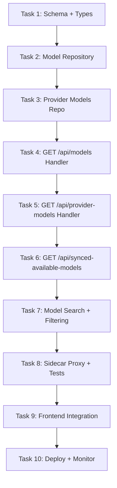

# 🎯 Slice 5: Go Backend for Model Routes (`/api/models`)

**Goal**: Migrate model catalog, provider models, and sync endpoints from TypeScript to Go. The dashboard model pages (`/dashboard/models`) display available models, provider-specific models, and sync status.

**Why this endpoint next**: Models are read-heavy, well-defined data — ideal for quick migration win. They depend on provider data (which is already migrated) and are consumed by combo configuration, chat routing, and the model picker UI.

**Tables involved**: `models`, `provider_models`, `synced_available_models`, `model_deprecation`

---

## 📋 TASK LIST



---

## ✅ TASK 1: Schema + Shared Types

**What**: Define Go structs for models, provider models, and synced models.

**Files to create**: `pkg/types/model.go`

```go
// pkg/types/model.go
package types

type Model struct {
    ID              string  `json:"id"`
    Name            string  `json:"name"`
    ProviderID      string  `json:"provider_id"`
    Capabilities    []string `json:"capabilities"`    // ["chat", "vision", "function_calling"]
    ContextWindow   int     `json:"context_window"`
    MaxOutputTokens int     `json:"max_output_tokens"`
    InputPrice      float64 `json:"input_price"`      // per 1M tokens
    OutputPrice     float64 `json:"output_price"`      // per 1M tokens
    Deprecated      bool    `json:"deprecated"`
    DeprecatedAt    string  `json:"deprecated_at,omitempty"`
    IsActive        bool    `json:"is_active"`
    CreatedAt       string  `json:"created_at"`
}

type ProviderModel struct {
    ID         string `json:"id"`
    ProviderID string `json:"provider_id"`
    ModelID    string `json:"model_id"`
    ModelName  string `json:"model_name"`       // provider's name for the model
    IsEnabled  bool   `json:"is_enabled"`
    Config     string `json:"config,omitempty"`  // provider-specific JSON config
}

type SyncedModel struct {
    ID         string `json:"id"`
    ProviderID string `json:"provider_id"`
    ModelID    string `json:"model_id"`
    LastSynced string `json:"last_synced"`
    IsActive   bool   `json:"is_active"`
}
```

| # | Step | Done |
|---|------|------|
| 1.1 | Create `pkg/types/model.go` with Model struct | ☐ |
| 1.2 | Add ProviderModel struct | ☐ |
| 1.3 | Add SyncedModel struct | ☐ |
| 1.4 | Add ModelListResponse with pagination | ☐ |
| 1.5 | Run `go build` to verify | ☐ |

---

## ✅ TASK 2: Model Repository

**What**: CRUD + query operations on the `models` table.

**Files to create**: `internal/db/models.go`, `internal/db/models_test.go`

```go
type ModelRepository struct { db *sql.DB }

func (r *ModelRepository) ListAll() ([]types.Model, error)
func (r *ModelRepository) GetByID(id string) (*types.Model, error)
func (r *ModelRepository) ListByProvider(providerID string) ([]types.Model, error)
func (r *ModelRepository) ListByCapability(capability string) ([]types.Model, error)
func (r *ModelRepository) Search(query string) ([]types.Model, error)
func (r *ModelRepository) GetActive() ([]types.Model, error)
func (r *ModelRepository) GetDeprecated() ([]types.Model, error)
```

| # | Step | Done |
|---|------|------|
| 2.1 | Implement `ListAll()` → `SELECT * FROM models ORDER BY provider_id, name` | ☐ |
| 2.2 | Implement `GetByID(id)` → single model | ☐ |
| 2.3 | Implement `ListByProvider(pid)` → filter by provider | ☐ |
| 2.4 | Implement `ListByCapability(cap)` → `WHERE capabilities LIKE '%cap%'` | ☐ |
| 2.5 | Implement `Search(query)` → `WHERE name LIKE '%query%' OR model_id LIKE '%query%'` | ☐ |
| 2.6 | Implement `GetActive()` / `GetDeprecated()` helpers | ☐ |
| 2.7 | Write test: ListAll returns models | ☐ |
| 2.8 | Write test: ListByProvider filtering | ☐ |
| 2.9 | Write test: Search by partial name | ☐ |
| 2.10 | `go test ./internal/db/ -run Model` → passes | ☐ |

---

## ✅ TASK 3: Provider Models Repository

**What**: CRUD on `provider_models` table.

**Files to create**: `internal/db/provider_models.go`, `internal/db/provider_models_test.go`

```go
type ProviderModelRepository struct { db *sql.DB }

func (r *ProviderModelRepository) ListByProvider(providerID string) ([]types.ProviderModel, error)
func (r *ProviderModelRepository) Enable(id string) error
func (r *ProviderModelRepository) Disable(id string) error
func (r *ProviderModelRepository) UpdateConfig(id string, config string) error
```

| # | Step | Done |
|---|------|------|
| 3.1 | Implement `ListByProvider(pid)` → join provider + model data | ☐ |
| 3.2 | Implement `Enable(id)` / `Disable(id)` toggle | ☐ |
| 3.3 | Implement `UpdateConfig(id, config)` | ☐ |
| 3.4 | Write test: enable/disable toggle | ☐ |
| 3.5 | `go test ./internal/db/ -run ProviderModel` → passes | ☐ |

---

## ✅ TASK 4: GET /api/models Handler

**What**: Serve model catalog to frontend and clients.

**Files to create**: `api/handlers/models.go`

```go
// GET /api/models — list all models
// GET /api/models?provider=openai — filter by provider
// GET /api/models?capability=vision — filter by capability
// GET /api/models?search=gpt — search by name/id
// GET /api/models/:id — get single model detail
```

| # | Step | Done |
|---|------|------|
| 4.1 | `ListModels` handler: support all query params | ☐ |
| 4.2 | Pagination: `?page=1&per_page=50` | ☐ |
| 4.3 | `GetModel` handler: `GET /api/models/:id` | ☐ |
| 4.4 | Include provider info (name, logo) in response | ☐ |
| 4.5 | Wire routes | ☐ |
| 4.6 | `curl localhost:8080/api/models` → model list | ☐ |
| 4.7 | `curl localhost:8080/api/models?provider=openai` → filtered | ☐ |
| 4.8 | `curl localhost:8080/api/models?search=claude` → search results | ☐ |
| 4.9 | `curl localhost:8080/api/models/gpt-4` → single model | ☐ |
| 4.10 | Verify: response format matches TS | ☐ |

---

## ✅ TASK 5: GET /api/provider-models Handler

**What**: Serve provider-specific model configurations.

```go
// GET /api/provider-models/:providerId — models for a specific provider
```

| # | Step | Done |
|---|------|------|
| 5.1 | `ListProviderModels` handler | ☐ |
| 5.2 | Include enabled/disabled status per model | ☐ |
| 5.3 | Wire route | ☐ |
| 5.4 | `curl localhost:8080/api/provider-models/openai` → provider models | ☐ |

---

## ✅ TASK 6: GET /api/synced-available-models Handler

**What**: Serve synced model data.

```go
// GET /api/synced-available-models — all synced models
// GET /api/synced-available-models/:providerId — by provider
```

| # | Step | Done |
|---|------|------|
| 6.1 | `ListSyncedModels` handler | ☐ |
| 6.2 | Include `last_synced` and freshness indicator | ☐ |
| 6.3 | Wire route | ☐ |
| 6.4 | `curl localhost:8080/api/synced-available-models` → synced list | ☐ |

---

## ✅ TASK 7: Model Search + Filtering Service

**What**: Service-level model search with capability intersection.

**Files to create**: `internal/service/models.go`

```go
func SearchModels(repo *db.ModelRepository, query string, capabilities []string) ([]types.Model, error)
func FindBestModel(repo *db.ModelRepository, requirements ModelRequirements) (*types.Model, error)

type ModelRequirements struct {
    MinContext    int
    Capabilities  []string
    MaxPrice      float64
    PreferredProvider string
}
```

| # | Step | Done |
|---|------|------|
| 7.1 | `SearchModels` with multi-capability intersection | ☐ |
| 7.2 | `FindBestModel` with constraints | ☐ |
| 7.3 | Write test: search with vision + function_calling | ☐ |
| 7.4 | `go test ./internal/service/ -run Model` → passes | ☐ |

---

## ✅ TASK 8: Sidecar Proxy + Integration Tests

| # | Step | Done |
|---|------|------|
| 8.1 | Update nginx: add `/api/models`, `/api/provider-models`, `/api/synced-available-models` → Go | ☐ |
| 8.2 | Integration test: query models returns correct count | ☐ |
| 8.3 | Integration test: filter by provider works | ☐ |
| 8.4 | Integration test: search by name works | ☐ |
| 8.5 | Integration test: single model detail | ☐ |
| 8.6 | `go test ./...` → passes | ☐ |

---

## ✅ TASK 9: Frontend Integration

**Dashboard pages**: `/dashboard/models`

| # | Step | Done |
|---|------|------|
| 9.1 | Open `http://localhost:3000/dashboard/models` | ☐ |
| 9.2 | Verify: all models display in catalog | ☐ |
| 9.3 | Verify: provider filter works | ☐ |
| 9.4 | Verify: capability filter works | ☐ |
| 9.5 | Verify: search by name works | ☐ |
| 9.6 | Verify: model detail page (`/dashboard/models/:id`) | ☐ |
| 9.7 | Verify: pagination works | ☐ |
| 9.8 | Verify: sorted by context window | ☐ |

---

## ✅ TASK 10: Deploy + Monitor

| # | Step | Done |
|---|------|------|
| 10.1 | `docker-compose up` → all start | ☐ |
| 10.2 | `curl localhost/api/models` → Go response | ☐ |
| 10.3 | `curl localhost/api/models?search=gpt` → filtered | ☐ |
| 10.4 | Measure: model list < 20ms P95 | ☐ |
| 10.5 | Document rollback | ☐ |
| 10.6 | Update migration status | ☐ |

---

## 🚀 QUICK START

```bash
# Terminal 1: Go
cd omniroute-go && go run .

# Terminal 2: Next.js
npm run dev

# Test
curl localhost:8080/api/models
curl localhost:8080/api/models?provider=openai
curl localhost:8080/api/models?search=claude
curl localhost:8080/api/models?capability=vision

# Browser
open http://localhost:3000/dashboard/models
```

---

## 📊 COMPARISON: TS vs Go

| Aspect | TypeScript (current) | Go (new) |
|--------|---------------------|----------|
| Routes | `src/app/api/models/`, `provider-models/`, `synced-available-models/` | `api/handlers/models.go` |
| DB | `src/lib/db/models.ts`, `providerModels.ts` | `internal/db/models.go` |
| Frontend | `/dashboard/models/` | No change |