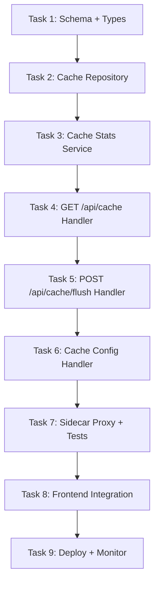

# 🎯 Slice 6: Go Backend for Cache Routes (`/api/cache`)

**Goal**: Migrate cache management (stats, flush, configuration) from TypeScript to Go. The dashboard cache page (`/dashboard/cache`) displays cache hit rates, size, and provides cache controls.

**Why this endpoint next**: Cache is a standalone, read-heavy feature with simple operations (stats + flush). It proves Go can handle system-wide operational endpoints before tackling the more complex settings. The cache data comes from the in-memory + SQLite hybrid cache used by the request pipeline.

**Tables involved**: `reasoning_cache`, `read_cache`, `api_response_cache`

---

## 📋 TASK LIST



---

## ✅ TASK 1: Schema + Shared Types

**What**: Define Go structs for cache entries, stats, and config.

**Files to create**: `pkg/types/cache.go`

```go
package types

type CacheStats struct {
    TableName       string  `json:"table_name"`
    TotalEntries    int64   `json:"total_entries"`
    TotalSizeBytes  int64   `json:"total_size_bytes"`
    HitCount        int64   `json:"hit_count"`
    MissCount       int64   `json:"miss_count"`
    HitRate         float64 `json:"hit_rate"`          // 0.0–1.0
    OldestEntry     string  `json:"oldest_entry"`
    NewestEntry     string  `json:"newest_entry"`
    AvgTtlSeconds   int64   `json:"avg_ttl_seconds"`
}

type CacheFlushResponse struct {
    TablesFlushed []string `json:"tables_flushed"`
    EntriesRemoved int64   `json:"entries_removed"`
    DurationMs    int64    `json:"duration_ms"`
}

type CacheConfig struct {
    MaxEntries     int64 `json:"max_entries"`
    DefaultTtlSec  int64 `json:"default_ttl_seconds"`
    AutoFlushEnabled bool `json:"auto_flush_enabled"`
    MaxMemoryMb    int64 `json:"max_memory_mb"`
}

type CacheListResponse struct {
    Reasoning CacheStats `json:"reasoning"`
    ReadCache CacheStats `json:"read_cache"`
    ApiCache  CacheStats `json:"api_cache"`
    Total     CacheStats `json:"total"`
}
```

| # | Step | Done |
|---|------|------|
| 1.1 | Create `pkg/types/cache.go` | ☐ |
| 1.2 | Add CacheStats, CacheConfig, CacheFlushResponse | ☐ |
| 1.3 | Add CacheListResponse (aggregate stats) | ☐ |
| 1.4 | Run `go build` to verify | ☐ |

---

## ✅ TASK 2: Cache Repository

**What**: Query cache tables for stats, perform flush operations.

**Files to create**: `internal/db/cache.go`, `internal/db/cache_test.go`

```go
type CacheRepository struct { db *sql.DB }

// Stats
func (r *CacheRepository) GetStats(tableName string) (*types.CacheStats, error)
func (r *CacheRepository) GetAllStats() (*types.CacheListResponse, error)

// Flush
func (r *CacheRepository) Flush(tableName string) (int64, error)
func (r *CacheRepository) FlushAll() (int64, error)

// Config
func (r *CacheRepository) GetConfig() (*types.CacheConfig, error)
func (r *CacheRepository) UpdateConfig(cfg *types.CacheConfig) error
```

| # | Step | Done |
|---|------|------|
| 2.1 | Implement `GetStats(tableName)` → `SELECT COUNT(*), SUM(LENGTH(value)), ...` | ☐ |
| 2.2 | Implement `GetAllStats()` → aggregate across 3 cache tables | ☐ |
| 2.3 | Implement `Flush(tableName)` → `DELETE FROM cache_table` | ☐ |
| 2.4 | Implement `FlushAll()` → flush all 3 tables in transaction | ☐ |
| 2.5 | Implement `GetConfig()` → read from settings table | ☐ |
| 2.6 | Implement `UpdateConfig(cfg)` → write to settings table | ☐ |
| 2.7 | Write test: GetStats returns counts after insert | ☐ |
| 2.8 | Write test: Flush empties table | ☐ |
| 2.9 | Write test: GetAllStats sums correctly | ☐ |
| 2.10 | `go test ./internal/db/ -run Cache` → passes | ☐ |

---

## ✅ TASK 3: Cache Stats Service

**What**: Compute hit rates, size formatting, TTL calculations.

**Files to create**: `internal/service/cache.go`

```go
func FormatSize(bytes int64) string  // "1.2 GB", "340 MB", "12 KB"
func ComputeHitRate(hits, misses int64) float64
```

| # | Step | Done |
|---|------|------|
| 3.1 | `FormatSize(bytes)` → human-readable size | ☐ |
| 3.2 | `ComputeHitRate(hits, misses)` → 0.0–1.0 | ☐ |
| 3.3 | Write test: FormatSize edge cases (0, 1023, 1024^2, etc.) | ☐ |
| 3.4 | `go test ./internal/service/ -run Cache` → passes | ☐ |

---

## ✅ TASK 4: GET /api/cache Handler

**What**: Serve cache statistics to the dashboard.

**Files to create**: `api/handlers/cache.go`

```go
// GET /api/cache — all cache stats
// GET /api/cache/reasoning — reasoning cache only
// GET /api/cache/read — read cache only
// GET /api/cache/config — cache configuration
```

| # | Step | Done |
|---|------|------|
| 4.1 | `GetAllCacheStats` handler: GET /api/cache | ☐ |
| 4.2 | `GetCacheStats` handler: GET /api/cache/:table | ☐ |
| 4.3 | `GetCacheConfig` handler: GET /api/cache/config | ☐ |
| 4.4 | Wire routes | ☐ |
| 4.5 | `curl localhost:8080/api/cache` → all stats | ☐ |
| 4.6 | `curl localhost:8080/api/cache/reasoning` → single | ☐ |
| 4.7 | `curl localhost:8080/api/cache/config` → config | ☐ |
| 4.8 | Verify: JSON format matches TS | ☐ |

---

## ✅ TASK 5: POST /api/cache/flush Handler

**What**: Flush cache tables.

```go
// POST /api/cache/flush — flush all caches
// POST /api/cache/flush/reasoning — flush reasoning cache only
```

| # | Step | Done |
|---|------|------|
| 5.1 | `FlushAllCache` handler: POST /api/cache/flush | ☐ |
| 5.2 | `FlushCacheTable` handler: POST /api/cache/flush/:table | ☐ |
| 5.3 | Return entries removed + duration | ☐ |
| 5.4 | Add auth: require admin scope | ☐ |
| 5.5 | Wire routes | ☐ |
| 5.6 | `curl -X POST localhost:8080/api/cache/flush` → flush all | ☐ |
| 5.7 | `curl -X POST localhost:8080/api/cache/flush/reasoning` | ☐ |
| 5.8 | Test: verify entries actually deleted | ☐ |
| 5.9 | Test: unauthorized request returns 403 | ☐ |

---

## ✅ TASK 6: Cache Config Handler

**What**: Update cache configuration.

```go
// PUT /api/cache/config — update cache config
```

| # | Step | Done |
|---|------|------|
| 6.1 | `UpdateCacheConfig` handler: PUT /api/cache/config | ☐ |
| 6.2 | Validate: max_entries > 0, ttl > 0 | ☐ |
| 6.3 | Wire route | ☐ |
| 6.4 | `curl -X PUT -d '{"max_entries":10000}' localhost:8080/api/cache/config` | ☐ |
| 6.5 | Verify: config persists after re-read | ☐ |

---

## ✅ TASK 7: Sidecar Proxy + Integration Tests

| # | Step | Done |
|---|------|------|
| 7.1 | Update nginx: add `/api/cache` → Go | ☐ |
| 7.2 | Integration test: stats match after inserts | ☐ |
| 7.3 | Integration test: flush empties table | ☐ |
| 7.4 | `go test ./...` → passes | ☐ |

---

## ✅ TASK 8: Frontend Integration

**Dashboard pages**: `/dashboard/cache`

| # | Step | Done |
|---|------|------|
| 8.1 | Open `http://localhost:3000/dashboard/cache` | ☐ |
| 8.2 | Verify: cache stats display (entry count, size, hit rate) | ☐ |
| 8.3 | Verify: per-table breakdown (reasoning, read, API) | ☐ |
| 8.4 | Verify: flush button works | ☐ |
| 8.5 | Verify: config editor works | ☐ |

---

## ✅ TASK 9: Deploy + Monitor

| # | Step | Done |
|---|------|------|
| 9.1 | `docker-compose up` → all start | ☐ |
| 9.2 | `curl localhost/api/cache` → Go response | ☐ |
| 9.3 | Measure: cache query < 5ms | ☐ |
| 9.4 | Document rollback | ☐ |
| 9.5 | Update migration status | ☐ |

---

## 🚀 QUICK START

```bash
# Terminal 1: Go
cd omniroute-go && go run .

# Terminal 2: Next.js
npm run dev

# Test
curl localhost:8080/api/cache
curl -X POST localhost:8080/api/cache/flush
curl localhost:8080/api/cache/config

# Browser
open http://localhost:3000/dashboard/cache