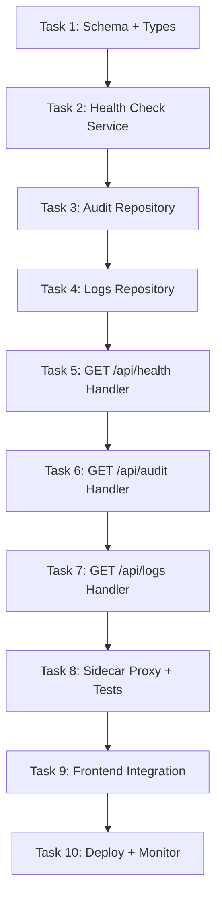

# 🎯 Slice 7: Go Backend for Health, Audit & Log Routes (`/api/health`, `/api/audit`, `/api/logs`)

**Goal**: Migrate health checks, audit log queries, and system log endpoints from TypeScript to Go. The dashboard health page (`/dashboard/health`) displays system status, the audit page (`/dashboard/audit`) shows action history, and the logs page (`/dashboard/logs`) shows request/error logs.

**Why this endpoint next**: Health and monitoring are critical for operating the Go backend. Having these in Go first provides self-monitoring capability (Go can check its own health). Audit and logs are read-heavy, well-structured queries.

**Tables involved**: `audit_log`, `request_logs`, `system_events`, `health_checks`

---

## 📋 TASK LIST



---

## ✅ TASK 1: Schema + Shared Types

**Files to create**: `pkg/types/health.go`, `pkg/types/audit.go`, `pkg/types/log.go`

```go
// pkg/types/health.go
package types

type HealthStatus struct {
    Status      string            `json:"status"`       // "healthy", "degraded", "unhealthy"
    Version     string            `json:"version"`
    Uptime      string            `json:"uptime"`
    Timestamp   string            `json:"timestamp"`
    Components  map[string]ComponentHealth `json:"components"`
}

type ComponentHealth struct {
    Status   string `json:"status"`
    Message  string `json:"message,omitempty"`
    LatencyMs int64 `json:"latency_ms,omitempty"`
}

// pkg/types/audit.go
type AuditEntry struct {
    ID        string `json:"id"`
    Action    string `json:"action"`     // "create", "update", "delete"
    Entity    string `json:"entity"`     // "provider", "combo", "key"
    EntityID  string `json:"entity_id"`
    Actor     string `json:"actor"`      // API key name or user
    Changes   string `json:"changes,omitempty"` // JSON diff
    IP        string `json:"ip,omitempty"`
    CreatedAt string `json:"created_at"`
}

// pkg/types/log.go
type LogEntry struct {
    ID         string `json:"id"`
    Level      string `json:"level"`       // "info", "warn", "error"
    Message    string `json:"message"`
    RequestID  string `json:"request_id,omitempty"`
    ProviderID string `json:"provider_id,omitempty"`
    ModelID    string `json:"model_id,omitempty"`
    LatencyMs  int    `json:"latency_ms,omitempty"`
    StatusCode int    `json:"status_code,omitempty"`
    CreatedAt  string `json:"created_at"`
}
```

| # | Step | Done |
|---|------|------|
| 1.1 | Create `pkg/types/health.go` | ☐ |
| 1.2 | Create `pkg/types/audit.go` | ☐ |
| 1.3 | Create `pkg/types/log.go` | ☐ |
| 1.4 | Run `go build` to verify | ☐ |

---

## ✅ TASK 2: Health Check Service

**What**: Check SQLite connectivity, Go process health, system resources.

**Files to create**: `internal/service/health.go`, `api/handlers/health.go`

```go
func CheckDatabaseHealth(db *sql.DB) *types.ComponentHealth
func CheckProcessHealth() *types.ComponentHealth
func CheckSystemResources() *types.ComponentHealth
```

| # | Step | Done |
|---|------|------|
| 2.1 | `CheckDatabaseHealth(db)` → ping SQLite, measure latency | ☐ |
| 2.2 | `CheckProcessHealth()` → goroutine count, GC stats | ☐ |
| 2.3 | `CheckSystemResources()` → disk space, memory | ☐ |
| 2.4 | `GET /api/health` → aggregate all component checks | ☐ |
| 2.5 | `GET /api/health/live` → simple OK (for K8s liveness) | ☐ |
| 2.6 | `GET /api/health/ready` → checks DB (for K8s readiness) | ☐ |
| 2.7 | Wire routes | ☐ |
| 2.8 | `curl localhost:8080/api/health` → status JSON | ☐ |
| 2.9 | Test: DB down → status = "degraded" | ☐ |
| 2.10 | `go test ./internal/service/ -run Health` → passes | ☐ |

---

## ✅ TASK 3: Audit Repository

**What**: Query and insert audit log entries.

**Files to create**: `internal/db/audit.go`, `internal/db/audit_test.go`

```go
type AuditRepository struct { db *sql.DB }

func (r *AuditRepository) List(opts AuditQueryOpts) ([]types.AuditEntry, error)
func (r *AuditRepository) GetByID(id string) (*types.AuditEntry, error)
func (r *AuditRepository) Create(entry *types.AuditEntry) error
func (r *AuditRepository) ListByEntity(entity string, entityID string) ([]types.AuditEntry, error)
func (r *AuditRepository) GetStats(timeRange string) (*AuditStats, error)

type AuditQueryOpts struct {
    Entity    string
    Action    string
    Actor     string
    StartDate string
    EndDate   string
    Limit     int
    Offset    int
}

type AuditStats struct {
    TotalEntries int64            `json:"total_entries"`
    ByAction     map[string]int64 `json:"by_action"`
    ByEntity     map[string]int64 `json:"by_entity"`
}
```

| # | Step | Done |
|---|------|------|
| 3.1 | Implement `List(opts)` with dynamic filters | ☐ |
| 3.2 | Implement `Create(entry)` with timestamp | ☐ |
| 3.3 | Implement `GetStats(timeRange)` | ☐ |
| 3.4 | Write test: audit insert + query | ☐ |
| 3.5 | `go test ./internal/db/ -run Audit` → passes | ☐ |

---

## ✅ TASK 4: Logs Repository

**What**: Query request and error logs.

**Files to create**: `internal/db/logs.go`, `internal/db/logs_test.go`

```go
type LogRepository struct { db *sql.DB }

func (r *LogRepository) List(level string, opts LogQueryOpts) ([]types.LogEntry, error)
func (r *LogRepository) GetErrorSummary(timeRange string) (*ErrorSummary, error)
func (r *LogRepository) GetRecentErrors(limit int) ([]types.LogEntry, error)

type LogQueryOpts struct {
    StartDate  string
    EndDate    string
    ProviderID string
    ModelID    string
    StatusCode int
    Limit      int
    Offset     int
}

type ErrorSummary struct {
    TotalErrors  int64            `json:"total_errors"`
    ByProvider   map[string]int64 `json:"by_provider"`
    ByStatusCode map[int]int64    `json:"by_status_code"`
}
```

| # | Step | Done |
|---|------|------|
| 4.1 | Implement `List(level, opts)` with filters | ☐ |
| 4.2 | Implement `GetErrorSummary(timeRange)` | ☐ |
| 4.3 | Implement `GetRecentErrors(limit)` | ☐ |
| 4.4 | Write test: insert + query logs | ☐ |
| 4.5 | `go test ./internal/db/ -run Log` → passes | ☐ |

---

## ✅ TASK 5: GET /api/health Handler + Dashboard Integration

| # | Step | Done |
|---|------|------|
| 5.1 | `curl localhost:8080/api/health` → {"status":"healthy",...} | ☐ |
| 5.2 | `curl localhost:8080/api/health/live` → 200 OK | ☐ |
| 5.3 | `curl localhost:8080/api/health/ready` → 200 OK (DB connected) | ☐ |
| 5.4 | Open `/dashboard/health` → health dashboard works | ☐ |
| 5.5 | Verify: component breakdown displays | ☐ |
| 5.6 | Verify: uptime and version shown | ☐ |

---

## ✅ TASK 6: GET /api/audit Handler

```go
// GET /api/audit — list audit entries (paginated)
// GET /api/audit?entity=provider&entity_id=xyz — filter
// GET /api/audit/stats — audit statistics
```

| # | Step | Done |
|---|------|------|
| 6.1 | `ListAudit` handler with pagination | ☐ |
| 6.2 | Filter params: entity, action, actor, date range | ☐ |
| 6.3 | `GetAuditStats` handler | ☐ |
| 6.4 | Wire routes | ☐ |
| 6.5 | `curl localhost:8080/api/audit` → audit list | ☐ |
| 6.6 | `curl localhost:8080/api/audit/stats` → stats | ☐ |
| 6.7 | Open `/dashboard/audit` → audit page works | ☐ |

---

## ✅ TASK 7: GET /api/logs Handler

```go
// GET /api/logs?level=error — filtered log list
// GET /api/logs/errors/summary — error summary
// GET /api/logs/recent-errors — recent errors for alerts
```

| # | Step | Done |
|---|------|------|
| 7.1 | `ListLogs` handler with level filter | ☐ |
| 7.2 | `GetErrorSummary` handler | ☐ |
| 7.3 | `GetRecentErrors` handler | ☐ |
| 7.4 | Wire routes | ☐ |
| 7.5 | `curl localhost:8080/api/logs?level=error` → errors | ☐ |
| 7.6 | `curl localhost:8080/api/logs/errors/summary` → summary | ☐ |
| 7.7 | Open `/dashboard/logs` → logs page works | ☐ |

---

## ✅ TASK 8: Sidecar Proxy + Integration Tests

| # | Step | Done |
|---|------|------|
| 8.1 | Update nginx: add `/api/health`, `/api/audit`, `/api/logs` → Go | ☐ |
| 8.2 | Integration: health endpoint returns correct status | ☐ |
| 8.3 | Integration: insert audit entry → query → verify | ☐ |
| 8.4 | `go test ./...` → passes | ☐ |

---

## ✅ TASK 9: Frontend Integration

| # | Step | Done |
|---|------|------|
| 9.1 | `/dashboard/health` → component health visible | ☐ |
| 9.2 | `/dashboard/audit` → audit entries with filters | ☐ |
| 9.3 | `/dashboard/logs` → log viewer works | ☐ |
| 9.4 | Verify: error summary chart renders | ☐ |

---

## ✅ TASK 10: Deploy + Monitor

| # | Step | Done |
|---|------|------|
| 10.1 | `docker-compose up` → all start | ☐ |
| 10.2 | `curl localhost/api/health` → Go response | ☐ |
| 10.3 | `curl localhost/api/health/live` → 200 | ☐ |
| 10.4 | Document | ☐ |
| 10.5 | Update migration status | ☐ |

---

## 🚀 QUICK START

```bash
# Terminal 1: Go
cd omniroute-go && go run .

# Terminal 2: Next.js
npm run dev

# Test
curl localhost:8080/api/health
curl localhost:8080/api/health/live
curl localhost:8080/api/health/ready
curl localhost:8080/api/audit?limit=10
curl localhost:8080/api/logs?level=error

# Browser
open http://localhost:3000/dashboard/health
open http://localhost:3000/dashboard/audit
open http://localhost:3000/dashboard/logs
```

---

## 📊 COMPARISON: TS vs Go

| Aspect | TypeScript (current) | Go (new) |
|--------|---------------------|----------|
| Routes | `health/`, `audit/`, `logs/` under `src/app/api/` | `api/handlers/health.go`, `audit.go`, `logs.go` |
| DB | Various db modules | `internal/db/audit.go`, `logs.go` |
| Frontend | `/dashboard/health`, `/audit`, `/logs` | No change |