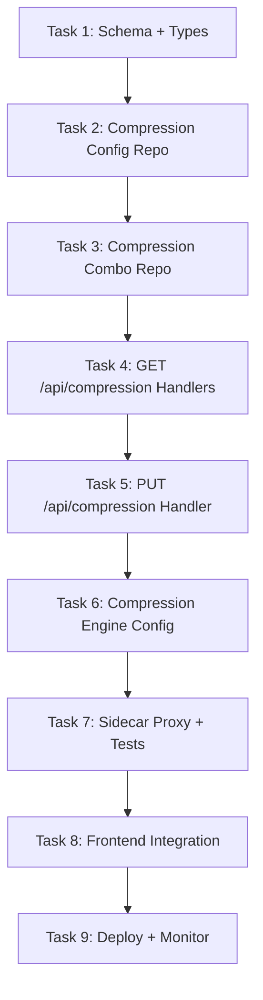

# 🎯 Slice 8: Go Backend for Compression Routes (`/api/compression`)

**Goal**: Migrate compression configuration and management endpoints from TypeScript to Go. The dashboard compression page (`/dashboard/compression`) displays compression engine settings, combo assignments, and compression statistics.

**Why this endpoint next**: Compression is a specialized feature with its own configuration schema, engine types (caveman, RTK, lite), and combo assignments. It's largely read/configure — ideal for proving Go handles domain-specific config endpoints. The compression pipeline itself (in `open-sse/`) stays in TypeScript and calls the Go config via HTTP.

**Tables involved**: `compression_config`, `compression_combos`, `compression_language_packs`, `compression_cache_stats`

---

## 📋 TASK LIST



---

## ✅ TASK 1: Schema + Shared Types

**Files to create**: `pkg/types/compression.go`

```go
package types

type CompressionConfig struct {
    ID              string `json:"id"`
    Mode            string `json:"mode"`             // "off", "lite", "standard", "aggressive", "ultra", "rtk", "stacked"
    DefaultEngine   string `json:"default_engine"`   // "caveman", "rtk", "lite"
    AutoTriggerEnabled bool `json:"auto_trigger_enabled"`
    AutoTriggerThreshold int `json:"auto_trigger_threshold"` // token count
    CreatedAt       string `json:"created_at"`
    UpdatedAt       string `json:"updated_at"`
}

type CompressionCombo struct {
    ID             string `json:"id"`
    ComboID        string `json:"combo_id"`
    Engine         string `json:"engine"`
    Mode           string `json:"mode"`
    Priority       int    `json:"priority"`
    IsActive       bool   `json:"is_active"`
}

type CompressionStats struct {
    TotalCompressed   int64   `json:"total_compressed"`
    TotalSavings      int64   `json:"total_savings_tokens"`
    AverageRatio      float64 `json:"average_compression_ratio"`
    ByEngine          map[string]*EngineStats `json:"by_engine"`
}

type EngineStats struct {
    Compressed int64   `json:"compressed"`
    Savings    int64   `json:"savings_tokens"`
    Ratio      float64 `json:"ratio"`
}
```

| # | Step | Done |
|---|------|------|
| 1.1 | Create `pkg/types/compression.go` | ☐ |
| 1.2 | Add response wrappers | ☐ |
| 1.3 | Run `go build` to verify | ☐ |

---

## ✅ TASK 2: Compression Config Repository

**What**: CRUD on compression configuration.

**Files to create**: `internal/db/compression.go`, `internal/db/compression_test.go`

```go
type CompressionRepo struct { db *sql.DB }

func (r *CompressionRepo) GetConfig() (*types.CompressionConfig, error)
func (r *CompressionRepo) UpdateConfig(cfg *types.CompressionConfig) error
func (r *CompressionRepo) ListCombos() ([]types.CompressionCombo, error)
func (r *CompressionRepo) GetComboByID(id string) (*types.CompressionCombo, error)
func (r *CompressionRepo) AssignCombo(mapping *types.CompressionCombo) error
func (r *CompressionRepo) RemoveCombo(id string) error
func (r *CompressionRepo) GetStats() (*types.CompressionStats, error)
```

| # | Step | Done |
|---|------|------|
| 2.1 | Implement GetConfig/UpdateConfig | ☐ |
| 2.2 | Implement ListCombos/GetComboByID | ☐ |
| 2.3 | Implement AssignCombo/RemoveCombo | ☐ |
| 2.4 | Implement GetStats with aggregation | ☐ |
| 2.5 | Write test: CRUD cycle for config | ☐ |
| 2.6 | `go test ./internal/db/ -run Compression` → passes | ☐ |

---

## ✅ TASK 3: GET /api/compression Handlers

**Files to create**: `api/handlers/compression.go`

```go
// GET /api/compression/config — compression config
// GET /api/compression/combos — assigned compression combos
// GET /api/compression/stats — compression statistics
```

| # | Step | Done |
|---|------|------|
| 3.1 | `GetCompressionConfig` handler | ☐ |
| 3.2 | `ListCompressionCombos` handler | ☐ |
| 3.3 | `GetCompressionStats` handler | ☐ |
| 3.4 | Wire routes | ☐ |
| 3.5 | `curl localhost:8080/api/compression/config` | ☐ |
| 3.6 | `curl localhost:8080/api/compression/combos` | ☐ |
| 3.7 | `curl localhost:8080/api/compression/stats` | ☐ |

---

## ✅ TASK 4: PUT /api/compression Handlers

```go
// PUT /api/compression/config — update config
// POST /api/compression/combos — assign combo to compression
// DELETE /api/compression/combos/:id — remove assignment
```

| # | Step | Done |
|---|------|------|
| 4.1 | `UpdateCompressionConfig` handler with validation | ☐ |
| 4.2 | `AssignCompressionCombo` handler | ☐ |
| 4.3 | `RemoveCompressionCombo` handler | ☐ |
| 4.4 | Validate engine is one of: caveman, rtk, lite | ☐ |
| 4.5 | Wire routes | ☐ |
| 4.6 | `curl -X PUT -d '{"mode":"lite"}' ...` | ☐ |

---

## ✅ TASK 5: Sidecar + Frontend + Deploy

| # | Step | Done |
|---|------|------|
| 5.1 | Update nginx: add `/api/compression` → Go | ☐ |
| 5.2 | Integration test: full CRUD | ☐ |
| 5.3 | Open `/dashboard/compression` → config visible | ☐ |
| 5.4 | Verify: engine selector works | ☐ |
| 5.5 | Verify: combo assignment works | ☐ |
| 5.6 | Measure: < 20ms P95 | ☐ |
| 5.7 | Document | ☐ |

---

## 🚀 QUICK START

```bash
cd omniroute-go && go run .
npm run dev
curl localhost:8080/api/compression/config
curl localhost:8080/api/compression/stats
open http://localhost:3000/dashboard/compression