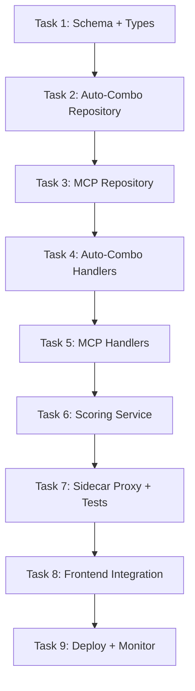

# 🎯 Slice 9: Go Backend for Auto-Combo & MCP Routes

**Goal**: Migrate auto-combo configuration and MCP server management endpoints from TypeScript to Go. The dashboard auto-combo page (`/dashboard/auto-combo`) displays scoring factors, combo suggestions, and configuration. The MCP page (`/dashboard/mcp`) shows tool registration, audit logs, and scope management.

**Why this endpoint next**: Auto-Combo is the intelligent routing engine (12 scoring factors, combo recommendations). It's a flagship feature — having it in Go proves performance benefits most clearly. MCP management is closely related (tools, scopes, audit). These are the most "complex" management endpoints before tackling settings.

**Tables involved**: `auto_combo_scores`, `auto_combo_history`, `mcp_tools`, `mcp_audit`, `mcp_sessions`

---

## 📋 TASK LIST



---

## ✅ TASK 1: Schema + Shared Types

**Files to create**: `pkg/types/autocombo.go`, `pkg/types/mcp.go`

```go
// pkg/types/autocombo.go
package types

type AutoComboScore struct {
    ID         string  `json:"id"`
    ComboID    string  `json:"combo_id"`
    Factor     string  `json:"factor"`     // latency, cost, success_rate, tokens, etc.
    Score      float64 `json:"score"`      // 0.0–1.0
    Weight     float64 `json:"weight"`
    LastUpdated string `json:"last_updated"`
}

type ComboRecommendation struct {
    ComboID      string            `json:"combo_id"`
    ComboName    string            `json:"combo_name"`
    TotalScore   float64           `json:"total_score"`
    FactorScores map[string]float64 `json:"factor_scores"`
    Confidence   string            `json:"confidence"` // "high", "medium", "low"
}

// pkg/types/mcp.go
type MCPTool struct {
    Name        string   `json:"name"`
    Description string   `json:"description"`
    Category    string   `json:"category"`     // "core", "cache", "compression", "memory"
    Scopes      []string `json:"scopes"`
    Active      bool     `json:"active"`
    Invocations int64    `json:"invocations"`
    ErrorRate   float64  `json:"error_rate"`
}

type MCPAuditEntry struct {
    ID          string `json:"id"`
    ToolName    string `json:"tool_name"`
    Args        string `json:"args,omitempty"`
    Success     bool   `json:"success"`
    ErrorMsg    string `json:"error_msg,omitempty"`
    APIKeyID    string `json:"api_key_id,omitempty"`
    DurationMs  int    `json:"duration_ms"`
    CreatedAt   string `json:"created_at"`
}

type MCPScope struct {
    Name        string `json:"name"`
    Description string `json:"description"`
    Tools       int    `json:"tools_count"`
}
```

| # | Step | Done |
|---|------|------|
| 1.1 | Create `pkg/types/autocombo.go` | ☐ |
| 1.2 | Create `pkg/types/mcp.go` | ☐ |
| 1.3 | Add response types | ☐ |
| 1.4 | Run `go build` | ☐ |

---

## ✅ TASK 2: Auto-Combo Repository

**Files to create**: `internal/db/autocombo.go`, `internal/db/autocombo_test.go`

```go
type AutoComboRepo struct { db *sql.DB }

func (r *AutoComboRepo) ListScores(comboID string) ([]types.AutoComboScore, error)
func (r *AutoComboRepo) UpdateScore(comboID, factor string, score float64) error
func (r *AutoComboRepo) GetRecommendations(limit int) ([]types.ComboRecommendation, error)
func (r *AutoComboRepo) GetFactorWeights() (map[string]float64, error)
func (r *AutoComboRepo) UpdateFactorWeight(factor string, weight float64) error
```

| # | Step | Done |
|---|------|------|
| 2.1 | ListScores → SELECT with JOIN to combos table | ☐ |
| 2.2 | UpdateScore → UPSERT | ☐ |
| 2.3 | GetRecommendations → weighted scoring | ☐ |
| 2.4 | GetFactorWeights / UpdateFactorWeight | ☐ |
| 2.5 | Write test: score CRUD | ☐ |
| 2.6 | `go test ./internal/db/ -run AutoCombo` → passes | ☐ |

---

## ✅ TASK 3: MCP Repository

**Files to create**: `internal/db/mcp.go`, `internal/db/mcp_test.go`

```go
type MCPRepo struct { db *sql.DB }

func (r *MCPRepo) ListTools() ([]types.MCPTool, error)
func (r *MCPRepo) GetTool(name string) (*types.MCPTool, error)
func (r *MCPRepo) ToggleTool(name string, active bool) error
func (r *MCPRepo) GetAuditLogs(limit, offset int) ([]types.MCPAuditEntry, error)
func (r *MCPRepo) GetAuditStats() (*MCPAuditStats, error)
func (r *MCPRepo) ListScopes() ([]types.MCPScope, error)

type MCPAuditStats struct {
    TotalInvocations int64            `json:"total_invocations"`
    TotalErrors      int64            `json:"total_errors"`
    ByTool           map[string]int64 `json:"by_tool"`
    ByScope          map[string]int64 `json:"by_scope"`
}
```

| # | Step | Done |
|---|------|------|
| 3.1 | ListTools with stats (invocation count, error rate) | ☐ |
| 3.2 | ToggleTool enable/disable | ☐ |
| 3.3 | GetAuditLogs paginated | ☐ |
| 3.4 | GetAuditStats aggregated | ☐ |
| 3.5 | ListScopes with tool count | ☐ |
| 3.6 | Write test: tool toggle cycle | ☐ |
| 3.7 | `go test ./internal/db/ -run MCP` → passes | ☐ |

---

## ✅ TASK 4: Auto-Combo Handlers

**Files to create**: `api/handlers/autocombo.go`

```go
// GET /api/auto-combo/scores?combo_id=xyz — scores for combo
// GET /api/auto-combo/recommendations — best combo recommendations
// GET /api/auto-combo/weights — factor weights
// PUT /api/auto-combo/weights — update factor weights
```

| # | Step | Done |
|---|------|------|
| 4.1 | `ListScores` handler | ☐ |
| 4.2 | `GetRecommendations` handler (top-5 by score) | ☐ |
| 4.3 | `GetWeights` / `UpdateWeights` handlers | ☐ |
| 4.4 | Wire routes | ☐ |
| 4.5 | `curl localhost:8080/api/auto-combo/scores?combo_id=abc` | ☐ |
| 4.6 | `curl localhost:8080/api/auto-combo/recommendations` | ☐ |

---

## ✅ TASK 5: MCP Handlers

**Files to create**: `api/handlers/mcp.go`

```go
// GET /api/mcp/tools — list all MCP tools
// PUT /api/mcp/tools/:name — enable/disable tool
// GET /api/mcp/audit — audit log
// GET /api/mcp/audit/stats — audit statistics
// GET /api/mcp/scopes — list scopes
```

| # | Step | Done |
|---|------|------|
| 5.1 | `ListTools` handler with category filter | ☐ |
| 5.2 | `ToggleTool` handler | ☐ |
| 5.3 | `GetAuditLogs` handler with pagination | ☐ |
| 5.4 | `GetAuditStats` handler | ☐ |
| 5.5 | `ListScopes` handler | ☐ |
| 5.6 | Wire routes | ☐ |
| 5.7 | `curl localhost:8080/api/mcp/tools` | ☐ |
| 5.8 | `curl localhost:8080/api/mcp/audit?limit=20` | ☐ |
| 5.9 | `curl localhost:8080/api/mcp/scopes` | ☐ |

---

## ✅ TASK 6: Scoring Service

**Files to create**: `internal/service/scoring.go`

```go
func CalculateWeightedScore(scores []types.AutoComboScore) float64
func GetConfidenceLevel(totalScore float64) string  // high ≥ 0.8, medium ≥ 0.5, low < 0.5
```

| # | Step | Done |
|---|------|------|
| 6.1 | Implement CalculateWeightedScore | ☐ |
| 6.2 | Implement GetConfidenceLevel | ☐ |
| 6.3 | Write test: scoring edge cases | ☐ |
| 6.4 | `go test ./internal/service/ -run Score` → passes | ☐ |

---

## ✅ TASK 7: Sidecar Proxy + Integration Tests

| # | Step | Done |
|---|------|------|
| 7.1 | Update nginx: add routes → Go | ☐ |
| 7.2 | Integration: full auto-combo flow | ☐ |
| 7.3 | Integration: MCP audit query | ☐ |
| 7.4 | `go test ./...` → passes | ☐ |

---

## ✅ TASK 8: Frontend Integration

**Dashboard pages**: `/dashboard/auto-combo`, `/dashboard/mcp`

| # | Step | Done |
|---|------|------|
| 8.1 | Open `/dashboard/auto-combo` → scores display | ☐ |
| 8.2 | Verify: recommendation cards render | ☐ |
| 8.3 | Verify: factor weights editable | ☐ |
| 8.4 | Open `/dashboard/mcp` → tool list displays | ☐ |
| 8.5 | Verify: tool enable/disable toggle works | ☐ |
| 8.6 | Verify: audit log table displays | ☐ |
| 8.7 | Verify: scope list displays | ☐ |

---

## ✅ TASK 9: Deploy + Monitor

| # | Step | Done |
|---|------|------|
| 9.1 | `docker-compose up` → all start | ☐ |
| 9.2 | `curl localhost/api/auto-combo/recommendations` → Go | ☐ |
| 9.3 | `curl localhost/api/mcp/tools` → Go | ☐ |
| 9.4 | Measure: < 30ms P95 | ☐ |
| 9.5 | Document | ☐ |

---

## 🚀 QUICK START

```bash
cd omniroute-go && go run .
npm run dev

# Auto-Combo
curl localhost:8080/api/auto-combo/scores?combo_id=abc
curl localhost:8080/api/auto-combo/recommendations

# MCP
curl localhost:8080/api/mcp/tools
curl localhost:8080/api/mcp/audit
curl localhost:8080/api/mcp/scopes

# Browser
open http://localhost:3000/dashboard/auto-combo
open http://localhost:3000/dashboard/mcp