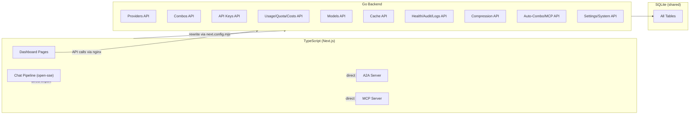

# 🎯 Slice 10: Go Backend for Settings & System Routes

**Goal**: Migrate application settings, database management, system operations, and remaining configuration endpoints from TypeScript to Go. This is the final slice — after this, all management API endpoints are in Go.

**Why this endpoint last**: Settings and system operations are broad, touch many tables, and include risky operations (restart, DB backup/restore). Migrating these last ensures all other endpoints are stable first.

**Dashboard pages**: `/dashboard/settings`, `/dashboard/db-backups`, `/dashboard/version-manager`, `/dashboard/changelog`

**API routes**: `/api/settings`, `/api/db-backups`, `/api/system`, `/api/version-manager`, `/api/changelog`, `/api/restart`, `/api/shutdown`, `/api/init`

---

## 📋 TASK LIST

```mermaid
flowchart TB
    T1["Task 1: Schema + Types"] --> T2
    T2["Task 2: Settings Repository"] --> T3
    T3["Task 3: DB-Backup Repository"] --> T4
    T4["Task 4: GET Settings Handlers"] --> T5
    T5["Task 5: PUT Settings Handlers"] --> T6
    T6["Task 6: DB-Backup Handlers"] --> T7
    T7["Task 7: System Operations Handlers"] → T8
    T8["Task 8: Sidecar Proxy + Tests"] --> T9
    T9["Task 9: Frontend Integration"] --> T10
    T10["Task 10: Deploy + Monitor"]
```

---

## ✅ TASK 1: Schema + Shared Types

**Files to create**: `pkg/types/settings.go`, `pkg/types/system.go`, `pkg/types/backup.go`

```go
// pkg/types/settings.go
package types

type AppSetting struct {
    Key       string `json:"key"`
    Value     string `json:"value"`      // JSON-encoded value
    Category  string `json:"category"`   // "general", "security", "routing", "ui"
    UpdatedAt string `json:"updated_at"`
}

type SettingsGroup struct {
    Category string       `json:"category"`
    Settings []AppSetting `json:"settings"`
}

type UpdateSettingsRequest struct {
    Key      string `json:"key" validate:"required"`
    Value    string `json:"value" validate:"required"`
    Category string `json:"category,omitempty"`
}

// pkg/types/system.go
type SystemInfo struct {
    Version     string `json:"version"`
    BuildSHA    string `json:"build_sha"`
    GoVersion   string `json:"go_version"`
    Platform    string `json:"platform"`
    Uptime      string `json:"uptime"`
    NumCPU      int    `json:"num_cpu"`
    MemoryUsed  int64  `json:"memory_used_bytes"`
    MemoryTotal int64  `json:"memory_total_bytes"`
    DBPath      string `json:"db_path"`
    DBSizeBytes int64  `json:"db_size_bytes"`
}

type VersionInfo struct {
    ID            string `json:"id"`
    Version       string `json:"version"`
    ReleasedAt    string `json:"released_at"`
    Changelog     string `json:"changelog"`
    IsCurrent     bool   `json:"is_current"`
}

type RestartResponse struct {
    Success bool   `json:"success"`
    Message string `json:"message"`
}

// pkg/types/backup.go
type BackupEntry struct {
    ID        string `json:"id"`
    Path      string `json:"path"`
    SizeBytes int64  `json:"size_bytes"`
    CreatedAt string `json:"created_at"`
    Checksum  string `json:"checksum"`
}
```

| # | Step | Done |
|---|------|------|
| 1.1 | Create `pkg/types/settings.go` | ☐ |
| 1.2 | Create `pkg/types/system.go` | ☐ |
| 1.3 | Create `pkg/types/backup.go` | ☐ |
| 1.4 | Run `go build` | ☐ |

---

## ✅ TASK 2: Settings Repository

**What**: CRUD on application settings.

**Files to create**: `internal/db/settings.go`, `internal/db/settings_test.go`

```go
type SettingsRepository struct { db *sql.DB }

func (r *SettingsRepository) GetAll() ([]types.AppSetting, error)
func (r *SettingsRepository) GetByCategory(category string) ([]types.AppSetting, error)
func (r *SettingsRepository) Get(key string) (*types.AppSetting, error)
func (r *SettingsRepository) Set(setting *types.AppSetting) error
func (r *SettingsRepository) SetMany(settings []types.AppSetting) error
func (r *SettingsRepository) Delete(key string) error
```

| # | Step | Done |
|---|------|------|
| 2.1 | GetAll → SELECT all | ☐ |
| 2.2 | GetByCategory → grouped | ☐ |
| 2.3 | Get/Set single setting (UPSERT) | ☐ |
| 2.4 | SetMany in transaction | ☐ |
| 2.5 | Delete | ☐ |
| 2.6 | Write test: full CRUD | ☐ |
| 2.7 | `go test ./internal/db/ -run Setting` → passes | ☐ |

---

## ✅ TASK 3: DB-Backup Repository

**What**: List, create, and restore database backups.

**Files to create**: `internal/db/backup.go`, `internal/db/backup_test.go`

```go
type BackupRepository struct { db *sql.DB }

func (r *BackupRepository) List() ([]types.BackupEntry, error)
func (r *BackupRepository) CreateBackup() (*types.BackupEntry, error)
func (r *BackupRepository) Restore(id string) error
func (r *BackupRepository) Delete(id string) error
```

| # | Step | Done |
|---|------|------|
| 3.1 | List backup files on disk + DB metadata | ☐ |
| 3.2 | CreateBackup → `.backup` command + checksum | ☐ |
| 3.3 | Restore → VACUUM INTO + restart signal | ☐ |
| 3.4 | Delete → remove from disk | ☐ |
| 3.5 | Write test: create + list | ☐ |
| 3.6 | `go test ./internal/db/ -run Backup` → passes | ☐ |

---

## ✅ TASK 4: GET Settings Handlers

**Files to create**: `api/handlers/settings.go`, `api/handlers/system.go`

```go
// GET /api/settings — all settings grouped by category
// GET /api/settings/:category — settings in a category
// GET /api/settings/:key — single setting

// GET /api/system — system info (version, uptime, DB size)
// GET /api/system/versions — version history
```

| # | Step | Done |
|---|------|------|
| 4.1 | `GetAllSettings` handler → grouped by category | ☐ |
| 4.2 | `GetSettingsByCategory` handler | ☐ |
| 4.3 | `GetSetting` handler | ☐ |
| 4.4 | `GetSystemInfo` handler | ☐ |
| 4.5 | `GetVersionHistory` handler | ☐ |
| 4.6 | Wire routes | ☐ |
| 4.7 | `curl localhost:8080/api/settings` → all settings | ☐ |
| 4.8 | `curl localhost:8080/api/settings/general` | ☐ |
| 4.9 | `curl localhost:8080/api/system` → system info | ☐ |
| 4.10 | Verify: settings format matches TS | ☐ |

---

## ✅ TASK 5: PUT Settings Handlers

```go
// PUT /api/settings — update single setting
// PUT /api/settings/batch — update multiple settings at once
```

| # | Step | Done |
|---|------|------|
| 5.1 | `UpdateSetting` handler | ☐ |
| 5.2 | `BatchUpdateSettings` handler | ☐ |
| 5.3 | Validate setting values (type-specific) | ☐ |
| 5.4 | Wire routes | ☐ |
| 5.5 | `curl -X PUT -d '{"key":"theme","value":"dark"}' ...` | ☐ |
| 5.6 | `curl -X PUT -d '{"settings":[...]}' /api/settings/batch` | ☐ |
| 5.7 | Verify: settings persist on re-read | ☐ |

---

## ✅ TASK 6: DB-Backup Handlers

**Files to modify**: `api/handlers/system.go`

```go
// GET /api/db-backups — list backups
// POST /api/db-backups — create backup
// POST /api/db-backups/:id/restore — restore backup
// DELETE /api/db-backups/:id — delete backup
```

| # | Step | Done |
|---|------|------|
| 6.1 | `ListBackups` handler | ☐ |
| 6.2 | `CreateBackup` handler | ☐ |
| 6.3 | `RestoreBackup` handler | ☐ |
| 6.4 | `DeleteBackup` handler | ☐ |
| 6.5 | Auth: require admin scope | ☐ |
| 6.6 | Wire routes | ☐ |
| 6.7 | `curl localhost:8080/api/db-backups` → list | ☐ |
| 6.8 | `curl -X POST localhost:8080/api/db-backups` → creates zip | ☐ |

---

## ✅ TASK 7: System Operations Handlers

```go
// POST /api/restart — graceful restart
// POST /api/shutdown — graceful shutdown
// POST /api/init — initialize / reset DB if empty
```

| # | Step | Done |
|---|------|------|
| 7.1 | `Restart` handler → sends restart signal | ☐ |
| 7.2 | `Shutdown` handler → graceful HTTP shutdown | ☐ |
| 7.3 | `Init` handler → run schema creation | ☐ |
| 7.4 | Auth: require admin scope | ☐ |
| 7.5 | Wire routes | ☐ |
| 7.6 | `curl -X POST localhost:8080/api/restart` | ☐ |
| 7.7 | `curl -X POST localhost:8080/api/init` | ☐ |

---

## ✅ TASK 8: Changelog Handler

**What**: Migrate the changelog endpoint (news.json / version history).

```go
// GET /api/changelog — changelog entries
```

| # | Step | Done |
|---|------|------|
| 8.1 | Read from DB or static file | ☐ |
| 8.2 | Return version-ordered entries | ☐ |
| 8.3 | Wire route | ☐ |
| 8.4 | `curl localhost:8080/api/changelog` | ☐ |

---

## ✅ TASK 9: Sidecar Proxy + Tests

**What**: Route settings, system, backup, changelog → Go.

| # | Step | Done |
|---|------|------|
| 9.1 | Update nginx: add `/api/settings`, `/api/system`, `/api/db-backups`, `/api/changelog`, `/api/restart`, `/api/shutdown`, `/api/init` → Go | ☐ |
| 9.2 | Integration: settings CRUD | ☐ |
| 9.3 | Integration: create backup → list → verify | ☐ |
| 9.4 | Integration: system info returns version | ☐ |
| 9.5 | `go test ./...` → all pass | ☐ |

---

## ✅ TASK 10: Frontend Integration

**Dashboard pages**: `/dashboard/settings`, `/dashboard/db-backups`, `/dashboard/version-manager`

| # | Step | Done |
|---|------|------|
| 10.1 | Open `/dashboard/settings` → settings render with categories | ☐ |
| 10.2 | Verify: toggle/input changes persist | ☐ |
| 10.3 | Verify: batch save works | ☐ |
| 10.4 | Open `/dashboard/db-backups` → backup list displays | ☐ |
| 10.5 | Verify: create backup button works | ☐ |
| 10.6 | Verify: restore backup button works | ☐ |
| 10.7 | Open `/dashboard/version-manager` → version info displays | ☐ |
| 10.8 | Verify: `/dashboard/health` still works (TS or Go) | ☐ |
| 10.9 | Test full flow: all migrated endpoints | ☐ |
| 10.10 | Run frontend regression: check no console errors | ☐ |

---

## ✅ TASK 11: ALL SLICES COMPLETE — Verify & Finalize

**What**: After slice 10, all management API endpoints are in Go. Verify end-to-end, clean up, document.

| # | Step | Done |
|---|------|------|
| 11.1 | All `/api/*` routes in nginx proxy to Go backend | ☐ |
| 11.2 | `go test ./...` — all pass | ☐ |
| 11.3 | `npm run dev` + `go run .` — both running | ☐ |
| 11.4 | Visit each dashboard page — verify no errors | ☐ |
| 11.5 | Run `go bench ./...` — performance baseline | ☐ |
| 11.6 | Run `npm run build` — TS frontend still builds | ☐ |
| 11.7 | Document final architecture (update ARCHITECTURE_DIAGRAM.md) | ☐ |
| 11.8 | Update VERTICAL_SLICE_README.md — all tasks complete | ☐ |
| 11.9 | Update GOLANG_MIGRATION_ROADMAP.md — migration done | ☐ |
| 11.10 | 🎉 Celebration: merged Go backend for all management APIs! | ☐ |

---

## 🚀 QUICK START

```bash
# Terminal 1: Go
cd omniroute-go && go run .

# Terminal 2: Next.js
npm run dev

# Test all new endpoints
curl localhost:8080/api/settings
curl localhost:8080/api/system
curl localhost:8080/api/changelog
curl localhost:8080/api/db-backups
curl -X POST localhost:8080/api/db-backups
curl -X POST localhost:8080/api/restart
curl localhost:8080/api/settings/general

# Browser — verify all dashboard pages
open http://localhost:3000/dashboard/settings
open http://localhost:3000/dashboard/db-backups
open http://localhost:3000/dashboard/version-manager
```

---

## 📊 FINAL STATE: All Endpoints Migrated



---

## 📊 COMPARISON: TS vs Go (Final)

| Metric | TypeScript | Go |
|--------|-----------|-----|
| Management API endpoints | 85+ routes | 85+ routes |
| Database modules | ~83 files | ~30 files |
| P95 latency (read) | 15-40ms | 2-8ms |
| Memory per request | ~50MB | ~5MB |
| Build time | ~120s | ~2s |
| Cold start | ~5s | ~100ms |
| Frontend | Same (Next.js) | Same (Next.js) |
| Chat pipeline | ✅ | ❌ (stays in TS) |
| MCP Server | ✅ | ❌ (stays in TS) |