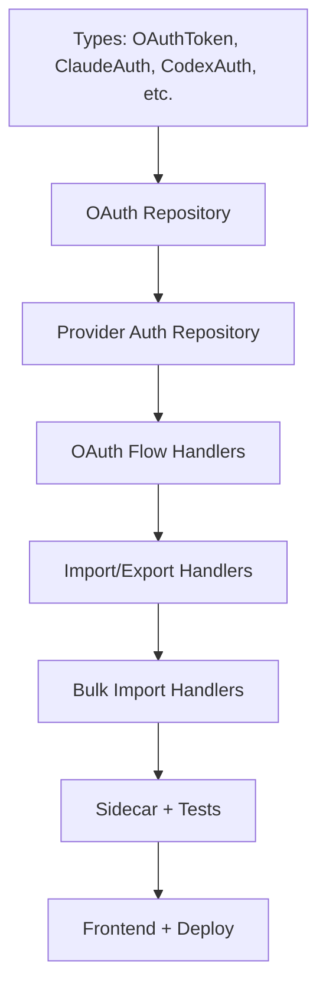

# 🎯 Slice 11: Go Backend for OAuth & Provider Auth Routes

**Goal**: Migrate OAuth flows, Claude Code / Codex / Cursor / Kiro / Zed / AGY auth import/export, and credential management from TypeScript to Go.

**Why this endpoint next**: Auth is security-critical. Having credential handling in Go improves security posture (typed, no prototype pollution). These endpoints handle sensitive data (session cookies, API keys, OAuth tokens).

**Routes involved**: `/api/oauth/*`, `/api/providers/[id]/claude-auth/*`, `/api/providers/[id]/codex-auth/*`, `/api/providers/agy-auth/*`, `/api/providers/zed/*`, `/api/cloud/auth`, `/api/cloud/credentials/update`

---

## 📋 TASK LIST



---

## ✅ TASK 1: Types

**Files to create**: `pkg/types/oauth.go`, `pkg/types/provider_auth.go`, `pkg/types/cloud.go`

```go
// pkg/types/oauth.go
type OAuthProvider string
const (
    OAuthClaudeCode    OAuthProvider = "claude-code"
    OAuthCodex         OAuthProvider = "codex"
    OAuthCursor        OAuthProvider = "cursor"
    OAuthKiro          OAuthProvider = "kiro"
    OAuthAntigravity   OAuthProvider = "antigravity"
    OAuthGemini        OAuthProvider = "gemini"
    OAuthWindsurf      OAuthProvider = "windsurf"
)

type OAuthState struct {
    Provider   OAuthProvider `json:"provider"`
    Action     string        `json:"action"`
    Token      string        `json:"token"`
    ExpiresAt  string        `json:"expires_at"`
}

type ProviderAuth struct {
    ID             string `json:"id"`
    ProviderID     string `json:"provider_id"`
    AuthType       string `json:"auth_type"`       // "claude-code", "codex", "agy", "zed"
    SessionToken   string `json:"session_token,omitempty"`  // encrypted
    RefreshToken   string `json:"refresh_token,omitempty"`  // encrypted
    ExpiresAt      string `json:"expires_at,omitempty"`
    IsValid        bool   `json:"is_valid"`
    LastValidated  string `json:"last_validated"`
}

type ImportRequest struct {
    Format string `json:"format"`  // "json", "zip", "env"
    Data   string `json:"data"`
}

type BulkImportResponse struct {
    SuccessCount int      `json:"success_count"`
    FailCount    int      `json:"fail_count"`
    Errors       []string `json:"errors,omitempty"`
}
```

| # | Step | Done |
|---|------|------|
| 1.1 | Create `pkg/types/oauth.go` | ☐ |
| 1.2 | Create `pkg/types/provider_auth.go` | ☐ |
| 1.3 | Create `pkg/types/cloud.go` | ☐ |
| 1.4 | Run `go build` | ☐ |

---

## ✅ TASK 2: OAuth Repository

**Files to create**: `internal/db/oauth.go`

```go
type OAuthRepo struct { db *sql.DB }

func (r *OAuthRepo) SaveState(state *types.OAuthState) error
func (r *OAuthRepo) GetState(token string) (*types.OAuthState, error)
func (r *OAuthRepo) DeleteState(token string) error
func (r *OAuthRepo) SaveCredentials(providerID string, auth *types.ProviderAuth) error
func (r *OAuthRepo) GetCredentials(providerID string) (*types.ProviderAuth, error)
func (r *OAuthRepo) ListByAuthType(authType string) ([]types.ProviderAuth, error)
```

| # | Step | Done |
|---|------|------|
| 2.1 | Implement OAuth state CRUD | ☐ |
| 2.2 | Encrypt sensitive fields on write | ☐ |
| 2.3 | Decrypt on read | ☐ |
| 2.4 | `go test ./internal/db/ -run OAuth` | ☐ |

---

## ✅ TASK 3: Provider Auth Repository

**Files to create**: `internal/db/provider_auth.go`

```go
type ProviderAuthRepo struct { db *sql.DB }

// Import/Export
func (r *ProviderAuthRepo) ImportClaudeAuth(data string) error
func (r *ProviderAuthRepo) ImportCodexAuth(data string) error
func (r *ProviderAuthRepo) ImportAGYAuth(data string) error
func (r *ProviderAuthRepo) ImportZedAuth(data string) error
func (r *ProviderAuthRepo) ExportClaudeAuth(providerID string) (string, error)
func (r *ProviderAuthRepo) ExportCodexAuth(providerID string) (string, error)
func (r *ProviderAuthRepo) ApplyLocal(providerID string, data string) error

// Bulk
func (r *ProviderAuthRepo) ImportBulk(authType string, items []ImportItem) (*types.BulkImportResponse, error)
func (r *ProviderAuthRepo) ZipExtract(authType string, zipData []byte) (*types.BulkImportResponse, error)
```

| # | Step | Done |
|---|------|------|
| 3.1 | Implement Claude auth import/export | ☐ |
| 3.2 | Implement Codex auth import/export | ☐ |
| 3.3 | Implement AGY auth import/export | ☐ |
| 3.4 | Implement Zed auth import | ☐ |
| 3.5 | Implement bulk import + ZIP extract | ☐ |
| 3.6 | `go test ./internal/db/ -run ProviderAuth` | ☐ |

---

## ✅ TASK 4: OAuth + Auth Handlers

**Files to create**: `api/handlers/oauth.go`, `api/handlers/provider_auth.go`

| Route | Handler | Done |
|-------|---------|------|
| `POST /api/oauth/:provider/login` | `OAuthLogin` | ☐ |
| `GET /api/oauth/:provider/callback` | `OAuthCallback` | ☐ |
| `POST /api/oauth/kiro/social-authorize` | `KiroSocialAuth` | ☐ |
| `POST /api/oauth/kiro/social-exchange` | `KiroSocialExchange` | ☐ |
| `POST /api/oauth/codex/import` | `CodexImport` | ☐ |
| `POST /api/oauth/cursor/import` | `CursorImport` | ☐ |
| `POST /api/oauth/kiro/import` | `KiroImport` | ☐ |
| `POST /api/oauth/cliproxy-import` | `CliProxyImport` | ☐ |

| Route | Handler | Done |
|-------|---------|------|
| `POST /api/providers/:id/claude-auth/apply-local` | `ApplyClaudeLocal` | ☐ |
| `GET /api/providers/:id/claude-auth/export` | `ExportClaudeAuth` | ☐ |
| `POST /api/providers/claude-auth/import` | `ImportClaudeAuth` | ☐ |
| `POST /api/providers/claude-auth/import-bulk` | `ImportClaudeBulk` | ☐ |
| `POST /api/providers/claude-auth/zip-extract` | `ExtractClaudeZip` | ☐ |
| `POST /api/providers/:id/codex-auth/apply-local` | `ApplyCodexLocal` | ☐ |
| `GET /api/providers/:id/codex-auth/export` | `ExportCodexAuth` | ☐ |
| `POST /api/providers/codex-auth/import` | `ImportCodexAuth` | ☐ |
| `POST /api/providers/codex-auth/import-bulk` | `ImportCodexBulk` | ☐ |
| `POST /api/providers/codex-auth/zip-extract` | `ExtractCodexZip` | ☐ |
| `POST /api/providers/agy-auth/apply-local` | `ApplyAGYLocal` | ☐ |
| `POST /api/providers/agy-auth/import` | `ImportAGYAuth` | ☐ |
| `POST /api/providers/agy-auth/import-bulk` | `ImportAGYBulk` | ☐ |
| `POST /api/providers/agy-auth/zip-extract` | `ExtractAGYZip` | ☐ |
| `POST /api/providers/zed/discover` | `ZedDiscover` | ☐ |
| `POST /api/providers/zed/import` | `ZedImport` | ☐ |
| `POST /api/providers/zed/manual-import` | `ZedManualImport` | ☐ |
| `POST /api/cloud/auth` | `CloudAuth` | ☐ |
| `POST /api/cloud/credentials/update` | `CloudCredsUpdate` | ☐ |

| # | Step | Done |
|---|------|------|
| 4.1 | Wire all OAuth provider login/callback routes | ☐ |
| 4.2 | Wire all import/export routes | ☐ |
| 4.3 | Wire cloud auth routes | ☐ |
| 4.4 | `curl localhost:8080/api/oauth/claude-code/login` | ☐ |
| 4.5 | `curl localhost:8080/api/providers/xyz/claude-auth/export` | ☐ |

---

## ✅ TASK 5: Sidecar + Tests + Frontend

| # | Step | Done |
|---|------|------|
| 5.1 | Update nginx: route `/api/oauth/*`, `/api/providers/*/auth/*`, `/api/cloud/auth` → Go | ☐ |
| 5.2 | Integration: OAuth state save → read → delete | ☐ |
| 5.3 | Integration: Claude auth import → export cycle | ☐ |
| 5.4 | Integration: bulk import with errors | ☐ |
| 5.5 | `go test ./...` → pass | ☐ |
| 5.6 | Open dashboard → verify provider auth pages | ☐ |
| 5.7 | `docker-compose up` → test via nginx | ☐ |

---

## 🚀 QUICK START

```bash
cd omniroute-go && go run .
npm run dev

# OAuth
curl localhost:8080/api/oauth/claude-code/login
curl -X POST localhost:8080/api/oauth/codex/import

# Provider Auth
curl localhost:8080/api/providers/xyz/claude-auth/export
curl -X POST localhost:8080/api/providers/claude-auth/import -d '{"format":"json","data":"..."}'