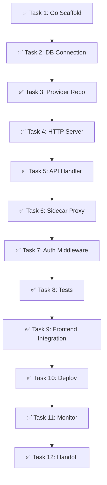
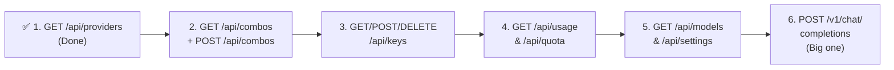

# 🎯 Vertical Slice: Go Backend for `GET /api/providers`

**Goal**: Build 1 complete endpoint end-to-end in Go (`GET /api/providers`) and connect it to the Next.js frontend. This proves the entire Go architecture works before scaling to more endpoints.

**Why this endpoint**: Simple read from 1 SQLite table (`provider_connections`). The dashboard Providers page fetches this data. Low risk — if broken, only the providers page is affected.

---

## 📋 TASK LIST



---

## ✅ TASK 1: Go Project Scaffold

**What**: Create the Go module, directory structure, build system, and shared types.

**Files to create**: `go.mod`, `Makefile`, `cmd/omniroute/main.go`, `pkg/types/provider.go`

```bash
mkdir -p omniroute-go/{cmd/omniroute,internal/{db,config,logger},api/{handlers,middleware},pkg/types}
cd omniroute-go && go mod init github.com/omniroute/core
go get github.com/gin-gonic/gin && go get github.com/mattn/go-sqlite3
```

| # | Step | Done |
|---|------|------|
| 1.1 | Create `omniroute-go/` directory with subdirectories | ☐ |
| 1.2 | Run `go mod init github.com/omniroute/core` | ☐ |
| 1.3 | Install Gin: `go get github.com/gin-gonic/gin` | ☐ |
| 1.4 | Install SQLite: `go get github.com/mattn/go-sqlite3` | ☐ |
| 1.5 | Create `cmd/omniroute/main.go` (stub Gin server on :8080) | ☐ |
| 1.6 | Create `pkg/types/provider.go` with ProviderConnection struct | ☐ |
| 1.7 | Create `Makefile` with `build`, `test`, `fmt`, `lint` targets | ☐ |
| 1.8 | Run `make build` → binary compiles successfully | ☐ |
| 1.9 | Run `go run .` → server starts on `:8080` | ☐ |
| 1.10 | `curl localhost:8080/api/providers` → `{"message": "not yet"}` | ☐ |

**Verification**: `make build` succeeds, `go run .` starts server on port 8080.

---

## ✅ TASK 2: SQLite Connection + Migrations

**What**: Connect to the same SQLite database that the TS backend uses. Run migrations.

**Files to create**: `internal/db/db.go`, `internal/db/migrations.go`

| # | Step | Done |
|---|------|------|
| 2.1 | Create `internal/db/db.go` with SQLite singleton + WAL mode | ☐ |
| 2.2 | Implement `GetDB(dbPath string) (*sql.DB, error)` with `sync.Once` | ☐ |
| 2.3 | Set `SetMaxOpenConns(1)` for SQLite safety | ☐ |
| 2.4 | Implement `runMigrations(db)` that scans `migrations/` directory | ☐ |
| 2.5 | Copy existing TS migrations `*.sql` into `migrations/` dir | ☐ |
| 2.6 | Create `internal/db/migrations.go` with migration runner logic | ☐ |
| 2.7 | Add `DATA_DIR` env var support (default: `~/.omniroute/`) | ☐ |
| 2.8 | Test: `GetDB("~/.omniroute/data.db")` returns connected DB | ☐ |
| 2.9 | Test: Migrations run, `provider_connections` table exists | ☐ |
| 2.10 | Verify: TS and Go can read the same DB simultaneously | ☐ |

**Verification**: Go connects to the same SQLite DB as Next.js. `SELECT * FROM provider_connections` returns data inserted by the TS app.

---

## ✅ TASK 3: Provider Repository

**What**: Go functions to read providers from SQLite.

**Files to create**: `internal/db/providers.go`, `internal/db/providers_test.go`

```go
type ProviderRepository struct { db *sql.DB }
func (r *ProviderRepository) ListAll() ([]types.ProviderConnection, error)
func (r *ProviderRepository) GetByID(id string) (*types.ProviderConnection, error)
func (r *ProviderRepository) Create(p *types.ProviderConnection) error
func (r *ProviderRepository) Update(p *types.ProviderConnection) error
func (r *ProviderRepository) Delete(id string) error
```

| # | Step | Done |
|---|------|------|
| 3.1 | Implement `ListAll()` → `SELECT * FROM provider_connections ORDER BY name` | ☐ |
| 3.2 | Implement `GetByID(id)` → `SELECT * WHERE id = ?` | ☐ |
| 3.3 | Implement `Create(p)` → `INSERT INTO provider_connections ...` | ☐ |
| 3.4 | Implement `Update(p)` → `UPDATE provider_connections SET ... WHERE id = ?` | ☐ |
| 3.5 | Implement `Delete(id)` → `DELETE FROM provider_connections WHERE id = ?` | ☐ |
| 3.6 | Handle nullable fields (JSON marshalling) | ☐ |
| 3.7 | Write unit test: `ListAll` with in-memory SQLite | ☐ |
| 3.8 | Write unit test: `Create` + `GetByID` round-trip | ☐ |
| 3.9 | Write unit test: `Update` modifies correct fields | ☐ |
| 3.10 | Write unit test: `Delete` removes and returns error on re-query | ☐ |

**Verification**: `go test ./internal/db/` passes all tests.

---

## ✅ TASK 4: Gin HTTP Server

**What**: Set up the HTTP server with routes, middleware, graceful shutdown.

**Files to modify**: `cmd/omniroute/main.go`
**Files to create**: `api/middleware/cors.go`, `api/router.go`

| # | Step | Done |
|---|------|------|
| 4.1 | Initialize Gin engine with `gin.Default()` | ☐ |
| 4.2 | Add CORS middleware (allow `*` for dev, restrict for prod) | ☐ |
| 4.3 | Create `/api` route group | ☐ |
| 4.4 | Register `GET /api/providers` route | ☐ |
| 4.5 | Add request logging middleware | ☐ |
| 4.6 | Add panic recovery middleware | ☐ |
| 4.7 | Implement graceful shutdown (SIGINT/SIGTERM) | ☐ |
| 4.8 | Read port from env `GO_PORT` (default 8080) | ☐ |
| 4.9 | Add health check endpoint `GET /api/health` | ☐ |
| 4.10 | `curl localhost:8080/api/health` → `{"status": "ok"}` | ☐ |

**Verification**: Server starts, responds to `/api/health` and `/api/providers`.

---

## ✅ TASK 5: GET /api/providers Handler

**What**: The actual handler that reads providers from DB and returns JSON.

**Files to create**: `api/handlers/providers.go`, `api/handlers/providers_test.go`

```go
func ListProviders(db *sql.DB) gin.HandlerFunc {
    repo := db.NewProviderRepository(database)
    return func(c *gin.Context) {
        providers, err := repo.ListAll()
        // ... return JSON
    }
}
```

| # | Step | Done |
|---|------|------|
| 5.1 | Create `api/handlers/providers.go` | ☐ |
| 5.2 | `ListProviders` handler: call `repo.ListAll()` | ☐ |
| 5.3 | Return `200` with `ProviderListResponse` JSON | ☐ |
| 5.4 | Return `500` with error JSON on DB failure | ☐ |
| 5.5 | Handle empty list (return `[]` not `null`) | ☐ |
| 5.6 | Wire handler into `cmd/omniroute/main.go` | ☐ |
| 5.7 | Add query param support: `?search=openai` filter | ☐ |
| 5.8 | Add query param support: `?page=1&per_page=20` pagination | ☐ |
| 5.9 | `curl localhost:8080/api/providers` → returns data | ☐ |
| 5.10 | `curl localhost:8080/api/providers?search=openai` → filtered | ☐ |

**Verification**: `curl localhost:8080/api/providers` returns the same data as the TS endpoint.

---

## ✅ TASK 6: Sidecar Proxy Integration

**What**: Route `GET /api/providers` to Go, keep everything else on Next.js.

**Files to create**: `nginx.conf` (or modify `next.config.mjs`)

```nginx
# nginx.conf
upstream nextjs { server 127.0.0.1:3000; }
upstream go-backend { server 127.0.0.1:8080; }
server {
    listen 80;
    location = /api/providers {
        proxy_pass http://go-backend;
    }
    location / { proxy_pass http://nextjs; }
}
```

| # | Step | Done |
|---|------|------|
| 6.1 | **Option A**: Create `nginx.conf` with Go + Next.js upstreams | ☐ |
| 6.2 | Add `location = /api/providers` → Go backend | ☐ |
| 6.3 | Add `location /` → Next.js | ☐ |
| 6.4 | Test: Start nginx, Go on :8080, Next.js on :3000 | ☐ |
| 6.5 | **Option B**: Or modify `next.config.mjs` with rewrite rule | ☐ |
| 6.6 | `curl localhost:80/api/providers` → Go response | ☐ |
| 6.7 | `curl localhost:80/api/combos` → Next.js response (unchanged) | ☐ |
| 6.8 | `curl localhost:80/dashboard/providers` → HTML from Next.js | ☐ |
| 6.9 | Verify: All other endpoints still work via TS | ☐ |
| 6.10 | Stop nginx → Go still accessible on :8080 directly | ☐ |

**Verification**: `GET /api/providers` hits Go, everything else hits Next.js.

---

## ✅ TASK 7: Auth Middleware

**What**: Validate API keys against the shared SQLite `api_keys` table.

**Files to create**: `api/middleware/auth.go`

```go
func AuthValidator(database *sql.DB) gin.HandlerFunc {
    // SHA256 hash of Bearer token
    // Compare hash against api_keys table
    // 401 if invalid, next() if valid or no header
}
```

| # | Step | Done |
|---|------|------|
| 7.1 | Extract `Authorization: Bearer <token>` header | ☐ |
| 7.2 | SHA256 hash the token (matches TS `crypto.createHash('sha256')`) | ☐ |
| 7.3 | Query: `SELECT EXISTS(SELECT 1 FROM api_keys WHERE key_hash = ? AND is_active = 1)` | ☐ |
| 7.4 | If not found: return `401` with standard error format | ☐ |
| 7.5 | If valid (or no header): `c.Next()` | ☐ |
| 7.6 | Support optional auth (same as TS — some routes allow anonymous) | ☐ |
| 7.7 | Wire middleware into `/api` route group in `main.go` | ☐ |
| 7.8 | Test: valid key → 200 | ☐ |
| 7.9 | Test: invalid key → 401 | ☐ |
| 7.10 | Test: no key → 200 (optional auth) | ☐ |

**Verification**: Valid keys pass, invalid keys get 401, matches exact TS auth behavior.

---

## ✅ TASK 8: Integration Tests

**What**: Full test suite for the endpoint.

**Files to create**: `internal/tests/providers_test.go`

| # | Step | Done |
|---|------|------|
| 8.1 | Setup: in-memory SQLite with migrations | ☐ |
| 8.2 | Setup: Seed 5 test providers | ☐ |
| 8.3 | Test: `GET /api/providers` returns all 5 | ☐ |
| 8.4 | Test: `GET /api/providers?search=openai` returns filtered | ☐ |
| 8.5 | Test: `GET /api/providers` with auth header works | ☐ |
| 8.6 | Test: `GET /api/providers` with invalid auth returns 401 | ☐ |
| 8.7 | Test: Empty DB returns `[]` not `null` | ☐ |
| 8.8 | Test: Response matches TS format exactly (field names, casing) | ☐ |
| 8.9 | Test: Response headers (Content-Type, CORS) | ☐ |
| 8.10 | `go test ./...` → all tests pass | ☐ |

**Verification**: `go test ./...` passes. Response JSON matches TS format.

---

## ✅ TASK 9: Frontend Integration

**What**: Verify the Next.js dashboard providers page works with the Go backend.

**Files to verify**: `src/app/dashboard/providers/page.tsx`

**Key insight**: If using the nginx proxy or Next.js rewrite, **no frontend code changes are needed**. The frontend fetches `/api/providers` as before — it just goes to Go instead of TS.

| # | Step | Done |
|---|------|------|
| 9.1 | Start Go backend (`go run .` on :8080) | ☐ |
| 9.2 | Start Next.js (`npm run dev` on :3000) | ☐ |
| 9.3 | Open `http://localhost:3000/dashboard/providers` | ☐ |
| 9.4 | Verify: Provider list displays correctly | ☐ |
| 9.5 | Verify: Sort by name works | ☐ |
| 9.6 | Verify: Search/filter works | ☐ |
| 9.7 | Verify: Pagination works | ☐ |
| 9.8 | Verify: Add new provider (creates in shared SQLite) | ☐ |
| 9.9 | Verify: Edit provider (updates in shared SQLite) | ☐ |
| 9.10 | Verify: Delete provider (removes from shared SQLite) | ☐ |

**Verification**: Providers page works identically with Go backend vs TS backend.

---

## ✅ TASK 10: Production Deployment

**What**: Dockerize and deploy the Go service alongside Next.js.

**Files to create**: `Dockerfile` (Go), update `docker-compose.yml`

```yaml
services:
  nextjs:
    image: omniroute/nextjs:latest
    ports: ["3000:3000"]
  go-backend:
    build: ./omniroute-go      # 🆕
    ports: ["8080:8080"]
    volumes: ["/data/omniroute:/data"]
  nginx:
    image: nginx:alpine
    ports: ["80:80"]
    volumes: ["./nginx.conf:/etc/nginx/conf.d/default.conf"]
```

| # | Step | Done |
|---|------|------|
| 10.1 | Create `Dockerfile` for Go binary (multi-stage: `golang:alpine` → `alpine`) | ☐ |
| 10.2 | Add Go service to `docker-compose.yml` | ☐ |
| 10.3 | Add Go service to `docker-compose.prod.yml` | ☐ |
| 10.4 | Mount shared data volume for SQLite | ☐ |
| 10.5 | Set `GIN_MODE=release` in production | ☐ |
| 10.6 | Add healthcheck for Go service | ☐ |
| 10.7 | Update nginx config in compose | ☐ |
| 10.8 | `docker-compose up` → all 3 services start | ☐ |
| 10.9 | `curl localhost/api/providers` → Go response | ☐ |
| 10.10 | `curl localhost/dashboard/providers` → HTML | ☐ |

**Verification**: `docker-compose up` starts Go, Next.js, nginx. Providers page works.

---

## ✅ TASK 11: Monitoring & Validation

**What**: Monitor the Go endpoint, measure latency, set up alerting, document rollback.

| # | Step | Done |
|---|------|------|
| 11.1 | Measure: `curl -w "%{time_total}"` → latency < 10ms | ☐ |
| 11.2 | Compare: TS vs Go latency for same endpoint | ☐ |
| 11.3 | Measure: Error rate from Go logs | ☐ |
| 11.4 | Add Go service metrics to monitoring (Prometheus if available) | ☐ |
| 11.5 | Test: Stop Go → verify TS fallback works | ☐ |
| 11.6 | Document rollback: remove 1 nginx `location` block → reload | ☐ |
| 11.7 | Test rollback: `curl localhost/api/providers` → TS response | ☐ |
| 11.8 | Re-apply: re-add nginx rule → Go response | ☐ |
| 11.9 | Document: List of files changed, config differences | ☐ |
| 11.10 | Document: Known issues / edge cases | ☐ |

**Verification**: Go P95 < 10ms, error rate < 0.1%, rollback < 30 seconds.

---

## ✅ TASK 12: Handoff Documentation

**What**: Document the architecture, what was built, what's next.

**Files**: This document, plus inline comments in all Go files.

| # | Step | Done |
|---|------|------|
| 12.1 | Document Go project structure in `README.md` | ☐ |
| 12.2 | Document each file's purpose (top-level comments) | ☐ |
| 12.3 | Document the sidecar proxy architecture | ☐ |
| 12.4 | Document how to add a new endpoint (template) | ☐ |
| 12.5 | Document the shared SQLite pattern | ☐ |
| 12.6 | Document deployment steps (compose, env vars) | ☐ |
| 12.7 | Document rollback procedure | ☐ |
| 12.8 | Update main `README.md` with Go migration status | ☐ |
| 12.9 | Create file: `omniroute-go/README.md` | ☐ |
| 12.10 | Present demo to team | ☐ |

**Verification**: Anyone can clone the repo, start Go + Next.js, and see the providers page working.

---

## 🗺️ AFTER THIS SLICE — WHAT'S NEXT

Each new endpoint follows the **same pattern**:

| Step | Time |
|------|------|
| 1. Add DB repository for the new tables | 1-2 days |
| 2. Add API handler + route | 1 day |
| 3. Add sidecar proxy rule | 1 hour |
| 4. Verify frontend integration | 1 day |
| 5. Tests + docs | 1 day |
| **Total per new endpoint** | **~5 days** |

### Recommended Order



---

## 🔑 KEY FILES REFERENCE

| Layer | File | Purpose |
|-------|------|---------|
| Types | `pkg/types/provider.go` | Go structs matching SQLite schema |
| DB Connection | `internal/db/db.go` | SQLite singleton with WAL + migrations |
| DB Repository | `internal/db/providers.go` | SQL queries for provider CRUD |
| API Handler | `api/handlers/providers.go` | Gin handler for GET /api/providers |
| Auth Middleware | `api/middleware/auth.go` | API key validation against SQLite |
| CORS Middleware | `api/middleware/cors.go` | CORS headers matching TS behavior |
| Main Server | `cmd/omniroute/main.go` | Server setup, routes, middleware |
| Nginx Config | `nginx.conf` | Route /api/providers to Go |
| Next.js Config | `next.config.mjs` | Optional rewrite fallback |

---

## 🚀 QUICK START

```bash
# Terminal 1: Start Go backend
cd omniroute-go && go run .

# Terminal 2: Start Next.js
npm run dev

# Terminal 3: Test
curl http://localhost:8080/api/providers     # Direct Go call
curl http://localhost:3000/api/providers     # Via Next.js rewrite

# Browser
open http://localhost:3000/dashboard/providers