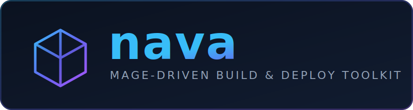

<p align="center">
  
</p>

<p align="center">
  
  
  
</p>

**nava** is a [Mage](https://magefile.org/)-based build & deployment toolkit. It
wraps common DevOps CLIs — `helm`, `ko`, `docker`, `k3d`, `sops`, and the Go /
Node / Python / Rust toolchains — behind typed Go runners that are driven by
simple **YAML config files**.

The design goal: your `magefile.go` stays tiny and declarative. It imports only
the `mage/*` wrapper packages and calls zero-argument targets. All the
per-command options live in YAML, not in Go.

```
magefile.go ──imports──▶ mage/<tool>   (thin zero-arg targets)
                              │
                              ▼
                         pkg/<tool>     (runner + YAML config structs)
                              │
                              ▼
                      helm / ko / docker / … CLI
```

---

## Prerequisites

- Go **1.25+**
- [Mage](https://magefile.org/): `go install github.com/magefile/mage@latest`
- The CLI for whichever target you run (`helm`, `ko`, `docker`, `k3d`, `sops`, …)
  must be installed and on your `PATH`.

---

## How it works

Every tool follows the same three-part pattern:

1. **`pkg/<tool>`** — a `Runner` plus a `*Config` struct with `yaml:"..."` tags.
   `LoadConfig(path)` reads a YAML file into the runner; each method builds and
   runs the underlying CLI command from that config.
2. **`mage/<tool>`** — package-level convenience functions (`LoadConfig`, and one
   zero-arg function per target) that delegate to a shared default runner.
3. **`magefile.go`** — loads the YAML config once in `init()`, then exposes
   namespaced targets. It imports **only** `mage/*` packages — never `pkg/*`.

Because options come from YAML, switching environments or charts is a config
edit, not a code change.

---

## Quick start

```bash
# 1. Install mage
go install github.com/magefile/mage@latest

# 2. List all available targets
mage -l

# 3. Run a target (config is read from helm.yaml / ko.yaml in the repo root)
mage helm:install
mage ko:build
```

The bundled `magefile.go` loads `helm.yaml` and `ko.yaml` in `init()`:

```go
func init() {
    _ = helmmagex.LoadConfig("helm.yaml")
    _ = komagex.LoadConfig("ko.yaml")
}

func (Helm) Install() error { return helmmagex.Install() }
func (Ko)   Build()   error { return komagex.Build() }
```

A target only fails with *"configuration not loaded"* if the section it needs is
missing from the YAML — so you can keep just `helm.yaml` and still run `helm:*`
targets without a `ko.yaml`.

---

## Helm targets

Config file: **`helm.yaml`**. Each top-level key maps to one target.

```yaml
install:
  releaseName: example
  chart: ./charts/example
  namespace: default
  createNamespace: true
  wait: true
  # values: [./charts/example/values.yaml]
  # set:    [image.tag=latest]
  # timeout: 5m

upgrade:
  releaseName: example
  chart: ./charts/example
  namespace: default
  install: true        # upgrade --install
  wait: true

uninstall:
  releaseName: example
  namespace: default

list:
  namespace: ""        # empty -> --all-namespaces

lint:
  chart: ./charts/example
```

| Target              | Reads section | Description                          |
| ------------------- | ------------- | ------------------------------------ |
| `mage helm:install` | `install`     | `helm install`                       |
| `mage helm:upgrade` | `upgrade`     | `helm upgrade [--install]`           |
| `mage helm:uninstall` | `uninstall` | `helm uninstall`                     |
| `mage helm:list`    | `list`        | `helm list`                          |
| `mage helm:lint`    | `lint`        | `helm lint`                          |
| `mage helm:repoUpdate` | `repoUpdate` (optional) | `helm repo update`        |

> The `pkg/helm` runner also exposes programmatic helpers
> (`UpgradeWith`, `UninstallRelease`, `RepoAddNamed`) used by `pkg/k3d` to drive
> Helm dynamically per release.

---

## Ko targets

Config file: **`ko.yaml`**.

```yaml
build:
  importPath: ./cmd/app
  tags: [latest]
  platform: [linux/amd64]
  local: true
  # push: true

apply:
  filenames: [k8s/deployment.yaml]
  platform: [linux/amd64]
  local: false

delete:
  filenames: [k8s/deployment.yaml]

publish:
  importPath: ./cmd/app
```

| Target            | Reads section | Description                            |
| ----------------- | ------------- | -------------------------------------- |
| `mage ko:build`   | `build`       | `ko build`                             |
| `mage ko:apply`   | `apply`       | `ko apply -f …`                        |
| `mage ko:delete`  | `delete`      | `ko delete -f …`                       |
| `mage ko:publish` | `publish`     | `ko publish`                           |

---

## Other namespaces

The same `LoadConfig` + zero-arg pattern is implemented for these tools (see
each package's `pkg/<tool>` config struct for the YAML schema):

| Namespace | Package        | Highlights                                             |
| --------- | -------------- | ------------------------------------------------------ |
| `docker`  | `mage/docker`  | build, push, pull, buildx, compose up/down, run/exec   |
| `k3d`     | `mage/k3d`     | cluster up/down, bootstrap, ArgoCD GitOps, releases    |
| `sops`    | `mage/sops`    | init, encrypt/decrypt, age key generation              |
| `golang`  | `mage/golang`  | setup, build, run, test, lint, vet, fmt                |
| `nodejs`  | `mage/nodejs`  | setup, build, test, dev, preview, lint, format         |
| `python`  | `mage/python`  | setup, run service/script, tests, lint, format         |
| `rust`    | `mage/rust`    | setup, build, run, test, lint, format, codegen         |
| `git`     | `mage/git`     | commit SHA, branch, tag, version helpers               |

Run `mage -l` to see the full list of targets wired up in `magefile.go`.

---

## Adding a new target

1. Add the option struct + `yaml` tags and a method to `pkg/<tool>`.
2. Add a zero-arg wrapper in `mage/<tool>`.
3. Add the section to your YAML config and a one-line target in `magefile.go`.

---

## Build & verify

```bash
go build ./...            # build library packages
go build -tags mage ./... # build the magefile
go vet ./...
```
